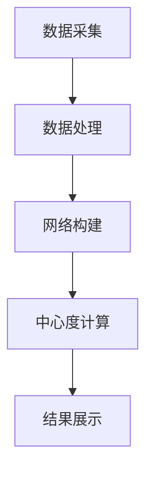

                 


# 利用智能体网络分析公司在创新生态系统中的中心度

> 关键词：创新生态系统，智能体网络，中心度，图论，网络分析，算法，系统设计

> 摘要：在当今快速变化的商业环境中，创新生态系统中的公司中心度分析变得越来越重要。本文通过智能体网络分析的方法，详细探讨了如何计算和评估公司在创新生态系统中的中心度，从而帮助企业识别关键合作伙伴、优化资源分配、制定更有效的战略。文章从理论基础到实际应用，结合数学模型、算法实现和系统设计，全面解析了公司中心度分析的全过程。

---

## 目录

1. [创新生态系统与智能体网络概述](#创新生态系统与智能体网络概述)
2. [智能体网络分析的理论基础](#智能体网络分析的理论基础)
3. [中心度计算的算法与实现](#中心度计算的算法与实现)
4. [智能体网络分析系统的架构设计](#智能体网络分析系统的架构设计)
5. [项目实战：分析科技公司的创新生态系统](#项目实战分析科技公司的创新生态系统)
6. [总结与展望](#总结与展望)

---

## 1. 创新生态系统与智能体网络概述

### 1.1 创新生态系统的定义与特征

创新生态系统是一个由多个参与者（如企业、研究机构、政府、非营利组织等）组成的复杂网络，这些参与者通过合作和竞争共同推动技术创新和价值创造。其主要特征包括：

- **多样性**：参与者类型多样，涵盖企业、学术机构、政府等。
- **动态性**：生态系统不断变化，参与者之间的关系和合作模式也在调整。
- **互操作性**：参与者之间的合作和资源整合是生态系统运行的关键。
- **价值共创**：通过合作，参与者共同创造和分享价值。

### 1.2 智能体网络的概念与特点

智能体网络是指由多个智能体（agents）组成的网络，每个智能体都是具有自主决策能力的实体。在创新生态系统中，智能体可以是公司、研究机构或个人。智能体网络的特点包括：

- **动态性**：智能体之间的关系和交互是动态变化的。
- **复杂性**：网络结构复杂，涉及多个层次和维度。
- **适应性**：智能体能够根据环境变化调整自身行为。

### 1.3 公司中心度的定义与重要性

公司中心度是指公司在智能体网络中的影响力和重要性。中心度的计算可以帮助企业识别其在网络中的地位，进而优化资源分配和战略决策。

- **定义**：中心度是衡量节点在网络中重要性的指标，常见的中心度指标包括度中心度（degree centrality）、中间中心度（betweenness centrality）和特征向量中心度（eigenvector centrality）。
- **重要性**：通过分析公司中心度，企业可以识别关键合作伙伴、发现潜在风险、优化资源配置，从而在创新生态系统中占据更有利的位置。

---

## 2. 智能体网络分析的理论基础

### 2.1 图论基础

图论是智能体网络分析的基础，以下是图论中常用的几个概念：

- **节点（Node）**：网络中的一个参与者，可以是公司、个人或其他实体。
- **边（Edge）**：节点之间的连接，表示两个节点之间的关系。
- **加权图（Weighted Graph）**：边具有权重，表示关系的强度或类型。

### 2.2 中心度计算模型

#### 2.2.1 度中心度

度中心度是衡量节点在网络中连接数量的指标，计算公式为：

$$
C_d(v) = \frac{d(v)}{\max(d(v))}
$$

其中，$d(v)$ 表示节点 $v$ 的度数，$\max(d(v))$ 是网络中的最大度数。

#### 2.2.2 中间中心度

中间中心度衡量的是节点作为中间人的重要性，计算公式为：

$$
C_b(v) = \sum_{s \neq v, t \neq v} \frac{\sigma(s, t, v)}{\sigma(s, t)}
$$

其中，$\sigma(s, t, v)$ 表示从 $s$ 到 $t$ 经过 $v$ 的最短路径数，$\sigma(s, t)$ 是从 $s$ 到 $t$ 的所有最短路径数。

---

## 3. 中心度计算的算法与实现

### 3.1 算法实现

以下是计算度中心度和特征向量中心度的Python代码示例：

```python
import networkx as nx
import numpy as np

# 创建一个示例网络
G = nx.Graph()
G.add_edges_from([(1, 2), (1, 3), (2, 3), (2, 4), (3, 4), (4, 5)])

# 计算度中心度
degree_centralities = nx.degree_centrality(G)
print("度中心度：", degree_centralities)

# 计算特征向量中心度
eigenvector_centralities = nx.eigenvector_centrality(G)
print("特征向量中心度：", eigenvector_centralities)
```

---

## 4. 智能体网络分析系统的架构设计

### 4.1 问题场景分析

假设我们有一个科技公司的创新生态系统，包含多个合作伙伴和供应商。我们需要分析这些公司在网络中的中心度，以识别关键合作伙伴。

### 4.2 系统功能设计

- **数据采集模块**：收集公司之间的合作数据。
- **网络构建模块**：将数据转换为图结构。
- **中心度计算模块**：使用算法计算各公司的中心度。
- **结果展示模块**：以可视化形式展示分析结果。

### 4.3 系统架构设计

以下是系统的分层架构图：



---

## 5. 项目实战：分析科技公司的创新生态系统

### 5.1 环境安装

安装所需的Python库：

```bash
pip install networkx matplotlib
```

### 5.2 核心实现

以下是代码实现：

```python
import networkx as nx
import matplotlib.pyplot as plt

# 创建网络
G = nx.Graph()
G.add_edges_from([(1, 2), (1, 3), (2, 3), (2, 4), (3, 4), (4, 5)])

# 计算中心度
degree_centralities = nx.degree_centrality(G)
eigenvector_centralities = nx.eigenvector_centrality(G)

# 可视化网络
nx.draw(G, with_labels=True)
plt.show()
```

---

## 6. 总结与展望

### 6.1 总结

本文详细探讨了如何利用智能体网络分析公司在创新生态系统中的中心度。通过图论、算法实现和系统设计，我们能够有效地识别关键参与者，优化资源配置，制定更有效的战略。

### 6.2 展望

未来的研究可以进一步探索动态网络分析、多维中心度计算以及更复杂的网络模型，以更全面地评估公司在创新生态系统中的地位。

---

## 作者：AI天才研究院/AI Genius Institute & 禅与计算机程序设计艺术 /Zen And The Art of Computer Programming

