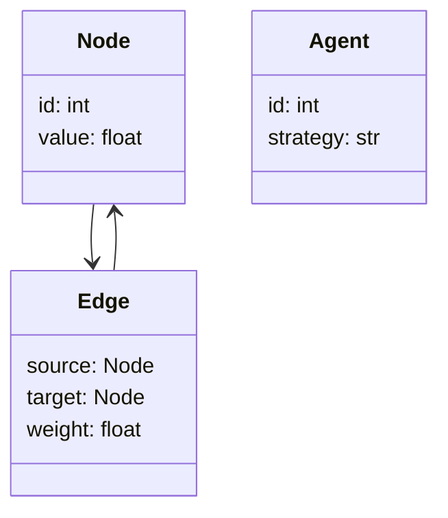
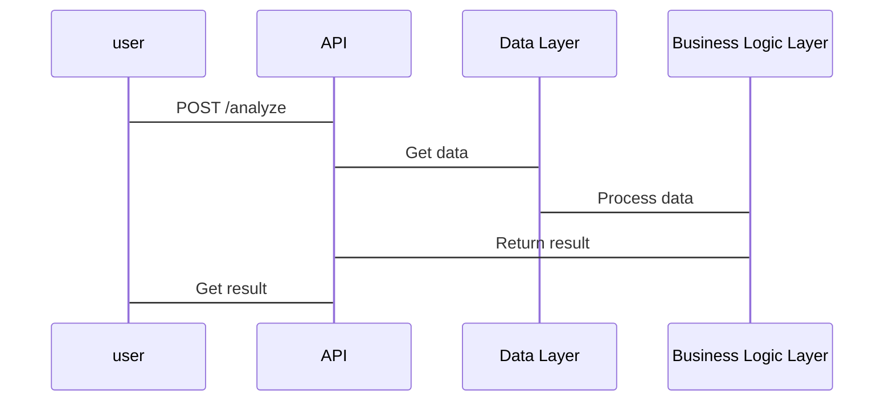

                 


# 利用智能体网络分析公司的创新合作网络价值

> 关键词：智能体网络、创新合作网络、网络价值分析、算法原理、系统设计

> 摘要：本文探讨了利用智能体网络分析公司创新合作网络价值的方法，从理论到实践，详细分析了创新合作网络的结构、价值评估模型、算法实现、系统设计和项目实战。通过图论、博弈论和网络流模型，结合Python代码实现，展示了如何利用智能体网络提升公司的创新合作效率。

---

## 第一部分: 智能体网络与创新合作网络概述

### 第1章: 利用智能体网络分析创新合作网络的背景与概念

#### 1.1 智能体网络的定义与核心要素

##### 1.1.1 智能体网络的基本概念

智能体网络是由多个智能体（Agent）通过某种规则和协议组成的网络系统。每个智能体都是一个能够感知环境、做出决策并采取行动的实体。智能体可以是软件程序、硬件设备或人类。

##### 1.1.2 创新合作网络的定义

创新合作网络是指在公司内部或外部，不同部门、团队或个体之间通过合作创新形成的网络结构。这些节点之间的关系可以通过图论模型进行描述。

##### 1.1.3 智能体网络与创新合作网络的关系

智能体网络与创新合作网络密切相关，前者提供了技术手段，后者提供了应用场景。智能体网络可以用来模拟和分析创新合作网络的结构和行为。

#### 1.2 创新合作网络的价值分析

##### 1.2.1 创新合作网络的背景与问题背景

现代企业面临的竞争日益激烈，创新是企业生存和发展的关键。创新合作网络的价值在于通过优化合作结构，提升创新效率。

##### 1.2.2 创新合作网络的核心问题描述

创新合作网络的核心问题是如何量化合作的价值，找到瓶颈节点，优化网络结构。

##### 1.2.3 利用智能体网络解决创新合作网络问题的思路

通过构建智能体网络模型，分析节点之间的关系，量化合作价值，提出优化策略。

##### 1.2.4 创新合作网络的边界与外延

创新合作网络的边界包括公司内部和外部合作伙伴，外延则涉及供应链、客户和生态系统。

##### 1.2.5 创新合作网络的概念结构与核心要素

创新合作网络的概念结构包括节点、边和权重，核心要素包括合作强度、创新贡献和协作效率。

---

### 第2章: 智能体网络的结构与特性

#### 2.1 智能体网络的结构类型

##### 2.1.1 分散式智能体网络

节点之间没有中心控制，通过去中心化协议进行协作。

##### 2.1.2 集中式智能体网络

有一个中心节点控制整个网络，其他节点遵循中心的指令。

##### 2.1.3 混合式智能体网络

结合分散式和集中式的特点，部分节点由中心控制，部分节点自主运作。

#### 2.2 创新合作网络的层次分析

##### 2.2.1 创新合作网络的微观层次

包括个体员工、团队等小范围的合作。

##### 2.2.2 创新合作网络的中观层次

包括部门、事业部等中等规模的合作结构。

##### 2.2.3 创新合作网络的宏观层次

包括整个公司、供应链、合作伙伴等大范围的合作网络。

#### 2.3 智能体网络的关键特性

##### 2.3.1 智能体的自主性

智能体能够独立决策和行动，无需外部干预。

##### 2.3.2 智能体的反应性

智能体能够感知环境变化并做出实时反应。

##### 2.3.3 智能体的协作性

智能体之间通过合作完成共同目标，形成协同效应。

##### 2.3.4 智能体网络的动态性

网络结构和节点关系随时间变化，具有动态性。

---

### 第3章: 创新合作网络的价值分析与模型构建

#### 3.1 创新合作网络的价值分析框架

##### 3.1.1 创新合作网络的价值维度

包括创新产出、合作效率、资源利用等。

##### 3.1.2 创新合作网络的价值评估指标

如合作频率、创新成果数量、资源分配效率等。

#### 3.2 创新合作网络的数学模型

##### 3.2.1 创新合作网络的图论模型

将公司内部和外部合作关系表示为图，节点为参与者，边为合作关系。

##### 3.2.2 创新合作网络的博弈论模型

将合作视为博弈过程，分析各节点的策略选择和收益分配。

##### 3.2.3 创新合作网络的网络流模型

通过网络流模型分析资源流动和瓶颈节点。

#### 3.3 创新合作网络的价值计算公式

##### 3.3.1 创新合作网络的节点价值公式

$$ \text{节点价值} = \sum_{i=1}^{n} (\text{合作强度} \times \text{创新贡献}) $$

##### 3.3.2 创新合作网络的边价值公式

$$ \text{边价值} = \frac{\text{节点价值}}{\text{节点度}} $$

##### 3.3.3 创新合作网络的整体价值公式

$$ \text{整体价值} = \sum_{i=1}^{m} \text{边价值} $$

---

### 第4章: 利用智能体网络分析创新合作网络的算法原理

#### 4.1 创新合作网络分析的基本算法

##### 4.1.1 基于图论的网络分析算法

如PageRank算法，用于评估节点的重要性。

##### 4.1.2 基于博弈论的网络分析算法

如纳什均衡分析，用于评估合作策略的稳定性。

##### 4.1.3 基于网络流的分析算法

如最大流算法，用于识别瓶颈节点。

#### 4.2 智能体网络分析的算法流程

##### 4.2.1 数据预处理

清洗数据，提取节点和边信息。

##### 4.2.2 网络构建

将数据转化为图结构，定义节点和边的属性。

##### 4.2.3 网络分析

应用算法计算节点和边的价值。

##### 4.2.4 价值评估

根据计算结果，评估网络的整体价值。

#### 4.3 算法实现的Python代码示例

##### 4.3.1 图论模型的Python实现

```python
import networkx as nx

G = nx.Graph()
G.add_nodes_from([1,2,3,4])
G.add_edges_from([(1,2),(2,3),(3,4),(4,1)])
print(G.nodes())
print(G.edges())
```

##### 4.3.2 博弈论模型的Python实现

```python
def nash_equilibrium(payoff_matrix):
    # 计算纳什均衡
    pass
```

##### 4.3.3 网络流模型的Python实现

```python
from networkx.algorithms.flow import maxflow_min_cut

flow_value = maxflow_min_cut(G, source, sink)
print(flow_value)
```

---

## 第五章: 创新合作网络分析系统的系统设计与实现

### 5.1 系统功能设计

#### 5.1.1 领域模型



#### 5.1.2 系统架构设计


### 5.2 系统接口设计

#### 5.2.1 API接口设计

RESTful API，如GET /nodes，POST /analyze。

#### 5.2.2 数据接口设计

JSON格式，如`{ "nodes": [1,2,3], "edges": [[1,2], [2,3]] }`。

### 5.3 系统交互设计

#### 5.3.1 用户交互流程



---

## 第六章: 项目实战

### 6.1 环境安装

安装必要的库，如networkx、numpy、pandas等。

### 6.2 核心代码实现

#### 6.2.1 网络构建

```python
import networkx as nx

G = nx.Graph()
G.add_nodes_from(['A', 'B', 'C', 'D'])
G.add_edges_from([('A','B'), ('B','C'), ('C','D'), ('D','A')])
```

#### 6.2.2 算法实现

```python
def calculate_value(G):
    node_values = {}
    for node in G.nodes():
        value = 0
        for neighbor in G.neighbors(node):
            value += G.get_edge_data(node, neighbor).get('weight', 1)
        node_values[node] = value
    return node_values
```

### 6.3 案例分析与结果解读

#### 6.3.1 案例分析

分析一个公司的创新合作网络，计算节点价值，识别关键节点。

#### 6.3.2 结果解读

根据计算结果，优化网络结构，提升整体价值。

---

## 第七章: 总结与展望

### 7.1 总结

总结全文内容，强调智能体网络在创新合作网络分析中的重要性。

### 7.2 注意事项

在实际应用中，需要注意数据质量和模型的适用性。

### 7.3 未来研究方向

探索更复杂的模型和算法，如深度学习在智能体网络中的应用。

---

作者：AI天才研究院 & 禅与计算机程序设计艺术

