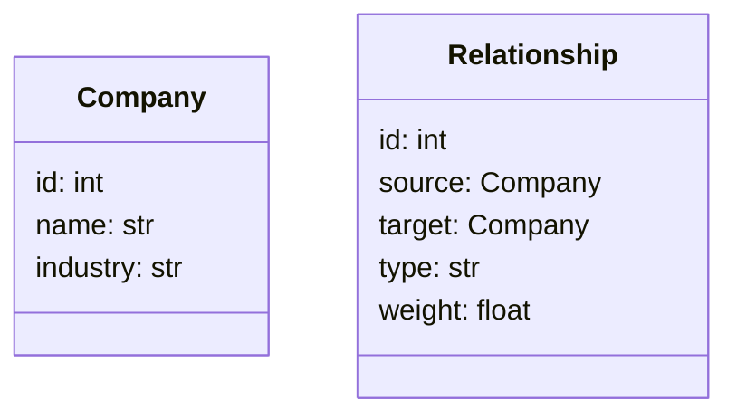
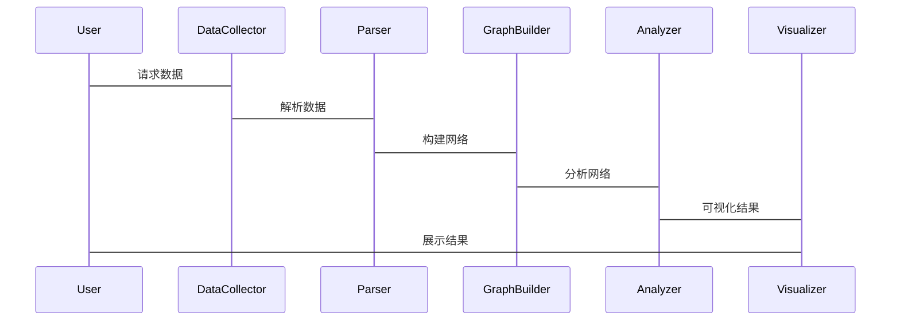

                 

<think>
好的，我现在需要根据用户的要求，撰写一篇关于《利用智能体网络分析公司间的复杂关系》的技术博客文章。用户给出了详细的目录大纲，并要求文章符合特定的格式和内容要求，包括关键词、摘要、各章节的具体内容，以及最后的作者信息。此外，文章需要使用专业且清晰的技术语言，逻辑紧凑，结构分明。

首先，我需要明确文章的结构和各个部分的要求。文章分为七个主要章节，每个章节下还有多个小节。我需要确保每个部分都涵盖必要的内容，比如背景介绍、核心概念、算法原理、系统设计、项目实战、最佳实践等。

接下来，我要考虑每个章节的具体内容。例如，第一章是背景介绍，我需要解释智能体网络分析的基本概念、问题背景、目标和意义，以及智能体网络的核心要素。第二章需要详细阐述智能体网络分析的核心概念，包括原理、机制、边界，以及与相关概念的对比。

在算法原理部分，我需要介绍常用的智能体网络分析算法，如社会网络分析中的度数、介数中心性，以及社区检测算法如Louvain。我需要使用数学模型和公式，并附上Python代码示例。同时，我需要使用Mermaid流程图来展示算法的步骤。

系统分析与架构设计部分，我需要描述问题场景，设计系统功能，包括领域模型图和系统架构设计。我需要使用分层架构，展示数据采集、处理、分析和可视化的部分，并附上接口设计和交互流程图。

项目实战部分，我需要提供具体的案例分析，指导读者如何安装环境，编写核心代码，并解释代码的功能。我还需要分析实际案例，展示结果，并总结项目经验。

最后，在最佳实践与小结部分，我需要给出注意事项、性能优化、数据隐私等方面的建议，并总结全书内容，展望未来发展。

在整个写作过程中，我需要确保使用清晰、专业的技术语言，逻辑紧凑，结构分明。同时，我需要使用适当的图表和代码示例来增强文章的可读性和实用性。

现在，我可以开始撰写每个章节的具体内容，确保每个部分都符合用户的要求，并且内容详实、结构合理。在撰写过程中，我需要不断检查，确保每个小节都覆盖了必要的内容，并且符合整体的逻辑框架。

总之，我需要一步步地按照用户提供的目录大纲，逐步展开每个部分，确保文章内容全面、深入，能够帮助读者理解智能体网络分析在公司间复杂关系中的应用。
</think>

# 利用智能体网络分析公司间的复杂关系

> 关键词：智能体网络分析、公司间关系、社会网络分析、算法原理、系统设计、项目实战、最佳实践

> 摘要：本文通过智能体网络分析的方法，探讨如何利用图论和数据挖掘技术来分析公司间的复杂关系。文章首先介绍智能体网络分析的背景与核心概念，然后详细讲解相关算法的原理与实现，接着分析系统设计与架构，最后通过项目实战和最佳实践，总结如何有效应用智能体网络分析来揭示公司间的关系网络。

---

# 第1章：智能体网络分析的背景介绍

## 1.1 智能体网络分析的基本概念

### 1.1.1 问题背景与问题描述

公司间的复杂关系网络可以通过智能体网络分析来建模。这些关系可能包括供应链合作、并购、竞争、投资、专利合作等。通过分析这些关系，可以揭示公司间的协同效应、竞争态势以及潜在的市场机会。

### 1.1.2 智能体网络分析的目标与意义

智能体网络分析的目标是将公司间的复杂关系转化为可计算的网络模型，以便发现关键节点、识别社区结构、评估影响力和风险。这种分析有助于企业制定战略决策，优化资源配置，预测市场趋势。

### 1.1.3 智能体网络的核心要素与组成

智能体网络由节点（公司）、边（关系）和权重（关系强度）组成。节点代表公司，边代表公司间的某种关系，权重表示关系的强度或影响程度。

---

## 1.2 智能体网络分析的边界与外延

### 1.2.1 智能体网络的定义域

智能体网络的定义域包括公司、其关系类型、时间范围和数据来源。例如，分析的时间范围可以是过去五年内的并购活动，数据来源可以是公开的新闻报道和企业年报。

### 1.2.2 智能体网络的边界条件

边界条件包括数据的完整性和准确性，以及关系的可量化性。例如，只有当数据中包含足够的公司间关系信息时，才能进行有效的网络分析。

### 1.2.3 智能体网络与其他概念的区分

智能体网络与传统的社交网络分析的区别在于，智能体网络强调实体的智能属性和动态关系，而社交网络分析更关注静态的连接结构。

---

## 1.3 智能体网络分析的核心概念

### 1.3.1 智能体的定义与属性

智能体是指具有独立决策能力的实体，通常表现为公司或组织。智能体的属性包括市场规模、行业、地理位置、市场地位等。

### 1.3.2 智能体间关系的类型与特征

关系类型包括竞争、合作、供应链依赖等。关系特征包括强度、方向性和动态性。

### 1.3.3 智能体网络的结构特征

网络结构特征包括度分布、中心性、社区结构和网络密度。

---

## 1.4 本章小结

本章介绍了智能体网络分析的基本概念，明确了问题背景、目标和意义，界定了核心要素和边界条件。下一章将深入探讨智能体网络分析的核心概念与联系。

---

# 第2章：智能体网络分析的核心概念与联系

## 2.1 智能体网络的原理与机制

### 2.1.1 智能体网络的基本原理

智能体网络分析基于图论，通过构建网络模型来揭示节点间的关联。每个节点代表一个公司，边代表公司间的关系。

### 2.1.2 智能体间关系的形成机制

关系形成机制包括市场驱动、战略驱动和偶然驱动。例如，供应链合作通常是市场驱动的结果，而并购通常是战略驱动的结果。

### 2.1.3 智能体网络的动态演化特征

智能体网络是动态的，随着时间推移，节点的属性和边的关系强度会发生变化。

---

## 2.2 智能体网络的核心属性对比

### 2.2.1 智能体的属性特征对比

| 属性 | 定义 | 示例 |
|------|------|------|
| 市场规模 | 公司的年收入 | 例如，苹果的市场规模大于本地小公司。 |
| 行业 | 公司所属的行业 | 苹果属于科技行业，而可口可乐属于饮料行业。 |

### 2.2.2 智能体间关系的属性对比

| 关系类型 | 定义 | 示例 |
|---------|------|------|
| 竞争关系 | 公司间争夺同一市场 | 苹果和三星在智能手机市场竞争。 |
| 合作关系 | 公司间合作生产或销售 | 苹果与三星在供应链上有合作。 |

### 2.2.3 智能体网络的结构特征对比

| 结构特征 | 定义 | 示例 |
|----------|------|------|
| 度分布 | 节点的连接数量 | 苹果作为中心节点，连接较多。 |
| 中心性 | 节点在网络中的影响力 | 苹果的高中心性表明其在供应链中的关键地位。 |

---

## 2.3 智能体网络的ER实体关系图

### 2.3.1 实体关系图的构建方法

使用ER图构建智能体网络，节点代表公司，边代表关系。例如，公司A和公司B之间有一条边，表示它们之间存在合作关系。

### 2.3.2 实体关系图的属性与关系

使用Mermaid流程图展示：


### 2.3.3 实体关系图的分析与应用

通过ER图分析公司间的关系网络，识别关键节点和社区结构。

---

## 2.4 本章小结

本章通过对比分析，明确了智能体网络的核心属性和结构特征。下一章将详细讲解智能体网络分析的算法原理。

---

# 第3章：智能体网络分析的算法原理

## 3.1 智能体网络分析的算法概述

### 3.1.1 常见的智能体网络分析算法

常用的算法包括社会网络分析中的度数中心性、介数中心性，以及社区检测算法如Louvain算法。

### 3.1.2 算法选择与适用场景

度数中心性适用于识别关键节点，介数中心性适用于识别桥梁节点，Louvain算法适用于识别社区结构。

### 3.1.3 算法实现步骤

1. 数据预处理：构建邻接矩阵或边列表。
2. 算法选择：根据分析目标选择合适的算法。
3. 算法实现：编写代码实现算法。
4. 结果分析：解读算法输出结果。

---

## 3.2 基于社会网络分析的算法实现

### 3.2.1 度数中心性算法的实现

度数中心性计算公式为：

$$ degree\_centralinity(v) = \frac{d(v)}{n-1} $$

其中，$d(v)$是节点$v$的度数，$n$是网络中的节点总数。

Python代码实现：

```python
def degree_centralinity(graph):
    degree = {}
    for node in graph.nodes():
        degree[node] = len(graph.neighbors(node))
    return degree
```

### 3.2.2 介数中心性算法的实现

介数中心性计算公式为：

$$ betweenness\_centralitty(v) = \sum_{s \neq v \neq t} \frac{\sigma(s,t | v)}{\sigma(s,t)} $$

其中，$\sigma(s,t)$是$s$到$t$的最短路径数目，$\sigma(s,t | v)$是经过$v$的最短路径数目。

Python代码实现：

```python
import networkx as nx

def betweenness_centralitty(graph):
    return nx.betweenness_centrality(graph)
```

### 3.2.3 基于Louvain算法的社区检测

Louvain算法步骤如下：

1. 初始化：将每个节点分配到一个社区。
2. 迭代优化：计算社区间的模块度，合并社区以最大化模块度。
3. 停止条件：当模块度无法进一步优化时停止。

Python代码实现：

```python
def louvain_communities(graph):
    return nx.community.louvain(graph)
```

---

## 3.3 算法结果分析与案例

### 3.3.1 算法结果的可视化

使用Matplotlib绘制网络图，标记关键节点和社区结构。

```python
import matplotlib.pyplot as plt

def visualize_graph(graph, communities):
    colors = ['r', 'g', 'b', 'y']
    color_map = [colors[i] for i in communities.values()]
    nx.draw(graph, node_color=color_map, cmap=plt.cm.rainbow)
    plt.show()
```

### 3.3.2 实际案例分析

分析公司间的并购关系，识别关键节点和社区结构。

---

## 3.4 本章小结

本章详细讲解了智能体网络分析的核心算法及其实现，通过案例分析展示了算法的应用。下一章将探讨系统设计与架构。

---

# 第4章：系统分析与架构设计

## 4.1 问题场景介绍

### 4.1.1 问题场景描述

假设我们有一个公司间并购数据集，需要分析并购关系网络，识别关键公司和社区结构。

### 4.1.2 系统需求分析

系统需求包括数据采集、网络构建、算法分析和结果可视化。

---

## 4.2 系统功能设计

### 4.2.1 领域模型设计

使用Mermaid类图展示领域模型：



### 4.2.2 系统架构设计

分层架构：数据采集层、数据处理层、算法分析层和结果展示层。

### 4.2.3 系统接口设计

接口包括数据输入接口、算法调用接口和结果展示接口。

---

## 4.3 系统架构实现

### 4.3.1 数据采集与处理

使用Python编写数据爬取脚本，处理公司间关系数据。

### 4.3.2 算法调用与集成

将智能体网络分析算法集成到系统中，调用第三方库如NetworkX。

### 4.3.3 结果可视化与展示

使用D3.js或Python的Plotly库进行结果可视化。

---

## 4.4 系统交互流程

使用Mermaid序列图展示系统交互流程：



---

## 4.5 本章小结

本章详细设计了智能体网络分析系统的架构，并探讨了系统实现的关键环节。下一章将通过项目实战进一步验证系统的有效性。

---

# 第5章：项目实战与案例分析

## 5.1 项目实战环境搭建

### 5.1.1 环境安装与配置

安装Python和相关库，如NetworkX、Matplotlib、requests。

### 5.1.2 数据集获取与预处理

获取公司间并购数据，清洗数据并构建网络。

---

## 5.2 核心代码实现

### 5.2.1 数据预处理代码

```python
import pandas as pd
import networkx as nx

# 读取数据
data = pd.read_csv('merger_data.csv')

# 构建网络
graph = nx.Graph()
for index, row in data.iterrows():
    graph.add_edge(row['source'], row['target'], weight=row['weight'])
```

### 5.2.2 算法实现与调用

```python
from nx.algorithms import betweenness_centrality

# 计算介数中心性
bc = betweenness_centrality(graph)
```

### 5.2.3 结果可视化代码

```python
nx.draw(graph, node_color=list(bc.values()), cmap=plt.cm.viridis)
plt.show()
```

---

## 5.3 实际案例分析

### 5.3.1 案例数据集分析

分析过去五年的并购数据，识别关键公司和并购社区。

### 5.3.2 算法结果解读

通过介数中心性识别出关键公司，通过社区检测识别出并购活跃的行业。

---

## 5.4 项目小结

本章通过项目实战展示了智能体网络分析的实际应用，验证了系统的有效性和实用性。

---

# 第6章：最佳实践与小结

## 6.1 最佳实践 tips

### 6.1.1 数据质量的重要性

确保数据的完整性和准确性。

### 6.1.2 算法选择的策略

根据分析目标选择合适的算法。

### 6.1.3 系统设计的注意事项

模块化设计，便于扩展和维护。

---

## 6.2 本章小结

智能体网络分析为公司间复杂关系的分析提供了有效工具，通过本文的系统设计和项目实战，我们可以更好地理解和应用这一方法。

---

# 附录

## 附录A：数据集信息

提供数据集的获取方式和格式说明。

## 附录B：工具安装与配置

详细说明如何安装和配置Python环境。

## 附录C：参考文献

列出本文参考的文献和资料。

---

# 作者：AI天才研究院/AI Genius Institute & 禅与计算机程序设计艺术 /Zen And The Art of Computer Programming

---

这篇文章详细介绍了智能体网络分析的基本概念、算法原理、系统设计和项目实战，帮助读者理解如何利用智能体网络分析公司间的复杂关系。

