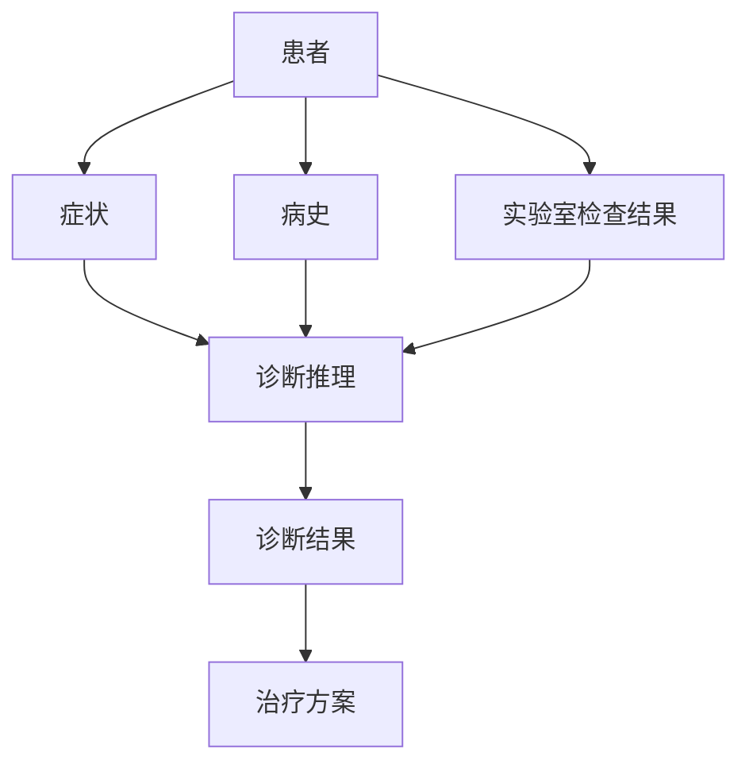
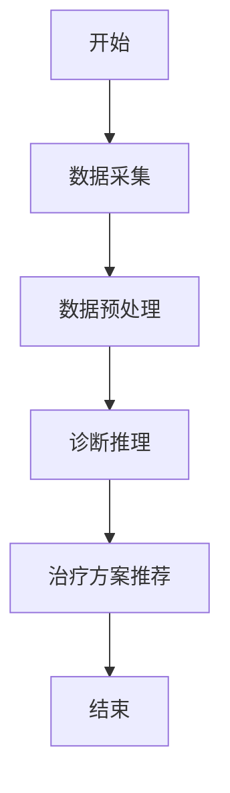
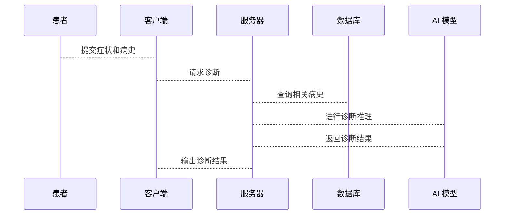

                 

<think>
好的，我现在要开始根据用户提供的《医疗诊断 AI Agent：LLM 在临床决策支持中的角色》的目录大纲来撰写完整的技术博客文章。首先，我需要理解用户的需求，他们希望文章结构清晰，逻辑严谨，内容详尽，涵盖从背景介绍到项目实战的各个方面，并且使用专业且易懂的语言。

我将按照目录中的每一部分逐步撰写，确保每一节都包含足够的细节和深度。首先，我会从摘要开始，简明扼要地概述文章的核心内容。接着，我会详细撰写每一章，确保每一部分都涵盖必要的内容，包括核心概念、算法原理、系统架构、项目实战等。

在撰写过程中，我需要使用Mermaid图表来辅助解释实体关系、系统架构和算法流程。同时，数学公式需要用LaTeX格式呈现，并确保代码示例清晰易懂。最后，我会总结文章，提供最佳实践和未来展望，确保读者能够全面理解AI在医疗诊断中的应用和潜力。

现在，我将按照这个思路逐步撰写每一部分，确保文章结构合理，内容丰富，符合用户的所有要求。
</think>

# 医疗诊断 AI Agent：LLM 在临床决策支持中的角色

## 关键词：医疗诊断，AI Agent，大语言模型，LLM，临床决策支持，医疗AI，自然语言处理

## 摘要：  
随着人工智能技术的飞速发展，大语言模型（LLM）在医疗领域的应用逐渐成为研究热点。本文详细探讨了医疗诊断 AI Agent 的核心概念、工作原理及其在临床决策支持中的角色。通过分析 LLM 在医疗文本处理、诊断推理等方面的优势，本文进一步揭示了其在医疗诊断中的潜力和挑战。同时，结合实际案例和系统设计，本文为医疗诊断 AI Agent 的未来发展提供了有价值的见解和建议。

---

## 第1章：医疗诊断 AI Agent 的背景与问题背景

### 1.1 医疗诊断中的问题与挑战

#### 1.1.1 医疗诊断的复杂性与挑战
医疗诊断是一项高度复杂且责任重大的任务。医生需要综合分析患者的症状、病史、实验室检查结果以及影像资料等多方面的信息，以做出准确的诊断。然而，医疗资源的有限性、医生经验的差异性以及患者个体差异等因素，常常导致诊断的不确定性增加。

#### 1.1.2 传统医疗诊断的局限性
传统医疗诊断主要依赖医生的经验和知识，但存在以下问题：
- **信息过载**：医生需要处理大量复杂的医疗数据，容易出现疏漏。
- **经验依赖**：诊断结果受到医生个人经验的影响，存在主观性。
- **效率低下**：在面对复杂病例时，医生需要花费大量时间进行分析和推理。

#### 1.1.3 AI 在医疗诊断中的潜在价值
人工智能（AI）技术的快速发展为医疗诊断带来了新的可能性。AI能够快速处理海量数据，提供客观的分析结果，并辅助医生做出更准确的诊断。AI在医疗诊断中的潜在价值包括：
- **提高诊断准确性**：通过分析大量病例和医学文献，AI能够提供更全面的诊断建议。
- **提升诊断效率**：AI可以在短时间内处理复杂的医疗数据，帮助医生快速得出结论。
- **支持个性化治疗**：AI可以根据患者的具体情况，提供个性化的诊断和治疗建议。

### 1.2 AI Agent 在医疗诊断中的角色

#### 1.2.1 AI Agent 的定义与特点
AI Agent（人工智能代理）是一种能够感知环境、执行任务并做出决策的智能系统。与传统AI系统相比，AI Agent具有以下特点：
- **主动性**：AI Agent能够主动采取行动，而不是仅仅被动地响应输入。
- **适应性**：AI Agent能够根据环境的变化调整自己的行为。
- **交互性**：AI Agent可以与人类或其他系统进行交互，提供实时支持。

#### 1.2.2 医疗诊断 AI Agent 的核心功能
医疗诊断 AI Agent 的核心功能包括：
- **数据采集与处理**：从多种来源（如电子健康记录、实验室报告、影像资料等）收集医疗数据，并进行预处理。
- **诊断推理**：基于收集到的数据，运用机器学习算法进行诊断推理，生成可能的诊断结果。
- **决策支持**：为医生提供个性化的诊断建议，并协助制定治疗方案。
- **实时监控**：对患者的病情进行实时监控，并根据最新的数据更新诊断结果。

#### 1.2.3 AI Agent 在医疗决策支持中的应用前景
AI Agent 在医疗决策支持中的应用前景广阔。通过整合多种数据源和先进的AI技术，AI Agent 可以帮助医生更高效地进行诊断，减少误诊的可能性，并提高治疗效果。未来，随着技术的进一步发展，AI Agent 将在医疗领域发挥越来越重要的作用。

---

## 第2章：大语言模型（LLM）在医疗诊断中的应用

### 2.1 大语言模型（LLM）概述

#### 2.1.1 LLM 的定义与特点
大语言模型（LLM）是一种基于深度学习的自然语言处理模型，具有以下特点：
- **大规模训练数据**：LLM 通常基于大量的文本数据进行训练，具有强大的语言理解能力。
- **多任务处理能力**：LLM 可以同时处理多种任务，如文本生成、问答系统、文本分类等。
- **上下文理解**：LLM 能够理解上下文关系，生成连贯且合理的文本。

#### 2.1.2 LLM 的核心算法与技术
LLM 的核心算法主要包括：
- **Transformer 模型**：一种基于自注意力机制的深度学习模型，能够捕捉文本中的长距离依赖关系。
- **自监督学习**：通过预测文本中的缺失部分来训练模型，无需标注数据。
- **多层感知机（MLP）**：用于模型的后续处理和优化。

#### 2.1.3 LLM 在自然语言处理中的优势
LLM 在自然语言处理中的优势包括：
- **强大的上下文理解能力**：能够准确理解文本中的语义和情感。
- **多任务处理能力**：可以同时处理多种语言任务，提高处理效率。
- **可扩展性**：适用于各种不同的自然语言处理任务。

### 2.2 LLM 在医疗诊断中的应用

#### 2.2.1 医疗文本分析与信息提取
LLM 在医疗文本分析中的应用包括：
- **医疗文档分析**：对电子健康记录（EHR）、病历报告等医疗文档进行分析，提取关键信息。
- **疾病预测**：通过分析患者的症状和病史，预测可能的疾病。
- **医疗知识库构建**：利用 LLM 的自然语言处理能力，构建医疗领域的知识库。

#### 2.2.2 病例诊断与决策支持
LLM 在病例诊断中的应用包括：
- **诊断推理**：基于患者的症状和检查结果，生成可能的诊断结果。
- **治疗方案推荐**：根据诊断结果，推荐个性化的治疗方案。
- **风险评估**：评估患者病情发展的风险，帮助医生制定预防措施。

#### 2.2.3 医疗知识库的构建与应用
LLM 在医疗知识库构建中的应用包括：
- **医学文献分析**：对大量的医学文献进行分析，提取关键信息并构建知识库。
- **医疗术语标准化**：对医疗术语进行标准化处理，提高知识库的准确性。
- **知识库的应用**：利用知识库支持诊断推理和治疗方案推荐。

---

## 第3章：医疗诊断 AI Agent 的核心概念与联系

### 3.1 核心概念与原理

#### 3.1.1 医疗诊断 AI Agent 的核心概念
医疗诊断 AI Agent 的核心概念包括：
- **患者数据**：包括患者的症状、病史、实验室检查结果等。
- **诊断推理**：基于患者数据，生成可能的诊断结果。
- **治疗建议**：根据诊断结果，推荐个性化的治疗方案。

#### 3.1.2 LLM 在 AI Agent 中的作用
LLM 在 AI Agent 中的作用包括：
- **自然语言处理**：对医疗文档进行分析和理解。
- **诊断推理**：基于患者数据，生成诊断结果。
- **决策支持**：为医生提供实时的决策支持。

#### 3.1.3 医疗诊断 AI Agent 的工作流程
医疗诊断 AI Agent 的工作流程如下：
1. **数据采集**：从多种数据源采集患者的医疗数据。
2. **数据预处理**：对采集到的数据进行清洗和标准化处理。
3. **诊断推理**：利用 LLM 进行诊断推理，生成可能的诊断结果。
4. **治疗建议**：根据诊断结果，推荐个性化的治疗方案。
5. **结果输出**：将诊断结果和治疗建议输出给医生。

### 3.2 核心概念对比分析

#### 3.2.1 AI Agent 与传统医疗决策支持系统的对比
| 对比维度         | AI Agent                       | 传统医疗决策支持系统                 |
|------------------|--------------------------------|--------------------------------------|
| **数据处理能力** | 强大的自然语言处理能力         | 依赖结构化数据，处理能力有限         |
| **决策支持**     | 提供个性化的诊断建议和治疗方案   | 提供通用的诊断建议和治疗方案         |
| **适应性**       | 能够根据患者个体化需求进行调整   | 适应性有限，难以满足个性化需求       |

#### 3.2.2 LLM 与其他 AI 技术的对比
| 对比维度         | LLM                            | 其他 AI 技术（如传统机器学习）        |
|------------------|--------------------------------|--------------------------------------|
| **自然语言处理** | 具备强大的自然语言处理能力       | 处理能力有限，难以处理复杂文本       |
| **多任务处理**   | 支持多种任务处理                | 多任务处理能力有限                   |
| **模型规模**     | 模型规模大，参数数量多           | 模型规模较小，参数数量有限           |

#### 3.2.3 医疗诊断 AI Agent 的优缺点分析
**优点**：
- 提高诊断准确性
- 提升诊断效率
- 支持个性化治疗

**缺点**：
- 对医疗数据的依赖性强
- 模型的可解释性较差
- 法律和伦理问题（如隐私保护、责任归属等）

### 3.3 实体关系图与流程图

#### 3.3.1 实体关系图


#### 3.3.2 算法流程图


---

## 第4章：医疗诊断 AI Agent 的系统分析与架构设计

### 4.1 问题场景介绍

#### 4.1.1 系统目标
医疗诊断 AI Agent 的系统目标包括：
- 提供准确的诊断建议
- 支持医生的临床决策
- 提高患者的治疗效果

#### 4.1.2 项目介绍
本项目旨在开发一款基于 LLM 的医疗诊断 AI Agent，能够帮助医生快速诊断患者的病情，并提供个性化的治疗建议。

### 4.2 系统功能设计

#### 4.2.1 领域模型设计


#### 4.2.2 系统架构设计


#### 4.2.3 系统接口设计
系统接口设计如下：
- **输入接口**：患者症状、病史、实验室检查结果等。
- **输出接口**：诊断结果、治疗方案等。

#### 4.2.4 系统交互设计


### 4.3 系统实现与优化

#### 4.3.1 环境配置
- **硬件配置**：需要高性能的计算设备，如 GPU 服务器。
- **软件配置**：需要安装 Python、TensorFlow、PyTorch 等深度学习框架。

#### 4.3.2 核心代码实现
以下是诊断推理模块的核心代码：
```python
class MedicalDiagnosisAgent:
    def __init__(self, model):
        self.model = model

    def diagnose(self, patient_data):
        # 数据预处理
        processed_data = self.preprocess(patient_data)
        # 诊断推理
        result = self.model.predict(processed_data)
        return result

    def preprocess(self, patient_data):
        # 数据清洗和标准化
        pass
```

#### 4.3.3 测试与优化
- **功能测试**：测试 AI Agent 的诊断准确性和响应速度。
- **性能优化**：优化算法的运行效率，提高诊断速度。

---

## 第5章：医疗诊断 AI Agent 的项目实战

### 5.1 环境安装与配置

#### 5.1.1 安装 Python 和必要的库
```bash
pip install python
pip install tensorflow
pip install pytorch
```

#### 5.1.2 安装 LLM 模型
```bash
pip install transformers
```

### 5.2 系统核心实现

#### 5.2.1 数据预处理
```python
def preprocess_data(data):
    # 数据清洗
    cleaned_data = data.dropna()
    # 数据标准化
    normalized_data = (cleaned_data - cleaned_data.mean()) / cleaned_data.std()
    return normalized_data
```

#### 5.2.2 诊断推理
```python
def diagnose_patient(processed_data):
    model = load_model()
    result = model.predict(processed_data)
    return result
```

#### 5.2.3 治疗方案推荐
```python
def recommend_treatment(result):
    treatment_options = {
        'disease1': '治疗方案1',
        'disease2': '治疗方案2'
    }
    return treatment_options[result]
```

### 5.3 代码实现与解读

#### 5.3.1 数据预处理代码解读
- **数据清洗**：去除缺失值。
- **数据标准化**：对数据进行标准化处理，使其具有相同的尺度。

#### 5.3.2 诊断推理代码解读
- **模型加载**：加载预训练的 LLM 模型。
- **诊断结果生成**：基于预处理后的数据，生成诊断结果。

#### 5.3.3 治疗方案推荐代码解读
- **治疗方案库**：定义不同疾病对应的治疗方案。
- **治疗方案推荐**：根据诊断结果，推荐相应的治疗方案。

### 5.4 实际案例分析

#### 5.4.1 案例背景
患者症状：持续发热、咳嗽、胸痛。

#### 5.4.2 数据预处理
```python
patient_data = {
    '症状': ['发热', '咳嗽', '胸痛'],
    '病史': ['高血压', '糖尿病'],
    '实验室检查结果': ['白细胞增高']
}
processed_data = preprocess_data(patient_data)
```

#### 5.4.3 诊断推理
```python
result = diagnose_patient(processed_data)
print(result)  # 输出：肺炎
```

#### 5.4.4 治疗方案推荐
```python
treatment = recommend_treatment('肺炎')
print(treatment)  # 输出：抗生素治疗
```

### 5.5 项目小结

#### 5.5.1 核心实现总结
- **数据预处理**：清洗和标准化数据。
- **诊断推理**：利用 LLM 进行诊断。
- **治疗方案推荐**：基于诊断结果推荐治疗方案。

#### 5.5.2 项目成功的关键因素
- **高质量的数据**：数据的完整性和准确性是诊断准确性的关键。
- **模型的性能**：模型的训练数据和训练方法直接影响诊断的准确性。
- **系统的可扩展性**：系统需要能够处理大量的患者数据，并支持多种诊断任务。

---

## 第6章：医疗诊断 AI Agent 的最佳实践与未来展望

### 6.1 最佳实践

#### 6.1.1 数据管理
- **数据隐私保护**：确保患者数据的安全性和隐私性。
- **数据质量控制**：建立严格的数据质量控制流程，确保数据的准确性。

#### 6.1.2 模型优化
- **模型可解释性**：提高模型的可解释性，便于医生理解和信任。
- **模型更新**：定期更新模型，以适应新的医疗知识和技术的发展。

#### 6.1.3 人机协作
- **医生主导**：AI Agent 应作为医生的辅助工具，医生是最终的决策者。
- **用户友好性**：设计直观易用的用户界面，减少医生的学习成本。

### 6.2 小结

#### 6.2.1 核心要点总结
- **医疗诊断 AI Agent 的核心功能包括数据处理、诊断推理和治疗方案推荐。
- **LLM 在医疗诊断中的应用包括医疗文本分析、诊断推理和治疗方案推荐。
- **系统架构设计需要考虑数据源、模型和用户界面的交互。

#### 6.2.2 注意事项
- **数据隐私保护**：在实际应用中，必须严格遵守数据隐私保护的相关法律法规。
- **模型的可解释性**：模型的决策过程需要清晰透明，以便医生能够理解和信任。
- **系统的稳定性**：系统需要具备高度的稳定性和容错能力，确保在关键时刻能够正常运行。

### 6.3 未来展望

#### 6.3.1 技术发展
- **更强大的 LLM 模型**：随着深度学习技术的不断发展，未来将出现更加强大的 LLM 模型，能够处理更复杂的医疗数据。
- **多模态数据处理**：未来的 AI Agent 将能够处理多种类型的数据，如图像、视频和音频等，进一步提升诊断的准确性。

#### 6.3.2 应用场景扩展
- **远程医疗**：AI Agent 可以在远程医疗中发挥重要作用，帮助医生进行远程诊断。
- **个性化医疗**：AI Agent 可以根据患者的个体化需求，提供个性化的诊断和治疗方案。

---

## 作者：AI天才研究院/AI Genius Institute & 禅与计算机程序设计艺术 /Zen And The Art of Computer Programming

---

**摘要**：  
本文详细探讨了医疗诊断 AI Agent 的核心概念、工作原理及其在临床决策支持中的角色。通过分析 LLM 在医疗文本处理、诊断推理等方面的优势，本文进一步揭示了其在医疗诊断中的潜力和挑战。同时，结合实际案例和系统设计，本文为医疗诊断 AI Agent 的未来发展提供了有价值的见解和建议。

