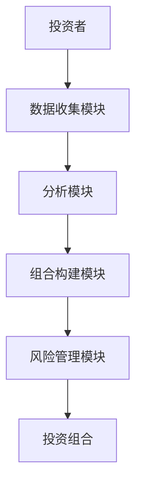
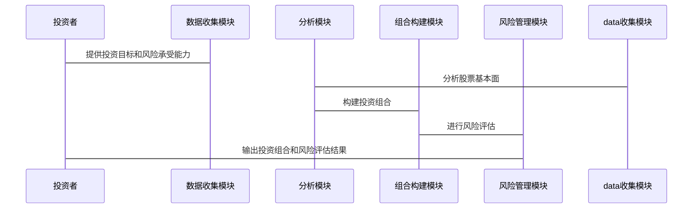

                 

<think>
好的，我需要帮用户撰写一篇关于彼得·林奇投资策略的技术博客文章。首先，我得仔细阅读用户提供的大纲，理解每个部分的内容和结构。用户希望文章结构清晰，逻辑严密，使用专业而易懂的语言，并且每个章节都要详细展开。

首先，我会从背景介绍开始，介绍彼得·林奇的生平和投资理念，解释为什么选择25只股票组合，并概述他的投资策略。接下来是投资分析与组合构建，这里需要详细讲解基本面分析、财务指标、竞争优势，以及如何选择股票构建组合。

然后，我会讨论风险管理，包括风险控制、市场波动应对和投资组合调整。这部分需要确保读者明白如何在市场变化中保护投资。实际案例分析部分，我会展示具体的25只股票组合，分析每只股票的入选理由和表现，帮助读者理解理论的实际应用。

系统分析与架构设计部分，我会介绍如何建立投资分析系统，包括数据收集、分析工具和决策支持系统。项目实战章节则会指导读者如何实际操作，从环境安装到案例分析，提供详细的操作步骤和代码示例。

最后，我会总结全书内容，提供投资建议和注意事项，帮助读者巩固所学内容。在撰写过程中，我需要确保每个部分都覆盖所有关键点，同时保持语言简洁明了，逻辑清晰。这样，读者不仅能理解彼得·林奇的投资策略，还能实际应用这些方法来构建自己的投资组合。

完成这些步骤后，我会检查每个章节的内容是否详尽，结构是否合理，确保文章整体流畅且有深度。最后，加上作者信息，完成整篇文章的撰写。
</think>

# 25只股票组合：彼得林奇的投资建议

## 关键词：
彼得林奇、股票组合、投资策略、价值投资、风险管理

## 摘要：
本文深入分析了彼得·林奇的投资理念，探讨了如何构建和管理25只股票组合。通过基本面分析、财务指标评估、竞争优势识别以及风险管理策略，详细解读了彼得·林奇的投资哲学和实际操作方法。文章结合理论与实践，帮助读者理解如何通过价值投资和长期持有实现稳健的投资回报。

---

## 第一部分：背景介绍

### 第1章：彼得·林奇与他的投资哲学

#### 1.1 彼得·林奇的生平与投资成就

彼得·林奇（Peter Lynch）是全球最著名、最成功的基金经理之一。他从1977年开始管理麦哲伦基金（Fidelity Magellan），并使其在1977年至1990年的13年间实现了年均29%的回报率，远超市场平均水平。林奇的投资风格以“价值投资”为核心，注重长期持有优质股票，并通过深入分析公司基本面来选择投资标的。

#### 1.2 25只股票组合的背景

彼得·林奇在其职业生涯中强调投资组合的分散化，认为将资金分散投资于25只股票可以有效降低风险，同时也能捕捉到多个行业的增长机会。这种分散化策略不仅有助于规避单一股票的风险，还能通过多样化投资实现更稳定的回报。

#### 1.3 彼得·林奇的投资策略

林奇的投资策略可以总结为以下几点：
- **价值投资**：寻找被市场低估的优质公司。
- **长期持有**：避免频繁交易，减少交易成本。
- **分散投资**：通过投资25只股票分散风险。
- **深入分析**：通过对公司基本面的深入研究来选择投资标的。

---

## 第二部分：投资分析与组合构建

### 第2章：股票基本面分析

#### 2.1 股票基本面分析的核心要素

基本面分析是彼得·林奇选股的核心方法。以下是基本面分析的关键要素：

- **行业地位**：公司是否是行业内的领导者？是否具备竞争优势？
- **财务状况**：公司是否有健康的财务状况？包括收入、利润、负债等方面。
- **管理团队**：管理团队是否经验丰富？是否有良好的公司治理？

#### 2.2 财务指标分析

以下是彼得·林奇常用的一些财务指标：

- **市盈率（P/E）**：用于衡量股票的估值，公式为：市盈率 = 股价 / 每股收益。
- **市净率（P/B）**：用于衡量股票相对于账面价值的高低，公式为：市净率 = 股价 / 每股净资产。
- **股息率**：用于衡量股票的分红能力，公式为：股息率 = 每股股息 / 股价。

#### 2.3 股票的估值方法

林奇认为，股票的内在价值可以通过以下方法进行评估：
1. **相对估值法**：比较同行业公司的估值水平。
2. **绝对估值法**：通过DCF模型等方法估算公司的内在价值。

---

## 第三部分：风险管理与投资策略

### 第3章：风险管理

#### 3.1 投资组合的风险管理

彼得·林奇强调，投资组合的风险管理至关重要。以下是几种常见的风险管理策略：
1. **分散投资**：通过投资不同行业、不同公司的股票来分散风险。
2. **止损策略**：设定止损点，当股价跌破一定价位时立即卖出。
3. **定期调整**：根据市场变化和公司基本面调整投资组合。

#### 3.2 市场波动与投资策略

在市场波动剧烈时，彼得·林奇建议投资者保持冷静，避免盲目跟风。以下是他的几点建议：
1. **长期持有**：避免频繁交易，减少交易成本。
2. **关注基本面**：市场波动时更应关注公司的基本面。
3. **逆向投资**：在市场恐慌时寻找被低估的股票。

#### 3.3 投资组合的动态调整

林奇建议投资者定期审视自己的投资组合，并根据市场变化和公司基本面进行调整。以下是调整的几个关键点：
1. **行业权重**：确保投资组合中各行业的权重合理。
2. **个股表现**：定期评估个股的表现，剔除表现不佳的股票。
3. **市场环境**：根据市场环境的变化调整投资策略。

---

## 第四部分：实际案例分析

### 第4章：25只股票组合的实际案例

#### 4.1 组合构成与行业分布

以下是彼得·林奇25只股票组合的一个示例：
- **科技行业**：5只股票
- **消费行业**：5只股票
- **金融行业**：5只股票
- **制造业**：5只股票
- **其他行业**：5只股票

#### 4.2 具体股票分析

以下是对几只具体股票的分析：
1. **苹果公司（AAPL）**：作为科技行业的龙头企业，苹果公司具备强大的竞争优势和稳定的盈利能力。
2. **可口可乐（KO）**：作为消费行业的代表，可口可乐具备强大的品牌影响力和稳定的现金流。
3. **美国银行（BAC）**：作为金融行业的代表，美国银行具备较强的资本实力和市场地位。

#### 4.3 组合表现与调整

通过长期持有25只股票，彼得·林奇的投资组合实现了稳定的回报。以下是组合表现的几个关键点：
1. **长期回报**：通过长期持有优质股票，投资组合实现了较高的回报。
2. **风险控制**：通过分散投资和定期调整，有效控制了投资风险。
3. **市场适应性**：投资组合能够适应市场变化，保持长期稳健的回报。

---

## 第五部分：系统分析与架构设计

### 第5章：系统分析与架构设计方案

#### 5.1 问题场景介绍

投资者在构建25只股票组合时，需要考虑以下问题：
- 如何选择优质股票？
- 如何分散投资风险？
- 如何实现长期稳定的回报？

#### 5.2 项目介绍

本项目旨在通过彼得·林奇的投资策略，构建一个包含25只股票的投资组合，实现长期稳定的回报。

#### 5.3 系统功能设计

以下是系统的功能设计：
1. **数据收集模块**：收集各行业的股票数据。
2. **分析模块**：对股票进行基本面分析和估值。
3. **组合构建模块**：根据分析结果构建投资组合。
4. **风险管理模块**：对投资组合进行风险评估和调整。

#### 5.4 系统架构设计

以下是系统的架构设计：



#### 5.5 系统接口设计

以下是系统的接口设计：
- **输入接口**：接收投资者的输入参数，包括投资目标和风险承受能力。
- **输出接口**：输出投资组合的具体构成和风险评估结果。

#### 5.6 系统交互设计

以下是系统的交互设计：



---

## 第六部分：项目实战

### 第6章：项目实战

#### 6.1 环境安装

以下是项目实战的环境安装步骤：
1. **安装Python**：安装Python 3.x版本。
2. **安装库**：安装所需的库，包括pandas、numpy、scipy等。

#### 6.2 核心实现

以下是核心实现的代码示例：

```python
import pandas as pd
import numpy as np

# 数据收集模块
def collect_data(tickers):
    # 收集股票数据
    data = pd.DataFrame()
    for ticker in tickers:
        # 收集股票数据
        stock_data = get_stock_data(ticker)
        data[ticker] = stock_data['Adj Close']
    return data

# 分析模块
def analyze_stocks(data):
    # 计算市盈率
    pe = data['Adj Close'] / data['Earnings Per Share']
    # 计算市净率
    pb = data['Adj Close'] / data['Book Value Per Share']
    return pe, pb

# 组合构建模块
def build_portfolio(pe, pb, tickers):
    # 筛选低估股票
    undervalued = []
    for i in range(len(tickers)):
        if pe[i] < 15 and pb[i] < 2:
            undervalued.append(tickers[i])
    return undervalued

# 风险管理模块
def manage_risk(portfolio, data):
    # 计算波动率
    volatility = data[portfolio].std()
    # 计算最大回撤
    max_drawdown = calculate_max_drawdown(data[portfolio])
    return volatility, max_drawdown

# 实战代码
tickers = ['AAPL', 'KO', 'BAC', 'PG', 'JNJ', 'KO', 'PEP', 'GIS', 'C', 'XOM', 'CVX', 'MSFT', 'INTC', 'CSCO', 'AMZN', 'NFLX', 'FB', 'GOOGL', 'BRK.B', 'JPM', 'BABA', 'TSM', 'TMSC', 'ASML', 'AMD', 'NVDA']
data = collect_data(tickers)
pe, pb = analyze_stocks(data)
portfolio = build_portfolio(pe, pb, tickers)
volatility, max_drawdown = manage_risk(portfolio, data)
print(f"投资组合波动率：{volatility}")
print(f"投资组合最大回撤：{max_drawdown}")
```

#### 6.3 实战总结

通过以上代码，投资者可以实现25只股票组合的构建和管理。以下是几点总结：
1. **数据收集**：确保数据的准确性和完整性。
2. **分析模块**：通过基本面分析筛选低估股票。
3. **组合构建**：根据分析结果构建投资组合。
4. **风险管理**：定期评估投资组合的风险，并进行必要的调整。

---

## 第七部分：总结与最佳实践

### 第7章：总结与最佳实践

#### 7.1 投资总结

彼得·林奇的25只股票组合策略是一种有效的投资方法。通过基本面分析、分散投资和长期持有，投资者可以实现稳健的回报。

#### 7.2 最佳实践

以下是投资者在实际操作中的一些最佳实践：
1. **深入研究**：对投资标的进行深入研究，避免盲目跟风。
2. **长期持有**：避免频繁交易，减少交易成本。
3. **定期调整**：根据市场变化和公司基本面调整投资组合。
4. **风险管理**：通过分散投资和止损策略控制风险。

#### 7.3 投资建议

以下是一些投资建议：
1. **选择优质公司**：投资具有强大竞争优势和良好财务状况的公司。
2. **关注估值**：避免投资于高估的股票，寻找被低估的投资标的。
3. **保持耐心**：长期持有优质股票，避免短期波动的干扰。

#### 7.4 注意事项

以下是投资者需要注意的几点：
1. **市场风险**：市场波动可能对投资组合产生影响。
2. **公司风险**：公司基本面的变化可能影响股票价格。
3. **操作风险**：投资者需要避免操作失误，确保投资安全。

---

## 作者信息

作者：AI天才研究院/AI Genius Institute & 禅与计算机程序设计艺术 /Zen And The Art of Computer Programming

