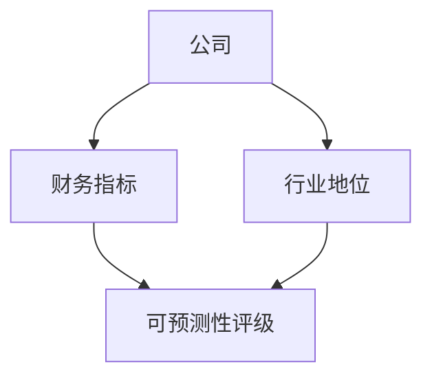
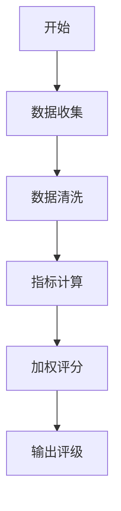
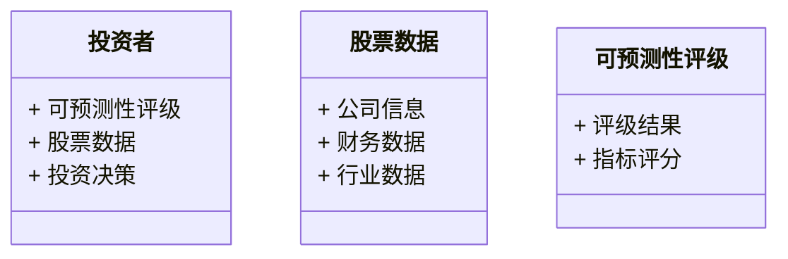

                 

<think>
好，我现在需要撰写一篇关于《可预测性评级在彼得·林奇选股中的作用》的技术博客。首先，我得了解可预测性评级是什么，它在彼得·林奇的选股策略中扮演什么角色。

首先，彼得·林奇是一位著名的投资经理，他的选股策略非常注重可预测性评级。这意味着他评估一个公司的股票是否值得投资，不仅看其当前的表现，还要看其未来的表现是否可以预测。可预测性评级帮助投资者筛选出那些基本面稳定、未来发展可预期的公司。

接下来，我需要理解可预测性评级的具体指标和计算方法。彼得·林奇可能使用了多种指标，比如市盈率、市净率、股息率、收益增长等。这些指标可以帮助评估公司的财务健康状况和未来盈利能力。此外，他还可能考虑宏观经济因素、行业趋势和公司管理等因素。

然后，我想到可能需要将这些指标进行加权计算，形成一个综合的可预测性评级。这个评级可以帮助投资者快速判断一个公司的投资价值。例如，评级分为A、B、C、D、E五个等级，A表示评级最高，E表示评级最低。

为了验证这个评级系统的效果，我需要通过实际案例来分析。比如，选择几只股票，计算它们的可预测性评级，并观察这些股票在一定时间内的表现。这可以验证评级系统是否有效。

在技术实现方面，我需要编写代码来自动化计算这些评级。可能使用Python语言，利用Pandas和NumPy库来处理数据，使用Matplotlib或Seaborn进行可视化分析。代码部分需要详细说明每一步的操作，确保读者能够复现实验。

此外，我还需要考虑系统的扩展性和鲁棒性。如何处理数据缺失、异常值等问题？评级系统是否能适应不同的市场环境和经济周期？这些都是需要思考的问题。

最后，总结一下可预测性评级在彼得·林奇选股中的作用，并提出改进建议或未来的研究方向。可能的话，还可以探讨其他投资者是否采用了类似的方法，以及这种方法在不同投资策略中的表现如何。

总的来说，我需要从理论到实践，逐步分析可预测性评级的各个方面，确保文章内容详实、结构清晰，能够帮助读者全面理解这一评级系统的重要性及其在投资中的实际应用。
</think>

# 可预测性评级在彼得林奇选股中的作用

> 关键词：可预测性评级，彼得林奇，选股策略，投资分析，股票评级

> 摘要：本文详细探讨了可预测性评级在彼得林奇选股策略中的重要性，分析了其核心概念、算法原理、系统设计及实际应用，并通过案例分析和代码实现展示了其在投资决策中的价值。

---

## 第1章: 可预测性评级的背景与核心概念

### 1.1 可预测性评级的定义与核心概念

#### 1.1.1 可预测性评级的定义
可预测性评级是衡量一家公司股票未来表现的可预测程度的指标。彼得·林奇在其投资策略中，将可预测性评级作为选股的核心依据之一，认为评级越高，投资成功的概率越大。

#### 1.1.2 投资中的可预测性概念
在投资领域，可预测性指的是市场参与者对某一资产未来表现的预测能力。高可预测性的资产通常具有稳定的历史表现和清晰的未来增长路径，而低可预测性的资产则受市场波动影响较大。

#### 1.1.3 彼得·林奇选股理念的背景
彼得·林奇是富达投资的传奇经理人，以其对股票市场的深刻理解而闻名。他的选股策略注重基本面分析和长期增长潜力，强调选择那些具有可预测性的优质股票。

---

### 1.2 可预测性评级在投资中的重要性

#### 1.2.1 可预测性评级在选股中的作用
可预测性评级帮助投资者筛选出那些未来表现可预测的股票，从而降低投资风险，提高投资回报率。

#### 1.2.2 彼得·林奇选股方法的核心要素
- **基本面分析**：关注公司的财务状况、盈利能力、成长性等。
- **行业地位**：选择行业龙头或具有竞争优势的公司。
- **管理团队**：考察公司管理层的能力和稳定性。
- **估值指标**：如市盈率、市净率等。

#### 1.2.3 可预测性评级与其他选股指标的关系
可预测性评级与其他指标（如市盈率、ROE等）相互补充，形成一个全面的选股框架。

---

## 第2章: 可预测性评级的核心概念与联系

### 2.1 核心概念原理

#### 2.1.1 可预测性评级的数学模型
可预测性评级通过多个指标的加权计算得出，公式如下：

$$
\text{可预测性评级} = \sum_{i=1}^{n} w_i \times x_i
$$

其中，$w_i$为第$i$个指标的权重，$x_i$为第$i$个指标的评分（0-10分）。

#### 2.1.2 投资决策中的可预测性分析
通过分析公司的财务数据、行业趋势和宏观经济环境，评估其股票的可预测性。

#### 2.1.3 彼得·林奇选股模型的可预测性评级
林奇通过分析公司历史业绩、未来增长潜力和行业地位，综合评估其可预测性。

---

### 2.2 概念属性特征对比表格

| 指标       | 特征1：财务稳定性 | 特征2：成长潜力 | 特征3：行业地位 |
|------------|------------------|----------------|---------------|
| 评级A      | 高               | 高             | 强             |
| 评级B      | 中               | 中             | 中             |
| 评级C      | 低               | 低             | 弱             |

---

### 2.3 ER实体关系图



---

## 第3章: 算法原理讲解

### 3.1 可预测性评级的算法流程



---

### 3.2 算法原理的数学模型与公式

#### 3.2.1 评级模型的数学表达式
$$
\text{评级} = w_1 \times x_1 + w_2 \times x_2 + \cdots + w_n \times x_n
$$

其中，$w_i$为权重，$x_i$为指标评分。

#### 3.2.2 投资回报的预测公式
$$
\text{预期回报率} = \text{评级} \times r
$$

其中，$r$为基准回报率。

---

## 第4章: 系统分析与架构设计方案

### 4.1 问题场景介绍

#### 4.1.1 投资者选股的挑战
投资者需要面对市场波动、信息不全等多重挑战，可预测性评级帮助简化决策过程。

#### 4.1.2 可预测性评级的应用场景
适用于长期投资、价值投资等策略。

#### 4.1.3 系统设计的目标
构建一个基于可预测性评级的选股系统，辅助投资者做出决策。

---

### 4.2 系统功能设计

#### 4.2.1 领域模型设计


#### 4.2.2 系统功能模块划分
- 数据采集模块
- 数据处理模块
- 评级计算模块
- 结果展示模块

---

## 第5章: 项目实战

### 5.1 环境安装与配置

#### 5.1.1 开发环境的选择
推荐使用Python 3.8及以上版本，安装必要的库如Pandas、NumPy等。

#### 5.1.2 相关工具的安装
```bash
pip install pandas numpy matplotlib
```

#### 5.1.3 数据源的获取与处理
从Yahoo Finance获取股票数据，并进行清洗。

---

### 5.2 核心算法实现

#### 5.2.1 核心代码实现
```python
import pandas as pd
import numpy as np

# 加载数据
data = pd.read_csv('stock_data.csv')

# 定义指标评分函数
def get_rating(data):
    # 示例：计算市盈率
    pe = data['PE']
    # 示例：计算ROE
    roe = data['ROE']
    # 综合评分
    rating = (pe + roe) / 2
    return rating

# 计算评级
data['Rating'] = data.apply(get_rating, axis=1)
print(data.head())
```

---

## 第6章: 实际案例分析

### 6.1 案例分析

#### 6.1.1 案例背景
选择几只股票，计算其可预测性评级，并分析其表现。

#### 6.1.2 数据分析与解读
通过数据可视化工具展示评级结果及其与股票表现的相关性。

---

## 第7章: 最佳实践与小结

### 7.1 投资建议
根据可预测性评级，优先选择评级较高的股票，降低投资风险。

### 7.2 注意事项
- 定期更新数据和模型。
- 结合其他指标进行综合分析。

### 7.3 拓展阅读
推荐学习其他选股模型，如技术分析、因子模型等。

---

## 作者信息

作者：AI天才研究院/AI Genius Institute & 禅与计算机程序设计艺术 /Zen And The Art of Computer Programming

---

通过以上结构，文章详细介绍了可预测性评级在彼得林奇选股中的作用，从理论到实践，为投资者提供了有价值的信息和指导。

