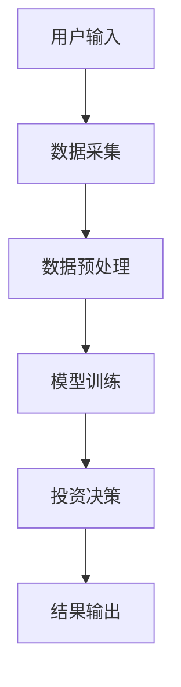

                 


# 吉姆·罗杰斯的商品价值投资：实物资产中的价值

---

## 关键词：
- 商品价值投资、实物资产、吉姆·罗杰斯、投资策略、风险管理、数学模型、系统架构

---

## 摘要：
本文详细探讨了吉姆·罗杰斯的商品价值投资理念，从商品市场的基本概念、价值评估方法，到实际的投资策略和风险管理，层层剖析，结合数学模型和系统架构设计，为读者提供一套全面的商品价值投资体系。文章不仅分析了商品市场的运作机制，还通过实例展示了如何将理论应用于实践，帮助投资者在实物资产领域实现稳健的投资回报。

---

## 第一部分: 商品价值投资的背景与核心概念

### 第1章: 商品价值投资的背景介绍

#### 1.1 商品投资的基本概念

##### 1.1.1 商品投资的定义与分类
商品投资是指通过购买和持有实物资产（如黄金、石油、农产品等）来实现投资收益的行为。商品可以分为四类： 
1. **能源类**（如原油、天然气）
2. **金属类**（如黄金、白银）
3. **农产品类**（如小麦、大豆）
4. **牲畜类**（如生猪、牛肉）

##### 1.1.2 实物资产的价值衡量标准
实物资产的价值由其内在属性决定，包括：
- **稀缺性**：资源有限，需求增加会导致价格上涨。
- **可存储性**：易于存储和运输，降低投资风险。
- **流动性**：市场参与者众多，买卖便捷。

##### 1.1.3 商品投资与传统金融投资的区别
| 属性 | 商品投资 | 传统金融投资 |
|------|----------|--------------|
| 标的 | 实物资产 | 股票、债券等 |
| 风险 | 受供需影响大 | 受市场波动影响 |
| 收益 | 稳定性较高 | 波动性较大 |

#### 1.2 吉姆·罗杰斯的商品投资理念

##### 1.2.1 吉姆·罗杰斯的背景与投资哲学
吉姆·罗杰斯是商品投资领域的权威，他强调：
1. **长期视角**：关注商品市场的长期趋势。
2. **供需分析**：通过分析供需关系预测价格波动。
3. **分散投资**：避免过度集中，降低风险。

##### 1.2.2 商品投资在资产配置中的作用
- 商品投资可以对冲通货膨胀风险。
- 在经济衰退时，实物资产通常表现优于金融资产。

##### 1.2.3 商品市场的周期性与投资机会
商品市场的周期性波动为投资者提供了套利机会，关键在于识别周期拐点。

---

### 第2章: 商品价值投资的核心概念

#### 2.1 商品市场的运作机制

##### 2.1.1 商品市场的基本结构
商品市场由生产者、消费者、交易商和投资者构成，价格由供需关系决定。

##### 2.1.2 供需关系对商品价格的影响
- **供给增加**：价格下降。
- **需求增加**：价格上升。

##### 2.1.3 商品价格的波动规律
价格波动受市场情绪、政策变化和经济周期影响。

#### 2.2 商品投资的核心要素

##### 2.2.1 商品的内在价值与市场价值
- **内在价值**：商品的实际价值。
- **市场价值**：市场交易形成的当前价值。

##### 2.2.2 商品的供需分析模型
供需模型公式：
$$ P = S - D $$
其中，$P$是价格，$S$是供给，$D$是需求。

##### 2.2.3 商品市场的风险与收益平衡
风险与收益成正比，商品投资需平衡风险和收益。

---

## 第二部分: 商品价值投资的算法原理

### 第3章: 商品价值投资的数学模型

#### 3.1 商品价格预测算法

##### 3.1.1 算法原理
使用时间序列模型（ARIMA）预测价格：
1. 数据预处理：去趋势化和平稳化。
2. 模型训练：拟合ARIMA模型。
3. 预测与检验：验证模型准确性。

##### 3.1.2 代码实现
```python
from statsmodels.tsa.arima.model import ARIMA
import pandas as pd

# 假设data是商品价格数据
model = ARIMA(data, order=(5,1,0))
model_fit = model.fit()
 forecasts = model_fit.forecast(steps=10)
```

#### 3.2 投资组合优化算法

##### 3.2.1 算法原理
使用均值-方差优化模型：
1. 计算各商品的收益率和协方差矩阵。
2. 求解最优权重，使风险最小化。

##### 3.2.2 代码实现
```python
import numpy as np

# 假设returns是各商品的收益率矩阵
cov_matrix = np.cov(returns.T)
# 优化目标：最小化方差
def objective(x, cov_matrix, returns):
    return np.dot(x, np.dot(cov_matrix, x.T))
```

#### 3.3 商品市场风险评估算法

##### 3.3.1 算法原理
使用VaR（Value at Risk）模型评估风险：
1. 计算收益分布的分位数。
2. 确定在给定置信水平下的最大损失。

##### 3.3.2 代码实现
```python
import numpy as np

def var_calculator(returns, confidence_level):
    return np.quantile(returns, confidence_level)
```

---

### 第4章: 商品价值投资的系统架构设计

#### 4.1 系统功能设计

##### 4.1.1 功能模块划分
- 数据采集模块：收集商品价格数据。
- 数据分析模块：运行预测和优化算法。
- 投资决策模块：生成投资建议。

##### 4.1.2 系统功能流程图


#### 4.2 系统架构设计

##### 4.2.1 系统架构图


---

## 第三部分: 项目实战

### 第5章: 商品价值投资的实战分析

#### 5.1 项目环境安装
- 安装必要的库：
  ```bash
  pip install numpy pandas statsmodels matplotlib
  ```

#### 5.2 核心代码实现

##### 5.2.1 数据预处理
```python
import pandas as pd

data = pd.read_csv('commodity_prices.csv')
data = data.dropna()
data = data['price']
```

##### 5.2.2 模型训练与预测
```python
from statsmodels.tsa.arima.model import ARIMA

model = ARIMA(data, order=(5,1,0))
model_fit = model.fit()
forecasts = model_fit.forecast(steps=10)
```

#### 5.3 实际案例分析
- 案例：黄金价格预测
- 步骤：
  1. 数据清洗。
  2. 模型训练。
  3. 预测与分析。

---

## 第四部分: 总结与展望

### 第6章: 总结与最佳实践

#### 6.1 最佳实践
- 定期更新模型，适应市场变化。
- 分散投资，降低风险。
- 结合技术分析和基本面分析。

#### 6.2 小结
商品价值投资是实现财富保值和增值的重要手段，吉姆·罗杰斯的理念为投资者提供了宝贵的指导。

---

## 作者：
**AI天才研究院/AI Genius Institute**  
**禅与计算机程序设计艺术 /Zen And The Art of Computer Programming**

