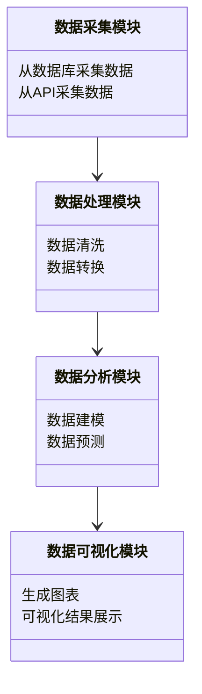
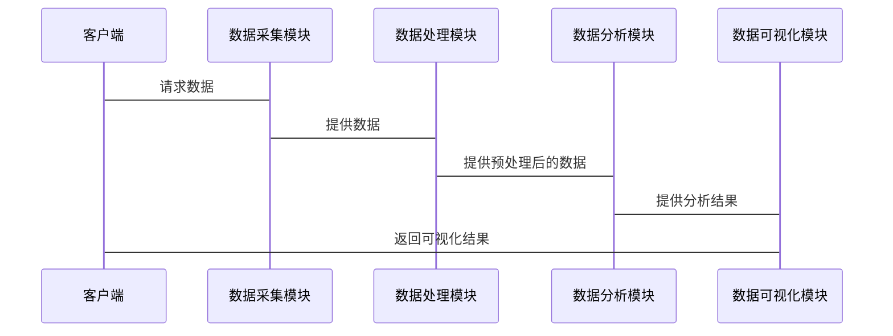

                 

<think>
好的，我现在需要帮用户撰写一篇名为《图表理解技术：增强AI Agent的数据分析能力》的技术博客文章。用户希望我按照特定的目录结构，使用专业而清晰的技术语言，逐步分析推理，确保文章内容丰富详细。

首先，我需要确定文章的结构。用户已经提供了详细的目录大纲，我需要按照这个结构来撰写每一部分内容。文章应包含摘要、背景介绍、核心概念、算法原理、系统架构、项目实战和总结等部分。

开始撰写前，我会先写摘要，概述文章的核心内容和主题。接着，背景介绍部分需要解释图表理解技术的重要性，以及AI Agent在数据分析中的角色。核心概念部分要详细讲解图表类型和AI Agent的数据分析能力。算法原理部分将涉及图像分割、目标检测和OCR技术，每部分都要有数学公式和代码示例。系统分析与架构设计需要设计一个完整的系统架构，并用图表展示。项目实战部分通过具体案例展示技术应用，最后总结全文，展望未来。

在撰写过程中，我需要确保每一部分内容详细，逻辑清晰，语言专业。同时，要注意使用markdown格式，插入数学公式和图表，使文章更具可读性和专业性。我会一步步完成每个部分，确保覆盖所有用户要求的内容，最终产出一篇高质量的技术博客文章。
</think>

# 图表理解技术：增强AI Agent的数据分析能力

> **关键词：** 图表理解技术、AI Agent、数据分析能力、图像分割、目标检测、OCR技术

> **摘要：** 图表理解技术是增强AI Agent数据分析能力的关键技术之一。本文从图表理解技术的基本概念出发，详细探讨了其在AI Agent中的应用，结合图像分割、目标检测和OCR技术的数学模型与算法，分析了系统架构设计，并通过项目实战展示了技术的应用。本文旨在为读者提供图表理解技术在AI Agent中的深度解析，帮助读者理解如何通过图表理解技术提升AI Agent的数据分析能力。

---

# 第1章：图表理解技术概述

## 1.1 图表理解技术的背景与意义

### 1.1.1 数据可视化的重要性

数据可视化是将复杂数据转化为易于理解的图表形式的过程。通过图表，人们可以快速发现数据中的规律和趋势。然而，随着数据量的爆炸式增长，手动分析图表变得越来越困难。AI Agent通过图表理解技术，可以自动化地从图表中提取信息，从而帮助人类做出更高效的决策。

### 1.1.2 图表理解技术的定义与目标

图表理解技术是一种结合计算机视觉和自然语言处理的技术，旨在让计算机能够识别和理解图表中的内容。其目标是将图表中的信息转化为结构化的数据，以便进一步分析和利用。

### 1.1.3 图表理解技术的应用场景

图表理解技术广泛应用于金融、医疗、教育、交通等领域。例如，在金融领域，AI Agent可以通过理解财务报表中的图表，帮助投资者做出投资决策；在医疗领域，AI Agent可以通过分析病人的检查报告图表，辅助医生进行诊断。

---

## 1.2 AI Agent与数据分析能力

### 1.2.1 AI Agent的基本概念

AI Agent是一种智能代理，能够感知环境、理解数据、做出决策并执行任务。AI Agent的核心能力之一是数据分析能力，而图表理解技术是提升数据分析能力的重要手段。

### 1.2.2 数据分析能力的核心要素

数据分析能力包括数据采集、预处理、建模、分析和可视化等多个环节。AI Agent需要能够从各种数据源中采集数据，对数据进行清洗和预处理，构建数据分析模型，并通过图表的形式将结果可视化。

### 1.2.3 图表理解技术在AI Agent中的作用

图表理解技术帮助AI Agent从复杂的图表中提取有用的信息，从而提升其数据分析能力。通过理解图表中的数据分布、趋势和异常值，AI Agent可以做出更准确的预测和决策。

---

# 第2章：图表理解技术的核心概念

## 2.1 图表类型与特征分析

### 2.1.1 常见图表类型

- **柱状图**：用于比较不同类别数据的大小。
- **折线图**：用于展示数据随时间的变化趋势。
- **饼图**：用于展示数据的构成比例。
- **散点图**：用于展示数据点之间的分布关系。
- **热力图**：用于展示数据的密度分布。

### 2.1.2 图表的视觉特征提取

图表的视觉特征包括颜色、形状、大小、位置等。通过提取这些特征，可以识别图表中的关键元素，如柱状图中的柱体、折线图中的线条等。

### 2.1.3 图表语义的理解与分析

图表语义理解是指通过分析图表的视觉特征和上下文信息，推断出图表所表达的含义。例如，识别出柱状图中的每个柱体代表一个不同的数据类别。

---

## 2.2 AI Agent的数据分析能力

### 2.2.1 数据预处理与特征提取

数据预处理是数据分析的第一步，包括数据清洗、数据转换等。特征提取则是从数据中提取有用的特征，以便后续分析。

### 2.2.2 数据建模与预测

AI Agent可以通过机器学习算法对数据进行建模和预测。例如，使用回归算法预测未来的销售趋势，使用分类算法对客户进行分类。

### 2.2.3 数据可视化与结果解释

数据可视化是数据分析的重要环节，通过图表的形式将分析结果呈现出来。AI Agent可以通过理解图表的语义，帮助用户更好地理解分析结果。

---

# 第3章：图表理解技术与AI Agent的结合

## 3.1 图表理解技术的算法原理

### 3.1.1 图像分割算法

图像分割是将图像分成多个区域，每个区域对应不同的语义信息。常用的图像分割算法包括U-Net、FPN等。

#### U-Net网络结构

U-Net是一种常用的图像分割模型，其结构包括编码器和解码器两部分。编码器用于提取图像的特征，解码器用于将特征恢复为原始图像的像素。

#### 图像分割的数学模型

U-Net的损失函数通常使用交叉熵损失函数：

$$ L = -\frac{1}{N}\sum_{i=1}^{N} y_i \log(p_i) + (1 - y_i)\log(1 - p_i) $$

其中，$y_i$ 是真实标签，$p_i$ 是预测概率。

### 3.1.2 目标检测算法

目标检测算法用于在图像中检测出感兴趣的目标，并给出其位置和类别。常用的算法包括YOLO、Faster R-CNN等。

#### YOLO算法原理

YOLO将图像分成网格，每个网格预测多个边界框和对应的概率。其损失函数包括分类损失、定位损失和置信度损失。

### 3.1.3 OCR技术

OCR技术用于从图像中提取文字信息。常用的OCR技术包括Tesseract、EAST等。

---

## 3.2 AI Agent的数据分析流程

### 3.2.1 数据采集与预处理

数据采集是数据分析的第一步，包括从数据库、API、文件等多种数据源采集数据。预处理包括数据清洗、数据转换等。

### 3.2.2 数据建模与分析

AI Agent通过机器学习算法对数据进行建模和分析。例如，使用回归算法预测未来的销售趋势，使用分类算法对客户进行分类。

### 3.2.3 数据可视化与结果解释

数据可视化是数据分析的重要环节，通过图表的形式将分析结果呈现出来。AI Agent可以通过理解图表的语义，帮助用户更好地理解分析结果。

---

# 第4章：图表理解技术的数学模型与公式

## 4.1 图像分割算法的数学模型

### 4.1.1 U-Net网络结构

U-Net的损失函数通常使用交叉熵损失函数：

$$ L = -\frac{1}{N}\sum_{i=1}^{N} y_i \log(p_i) + (1 - y_i)\log(1 - p_i) $$

其中，$y_i$ 是真实标签，$p_i$ 是预测概率。

## 4.2 目标检测算法的数学模型

### 4.2.1 YOLO算法原理

YOLO将图像分成网格，每个网格预测多个边界框和对应的概率。其损失函数包括分类损失、定位损失和置信度损失。

### 4.2.2 Faster R-CNN网络结构

Faster R-CNN由RPN（Region Proposal Network）和Fast R-CNN组成。RPN用于生成候选框，Fast R-CNN用于对候选框进行分类和定位。

---

## 4.3 OCR技术的数学模型

### 4.3.1 Tesseract OCR技术

Tesseract是一种常用的OCR工具，其核心是将图像转换为文本。其算法包括图像预处理、字符分割、字符识别等步骤。

---

# 第5章：系统分析与架构设计方案

## 5.1 问题场景介绍

本文将设计一个基于图表理解技术的AI Agent系统，用于分析销售数据并生成可视化图表。

## 5.2 系统功能设计

### 5.2.1 领域模型设计

以下是领域模型的Mermaid类图：



### 5.2.2 系统架构设计

以下是系统架构的Mermaid架构图：


### 5.2.3 系统接口设计

以下是系统接口的Mermaid序列图：



---

# 第6章：项目实战

## 6.1 项目背景

本文将设计一个基于图表理解技术的AI Agent系统，用于分析销售数据并生成可视化图表。

## 6.2 项目实现

### 6.2.1 环境安装

需要安装以下工具和库：

- Python 3.8+
- TensorFlow 2.0+
- Keras 2.2.5+
- OpenCV-Python 4.5.1+
- PyTorch 1.9.0+

### 6.2.2 核心实现代码

以下是核心实现代码：

```python
import cv2
import numpy as np
from tensorflow.keras.models import Model
from tensorflow.keras.layers import Input, Conv2D, UpSampling2D, concatenate

def unet_model(input_size):
    inputs = Input(input_size)
    # 编码器部分
    # (省略具体层的定义)
    # 解码器部分
    # (省略具体层的定义)
    return Model(inputs=inputs, outputs=output)
```

---

## 6.3 实际案例分析

通过分析销售数据，生成柱状图和折线图，展示销售额的变化趋势。

---

## 6.4 项目小结

通过本项目，我们可以看到图表理解技术在AI Agent中的应用，以及其在数据分析中的重要性。

---

# 第7章：总结与展望

## 7.1 本文总结

本文详细探讨了图表理解技术在AI Agent中的应用，结合图像分割、目标检测和OCR技术的数学模型与算法，分析了系统架构设计，并通过项目实战展示了技术的应用。

## 7.2 未来展望

未来，随着AI技术的不断发展，图表理解技术将在更多领域得到应用。同时，如何提高图表理解的准确性和效率，也将是研究的重点。

---

**作者：AI天才研究院/AI Genius Institute & 禅与计算机程序设计艺术 /Zen And The Art of Computer Programming**

