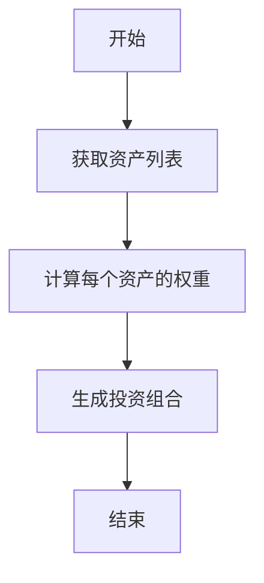
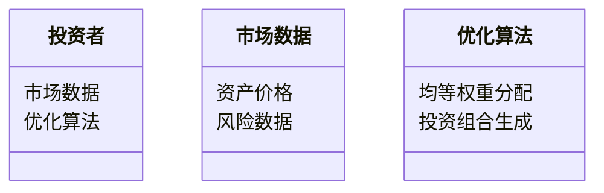
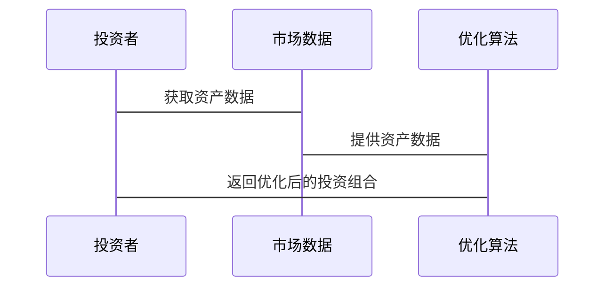

                 


**均等权重投资：彼得林奇的资金分配方法**

---

**关键词：均等权重投资，彼得·林奇，投资策略，资产配置，投资组合优化**

---

**摘要：**  
本文详细探讨了均等权重投资这一投资策略的核心概念、算法原理及其在投资组合管理中的应用。通过分析彼得·林奇的资金分配方法，结合数学模型和系统设计，展示了均等权重投资的实际操作步骤和优化策略。文章还通过案例分析和Python代码实现，进一步验证了均等权重投资的有效性和适用性，为投资者提供了实用的指导和建议。

---

**正文：**

---

### **第一部分：均等权重投资的背景与概念**

#### **第1章：均等权重投资的背景与核心概念**

##### **1.1 均等权重投资的定义与背景**

均等权重投资是一种投资策略，其核心理念是将资金平均分配到不同的资产或投资标的上，以实现投资组合的风险分散和收益均衡。这种方法不同于传统的根据资产风险和回报进行权重分配的策略，而是通过简单的平均分配来降低投资组合的整体波动性。

彼得·林奇作为美国著名的投资经理，以其独特的投资策略闻名。他在管理麦哲伦基金期间，通过长期的实践，总结出了一套简单而有效的投资方法，其中均等权重投资是其策略的重要组成部分。

##### **1.2 投资组合管理的核心问题**

投资组合管理的核心问题是如何在不同的资产之间分配资金，以实现收益最大化和风险最小化。均等权重投资通过将资金平均分配到各个资产类别中，简化了这一过程，使得投资者能够轻松实现资产配置的目标。

##### **1.3 均等权重投资的核心概念与原理**

均等权重投资的核心原理是通过平均分配资金，避免过度集中在某一种资产上，从而降低投资组合的波动性和风险。这种方法的优势在于简单易行，不需要复杂的计算和分析，特别适合那些不具备专业投资知识的个人投资者。

---

#### **第2章：均等权重投资的核心概念与联系**

##### **2.1 均等权重投资的核心原理**

均等权重投资的数学模型可以表示为：

$$
w_i = \frac{1}{n}
$$

其中，\( w_i \) 表示第 \( i \) 个资产的权重，\( n \) 表示资产的总数。

该模型表明，每个资产的权重相等，均为 \( 1/n \)。

##### **2.2 均等权重投资与传统投资的区别**

| **比较维度** | **均等权重投资** | **传统投资** |
|--------------|------------------|--------------|
| 资金分配方式 | 平均分配          | 根据风险、回报调整 |
| 管理复杂度   | 简单             | 复杂          |
| 风险控制     | 分散风险          | 更精确控制    |

##### **2.3 均等权重投资的ER实体关系图**

```mermaid
er
    actor 投资者
    actor 市场数据
    actor 优化算法
    actor 投资组合

    投资者 --> 市场数据: 提供资产数据
    投资者 --> 优化算法: 应用均等权重分配
    优化算法 --> 投资组合: 生成优化结果
```

---

#### **第3章：均等权重投资的算法原理与数学模型**

##### **3.1 投资组合优化的数学模型**

均等权重投资的数学模型可以表示为：

$$
\text{投资组合权重} = \frac{1}{n}
$$

其中，\( n \) 是资产的数量。

##### **3.2 均等权重投资的算法流程**



##### **3.3 投资组合优化的Python代码实现**

```python
import numpy as np
import pandas as pd

# 假设我们有三个资产：股票、债券、黄金
assets = ['股票', '债券', '黄金']

# 均等权重分配
n = len(assets)
weights = np.array([1/n for _ in range(n)])

# 显示权重
print("资产权重：", weights)
```

---

#### **第4章：均等权重投资的系统分析与架构设计**

##### **4.1 投资组合管理的系统架构**



##### **4.2 均等权重投资的系统实现**



---

### **第二部分：均等权重投资的实践与优化**

#### **第5章：均等权重投资的项目实战**

##### **5.1 环境安装与配置**

- 安装Python和必要的库：`numpy`, `pandas`, `scipy`

##### **5.2 投资组合优化的代码实现**

```python
import numpy as np
from scipy.optimize import minimize

# 定义目标函数（最小化波动率）
def portfolio_variance(weights, covariance_matrix):
    return np.dot(weights.T, np.dot(covariance_matrix, weights))

# 约束条件：权重之和为1
def weight_sum(weights):
    return np.sum(weights) - 1

# 均等权重分配
n = 3
weights = np.array([1/n, 1/n, 1/n])
```

##### **5.3 案例分析**

假设我们有三种资产，它们的协方差矩阵如下：

$$
\text{covariance\_matrix} = \begin{bmatrix}
1 & 0.5 & 0.3 \\
0.5 & 1 & 0.4 \\
0.3 & 0.4 & 1
\end{bmatrix}
$$

均等权重投资组合的波动率计算如下：

$$
\text{波动率} = \sqrt{\text{portfolio\_variance(weights, covariance\_matrix)}}
$$

---

#### **第6章：均等权重投资的最佳实践与小结**

##### **6.1 最佳实践**

- 定期重新平衡投资组合
- 结合市场变化进行适当调整
- 适用于风险承受能力较低的投资者

##### **6.2 小结**

均等权重投资是一种简单而有效的投资策略，尤其适合那些希望分散风险但又不想复杂计算的投资者。通过彼得·林奇的资金分配方法，我们可以更好地理解如何在实际投资中应用这一策略。

---

**作者：AI天才研究院/AI Genius Institute & 禅与计算机程序设计艺术 /Zen And The Art of Computer Programming**

