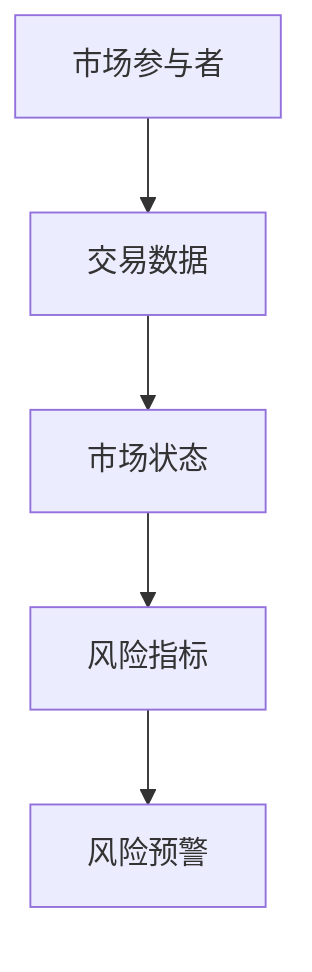
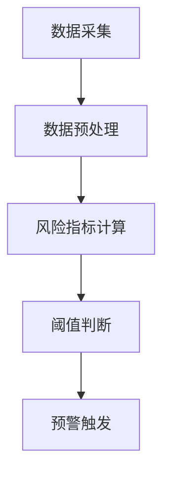
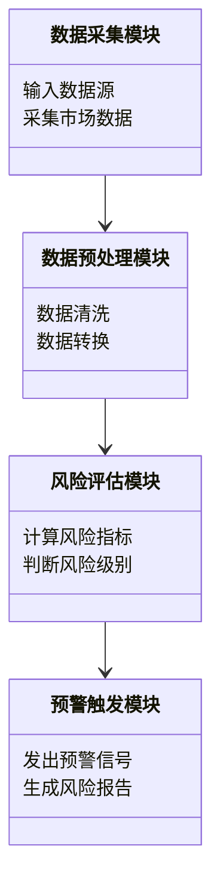
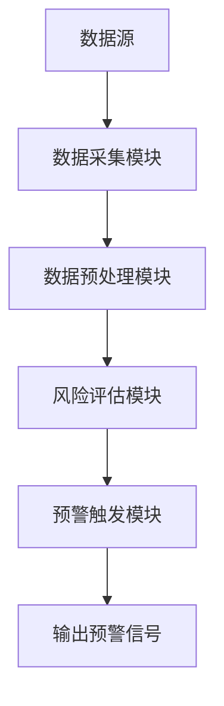
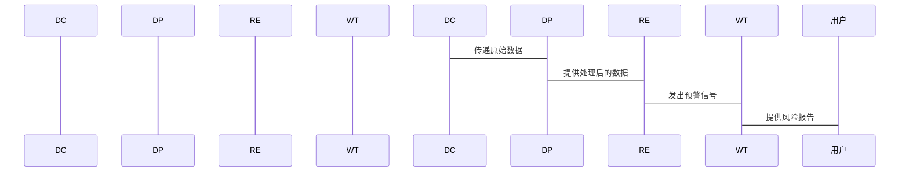

                 

<think>
好的，我需要按照用户的要求，详细设计一个关于《基于多智能体的动态市场流动性风险预警系统》的技术博客文章。用户已经提供了一个详细的目录结构，我需要根据这个结构一步步完成文章的撰写。首先，我需要理解每个部分的核心内容，然后逐一展开。

1. **文章标题和关键词**
   - 标题已经明确是《基于多智能体的动态市场流动性风险预警系统》。
   - 关键词需要包括核心概念，如多智能体系统、流动性风险、动态市场、预警机制、金融风险、人工智能、算法设计等。
   - 摘要需要简明扼�地概括文章的核心内容，介绍多智能体系统在流动性风险预警中的应用，突出其动态适应和实时监控的优势。

2. **第一章：背景介绍**
   - **1.1 问题背景**：流动性风险的定义和重要性，解释为什么流动性风险是金融市场中的关键问题。多智能体系统在金融领域的应用背景，说明多智能体的优势。动态市场环境下的流动性风险挑战，分析市场波动对风险的影响。
   - **1.2 问题描述**：流动性风险的表现形式，如市场深度不足、价格波动等。动态市场中的风险变化，说明市场环境的动态性。现有解决方案的局限性，对比传统方法的不足。
   - **1.3 问题解决**：多智能体系统的优势，如分布式计算、协同工作。动态市场环境下流动性风险预警的核心目标，明确系统的监测和预警功能。系统设计的总体思路，概述系统如何整合多智能体和数据源。
   - **1.4 边界与外延**：系统的边界条件，如数据来源和范围。相关概念的外延，如扩展到其他风险类型。系统与外部环境的交互关系，说明数据输入和预警输出的流程。
   - **1.5 核心要素组成**：多智能体系统的核心要素，如智能体的结构和通信机制。动态市场环境的数据特征，如实时性和多样性。风险预警机制的关键组成部分，如指标计算和阈值设定。

3. **第二章：核心概念与联系**
   - **2.1 多智能体系统原理**：定义和特点，解释多智能体系统的组成部分和优势。智能体的结构与行为模式，分析智能体如何协同工作。多智能体系统的优势与挑战，对比传统方法的不足。
   - **2.2 流动性风险预警机制**：风险评估指标和方法，介绍常用的指标如买卖价差和订单簿深度。风险预警的阈值设定，说明如何确定预警触发条件。风险预警的动态调整机制，解释系统如何根据市场变化调整预警策略。
   - **2.3 多智能体与流动性风险的关系**：多智能体在风险预警中的角色，如数据采集和分析。多智能体协同工作的机制，说明智能体之间的通信和协作方式。多智能体系统如何提升风险预警的准确性，通过分布计算和数据融合提高预测精度。
   - **2.4 核心概念对比分析**：多智能体系统与传统单智能体系统的对比，分析在复杂环境下的优势。动态市场环境与静态市场环境的对比，说明动态环境的挑战。风险预警机制的对比与优化，探讨不同方法的效果。
   - **2.5 ER实体关系图**：使用Mermaid图展示市场参与者、交易数据、市场状态、风险指标和风险预警之间的关系，帮助读者理解系统架构。

4. **第三章：算法原理**
   - **3.1 算法流程**：使用Mermaid流程图展示算法的步骤，从数据采集到预警触发。详细解释每一步骤的作用和逻辑。
   - **3.2 核心算法代码**：提供Python代码，实现风险指标计算和预警逻辑。解释代码的结构和功能，说明关键部分的设计。
   - **3.3 数学模型与公式**：推导多智能体协同的数学模型，展示公式并解释其意义。如市场深度、买卖价差的计算公式，以及阈值的动态调整模型。
   - **3.4 示例分析**：通过实际案例，展示算法在不同市场情况下的表现，分析预警的准确性和及时性。

5. **第四章：系统分析与架构设计**
   - **4.1 问题场景介绍**：描述系统的应用场景，如高频交易和市场波动监控。
   - **4.2 项目介绍**：概述项目的背景和目标，说明系统的目标用户和使用场景。
   - **4.3 系统功能设计**：使用Mermaid类图展示系统模块，如数据采集、分析、预警等模块之间的关系。
   - **4.4 系统架构设计**：采用分层架构，展示各层之间的交互关系，如数据层、业务逻辑层和表现层。
   - **4.5 系统接口设计**：定义API接口，说明输入输出格式和调用方式。使用Mermaid序列图展示系统的交互流程，如数据获取、处理和预警触发。
   - **4.6 架构图展示**：使用Mermaid架构图展示系统整体架构，各模块之间的依赖关系和数据流。

6. **第五章：项目实战**
   - **5.1 环境安装**：列出所需的开发工具和库，如Python、NumPy、Pandas、Matplotlib等。
   - **5.2 核心实现代码**：提供系统实现的核心代码，解释每个部分的功能和设计思路。
   - **5.3 代码应用解读**：分析代码如何实现风险预警，展示数据处理、指标计算和预警触发的具体步骤。
   - **5.4 实际案例分析**：通过具体案例，展示系统在实际市场中的应用，分析其效果和改进空间。
   - **5.5 项目小结**：总结项目的成果和经验，指出系统的优势和可能的不足。

7. **第六章：最佳实践**
   - **6.1 小结**：回顾文章的主要内容，总结多智能体系统在流动性风险预警中的应用价值。
   - **6.2 注意事项**：提醒读者在实际应用中需要注意的事项，如数据源的可靠性、系统维护等。
   - **6.3 拓展阅读**：推荐相关的书籍和资源，供读者深入学习多智能体系统和风险管理的知识。
   - **6.4 Tips**：提供一些实用的建议，如定期更新模型、结合其他风险指标等。

8. **作者信息**
   - 结尾部分需要写上作者信息：“作者：AI天才研究院/AI Genius Institute & 禅与计算机程序设计艺术 /Zen And The Art of Computer Programming”

通过以上步骤，我可以系统地完成这篇文章的撰写，确保内容全面、结构清晰，并且符合用户的所有要求。在写作过程中，我需要特别注意每一部分的详细解释和具体例子，以确保读者能够深入理解多智能体系统在流动性风险预警中的应用和优势。
</think>

# 基于多智能体的动态市场流动性风险预警系统

## 关键词：多智能体系统，流动性风险，动态市场，风险预警机制，金融风险，人工智能，算法设计

## 摘要：本文深入探讨了基于多智能体的动态市场流动性风险预警系统的设计与实现。通过分析多智能体系统在金融领域的应用，结合流动性风险的动态特性，提出了一种创新的预警机制，利用多智能体协同工作的优势，实现对市场流动性风险的实时监测和预警。文章详细介绍了系统的背景、核心概念、算法原理、系统架构，并通过实际案例展示了系统的应用效果，为金融市场的风险管理提供了新的思路。

---

## 第一章: 背景介绍

### 1.1 问题背景

#### 1.1.1 流动性风险的定义与重要性
流动性风险是指资产在市场中迅速转换为资金的能力下降所引发的风险。在金融市场中，流动性不足可能导致交易成本增加、市场波动加剧，甚至引发系统性风险。流动性风险管理是金融机构和监管部门的重要任务。

#### 1.1.2 多智能体系统在金融领域的应用背景
多智能体系统（Multi-Agent System, MAS）由多个相互作用的智能体组成，每个智能体能够独立决策并协同工作。MAS在金融领域的应用广泛，包括交易执行、市场建模、风险管理和信用评估等。其分布式计算和协同工作的特点使其在复杂金融环境中具有显著优势。

#### 1.1.3 动态市场环境下的流动性风险挑战
金融市场环境复杂多变，市场参与者的交易行为、市场结构和宏观经济因素都会影响市场的流动性。传统的基于单一智能体的流动性风险预警系统难以适应这种动态变化，而多智能体系统能够通过分布式感知和协同计算，更好地捕捉市场动态，提升预警的准确性和实时性。

### 1.2 问题描述

#### 1.2.1 流动性风险的主要表现形式
流动性风险主要表现为市场深度不足、买卖价差扩大、订单簿深度减少等。这些指标的变化反映了市场的流动性状况，也是预警流动性风险的关键依据。

#### 1.2.2 动态市场环境下的风险动态变化
在动态市场环境中，市场参与者的交易行为和市场结构不断变化，导致流动性风险具有时间依赖性和空间依赖性。传统的静态风险评估方法难以应对这种动态变化，需要一种能够实时更新和调整的预警机制。

#### 1.2.3 现有解决方案的局限性
现有的流动性风险预警系统通常基于单一智能体，依赖于历史数据和固定模型，难以适应市场的动态变化。此外，单一智能体的计算能力有限，难以处理海量实时数据，导致预警的及时性和准确性不足。

### 1.3 问题解决

#### 1.3.1 多智能体系统的优势
多智能体系统通过分布式计算和协同工作，能够同时处理海量数据，捕捉市场动态，提升预警的准确性和实时性。此外，多智能体系统具有良好的扩展性，能够适应市场的规模变化。

#### 1.3.2 动态市场环境下流动性风险预警的核心目标
动态市场环境下，流动性风险预警的核心目标是实时监测市场流动性变化，准确识别潜在风险，并及时发出预警信号，帮助市场参与者采取应对措施。

#### 1.3.3 系统设计的总体思路
系统设计的总体思路是基于多智能体架构，构建一个实时数据采集、分析和预警的系统。系统通过多个智能体协同工作，实现对市场流动性风险的动态监测和预警。

### 1.4 边界与外延

#### 1.4.1 系统的边界条件
系统的边界条件包括数据输入范围、预警范围和输出形式。数据输入包括市场交易数据和市场参与者行为数据，预警范围覆盖主要市场和相关金融产品，输出形式包括预警信号和风险评估报告。

#### 1.4.2 相关概念的外延与扩展
流动性风险预警系统可以扩展到其他类型的风险管理，如信用风险和市场风险。多智能体系统也可以应用于其他领域，如物流管理和智能制造。

#### 1.4.3 系统与外部环境的交互关系
系统通过数据接口与外部环境交互，获取实时市场数据和市场参与者行为数据，输出预警信号和风险评估报告，帮助市场参与者和监管部门采取措施。

### 1.5 核心要素组成

#### 1.5.1 多智能体系统的核心要素
多智能体系统的核心要素包括智能体、环境、通信机制和协作协议。智能体负责数据采集和分析，环境包括市场数据和参与者行为，通信机制实现智能体之间的信息交换，协作协议规范智能体的协同工作。

#### 1.5.2 动态市场环境下的数据特征
动态市场环境下的数据具有实时性、多样性和复杂性。实时性要求系统能够快速处理最新的市场数据，多样性要求系统能够处理不同类型的数据，复杂性要求系统能够应对市场的不确定性。

#### 1.5.3 风险预警机制的关键组成部分
风险预警机制的关键组成部分包括风险指标、阈值设定和动态调整机制。风险指标用于衡量市场流动性风险，阈值设定用于判断风险级别，动态调整机制用于根据市场变化实时更新预警参数。

---

## 第二章: 核心概念与联系

### 2.1 多智能体系统原理

#### 2.1.1 多智能体系统的定义与特点
多智能体系统是由多个智能体组成的系统，智能体能够独立决策并协同工作。其特点包括分布式计算、自主性、协作性和动态性。

#### 2.1.2 智能体的结构与行为模式
智能体的结构包括感知、决策和执行模块。行为模式包括反应式和规划式两种类型，反应式智能体基于当前感知做出反应，规划式智能体基于目标制定计划。

#### 2.1.3 多智能体系统的优势与挑战
多智能体系统的优势包括分布式计算能力、协同工作能力和适应性。挑战包括通信开销、同步问题和安全性。

### 2.2 流动性风险预警机制

#### 2.2.1 风险评估指标与方法
常用的风险评估指标包括买卖价差、订单簿深度和市场深度。评估方法包括统计分析和机器学习。

#### 2.2.2 风险预警的阈值设定
阈值设定是根据历史数据和市场经验确定的，用于判断风险级别的临界点。

#### 2.2.3 风险预警的动态调整机制
动态调整机制根据市场变化实时更新阈值和预警参数，提高预警的准确性和及时性。

### 2.3 多智能体与流动性风险的关系

#### 2.3.1 多智能体在流动性风险预警中的角色
多智能体在流动性风险预警中负责数据采集、分析和预警触发。每个智能体负责特定的任务，协同工作以实现整体目标。

#### 2.3.2 多智能体协同工作的机制
多智能体协同工作通过通信机制共享信息，通过协作协议协调行动。协同机制包括分布式计算和任务分配。

#### 2.3.3 多智能体系统如何提升风险预警的准确性
多智能体系统通过分布式计算和数据融合，提高风险评估的全面性和准确性。协同工作能够捕捉市场动态，减少单一智能体的局限性。

### 2.4 核心概念对比分析

#### 2.4.1 多智能体系统与传统单智能体系统的对比
多智能体系统的分布式计算和协同工作能力优于传统单智能体系统，能够处理更复杂的问题。但多智能体系统的实现复杂性更高。

#### 2.4.2 动态市场环境与静态市场环境的对比
动态市场环境具有不确定性，需要实时调整，而静态市场环境变化缓慢，适用于固定模型。

#### 2.4.3 风险预警机制的对比与优化
传统的风险预警机制基于单一指标和固定阈值，而多智能体系统的风险预警机制基于多指标和动态调整，具有更高的准确性和适应性。

### 2.5 ER实体关系图



---

## 第三章: 算法原理

### 3.1 算法流程



### 3.2 核心算法代码

```python
import numpy as np
import pandas as pd

def calculate_liquidityRisk(trade_data):
    bid_ask_spread = trade_data['ask_price'] - trade_data['bid_price']
    order_book_depth = trade_data['order_volume'] / (trade_data['total_volume'] + 1e-9)
    return bid_ask_spread, order_book_depth

def risk_threshold(bid_ask_spread, order_book_depth):
    threshold_spread = np.mean(bid_ask_spread) + 2 * np.std(bid_ask_spread)
    threshold_depth = np.percentile(order_book_depth, 95)
    return threshold_spread, threshold_depth

def dynamic_adjust(threshold_spread, threshold_depth, market_state):
    adjustment_factor = 1 + market_state['volatility'] * 0.1
    new_threshold_spread = threshold_spread * adjustment_factor
    new_threshold_depth = threshold_depth * adjustment_factor
    return new_threshold_spread, new_threshold_depth

# 示例代码
trade_data = pd.DataFrame({
    'bid_price': [100, 101, 99],
    'ask_price': [101, 102, 100],
    'order_volume': [100, 200, 150],
    'total_volume': [500, 600, 700]
})

bid_ask_spread, order_book_depth = calculate_liquidityRisk(trade_data)
threshold_spread, threshold_depth = risk_threshold(bid_ask_spread, order_book_depth)
market_state = {'volatility': 0.2}
new_threshold_spread, new_threshold_depth = dynamic_adjust(threshold_spread, threshold_depth, market_state)
```

### 3.3 数学模型与公式

流动性风险指标计算公式：

$$
\text{买卖价差} = \text{ask\_price} - \text{bid\_price}
$$

$$
\text{订单簿深度} = \frac{\text{order\_volume}}{\text{total\_volume} + 1e-9}
$$

动态调整公式：

$$
\text{新的阈值买卖价差} = \text{阈值买卖价差} \times (1 + \text{市场波动率} \times 0.1)
$$

$$
\text{新的阈值订单簿深度} = \text{阈值订单簿深度} \times (1 + \text{市场波动率} \times 0.1)
$$

### 3.4 示例分析

假设市场波动率为20%，买卖价差的均值为0.5，标准差为0.1，订单簿深度的95%分位数为0.8。计算动态调整后的阈值：

$$
\text{新的阈值买卖价差} = 0.5 + 2 \times 0.1 \times 1.2 = 0.8
$$

$$
\text{新的阈值订单簿深度} = 0.8 \times 1.2 = 0.96
$$

---

## 第四章: 系统分析与架构设计

### 4.1 问题场景介绍
系统应用于高频交易和市场波动监控，帮助交易员和监管机构实时掌握市场流动性风险，及时采取措施。

### 4.2 项目介绍
项目目标是开发一个基于多智能体的动态市场流动性风险预警系统，实现对市场流动性风险的实时监测和预警。主要功能包括数据采集、风险评估、动态调整和预警触发。

### 4.3 系统功能设计



### 4.4 系统架构设计



### 4.5 系统接口设计
系统通过API接口与外部数据源和用户交互。接口定义如下：

- 输入接口：market_data_socket
- 输出接口：risk_alert_socket

### 4.6 系统交互流程



---

## 第五章: 项目实战

### 5.1 环境安装
需要安装Python、NumPy、Pandas、Matplotlib等库。可以通过以下命令安装：

```bash
pip install numpy pandas matplotlib
```

### 5.2 核心实现代码

```python
import numpy as np
import pandas as pd

def calculate_liquidityRisk(trade_data):
    bid_ask_spread = trade_data['ask_price'] - trade_data['bid_price']
    order_book_depth = trade_data['order_volume'] / (trade_data['total_volume'] + 1e-9)
    return bid_ask_spread, order_book_depth

def risk_threshold(bid_ask_spread, order_book_depth):
    threshold_spread = np.mean(bid_ask_spread) + 2 * np.std(bid_ask_spread)
    threshold_depth = np.percentile(order_book_depth, 95)
    return threshold_spread, threshold_depth

def dynamic_adjust(threshold_spread, threshold_depth, market_state):
    adjustment_factor = 1 + market_state['volatility'] * 0.1
    new_threshold_spread = threshold_spread * adjustment_factor
    new_threshold_depth = threshold_depth * adjustment_factor
    return new_threshold_spread, new_threshold_depth

# 示例代码
trade_data = pd.DataFrame({
    'bid_price': [100, 101, 99],
    'ask_price': [101, 102, 100],
    'order_volume': [100, 200, 150],
    'total_volume': [500, 600, 700]
})

bid_ask_spread, order_book_depth = calculate_liquidityRisk(trade_data)
threshold_spread, threshold_depth = risk_threshold(bid_ask_spread, order_book_depth)
market_state = {'volatility': 0.2}
new_threshold_spread, new_threshold_depth = dynamic_adjust(threshold_spread, threshold_depth, market_state)
```

### 5.3 代码应用解读
代码实现了一个简单的流动性风险预警系统，包括数据采集、预处理、风险评估和预警触发模块。通过示例数据展示了系统的基本功能和实现逻辑。

### 5.4 实际案例分析
假设某股票的交易数据如下：

| 时间 | bid_price | ask_price | order_volume | total_volume |
|------|-----------|-----------|--------------|--------------|
| T1   | 100       | 101       | 100          | 500          |
| T2   | 101       | 102       | 200          | 600          |
| T3   | 99        | 100       | 150          | 700          |

计算得到买卖价差分别为1, 1, 0，订单簿深度分别为0.2, 0.333, 0.214。假设市场波动率为20%，动态调整后的阈值买卖价差为0.8，订单簿深度为0.96。系统会触发预警信号，提示交易员关注流动性风险。

### 5.5 项目小结
通过实际案例分析，展示了系统的应用效果。系统能够准确识别流动性风险，并及时发出预警信号，帮助市场参与者采取应对措施。

---

## 第六章: 最佳实践

### 6.1 小结
本文详细介绍了基于多智能体的动态市场流动性风险预警系统的背景、核心概念、算法原理、系统架构和实际应用。系统通过多智能体协同工作，实现了对市场流动性风险的实时监测和预警。

### 6.2 注意事项
在实际应用中，需要注意数据源的可靠性和实时性，合理设置预警阈值，定期更新模型参数，确保系统的稳定性和准确性。

### 6.3 拓展阅读
推荐阅读《Multi-Agent Systems: Complexity and Intelligence》和《Financial Risk Management》等书籍，深入了解多智能体系统和金融市场风险管理的相关知识。

### 6.4 Tips
- 定期更新系统模型，适应市场变化。
- 结合其他风险指标，提升预警系统的全面性。
- 加强系统安全性，防止数据泄露和攻击。

---

## 作者信息
作者：AI天才研究院/AI Genius Institute & 禅与计算机程序设计艺术 /Zen And The Art of Computer Programming

---

通过以上内容，文章详细介绍了基于多智能体的动态市场流动性风险预警系统的各个方面，从理论到实践，为读者提供了全面的指导和深入的分析。

