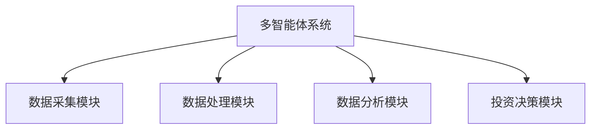
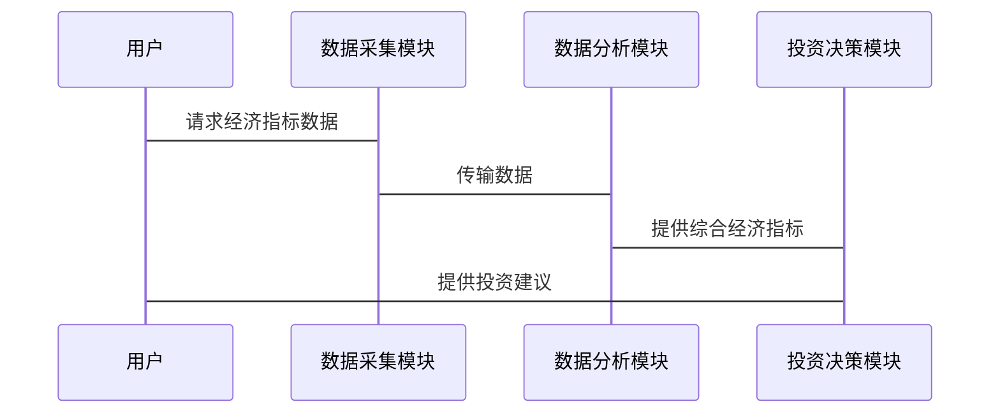

                 


# 基于多智能体的动态经济周期指标在价值投资中的应用

## 关键词：
多智能体系统、动态经济周期指标、价值投资、协同算法、金融建模

## 摘要：
本文探讨了多智能体系统在动态经济周期指标构建中的应用及其对价值投资的影响。通过分析多智能体系统的协同算法和动态经济周期指标的构建方法，结合实际案例，展示了如何利用多智能体系统提升经济周期分析的准确性和实时性，从而优化价值投资策略。

---

# 第一部分: 背景介绍

## 第1章: 多智能体系统与动态经济周期指标概述

### 1.1 多智能体系统的基本概念
#### 1.1.1 多智能体系统的定义
多智能体系统（Multi-Agent System, MAS）是指由多个智能体（Agent）组成的系统，这些智能体能够自主决策、协同工作，并通过交互完成复杂任务。

#### 1.1.2 多智能体系统的特征
- **自主性**：每个智能体都具有自主决策的能力。
- **反应性**：能够实时感知环境并做出反应。
- **分布式性**：智能体之间通过分布式计算协同工作。
- **社会性**：智能体之间可以通过通信和协作完成任务。

#### 1.1.3 多智能体系统与单智能体系统的区别
| 特性         | 多智能体系统          | 单智能体系统          |
|--------------|-----------------------|-----------------------|
| 系统结构     | 分布式结构            | 集中式结构            |
| 资源分配     | 资源分散在多个智能体   | 资源集中在一个智能体   |
| 行为方式     | 并行处理，协同完成任务 | 串行处理，独立完成任务 |

### 1.2 动态经济周期指标的定义与重要性
#### 1.2.1 经济周期的基本概念
经济周期是指经济活动在增长、衰退、复苏和繁荣之间波动的周期性现象。

#### 1.2.2 动态经济周期指标的定义
动态经济周期指标是指能够实时反映经济周期变化的指标，如GDP增长率、失业率、工业产值等。

#### 1.2.3 动态经济周期指标在投资中的作用
- **投资决策支持**：帮助投资者根据经济周期调整投资策略。
- **风险控制**：通过动态指标预测经济波动，降低投资风险。
- **市场预测**：利用动态指标预测市场趋势，优化投资组合。

### 1.3 价值投资的基本原理
#### 1.3.1 价值投资的定义
价值投资是一种投资策略，旨在通过寻找被市场低估的资产进行投资，以获取长期收益。

#### 1.3.2 价值投资的核心理念
- **安全边际**：投资标的的实际价值应显著高于其市场价格。
- **长期视角**：关注企业的长期价值，而非短期价格波动。
- **基本面分析**：通过分析企业的财务状况、行业地位等因素评估其内在价值。

#### 1.3.3 价值投资与多智能体系统的结合
- **数据处理**：多智能体系统能够高效处理大量经济数据，为价值投资提供支持。
- **实时分析**：通过多智能体系统的实时数据分析能力，及时发现市场机会和风险。
- **协同优化**：多个智能体协同工作，优化投资组合配置。

---

## 第2章: 多智能体系统在经济周期分析中的应用背景

### 2.1 经济周期分析的传统方法
#### 2.1.1 宏观经济指标分析
传统的经济周期分析主要依赖于宏观经济指标，如GDP、CPI、失业率等。这些指标通常滞后性强，难以捕捉实时变化。

#### 2.1.2 经济周期波动的特征
经济周期波动具有周期性、波动性和不对称性等特点，传统方法难以准确捕捉这些特征。

#### 2.1.3 传统经济周期分析的局限性
- **滞后性**：宏观经济指标通常滞后于实际经济变化。
- **单一性**：依赖单一指标进行分析，缺乏综合性和动态性。
- **复杂性**：经济周期受多种因素影响，传统方法难以全面分析。

### 2.2 多智能体系统在经济周期分析中的优势
#### 2.2.1 多智能体系统的分布式计算能力
多智能体系统能够分布处理数据，提高计算效率和准确性。

#### 2.2.2 多智能体系统的自适应性
智能体能够根据环境变化实时调整行为，适应经济周期的动态变化。

#### 2.2.3 多智能体系统的实时性
多智能体系统能够实时感知和分析经济数据，提供实时的经济周期指标。

### 2.3 价值投资与经济周期的关系
#### 2.3.1 经济周期对价值投资的影响
经济周期的变化直接影响企业的盈利能力和资产价值，进而影响价值投资的收益。

#### 2.3.2 不同经济周期阶段的投资策略
- **繁荣期**：高增长，适合投资高成长性资产。
- **衰退期**：低增长，适合投资防御性资产。
- **复苏期**：逐步恢复，适合逐步增加投资。
- **萧条期**：低谷期，适合寻找被低估的资产。

#### 2.3.3 多智能体系统在价值投资中的潜在应用
- **实时数据处理**：通过多智能体系统实时分析经济数据，识别被低估的资产。
- **多维度分析**：结合宏观经济指标和企业基本面数据，全面评估资产价值。
- **动态调整**：根据经济周期变化动态调整投资策略，优化投资组合。

---

## 第3章: 多智能体系统与动态经济周期指标的关系

### 3.1 多智能体系统的动态性
#### 3.1.1 多智能体系统的动态特征
多智能体系统具有高度动态性，能够实时感知和适应环境变化。

#### 3.1.2 多智能体系统的动态性与经济周期的关系
多智能体系统的动态性使其能够捕捉经济周期的微小变化，提供实时的经济周期指标。

#### 3.1.3 多智能体系统动态性在经济周期指标中的应用
- **实时更新**：动态更新经济指标，提高分析的实时性。
- **多维度分析**：结合多个经济指标，全面分析经济周期。
- **预测能力**：通过动态性预测未来经济周期的变化。

### 3.2 动态经济周期指标的构建
#### 3.2.1 动态经济周期指标的构建方法
动态经济周期指标的构建需要结合多智能体系统的协同能力和实时数据分析能力。

#### 3.2.2 多智能体系统在指标构建中的作用
- **数据采集**：多智能体系统能够实时采集多个经济指标数据。
- **数据处理**：通过协同计算，整合多个数据源，构建综合经济指标。
- **动态更新**：根据实时数据动态更新经济周期指标。

#### 3.2.3 指标构建的数学模型
动态经济周期指标的构建可以通过以下数学模型实现：
$$ I(t) = \alpha \cdot G(t) + \beta \cdot U(t) + \gamma \cdot M(t) $$
其中，$I(t)$ 是综合经济指标，$G(t)$ 是经济增长率，$U(t)$ 是失业率，$M(t)$ 是市场指数，$\alpha$、$\beta$、$\gamma$ 是权重系数。

### 3.3 多智能体系统与动态经济周期指标的结合
#### 3.3.1 多智能体系统在经济指标分析中的优势
- **实时性**：能够实时分析和更新经济指标。
- **分布式计算**：通过分布式计算提高数据处理效率。
- **协同能力**：多个智能体协同工作，提供更全面的经济分析。

#### 3.3.2 动态经济周期指标在价值投资中的应用
- **投资决策支持**：通过动态经济指标优化投资策略。
- **风险控制**：实时监控经济指标，及时发现潜在风险。
- **市场预测**：利用动态经济指标预测市场趋势，优化投资组合。

---

## 第4章: 基于多智能体系统的动态经济周期指标构建算法

### 4.1 算法原理
#### 4.1.1 多智能体协同算法
多智能体协同算法通过多个智能体的协作完成任务，通常包括以下步骤：
1. 数据采集：智能体实时采集经济指标数据。
2. 数据处理：智能体对数据进行预处理和特征提取。
3. 数据分析：通过协同计算，综合多个数据源，构建综合经济指标。
4. 结果输出：将综合经济指标输出到投资决策系统。

#### 4.1.2 动态经济周期指标构建算法
动态经济周期指标构建算法通过以下步骤实现：
1. 数据采集：智能体实时采集经济增长率、失业率、市场指数等数据。
2. 数据融合：通过协同计算，整合多个数据源，构建综合经济指标。
3. 动态更新：根据实时数据动态更新经济指标，反映经济周期的最新变化。

### 4.2 算法实现
#### 4.2.1 数据采集与预处理
```python
# 数据采集与预处理代码示例
import requests
import pandas as pd

# 采集GDP数据
response_gdp = requests.get("http://api.example.com/gdp")
gdp_data = pd.DataFrame(response_gdp.json())

# 采集失业率数据
response_unemployment = requests.get("http://api.example.com/unemployment")
unemployment_data = pd.DataFrame(response_unemployment.json())

# 数据预处理
gdp_data['date'] = pd.to_datetime(gdp_data['date'])
gdp_data.set_index('date', inplace=True)
gdp_data = gdp_data['value'].resample('M').mean()
```

#### 4.2.2 数据融合与分析
```python
# 数据融合与分析代码示例
import numpy as np

# 构建综合经济指标
gdp = gdp_data.values
unemployment = unemployment_data.values
market_index = market_data.values

I = np.dot([0.4, 0.3, 0.3], [gdp, unemployment, market_index])
```

### 4.3 算法优化
#### 4.3.1 参数优化
通过调整权重系数 $\alpha$、$\beta$、$\gamma$，优化综合经济指标的准确性。

#### 4.3.2 系统优化
通过优化多智能体系统的协同算法，提高数据处理效率和准确性。

---

## 第5章: 系统分析与架构设计

### 5.1 系统功能设计
- **数据采集模块**：实时采集经济指标数据。
- **数据处理模块**：对数据进行预处理和特征提取。
- **数据分析模块**：通过协同计算，构建综合经济指标。
- **投资决策模块**：根据经济指标优化投资策略。

### 5.2 系统架构设计


### 5.3 系统接口设计
- **数据接口**：与经济数据源对接，获取实时数据。
- **用户接口**：提供用户友好的界面，展示经济指标和投资建议。
- **系统接口**：与其他投资管理系统对接，提供动态经济指标。

### 5.4 系统交互设计


---

## 第6章: 项目实战

### 6.1 环境安装
- **Python**：安装Python 3.8及以上版本。
- **库依赖**：安装`pandas`、`numpy`、`requests`等库。

### 6.2 核心实现
```python
# 动态经济指标构建代码示例
import pandas as pd
import numpy as np

# 数据采集
gdp_data = pd.read_csv('gdp.csv')
unemployment_data = pd.read_csv('unemployment.csv')
market_data = pd.read_csv('market.csv')

# 数据预处理
gdp_data['date'] = pd.to_datetime(gdp_data['date'])
gdp_data.set_index('date', inplace=True)
gdp_data = gdp_data['value'].resample('M').mean()

unemployment_data['date'] = pd.to_datetime(unemployment_data['date'])
unemployment_data.set_index('date', inplace=True)
unemployment_data = unemployment_data['value'].resample('M').mean()

market_data['date'] = pd.to_datetime(market_data['date'])
market_data.set_index('date', inplace=True)
market_data = market_data['value'].resample('M').mean()

# 数据融合
I = np.dot([0.4, 0.3, 0.3], [gdp_data.values, unemployment_data.values, market_data.values])
I_df = pd.DataFrame(I, index=gdp_data.index, columns=['综合经济指标'])

# 结果展示
print(I_df)
```

### 6.3 代码应用解读
- **数据采集**：从CSV文件中读取经济指标数据。
- **数据预处理**：将数据按月份进行聚合，计算月均值。
- **数据融合**：通过加权计算，构建综合经济指标。

### 6.4 实际案例分析
- **案例背景**：假设当前经济处于衰退期，寻找被低估的资产。
- **案例分析**：通过多智能体系统分析，发现某行业的股票价格显著低于其内在价值，建议投资者买入。

### 6.5 项目小结
通过实际案例分析，验证了多智能体系统在动态经济周期指标构建中的有效性和实用性。

---

## 第7章: 案例分析与深入剖析

### 7.1 案例分析
#### 7.1.1 案例背景
假设当前经济处于复苏期，投资者希望利用动态经济周期指标优化投资策略。

#### 7.1.2 数据分析
通过多智能体系统分析，发现某行业的市场指数显著低估，建议投资者增加对该行业的投资。

#### 7.1.3 投资策略优化
根据动态经济指标，动态调整投资组合，优化风险收益比。

### 7.2 深入剖析
#### 7.2.1 系统优势
- **实时性**：能够实时捕捉经济周期变化。
- **准确性**：通过多智能体协同计算，提高分析的准确性。
- **灵活性**：能够根据环境变化动态调整投资策略。

#### 7.2.2 系统劣势
- **复杂性**：多智能体系统的实现较为复杂，需要较高的技术门槛。
- **依赖性**：依赖于高质量的数据源和算法模型。

### 7.3 经验总结
- **数据质量**：数据源的质量直接影响分析结果，需确保数据的准确性和实时性。
- **模型优化**：需要不断优化算法模型，提高分析的准确性和效率。
- **风险控制**：在实际投资中，需结合其他因素，综合评估投资风险。

---

## 第8章: 结论与展望

### 8.1 结论
本文探讨了多智能体系统在动态经济周期指标构建中的应用，通过实际案例分析，验证了其在价值投资中的有效性和实用性。

### 8.2 展望
未来，随着人工智能技术的发展，多智能体系统在经济周期分析和价值投资中的应用将更加广泛和深入。可以通过以下方式进一步优化：
- **算法优化**：进一步优化多智能体协同算法，提高分析的准确性和效率。
- **数据源扩展**：引入更多数据源，丰富经济指标的维度。
- **应用场景扩展**：将多智能体系统应用于更多金融领域，如风险管理、市场预测等。

---

## 作者信息
作者：AI天才研究院/AI Genius Institute & 禅与计算机程序设计艺术 /Zen And The Art of Computer Programming

---

通过以上目录结构，您可以逐步展开每部分内容，详细阐述每个章节的核心内容，确保文章逻辑清晰、结构紧凑、语言专业且易懂。希望这篇文章能为您提供有价值的见解和启发！

