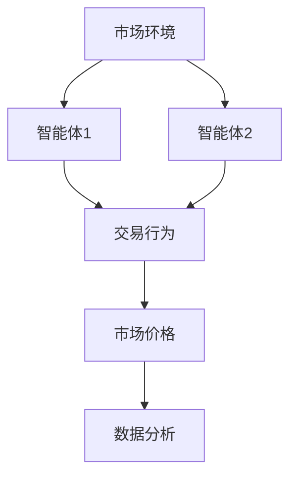

                 


# 基于多智能体的市场微观结构分析

## 关键词：多智能体，市场微观结构，市场分析，算法设计，系统架构

## 摘要：  
本文探讨了基于多智能体的市场微观结构分析，从理论基础到实际应用，详细阐述了多智能体系统在市场分析中的应用价值。文章通过定义核心概念、分析算法原理、设计系统架构，并结合实际案例，展示了如何利用多智能体技术模拟和优化市场微观结构，为市场分析提供新的视角和方法。

---

# 第一部分: 市场微观结构与多智能体系统概述

## 第1章: 市场微观结构的定义与特点

### 1.1 什么是市场微观结构
市场微观结构是指市场中各个参与者（如买家、卖家、交易商等）之间的互动关系和交易机制。它关注市场的动态行为，而非整体市场的宏观表现。

### 1.2 多智能体系统的特点
多智能体系统由多个自主或协作的智能体组成，这些智能体能够感知环境、做出决策并进行交互。其特点包括：
- **自主性**：智能体能够自主决策。
- **反应性**：能够实时感知环境变化并做出反应。
- **协作性**：多个智能体可以协作完成复杂任务。
- **分布性**：智能体之间分布式的计算和通信。

### 1.3 多智能体系统在市场微观结构中的作用
多智能体系统能够模拟市场中多个参与者的行为，分析其互动对市场价格、流动性和信息传播的影响，从而为市场分析提供更精细的视角。

---

## 第2章: 基于多智能体的市场微观结构分析

### 2.1 多智能体系统的构成
一个典型的多智能体系统包括以下组成部分：
- **环境**：市场的运行环境，包括时间、空间等因素。
- **智能体**：参与者，如买家、卖家、交易商等。
- **交互规则**：智能体之间的互动规则，如交易规则、价格形成机制等。

### 2.2 市场微观结构的动态特征
市场微观结构具有动态性，价格、成交量等指标会随着参与者行为的变化而波动。多智能体系统能够捕捉这些动态变化，提供实时的市场分析。

### 2.3 多智能体系统的优势
相比传统的市场分析方法，多智能体系统的优势在于：
- **实时性**：能够实时模拟市场动态。
- **复杂性**：能够处理多个参与者之间的复杂互动。
- **可扩展性**：适用于不同规模和复杂度的市场分析。

---

# 第二部分: 多智能体系统的算法设计与实现

## 第3章: 基于多智能体的交易模型

### 3.1 多智能体交易模型的构建
交易模型需要定义以下内容：
- **智能体的行为**：如报价、成交等。
- **市场规则**：如订单匹配规则、价格生成机制。
- **信息流**：如订单簿的更新、价格的传播。

### 3.2 基于博弈论的交易策略
博弈论是多智能体系统中的重要理论基础。通过分析各智能体的策略，可以预测市场中的价格波动和交易行为。

### 3.3 交易模型的实现
实现一个简单的多智能体交易模型，包括智能体的初始化、行为决策、交易执行等步骤。

---

## 第4章: 多智能体系统的算法实现

### 4.1 算法设计
- **初始化**：设置市场环境和智能体的初始状态。
- **循环执行**：每个智能体根据当前环境状态做出决策，并执行交易行为。
- **更新状态**：根据交易结果更新市场环境和智能体状态。

### 4.2 代码实现
以下是一个简单的多智能体交易模型的Python代码示例：

```python
class Agent:
    def __init__(self, id):
        self.id = id
        self.state = 0  # 0表示未持有资产，1表示持有资产

    def decide(self, price):
        # 根据当前价格决定是否买入或卖出
        if price < 100:
            return 'buy'
        elif price > 100:
            return 'sell'
        else:
            return 'hold'

def main():
    agents = [Agent(1), Agent(2), Agent(3)]
    price = 100
    for agent in agents:
        action = agent.decide(price)
        if action == 'buy':
            print(f"Agent {agent.id} buys at price {price}")
            price += 1
        elif action == 'sell':
            print(f"Agent {agent.id} sells at price {price}")
            price -= 1

if __name__ == "__main__":
    main()
```

---

## 第5章: 市场微观结构的动态分析

### 5.1 动态分析的方法
通过多智能体系统的模拟，可以实时跟踪市场价格的变化，分析市场波动的原因。

### 5.2 案例分析
以股票市场为例，模拟多智能体之间的交易行为，分析价格波动和市场流动性。

---

# 第三部分: 基于多智能体的市场分析系统设计

## 第6章: 系统架构设计

### 6.1 系统功能需求
- **市场环境模拟**：模拟真实的市场环境，包括时间、参与者等。
- **智能体行为建模**：定义智能体的行为规则和决策逻辑。
- **数据采集与分析**：采集市场数据，进行实时分析和反馈。

### 6.2 系统架构图


### 6.3 系统接口设计
定义智能体与市场环境之间的接口，如API调用、消息队列等。

---

## 第7章: 系统实现与优化

### 7.1 系统实现
基于前面的算法设计，实现一个多智能体市场分析系统，包括前端界面和后端逻辑。

### 7.2 系统优化
通过并行计算、事件驱动等技术优化系统的性能，提高模拟的效率。

---

# 第四部分: 项目实战与案例分析

## 第8章: 项目实战

### 8.1 环境安装
安装必要的开发工具和库，如Python、NumPy、Matplotlib等。

### 8.2 核心代码实现
实现多智能体交易模型，包括智能体的行为决策、交易执行等。

### 8.3 案例分析
以实际市场数据为例，模拟多智能体的交易行为，分析市场微观结构的变化。

---

## 第9章: 系统测试与结果展示

### 9.1 系统测试
通过测试用例验证系统的正确性和性能。

### 9.2 测试结果展示
展示测试结果，如价格波动曲线、成交量变化等。

---

# 第五部分: 总结与展望

## 第10章: 总结

### 10.1 本文的核心内容
总结本文的主要内容和研究成果。

### 10.2 研究的局限性
分析研究中存在的不足之处。

### 10.3 未来研究方向
提出未来可能的研究方向和改进思路。

---

## 作者信息

作者：AI天才研究院 & 禅与计算机程序设计艺术

---

**注**：以上内容为文章的详细目录和部分章节内容的示例，具体内容可根据实际需求进行扩展和补充。

