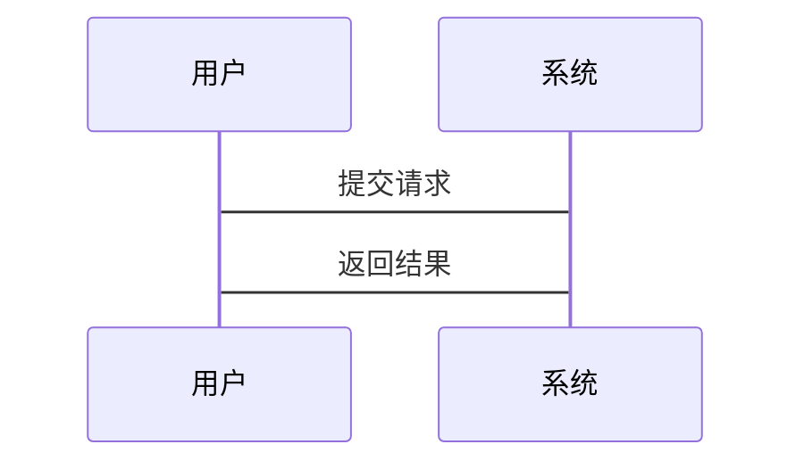

                 


# 基于多智能体的自动化产业周期分析

> 关键词：多智能体系统，产业周期分析，自动化分析，系统架构，算法原理，项目实战

> 摘要：本文详细探讨了基于多智能体的自动化产业周期分析方法，从多智能体系统的定义与核心概念出发，分析了其在产业周期分析中的应用价值。通过阐述多智能体系统的通信机制与协调协作原理，结合具体的算法实现与系统架构设计，本文深入介绍了如何利用多智能体技术实现产业周期的自动化分析。最后，通过一个实际案例展示了系统的具体实现过程，并总结了相关经验与未来研究方向。

---

# 第一部分: 多智能体系统与产业周期分析概述

## 第1章: 多智能体系统的基本概念

### 1.1 多智能体系统（Multi-Agent System, MAS）

#### 1.1.1 多智能体系统的定义
多智能体系统（MAS）是指由多个智能体（Agent）组成的分布式系统，这些智能体通过协作完成特定任务。智能体是具有感知环境、自主决策和行动能力的实体。

#### 1.1.2 多智能体系统的特征
- **自主性**：智能体能够自主决策。
- **反应性**：能够实时感知环境并做出反应。
- **协作性**：多个智能体之间需要协作完成任务。
- **分布性**：智能体通常分布在不同的空间或时间维度。

#### 1.1.3 多智能体系统的应用场景
- **分布式计算**
- **机器人协作**
- **自动驾驶**
- **金融交易**

### 1.2 产业周期分析的背景与意义

#### 1.2.1 产业周期的基本概念
产业周期是指一个产业从萌芽到成熟，再到衰退和复苏的循环过程。产业周期分析对于企业战略决策具有重要意义。

#### 1.2.2 产业周期分析的重要性
- **帮助企业制定战略规划**
- **优化资源配置**
- **规避市场风险**

#### 1.2.3 多智能体系统在产业周期分析中的优势
- **高效性**：多智能体系统能够快速处理大量数据。
- **协作性**：多个智能体可以分别负责不同的分析任务。
- **实时性**：能够实时跟踪市场变化。

---

# 第二部分: 多智能体系统的原理与实现

## 第2章: 多智能体系统的原理

### 2.1 多智能体系统的组成

#### 2.1.1 智能体的定义与分类
- **定义**：智能体是能够感知环境、做出决策并采取行动的实体。
- **分类**：
  - **简单反射型智能体**
  - **基于模型的反射型智能体**
  - **目标驱动型智能体**
  - **效用驱动型智能体**

#### 2.1.2 智能体之间的交互关系
- **协同合作**
- **竞争对抗**
- **信息共享**

#### 2.1.3 系统的环境与任务分配
- **环境建模**
- **任务分解**
- **资源分配**

### 2.2 多智能体系统的通信机制

#### 2.2.1 智能体之间的通信方式
- **直接通信**
- **间接通信**
- **广播通信**

#### 2.2.2 通信协议的选择与设计
- **基于HTTP的通信**
- **基于消息队列的通信**
- **基于WebSocket的实时通信**

#### 2.2.3 通信中的同步与异步问题
- **同步通信**：确保智能体之间的通信是同步的。
- **异步通信**：允许智能体在通信过程中继续执行其他任务。

### 2.3 多智能体系统的协调与协作

#### 2.3.1 协调机制的定义与作用
- **协调机制**：确保多个智能体能够协同工作。
- **作用**：提高系统的整体效率和性能。

#### 2.3.2 基于规则的协作方法
- **规则定义**：智能体根据预定义的规则进行协作。
- **规则执行**：通过规则引擎实现协作。

#### 2.3.3 基于学习的协作方法
- **强化学习**：智能体通过学习策略进行协作。
- **经验共享**：智能体之间共享经验以提高协作效率。

## 第3章: 多智能体系统的实现技术

### 3.1 多智能体系统的开发框架

#### 3.1.1 常见的多智能体开发框架
- **Jason**
- **Cognitive Agent Software (CAS)**
- **Open Agent**
- **社会仿真工具（如NetLogo）**

#### 3.1.2 各框架的优缺点对比
| 框架名称 | 优点 | 缺点 |
|----------|------|------|
| Jason    | 支持多种编程语言，功能强大 | 学习曲线较高 |
| CAS      | 易用性高，适合快速开发 | 功能相对简单 |
| Open Agent | 开源，社区支持好 | 文档不够完善 |

#### 3.1.3 框架选择的策略
- **项目需求**：根据具体需求选择适合的框架。
- **团队技能**：选择团队熟悉的框架。
- **性能要求**：选择能够满足性能需求的框架。

### 3.2 多智能体系统的编程实现

#### 3.2.1 基于Python的多智能体实现

```python
class Agent:
    def __init__(self, id):
        self.id = id
        self.state = "idle"
    
    def感知环境(self, 环境):
        pass
    
    def 决策(self):
        pass
    
    def 行动(self):
        pass

# 示例：多个智能体协作完成任务
agents = [Agent(i) for i in range(5)]
for agent in agents:
    agent.感知环境(环境)
    agent.决策()
    agent.行动()
```

#### 3.2.2 基于Java的多智能体实现
Java实现多智能体系统通常需要使用多线程和分布式技术，适合大规模复杂系统。

#### 3.2.3 其他语言的实现方式
- **C++**：适合高性能场景。
- **JavaScript**：适合Web环境下的多智能体实现。

### 3.3 多智能体系统的性能优化

#### 3.3.1 并行计算与分布式处理
- **并行计算**：利用多核处理器提高计算效率。
- **分布式处理**：将任务分配到多个节点上进行处理。

#### 3.3.2 网络通信的优化
- **减少数据传输量**：通过压缩和序列化技术优化通信效率。
- **异步通信**：使用异步机制减少等待时间。

#### 3.3.3 算法的优化与调优
- **简化算法**：减少不必要的计算步骤。
- **并行化算法**：将算法分解为多个并行执行的部分。

---

# 第三部分: 自动化产业周期分析的系统设计

## 第4章: 产业周期分析的系统架构

### 4.1 系统功能模块划分

#### 4.1.1 数据采集模块
- **数据来源**：股票市场数据、行业报告、新闻数据。
- **数据格式**：结构化数据（如CSV、JSON）和非结构化数据（如文本、图像）。

#### 4.1.2 数据处理模块
- **数据清洗**：去除噪声数据。
- **数据转换**：将数据转换为适合分析的格式。

#### 4.1.3 智能分析模块
- **趋势预测**：基于历史数据预测未来趋势。
- **风险评估**：评估市场的风险水平。
- **策略生成**：生成投资策略。

#### 4.1.4 结果展示模块
- **可视化展示**：通过图表展示分析结果。
- **报告生成**：生成详细的分析报告。

### 4.2 系统架构设计

#### 4.2.1 分层架构设计
- **数据层**：负责数据的存储和管理。
- **业务逻辑层**：负责具体的业务逻辑实现。
- **表现层**：负责与用户的交互和结果展示。

#### 4.2.2 微服务架构设计
- **服务分解**：将系统分解为多个独立的服务。
- **服务通信**：通过API进行服务之间的通信。

#### 4.2.3 混合架构设计
- **混合架构**：结合分层架构和微服务架构的优点。

### 4.3 系统接口设计

#### 4.3.1 数据接口
- **输入接口**：接收外部数据。
- **输出接口**：输出分析结果。

#### 4.3.2 用户接口
- **API接口**：供其他系统调用。
- **Web界面**：供用户查看分析结果。

### 4.4 系统交互设计

#### 4.4.1 交互流程
1. 用户提交请求。
2. 系统接收请求并进行处理。
3. 系统返回处理结果。

#### 4.4.2 交互序列图


## 第5章: 基于多智能体的自动化产业周期分析算法

### 5.1 算法原理

#### 5.1.1 算法的数学模型
$$ P(i) = \sum_{j=1}^{n} w_{ij} \cdot x_j $$
其中，$P(i)$ 是第$i$个智能体的预测值，$w_{ij}$ 是权重，$x_j$ 是输入数据。

#### 5.1.2 算法的实现步骤
1. 初始化智能体。
2. 智能体感知环境。
3. 智能体做出决策。
4. 智能体采取行动。
5. 系统更新状态。

### 5.2 算法的实现

#### 5.2.1 Python实现
```python
def predict_price(data, weights):
    return sum(weights[i] * data[i] for i in range(len(data)))

# 示例
data = [100, 200, 300]
weights = [0.1, 0.2, 0.7]
print(predict_price(data, weights))  # 输出：250
```

#### 5.2.2 算法的优化
- **参数调整**：通过调整权重提高预测精度。
- **模型优化**：使用机器学习算法（如神经网络）优化预测模型。

---

# 第四部分: 项目实战

## 第6章: 基于多智能体的产业周期分析系统实现

### 6.1 项目介绍

#### 6.1.1 项目目标
实现一个基于多智能体的产业周期分析系统，能够自动采集数据、分析趋势并生成报告。

#### 6.1.2 项目技术选型
- **编程语言**：Python
- **框架**：Django
- **数据库**：MySQL
- **工具**：TensorFlow、Pandas

### 6.2 系统核心实现

#### 6.2.1 数据采集模块
- **数据源**：股票市场数据接口。
- **实现代码**：
```python
import requests

def fetch_data(api_key):
    url = f"https://api.example.com/data?api_key={api_key}"
    response = requests.get(url)
    return response.json()
```

#### 6.2.2 数据处理模块
- **数据清洗**：去除缺失值。
- **实现代码**：
```python
import pandas as pd

data = fetch_data(api_key)
df = pd.DataFrame(data)
df.dropna(inplace=True)
```

#### 6.2.3 智能分析模块
- **趋势预测**：使用机器学习模型预测未来趋势。
- **实现代码**：
```python
import tensorflow as tf
from tensorflow.keras import layers

model = tf.keras.Sequential([
    layers.Dense(64, activation='relu'),
    layers.Dense(1)
])
model.compile(optimizer='adam', loss='mean_squared_error')
model.fit(X_train, y_train, epochs=100, batch_size=32)
```

#### 6.2.4 结果展示模块
- **可视化展示**：使用Matplotlib绘制图表。
- **实现代码**：
```python
import matplotlib.pyplot as plt

plt.plot(history.history['loss'], label='train_loss')
plt.plot(history.history['val_loss'], label='val_loss')
plt.title('Model Loss')
plt.ylabel('Loss')
plt.xlabel('Epoch')
plt.legend()
plt.show()
```

### 6.3 项目小结

#### 6.3.1 项目总结
通过本项目，我们成功实现了基于多智能体的产业周期分析系统，验证了多智能体系统在实际应用中的有效性。

#### 6.3.2 经验与教训
- **经验**：合理选择框架和技术能够提高开发效率。
- **教训**：需要充分考虑系统的可扩展性和可维护性。

---

# 第五部分: 总结与展望

## 第7章: 总结与展望

### 7.1 本章小结
本文详细探讨了基于多智能体的自动化产业周期分析方法，从理论到实践，全面介绍了系统的实现过程。

### 7.2 注意事项
- **数据质量**：确保数据来源可靠。
- **系统安全性**：注意系统的安全防护。
- **性能优化**：持续优化系统的性能。

### 7.3 最佳实践 tips
- **模块化设计**：提高系统的可维护性。
- **日志记录**：便于调试和优化。
- **持续集成**：确保系统的稳定性和可靠性。

### 7.4 未来研究方向
- **更复杂的多智能体协作算法**：研究更高效的协作机制。
- **结合其他技术**：如区块链、大数据等技术，提升系统的性能和安全性。

---

# 作者信息

作者：AI天才研究院/AI Genius Institute & 禅与计算机程序设计艺术 /Zen And The Art of Computer Programming  
邮箱：contact@aitianjiayanju.com

---

本文通过系统地介绍基于多智能体的自动化产业周期分析方法，深入探讨了多智能体系统的原理与实现，结合实际项目展示了系统的具体实现过程。希望本文能够为相关领域的研究和实践提供有价值的参考。

