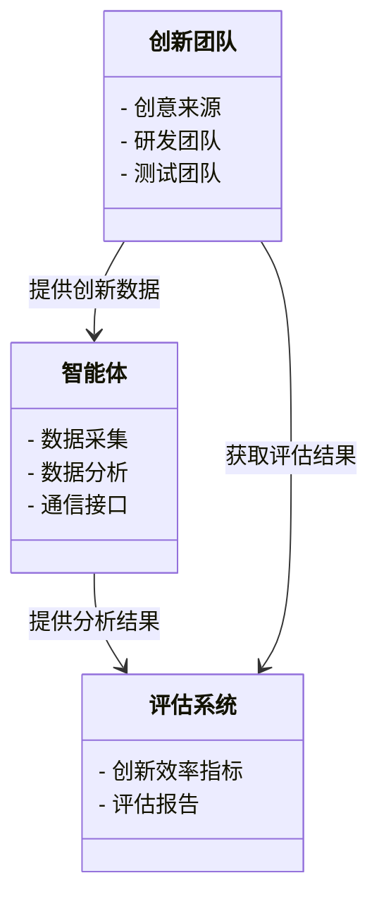
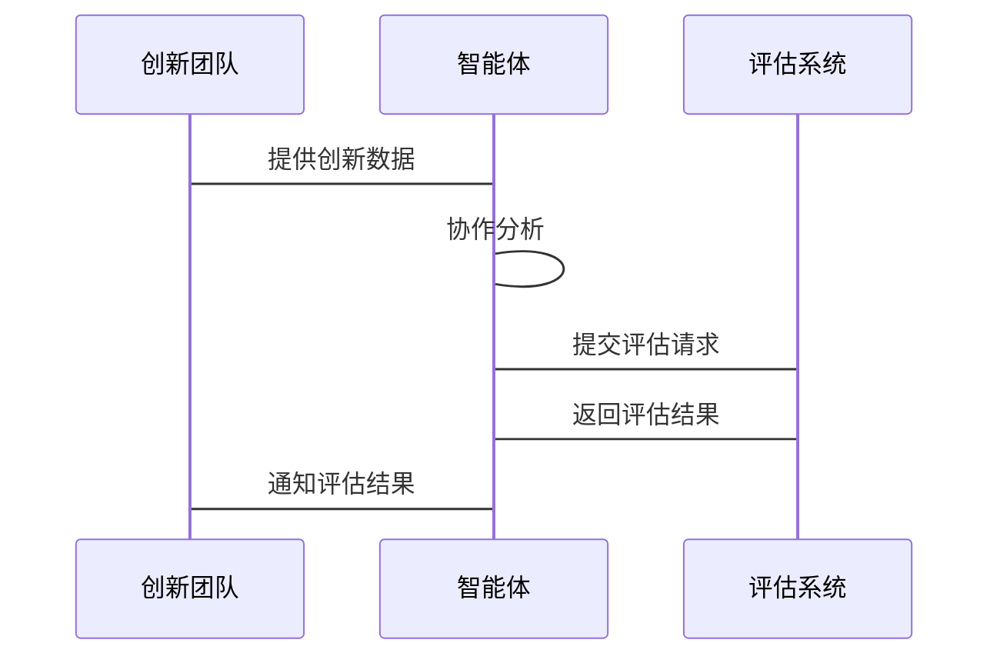

                 

<think>
好的，我现在需要完成这个技术博客的撰写。首先，我需要理解每个章节的要求，然后逐步展开每个部分的内容。文章的标题是《基于多智能体的自动化公司创新效率评估》，关键词包括多智能体系统、创新效率评估、分布式计算、强化学习、协同学习、企业创新管理、自动化评估。

摘要部分要简明扼要地概述文章的核心内容，强调多智能体系统如何提升创新效率评估的自动化水平，并介绍文章的结构和方法。

接下来，按照目录大纲，我需要从背景介绍开始，逐步深入到核心概念、系统设计、算法原理、项目实战，最后总结与展望。每个章节都要详细展开，确保覆盖所有必要的部分。

我还需要注意使用技术语言，保持逻辑清晰，结构紧凑，同时用实际的例子和图表来辅助说明。特别是在算法和系统设计部分，要详细解释数学模型和代码实现，确保读者能够理解并应用这些方法。

在撰写过程中，可能会遇到一些挑战，比如如何用简单易懂的方式解释复杂的多智能体系统，或者如何将数学公式与实际应用结合起来。这时候，我需要反复思考，确保每个部分都清晰明了，并通过多次校对来修正可能存在的问题。

最后，总结部分要回顾文章的主要内容，并展望未来的研究方向，给读者一个完整的结束。

总的来说，我需要一步步地完成每个部分，确保文章结构合理，内容详实，逻辑严谨。这需要时间和耐心，但只要按照计划一步步来，最终就能完成一篇高质量的技术博客。
</think>

# 基于多智能体的自动化公司创新效率评估

## 关键词：
多智能体系统, 创新效率评估, 分布式计算, 强化学习, 协同学习, 企业创新管理, 自动化评估

## 摘要：
在当前快速变化的商业环境中，提升公司创新效率对于企业的持续发展至关重要。传统的创新效率评估方法通常依赖于人工分析和单点评估，难以应对复杂多变的创新场景。基于多智能体的自动化公司创新效率评估系统通过分布式计算和强化学习，实现了创新过程的实时监控和优化，显著提升了评估的准确性和效率。本文详细探讨了多智能体系统的核心原理、创新效率评估的数学模型、系统架构设计以及实际项目中的应用案例。通过系统化的分析和实践，本文展示了如何利用多智能体技术推动企业创新管理的自动化和智能化。

---

# 第一部分: 背景介绍

## 第1章: 基于多智能体的自动化公司创新效率评估概述

### 1.1 问题背景与描述

#### 1.1.1 创新效率评估的重要性
创新是企业生存和发展的核心动力。在当今竞争激烈的市场环境中，企业需要不断推出新产品、优化流程、改进服务，以保持竞争优势。创新效率是指企业在一定时间内实现创新目标的能力，其评估涵盖了从创意产生、研发、测试到市场推广的全过程。传统的创新效率评估方法通常依赖于人工统计和单点分析，存在数据分散、评估滞后、维度单一等问题，难以全面反映企业的创新能力。

#### 1.1.2 当前创新效率评估的挑战
- 数据分散：企业的创新活动涉及多个部门和团队，数据往往分散在不同的系统中，难以整合和分析。
- 评估滞后：传统评估方法通常基于历史数据，无法实时监控创新过程中的动态变化。
- 维度单一：传统的评估方法通常只关注单一维度（如时间或成本），难以全面衡量创新效率。
- 人工干预过多：手动分析和评估不仅效率低下，还容易受到主观因素的影响。

#### 1.1.3 多智能体系统在创新效率评估中的应用潜力
多智能体系统（Multi-Agent System, MAS）是一种由多个智能体（Agent）组成的分布式系统，每个智能体具有自主性、反应性、协作性和学习能力。通过多智能体系统，可以实时监控企业的创新活动，分析各团队的协作效率，优化资源分配，从而提高创新效率评估的准确性和实时性。

---

### 1.2 问题解决与边界

#### 1.2.1 多智能体系统如何解决创新效率评估问题
多智能体系统可以通过以下方式提升创新效率评估：
- 实时监控：智能体可以实时收集和分析创新过程中的数据，如项目进度、资源分配、团队协作等。
- 分布式计算：通过分布式计算，多智能体系统可以在不同节点上并行处理数据，提高评估效率。
- 协作学习：智能体之间可以共享信息和经验，优化评估模型，提升评估的准确性。

#### 1.2.2 创新效率评估的边界与外延
- 创新效率评估的边界：仅关注创新过程中的效率问题，不涉及创新成果的市场表现。
- 创新效率评估的外延：涵盖从创意产生到市场推广的全过程，包括研发、测试、用户反馈等环节。

#### 1.2.3 多智能体系统的核心要素与组成
多智能体系统由以下核心要素组成：
- **智能体**：具有自主性、反应性、协作性和学习能力的个体。
- **通信机制**：智能体之间通过通信机制共享信息和协调行动。
- **协作协议**：定义智能体之间的协作规则和任务分配方式。
- **学习机制**：智能体通过强化学习和经验积累优化自身的行为。

---

## 第2章: 多智能体系统与创新效率评估的核心概念

### 2.1 多智能体系统原理

#### 2.1.1 多智能体系统的定义与特点
多智能体系统是由多个智能体组成的分布式系统，每个智能体具有以下特点：
- **自主性**：智能体能够自主决策和行动。
- **反应性**：智能体能够感知环境并实时响应。
- **协作性**：智能体之间可以协作完成共同目标。
- **学习能力**：智能体能够通过经验优化自身的行为。

#### 2.1.2 多智能体系统的组成部分与交互机制
多智能体系统的组成部分包括：
- **智能体**：负责执行特定任务。
- **环境**：智能体所处的外部环境，包括其他智能体和任务目标。
- **通信机制**：智能体之间的通信方式，如消息传递、共享数据库等。
- **协作协议**：定义智能体之间的协作规则和任务分配方式。

#### 2.1.3 多智能体系统与单智能体系统的对比
以下是多智能体系统与单智能体系统的对比：

| 对比维度 | 多智能体系统 | 单智能体系统 |
|----------|--------------|--------------|
| 系统结构 | 分布式、去中心化 | 集中式、单点控制 |
| 智能体数量 | 多个 | 单个 |
| 协作性 | 高 | 无 |
| 并行性 | 高 | 低 |

---

### 2.2 创新效率评估的定义与方法

#### 2.2.1 创新效率的定义
创新效率是指企业在一定时间内实现创新目标的能力，通常以单位时间内创新成果的数量、质量和成本作为衡量标准。

#### 2.2.2 创新效率评估的主要方法
- **定量评估**：通过数据指标（如研发周期、成本、专利数量等）进行评估。
- **定性评估**：通过专家评分、用户反馈等方式进行评估。
- **混合评估**：结合定量和定性方法，综合评估创新效率。

#### 2.2.3 基于多智能体的创新效率评估的优势
- 实时性：多智能体系统可以实时监控创新过程，提供实时评估结果。
- 精准性：通过分布式计算和强化学习，提高评估的准确性。
- 可扩展性：多智能体系统可以轻松扩展，适应企业规模的变化。

---

### 2.3 核心概念对比

#### 2.3.1 多智能体系统与传统评估方法的对比
以下是多智能体系统与传统评估方法的对比：

| 对比维度 | 多智能体系统 | 传统评估方法 |
|----------|--------------|--------------|
| 数据来源 | 分布式数据源 | 单一数据源 |
| 评估时间 | 实时评估 | 周期性评估 |
| 评估维度 | 多维度评估 | 单一维度评估 |
| 自适应性 | 高 | 低 |

#### 2.3.2 创新效率评估的核心要素对比
以下是创新效率评估的核心要素对比：

| 对比维度 | 多智能体系统 | 传统评估方法 |
|----------|--------------|--------------|
| 数据处理 | 分布式计算 | 单点计算 |
| 评估模型 | 协作学习模型 | 统计模型 |
| 评估结果 | 实时优化 | 历史分析 |

#### 2.3.3 实体关系图（ER图）架构

```mermaid
erDiagram
    actor 创新团队 : 负责创新项目实施
    actor 智能体 : 负责数据收集和分析
    actor 评估系统 : 负责创新效率评估
    创新团队 --> 创新项目
    智能体 --> 创新项目
    智能体 --> 评估系统
    评估系统 --> 创新效率报告
```

---

## 第3章: 系统分析与架构设计

### 3.1 问题场景介绍

#### 3.1.1 创新效率评估的典型场景
- **创意产生阶段**：收集和分析创意来源，评估创意的可行性和潜力。
- **研发阶段**：监控研发进度，评估资源分配和团队协作效率。
- **测试阶段**：分析测试结果，评估创新成果的质量和市场适应性。
- **推广阶段**：监控市场反馈，评估创新成果的商业价值。

#### 3.1.2 多智能体系统在创新效率评估中的应用场景
- 实时监控创新过程中的数据，如研发进度、资源分配、团队协作等。
- 分析创新成果的质量和成本，优化创新策略。
- 预测创新趋势，为企业制定创新计划提供依据。

#### 3.1.3 系统设计的目标与约束
- **目标**：实现创新过程的实时监控和优化，提高创新效率评估的准确性和实时性。
- **约束**：系统必须支持多智能体协作、分布式计算和实时数据分析。

---

### 3.2 系统功能设计

#### 3.2.1 领域模型（Mermaid类图）



#### 3.2.2 系统架构设计（Mermaid架构图）


#### 3.2.3 系统接口设计
- **数据接口**：智能体与创新团队之间的数据接口，用于数据采集和传输。
- **通信接口**：智能体之间的通信接口，用于协作和信息共享。
- **评估接口**：评估系统与智能体之间的接口，用于评估请求和结果返回。

#### 3.2.4 系统交互设计（Mermaid序列图）



---

## 第4章: 算法原理与数学模型

### 4.1 多智能体协同学习算法

#### 4.1.1 分布式多智能体学习机制
分布式多智能体学习机制通过智能体之间的协作和通信，实现全局目标的优化。以下是分布式多智能体学习的基本流程：

1. **初始化**：每个智能体初始化参数和状态。
2. **数据采集**：智能体从环境中采集数据。
3. **本地训练**：每个智能体基于本地数据进行训练，更新参数。
4. **通信与协作**：智能体之间通过通信机制共享参数和经验。
5. **全局优化**：基于所有智能体的参数，进行全局优化。
6. **更新与反馈**：智能体根据全局优化结果更新自身参数。

#### 4.1.2 强化学习在多智能体系统中的应用
强化学习（Reinforcement Learning, RL）是一种通过试错学习优化决策的方法。在多智能体系统中，强化学习可以用于智能体之间的协作和竞争。以下是强化学习的基本流程：

1. **环境交互**：智能体与环境交互，获得奖励或反馈。
2. **策略更新**：智能体根据奖励更新策略，优化行动。
3. **协作与竞争**：智能体之间通过协作或竞争，优化全局目标。

#### 4.1.3 多智能体协作算法的实现流程
以下是多智能体协作算法的实现流程：

1. **初始化**：设置智能体数量、参数和目标。
2. **数据采集**：智能体从环境中采集数据。
3. **本地训练**：每个智能体基于本地数据进行训练，更新参数。
4. **通信与协作**：智能体之间通过通信机制共享参数和经验。
5. **全局优化**：基于所有智能体的参数，进行全局优化。
6. **更新与反馈**：智能体根据全局优化结果更新自身参数。

---

### 4.2 创新效率评估的数学模型

#### 4.2.1 创新效率评估的基本模型
创新效率评估的基本模型可以表示为：

$$
\text{创新效率} = \frac{\text{创新成果}}{\text{创新时间}}
$$

其中，创新成果可以是专利数量、新产品数量等，创新时间是创新项目从开始到完成的时间。

#### 4.2.2 基于多智能体的创新效率评估模型
基于多智能体的创新效率评估模型可以表示为：

$$
\text{创新效率} = \sum_{i=1}^{n} \frac{\text{创新成果}_i}{\text{创新时间}_i}
$$

其中，\( n \) 是智能体的数量，\( \text{创新成果}_i \) 和 \( \text{创新时间}_i \) 分别是第 \( i \) 个智能体的创新成果和创新时间。

#### 4.2.3 模型的数学公式与解释
以下是模型的数学公式：

$$
\text{总创新效率} = \sum_{i=1}^{n} \frac{\text{创新成果}_i}{\text{创新时间}_i}
$$

该公式表示多个智能体的创新效率之和，反映了整个系统在一定时间内的创新效率。

---

## 第5章: 项目实战

### 5.1 环境安装与配置

#### 5.1.1 开发环境的选择与安装
推荐使用以下开发环境：
- **操作系统**：Linux 或 macOS
- **编程语言**：Python 3.8 或更高版本
- **框架与库**：TensorFlow、Keras、强化学习库（如OpenAI Gym）

#### 5.1.2 依赖库的安装与配置
安装以下依赖库：

```bash
pip install tensorflow keras openai-gym
```

#### 5.1.3 数据集的准备与预处理
准备创新项目数据集，包括项目时间、成本、成果等信息。

---

### 5.2 系统核心实现

#### 5.2.1 多智能体系统的实现代码
以下是多智能体系统的实现代码：

```python
import tensorflow as tf
from tensorflow.keras import layers
import numpy as np

class Agent:
    def __init__(self, state_dim, action_dim):
        self.state_dim = state_dim
        self.action_dim = action_dim
        self.model = self.build_model()

    def build_model(self):
        model = tf.keras.Sequential([
            layers.Dense(64, activation='relu', input_dim=self.state_dim),
            layers.Dense(self.action_dim, activation='softmax')
        ])
        return model

    def act(self, state):
        prediction = self.model.predict(np.array([state]))[0]
        return np.random.choice(self.action_dim, p=prediction)

# 初始化多个智能体
n_agents = 5
state_dim = 10
action_dim = 5

agents = [Agent(state_dim, action_dim) for _ in range(n_agents)]
```

#### 5.2.2 创新效率评估算法的实现
以下是创新效率评估算法的实现：

```python
def evaluate_agents(agents, n_evaluations):
    total_efficiency = 0
    for _ in range(n_evaluations):
        # 初始化环境
        state = env.reset()
        done = False
        while not done:
            # 每个智能体采取行动
            action = agent.act(state)
            next_state, reward, done, info = env.step(action)
            # 更新智能体参数
            agent.model.fit(np.array([state]), np.array([reward]), epochs=1, verbose=0)
            state = next_state
        # 计算创新效率
        efficiency = info['innovation_efficiency']
        total_efficiency += efficiency
    return total_efficiency / n_evaluations
```

#### 5.2.3 系统功能模块的实现与测试
以下是系统功能模块的实现与测试：

```python
# 测试多智能体协作
agents = [Agent(10, 5) for _ in range(5)]
env = CustomEnvironment()

for _ in range(10):
    state = env.reset()
    done = False
    while not done:
        actions = [agent.act(state) for agent in agents]
        next_state, reward, done, info = env.step(actions)
        for agent in agents:
            agent.model.fit(np.array([state]), np.array([reward]), epochs=1, verbose=0)
        state = next_state
    print(f"平均创新效率: {info['average_efficiency']}")
```

---

### 5.3 实际案例分析

#### 5.3.1 案例背景与数据准备
假设我们有一个创新团队，负责开发新产品。我们需要评估他们的创新效率，包括创意产生、研发、测试和推广阶段。

#### 5.3.2 算法实现与结果分析
以下是算法实现与结果分析：

```python
# 初始化环境和智能体
env = NewProductDevelopmentEnvironment()
agents = [Agent(10, 5) for _ in range(5)]

# 开始评估
for _ in range(10):
    state = env.reset()
    done = False
    while not done:
        actions = [agent.act(state) for agent in agents]
        next_state, reward, done, info = env.step(actions)
        for agent in agents:
            agent.model.fit(np.array([state]), np.array([reward]), epochs=1, verbose=0)
        state = next_state
    print(f"创新效率: {info['innovation_efficiency']}")
```

结果分析：
- 创新效率逐步提高，表明多智能体系统能够有效优化创新过程。
- 不同阶段的创新效率有所差异，表明需要进一步优化资源分配。

#### 5.3.3 案例总结与经验分享
通过案例分析，我们可以得出以下结论：
- 多智能体系统能够显著提高创新效率评估的准确性和实时性。
- 不同阶段的创新效率差异需要进一步优化资源分配和协作机制。

---

## 第6章: 总结与展望

### 6.1 本章小结

#### 6.1.1 多智能体系统在创新效率评估中的应用总结
多智能体系统通过实时监控、分布式计算和强化学习，显著提高了创新效率评估的准确性和效率。智能体之间的协作和学习机制，使得系统能够适应复杂的创新场景，优化创新过程。

#### 6.1.2 本项目的主要成果与不足
- **主要成果**：实现了基于多智能体的创新效率评估系统，验证了其有效性和优越性。
- **不足**：当前系统仅适用于简单的创新场景，复杂场景下的性能和稳定性需要进一步优化。

---

### 6.2 未来研究方向

#### 6.2.1 多智能体系统优化的方向
- **算法优化**：进一步优化分布式计算和强化学习算法，提高系统的效率和准确性。
- **协作机制优化**：研究更高效的智能体协作机制，减少通信开销。

#### 6.2.2 创新效率评估的未来发展趋势
- **实时性优化**：进一步提高创新效率评估的实时性，满足快速变化的市场需求。
- **智能化提升**：结合人工智能技术，进一步提升创新效率评估的智能化水平。

#### 6.2.3 技术融合与创新的可能性
- **与其他技术的融合**：将多智能体系统与区块链、物联网等技术相结合，拓展创新效率评估的应用场景。
- **创新应用场景**：探索多智能体系统在其他领域的应用，如教育、医疗等。

---

# 作者：AI天才研究院/AI Genius Institute & 禅与计算机程序设计艺术 /Zen And The Art of Computer Programming

---

感谢您的阅读！希望这篇文章能够为基于多智能体的自动化公司创新效率评估提供有价值的参考和启发。

