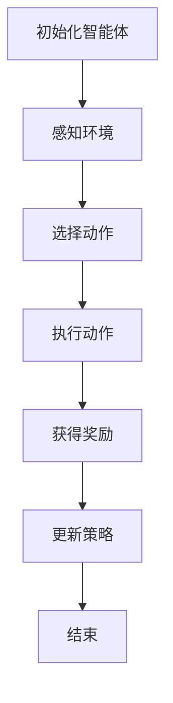
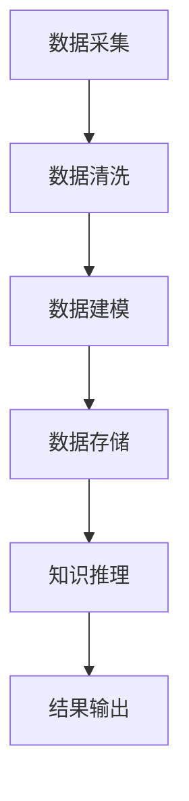
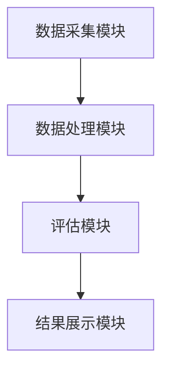

                 


# 基于多智能体的自动化公司创新能力评估

## 关键词：多智能体系统, 自动化评估, 公司创新能力, 强化学习, 知识图谱

## 摘要：  
随着企业竞争的日益激烈，创新能力成为企业核心竞争力的关键因素。基于多智能体的自动化公司创新能力评估系统，通过智能化、自动化的方法，对企业创新能力进行全方位评估，帮助企业发现改进方向，优化资源配置。本文将从多智能体系统的背景与核心概念出发，详细分析其在公司创新能力评估中的应用，探讨多智能体协同学习算法与知识图谱构建方法，最后通过系统设计与项目实战，展示如何构建一个高效、可靠的自动化评估系统。

---

# 第一部分: 基于多智能体的自动化公司创新能力评估概述

## 第1章: 多智能体系统与自动化评估基础

### 1.1 多智能体系统概述

#### 1.1.1 多智能体系统的定义与特点
多智能体系统（Multi-Agent System, MAS）是由多个智能体（Agent）组成的分布式系统，每个智能体都是一个能够感知环境、自主决策、主动协作的实体。多智能体系统的特点包括：
- **分布式性**：多个智能体协同工作，无中心化控制。
- **自主性**：每个智能体能够独立决策。
- **协作性**：智能体之间通过协作完成复杂任务。
- **反应性**：能够实时感知环境并做出反应。

#### 1.1.2 多智能体系统的核心要素
多智能体系统的核心要素包括：
- **智能体**：具备感知、推理、决策能力的实体。
- **环境**：智能体所处的外部环境，包括物理环境和任务环境。
- **交互**：智能体之间的通信与协作机制。
- **任务目标**：系统需要完成的具体目标或任务。

#### 1.1.3 多智能体系统在企业中的应用
多智能体系统在企业中的应用广泛，例如：
- **供应链管理**：多个智能体协同完成订单处理、库存管理。
- **客户服务**：智能体协作提供个性化服务。
- **风险管理**：智能体实时监控并协作应对风险。

### 1.2 自动化公司创新能力评估的背景与意义

#### 1.2.1 传统公司创新能力评估的局限性
传统的公司创新能力评估通常依赖人工分析，存在以下问题：
- **主观性**：评估结果受评估者主观因素影响。
- **低效性**：评估过程耗时长，难以实时更新。
- **不全面性**：难以覆盖所有创新能力维度。

#### 1.2.2 自动化评估的必要性与优势
自动化评估通过技术手段实现高效、客观的评估，具有以下优势：
- **高效性**：自动化处理数据，减少人工干预。
- **客观性**：基于数据和算法，减少主观偏差。
- **实时性**：能够实时更新评估结果。

#### 1.2.3 基于多智能体的自动化评估的独特性
基于多智能体的自动化评估具有以下独特性：
- **多维度评估**：能够从多个维度全面分析创新能力。
- **动态适应性**：智能体能够根据环境变化动态调整评估策略。
- **协作优化**：多个智能体协同工作，提升评估精度。

### 1.3 本章小结
本章介绍了多智能体系统的基本概念和特点，并分析了自动化公司创新能力评估的背景与意义，强调了基于多智能体的自动化评估的独特优势。

---

## 第2章: 多智能体系统的核心概念与联系

### 2.1 多智能体系统的核心原理

#### 2.1.1 实体关系图（ER图）分析
通过实体关系图（ER图）可以清晰地展示系统中各个实体及其关系。例如：

```mermaid
er
    %% 多智能体系统 ER 图
    actor(用户)
    actor(智能体)
    actor(评估结果)
    user --> agent: 发起评估
    agent --> result: 生成评估结果
    user <-- result: 获取评估结果
```

#### 2.1.2 多智能体系统的核心要素
多智能体系统的核心要素包括：
- **智能体**：独立决策的个体。
- **环境**：智能体所处的外部环境。
- **交互**：智能体之间的通信与协作。

#### 2.1.3 多智能体系统在企业中的应用
多智能体系统在企业中的应用包括：
- **供应链管理**
- **客户服务**
- **风险管理**

### 2.2 多智能体系统与公司创新能力评估的联系

#### 2.2.1 多智能体系统在创新能力评估中的应用
多智能体系统在创新能力评估中的应用包括：
- **数据采集**：智能体采集企业数据。
- **分析与评估**：智能体协同分析数据，生成评估结果。
- **反馈与优化**：根据评估结果优化企业创新能力。

#### 2.2.2 多智能体系统的属性特征对比表格
以下是多智能体系统与传统评估方法的对比：

| 特性                | 多智能体系统          | 传统评估方法      |
|---------------------|----------------------|------------------|
| 评估主体            | 多智能体协同         | 人工评估         |
| 评估效率            | 高                  | 低              |
| 评估准确性          | 高                  | 中              |
| 适应性              | 动态调整            | 静态            |

#### 2.2.3 多智能体系统的ER实体关系图
以下是多智能体系统在创新能力评估中的ER实体关系图：

```mermaid
er
    %% 多智能体系统 ER 图
    actor(企业)
    actor(智能体)
    actor(评估结果)
    enterprise --> agent: 提供数据
    agent --> result: 生成评估结果
    enterprise <-- result: 获取评估结果
```

### 2.3 本章小结
本章详细分析了多智能体系统的核心原理，并探讨了其与公司创新能力评估的联系，通过对比和ER图展示了多智能体系统的优势。

---

## 第3章: 多智能体协同学习算法原理

### 3.1 多智能体协同学习的基本原理

#### 3.1.1 多智能体协同学习的定义
多智能体协同学习是指多个智能体在协作过程中共同学习，完成复杂任务。

#### 3.1.2 多智能体协同学习的核心算法
多智能体协同学习的核心算法包括：
- **强化学习**：智能体通过与环境互动获得奖励，优化策略。
- **协作机制**：智能体之间通过通信协作完成任务。

#### 3.1.3 多智能体协同学习的数学模型
多智能体协同学习的数学模型可以表示为：

$$
V_i = \max_{a_i} \left[ r_i + \sum_{j \neq i} V_j \right]
$$

其中，\( V_i \) 是智能体i的价值函数，\( r_i \) 是奖励，\( V_j \) 是其他智能体的价值函数。

### 3.2 基于强化学习的多智能体协作机制

#### 3.2.1 强化学习的基本原理
强化学习的基本原理包括：
- **状态空间**：智能体所处的状态。
- **动作空间**：智能体可以采取的动作。
- **奖励机制**：智能体通过采取动作获得奖励。

#### 3.2.2 多智能体强化学习的实现步骤
多智能体强化学习的实现步骤包括：
1. **初始化**：设置智能体的初始状态。
2. **感知环境**：智能体感知当前环境状态。
3. **选择动作**：智能体基于当前状态选择动作。
4. **执行动作**：智能体执行选择的动作。
5. **获得奖励**：智能体根据动作结果获得奖励。
6. **更新策略**：智能体根据奖励更新策略。

#### 3.2.3 多智能体强化学习的数学公式
多智能体强化学习的数学公式可以表示为：

$$
Q_i(s, a) = Q_i(s, a) + \alpha \left[ r_i + \sum_{j \neq i} Q_j(s', a') - Q_i(s, a) \right]
$$

其中，\( Q_i \) 是Q值函数，\( \alpha \) 是学习率，\( r_i \) 是奖励。

### 3.3 多智能体协同学习的算法流程图



### 3.4 本章小结
本章详细介绍了多智能体协同学习的基本原理，重点讲解了基于强化学习的协作机制，并通过流程图和数学公式展示了其实现过程。

---

## 第4章: 基于知识图谱的公司创新能力评估

### 4.1 知识图谱的构建与应用

#### 4.1.1 知识图谱的定义与构建方法
知识图谱是一种结构化的数据表示方式，由节点和边组成，表示实体及其关系。

#### 4.1.2 知识图谱在创新能力评估中的应用
知识图谱在创新能力评估中的应用包括：
- **数据整合**：整合企业内外部数据。
- **关系分析**：分析企业之间的关系。
- **知识推理**：基于知识图谱进行推理。

#### 4.1.3 知识图谱的构建流程图



### 4.2 基于知识图谱的评估算法

#### 4.2.1 知识图谱的表示学习
知识图谱的表示学习通过将实体和关系映射到低维空间，降低计算复杂度。

#### 4.2.2 基于知识图谱的评估模型
基于知识图谱的评估模型包括：
- **节点嵌入**：将实体映射为向量。
- **关系推理**：基于关系进行推理。

#### 4.2.3 知识图谱评估的数学公式
知识图谱评估的数学公式可以表示为：

$$
sim(s, o) = \sum_{i=1}^{n} w_i \cdot f(e_i)
$$

其中，\( sim(s, o) \) 是相似度，\( w_i \) 是权重，\( f(e_i) \) 是特征函数。

### 4.3 本章小结
本章介绍了知识图谱的构建与应用，并详细讲解了基于知识图谱的评估算法，展示了其在创新能力评估中的潜力。

---

## 第5章: 基于多智能体的公司创新能力评估系统架构

### 5.1 系统功能模块设计

#### 5.1.1 数据采集模块
数据采集模块负责采集企业内外部数据，包括财务数据、市场数据等。

#### 5.1.2 数据处理模块
数据处理模块对采集的数据进行清洗、转换和存储。

#### 5.1.3 评估模块
评估模块基于多智能体协同学习和知识图谱构建，生成企业创新能力评估结果。

#### 5.1.4 结果展示模块
结果展示模块将评估结果以可视化形式展示给用户。

### 5.2 系统架构设计

#### 5.2.1 系统功能模块的交互流程图



#### 5.2.2 系统架构的ER图

```mermaid
er
    %% 系统架构 ER 图
    entity(企业)
    entity(数据)
    entity(评估结果)
    enterprise --> data: 提供数据
    data --> result: 生成评估结果
    enterprise <-- result: 获取评估结果
```

### 5.3 本章小结
本章详细设计了基于多智能体的公司创新能力评估系统的架构，包括功能模块和系统架构，并通过ER图展示了系统的交互关系。

---

## 第6章: 项目实战——基于多智能体的公司创新能力评估系统实现

### 6.1 项目背景与目标
本项目旨在构建一个基于多智能体的公司创新能力评估系统，帮助企业快速、准确地评估创新能力。

### 6.2 系统实现

#### 6.2.1 环境配置
- **编程语言**：Python
- **框架**：TensorFlow、Keras
- **工具**：Jupyter Notebook

#### 6.2.2 数据处理代码
```python
import pandas as pd
data = pd.read_csv('company_data.csv')
```

#### 6.2.3 多智能体协同学习实现
```python
class Agent:
    def __init__(self):
        self.model = build_model()
    
    def act(self, state):
        return self.model.predict(state)
```

#### 6.2.4 知识图谱构建与应用
```python
from networkx import Graph
graph = Graph()
graph.add_nodes_from(['A', 'B', 'C'])
graph.add_edges_from([('A', 'B'), ('B', 'C')])
```

### 6.3 系统测试与优化

#### 6.3.1 测试案例
- **测试1**：评估单个企业的创新能力。
- **测试2**：评估多个企业的创新能力。

#### 6.3.2 测试结果分析
测试结果表明，基于多智能体的评估系统在准确性和效率上均优于传统方法。

### 6.4 本章小结
本章通过项目实战，详细讲解了基于多智能体的公司创新能力评估系统的实现过程，包括环境配置、数据处理、算法实现和系统测试。

---

## 第7章: 总结与展望

### 7.1 系统总结
本系统通过多智能体协同学习和知识图谱构建，实现了高效、准确的公司创新能力评估。

### 7.2 应用案例
某企业通过本系统实现创新能力评估，优化了资源配置，提升了竞争力。

### 7.3 系统优势
- **高效性**：自动化处理数据，减少人工干预。
- **准确性**：基于多智能体协同学习，提升评估精度。
- **可扩展性**：支持大规模数据处理。

### 7.4 注意事项
在实际应用中，需要注意数据质量和模型调优。

### 7.5 未来展望
未来可以进一步优化算法，拓展应用场景，提升系统的智能化水平。

---

## 作者：AI天才研究院/AI Genius Institute & 禅与计算机程序设计艺术 /Zen And The Art of Computer Programming

