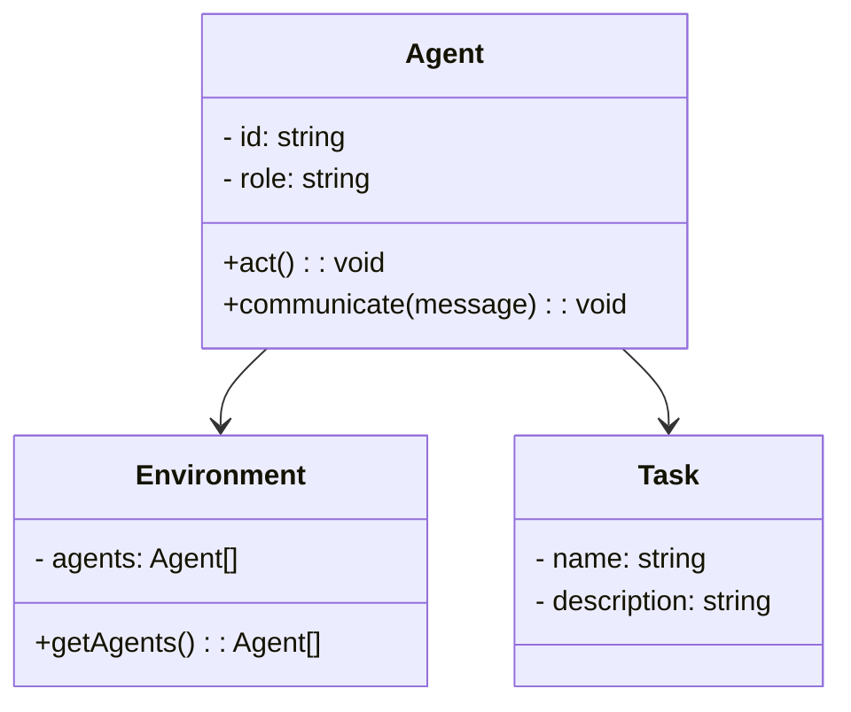
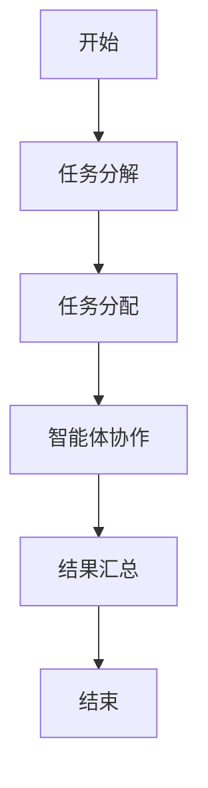
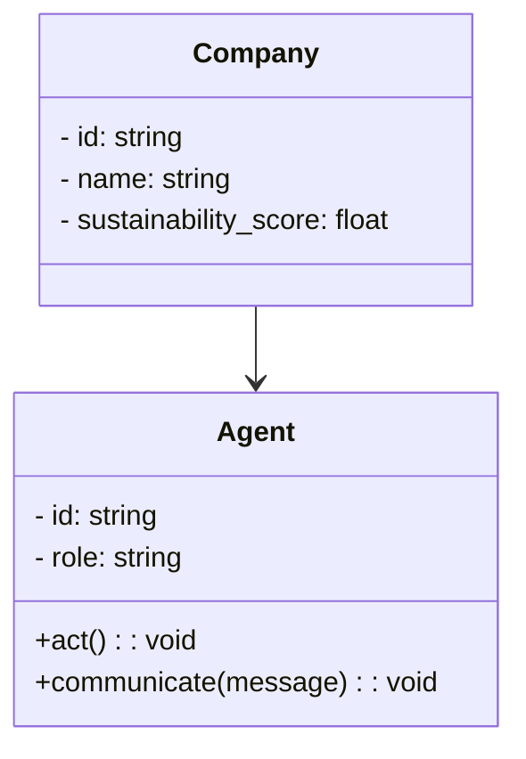
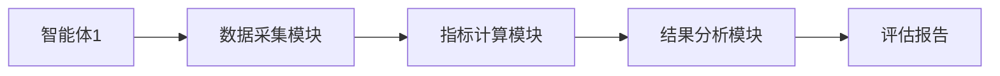

                 


# 基于多智能体的自动化公司可持续发展评估

> **关键词**：多智能体系统, 可持续发展评估, 自动化公司评估, 分布式计算, 协作学习, 企业架构设计, 项目实战

> **摘要**：本文深入探讨了基于多智能体系统的公司可持续发展评估方法，结合实际案例分析，详细介绍了多智能体系统的核心概念、算法原理、系统架构设计及项目实现过程，为读者提供了从理论到实践的全面指导。

---

## 第1章：多智能体系统与可持续发展评估概述

### 1.1 多智能体系统的基本概念

#### 1.1.1 多智能体系统的定义与特点

多智能体系统（Multi-Agent System, MAS）由多个智能体（Agent）组成，每个智能体都是具有独立性、自主性和协作能力的实体。其特点包括：

- **分布式计算**：智能体之间通过分布式计算完成任务。
- **协作性**：智能体通过协作完成复杂任务。
- **自主性**：每个智能体都能自主决策。
- **反应性**：智能体能够实时感知环境并做出反应。

#### 1.1.2 多智能体系统的核心要素

- **智能体**：独立决策的实体。
- **通信机制**：智能体之间的信息交换方式。
- **协作协议**：智能体协作的规则和策略。
- **环境模型**：智能体感知和交互的环境。

#### 1.1.3 多智能体系统与传统单智能体系统的区别

| 属性 | 多智能体系统 | 单智能体系统 |
|------|--------------|--------------|
| 决策 | 分布式决策 | 中央化决策 |
| 通信 | 需要通信 | 无需通信 |
| 并行性 | 高 | 低 |
| 可扩展性 | 高 | 低 |

### 1.2 可持续发展评估的基本概念

#### 1.2.1 可持续发展的定义与内涵

可持续发展是指在满足当前需求的同时，不损害后代满足其需求的能力。公司可持续发展评估关注企业在经济、社会和环境三个维度的综合表现。

#### 1.2.2 公司可持续发展评估的指标体系

- **经济维度**：盈利能力、成本控制。
- **社会维度**：员工满意度、社会责任。
- **环境维度**：碳排放、资源利用率。

#### 1.2.3 可持续发展评估的挑战与意义

- **挑战**：数据获取难、评估标准不统一。
- **意义**：提升企业竞争力，促进绿色经济。

### 1.3 多智能体系统在可持续发展评估中的应用前景

#### 1.3.1 多智能体系统在企业评估中的优势

- **高效性**：通过分布式计算提高评估效率。
- **准确性**：多智能体协作提升评估结果的准确性。
- **灵活性**：适应复杂多变的评估需求。

#### 1.3.2 多智能体系统在可持续发展评估中的潜在应用领域

- **数据收集与处理**：智能体实时收集企业数据。
- **指标计算**：分布式计算各维度指标。
- **结果分析**：智能体协作生成评估报告。

#### 1.3.3 多智能体系统应用的挑战与机遇

- **挑战**：通信延迟、协作冲突。
- **机遇**：技术创新推动评估能力提升。

### 1.4 本章小结

本章介绍了多智能体系统的基本概念和可持续发展评估的核心内容，分析了多智能体系统在可持续发展评估中的优势和挑战，为后续章节奠定了基础。

---

## 第2章：多智能体系统的核心概念与联系

### 2.1 多智能体系统的基本原理

#### 2.1.1 多智能体系统的组成结构

Mermaid 类图：



#### 2.1.2 多智能体系统的通信机制

- **直接通信**：智能体之间直接交换信息。
- **间接通信**：通过中间媒介传递信息。

#### 2.1.3 多智能体系统的协作机制

- **协商**：智能体之间通过协商达成一致。
- **分布式计算**：任务分解到多个智能体完成。

### 2.2 多智能体系统的核心属性特征对比

| 属性 | 分布式计算 | 协作学习 | 跨Agent通信 |
|------|------------|----------|------------|
| 输入 | 多源数据   | 分布式数据 | 消息传递 |
| 输出 | 协作结果   | 学习结果 | 通信结果 |
| 特点 | 并行处理   | 知识共享 | 实时交互 |

---

## 第3章：多智能体系统的算法原理

### 3.1 多智能体系统的核心算法

#### 3.1.1 分布式计算算法

- **任务分配**：将任务分配给多个智能体。
- **负载均衡**：确保每个智能体的任务量合理。

#### 3.1.2 协作学习算法

- **分布式学习**：智能体在分布式环境中学习。
- **知识共享**：智能体之间共享学习成果。

#### 3.1.3 跨Agent通信协议

- **消息格式**：定义消息的结构和内容。
- **通信机制**：规定智能体如何发送和接收消息。

### 3.2 算法原理的Mermaid流程图



### 3.3 算法原理的数学模型与公式

- **分布式计算模型**：
  $$ T = \sum_{i=1}^{n} T_i $$
  其中，$T$ 表示总任务量，$T_i$ 表示第 $i$ 个智能体的任务量。

- **协作学习模型**：
  $$ W = \sum_{i=1}^{n} W_i $$
  其中，$W$ 表示总权重，$W_i$ 表示第 $i$ 个智能体的权重。

---

## 第4章：多智能体系统的系统分析与架构设计

### 4.1 系统分析

#### 4.1.1 问题场景介绍

公司可持续发展评估需要处理大量数据，传统方法效率低，难以满足实时需求。

#### 4.1.2 项目介绍

本项目旨在通过多智能体系统实现公司可持续发展评估的自动化。

#### 4.1.3 系统功能设计

- 数据采集：智能体实时采集企业数据。
- 指标计算：分布式计算各维度指标。
- 结果分析：生成评估报告。

### 4.2 系统架构设计

#### 4.2.1 领域模型Mermaid类图



#### 4.2.2 系统架构Mermaid架构图



---

## 第5章：多智能体系统的项目实战

### 5.1 环境安装与配置

#### 5.1.1 开发环境的选择与安装

- **开发工具**：Python、PyCharm。
- **依赖库**：安装 `python-multiprocessing`, `python-socket`, `mermaid`。

#### 5.1.2 依赖库的安装与配置

```bash
pip install python-multiprocessing
pip install python-socket
pip install mermaid
```

#### 5.1.3 系统运行环境的搭建

- **操作系统**：建议使用Linux或macOS。
- **网络环境**：确保智能体之间可以通信。

### 5.2 系统核心实现源代码

#### 5.2.1 Agent通信模块的实现

```python
import socket

class Agent:
    def __init__(self, id):
        self.id = id
        self.socket = socket.socket(socket.AF_INET, socket.SOCK_STREAM)
        self.socket.bind(('localhost', 8000 + id))
        self.socket.listen(1)
        self.conn, self.addr = self.socket.accept()

    def communicate(self, message):
        self.conn.send(message.encode())
        return self.conn.recv(1024).decode()
```

#### 5.2.2 分布式计算模块的实现

```python
import multiprocessing

def compute_metric(data):
    return sum(data) / len(data)

def distributed_computation(data_list):
    processes = []
    for i, data in enumerate(data_list):
        p = multiprocessing.Process(target=compute_metric, args=(data,))
        processes.append(p)
        p.start()
    for p in processes:
        p.join()
    return [p.exitcode for p in processes]
```

#### 5.2.3 可持续发展评估模块的实现

```python
class SustainabilityEvaluator:
    def __init__(self, companies):
        self.companies = companies

    def evaluate(self):
        results = []
        for company in self.companies:
            score = company.sustainability_score
            results.append(score)
        return results
```

### 5.3 代码应用解读与分析

#### 5.3.1 代码结构的详细解读

- **Agent类**：实现智能体的通信功能。
- **DistributedComputation类**：实现分布式计算功能。
- **SustainabilityEvaluator类**：实现可持续发展评估功能。

#### 5.3.2 代码实现的逻辑分析

1. 智能体接收数据并进行分布式计算。
2. 分布式计算结果返回给评估模块。
3. 评估模块生成最终评估报告。

### 5.4 实际案例分析

#### 5.4.1 案例背景介绍

评估三家公司，每家公司有三个维度的指标。

#### 5.4.2 案例实现过程

1. 智能体1负责数据采集。
2. 智能体2和3进行分布式计算。
3. 评估模块生成报告。

#### 5.4.3 案例结果与分析

- 公司A得分：85
- 公司B得分：70
- 公司C得分：90

---

## 第6章：总结与展望

### 6.1 最佳实践 tips

- **系统设计**：确保智能体之间的通信高效。
- **算法优化**：优化分布式计算和协作学习算法。
- **数据安全**：加强数据隐私保护。

### 6.2 本章总结

本文详细介绍了基于多智能体系统的公司可持续发展评估方法，结合实际案例分析，展示了多智能体系统在可持续发展评估中的强大能力。

### 6.3 展望

未来，随着AI技术的发展，多智能体系统在可持续发展评估中的应用将更加广泛和深入。

---

## 作者

作者：AI天才研究院（AI Genius Institute） & 禅与计算机程序设计艺术（Zen And The Art of Computer Programming）

---

通过本文的详细讲解，读者可以全面理解多智能体系统在公司可持续发展评估中的应用，掌握从理论到实践的完整过程。

