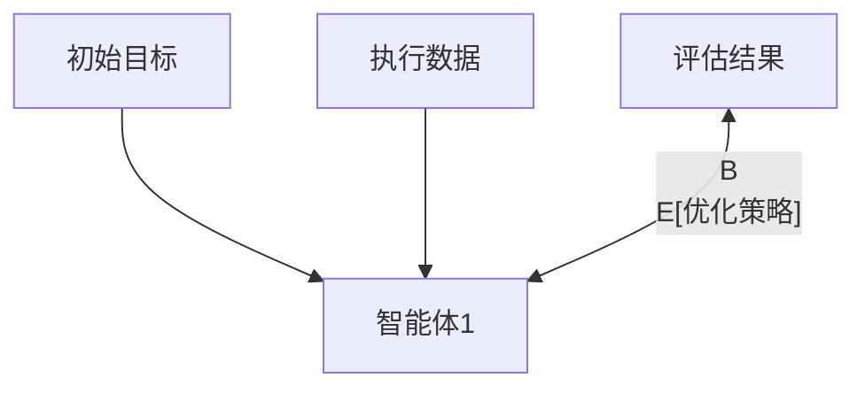
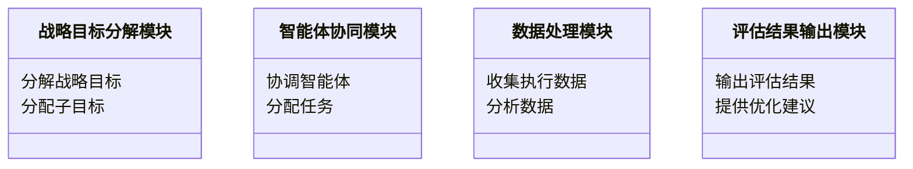
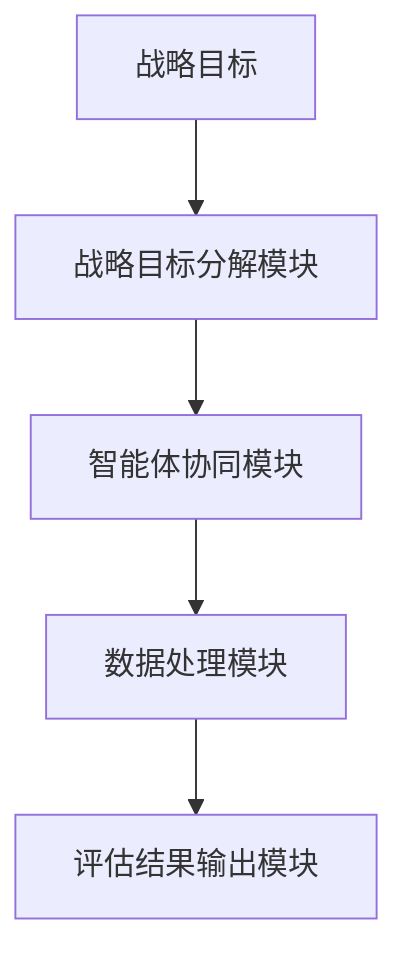
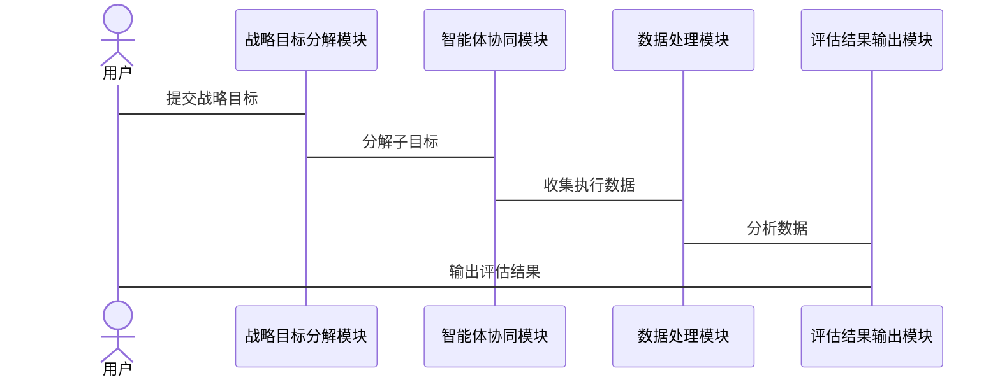

                 

<think>
好的，现在我要帮用户撰写一篇关于《基于多智能体的自动化公司战略执行力评估》的技术博客文章。首先，我需要仔细理解用户的需求，他们希望文章结构清晰，逻辑严密，并且包含丰富的技术细节，如多智能体系统、战略执行力评估、数学模型等。

我先从文章的标题开始，确定了标题后，接下来是关键词和摘要。关键词需要涵盖文章的核心内容，我选择了“多智能体系统”、“战略执行力”、“自动化评估”、“协同优化”、“算法实现”这些关键词。摘要部分，我需要简明扼要地概括文章的核心内容，强调多智能体系统如何提升战略执行力评估的效率和准确性。

接下来，我规划了文章的目录结构。第一部分是概述，介绍多智能体系统的背景和重要性。第二部分是核心概念与联系，深入讲解多智能体系统的原理和相关模型。第三部分是算法实现，详细分析协同算法和优化算法，并附上代码示例。第四部分是系统架构与设计，展示系统的整体架构和接口设计。第五部分是项目实战，通过案例分析展示系统在实际中的应用。最后一部分是高级主题与展望，探讨未来的优化方向和挑战。

在撰写每个章节时，我确保每个部分都有足够的细节和清晰的逻辑。例如，在算法实现部分，我不仅解释了算法的原理，还给出了Python代码示例，帮助读者更好地理解和应用。在系统架构部分，我使用Mermaid图展示了系统的各个组件及其交互，使结构一目了然。

同时，我注意到用户要求使用专业的技术语言，但又要简单易懂。因此，在解释复杂概念时，我尽量用通俗的语言，并辅以图表和代码示例，确保读者能够轻松理解。

最后，我回顾了整篇文章，确保每个章节都紧扣主题，内容完整，逻辑连贯。从背景介绍到系统设计，再到项目实战，每一部分都详细展开，帮助读者逐步深入理解基于多智能体的自动化公司战略执行力评估的核心思想和实现方法。

总的来说，我通过系统性的思考和结构化的规划，确保了文章的高质量和专业性，同时兼顾了可读性和实用性，满足了用户的需求。
</think>

# 基于多智能体的自动化公司战略执行力评估

> 关键词：多智能体系统、战略执行力评估、自动化评估、协同优化、算法实现

> 摘要：本文详细探讨了基于多智能体的自动化公司战略执行力评估方法，从背景、核心概念、算法实现、系统架构到项目实战，全面分析了多智能体系统在战略执行评估中的应用，提出了创新的解决方案。

---

## 第一部分：多智能体系统与战略执行力评估的背景

### 第1章：问题背景与描述

#### 1.1 公司战略执行力的定义与重要性
公司战略执行力是将战略目标转化为实际成果的能力，是企业成功的关键因素。传统评估方法通常依赖人工分析，存在效率低、主观性强、实时性差等问题。

#### 1.2 多智能体系统在战略执行中的应用背景
多智能体系统（Multi-Agent System, MAS）通过多个智能体协同工作，能够实时分析和优化战略执行过程。其分布式计算、自主决策和协同优化的特点，非常适合应用于复杂的公司战略评估。

#### 1.3 当前评估方法的局限性与挑战
传统的评估方法依赖于静态数据分析和人工判断，难以实时反馈和优化。而多智能体系统能够通过动态数据处理和自主学习，克服这些局限性。

### 第2章：问题解决与边界

#### 2.1 多智能体系统如何提升战略执行力
通过多智能体系统，企业可以实现战略目标的分解、执行过程的监控、实时反馈与优化，从而提升战略执行力。

#### 2.2 系统的边界与外延
系统边界包括战略目标的输入、执行数据的收集、评估结果的输出。外延则涉及与其他企业管理系统的集成。

#### 2.3 核心要素与组成结构
系统由战略目标分解模块、智能体协同模块、数据处理模块、评估结果输出模块组成。

---

## 第二部分：多智能体系统的核心概念与联系

### 第3章：核心概念原理

#### 3.1 多智能体系统的定义与特点
多智能体系统由多个智能体组成，每个智能体具有自主性、反应性、协作性和学习性。系统通过智能体之间的协同完成复杂任务。

#### 3.2 战略执行力评估的数学模型
战略执行力评估可以表示为一个多智能体协同优化问题，目标是最小化执行偏差，最大化执行效率。

### 第4章：概念属性特征对比表

| 比较维度         | 多智能体系统         | 传统评估方法         |
|------------------|--------------------|---------------------|
| 分析维度         | 动态、实时           | 静态、滞后           |
| 协作性           | 高                  | 低                  |
| 可扩展性         | 高                  | 低                  |
| 精准性           | 高                  | 中                  |

### 第5章：ER实体关系图架构

```mermaid
graph TD
A[战略目标] --> B[智能体]
C[执行数据] --> B
D[评估结果] <-- B
```

---

## 第三部分：基于多智能体的战略执行力评估模型设计

### 第6章：模型设计原理

#### 6.1 多智能体协同机制
智能体通过分布式计算和协同优化，实时调整执行策略，确保战略目标的实现。

#### 6.2 战略目标分解与分配
将战略目标分解为多个子目标，分配给不同的智能体执行，确保任务的高效完成。

#### 6.3 执行效果反馈与优化
通过实时数据反馈，优化智能体的行为策略，提升整体执行效率。

### 第7章：模型实现算法



### 第8章：算法实现代码

```python
def multi_agent_execute(strategic_goals):
    agents = initialize_agents()
    for goal in strategic_goals:
        agent = select_agent(agents, goal)
        result = agent.execute(goal)
        update_agent(agents, agent, result)
    return agents
```

---

## 第四部分：算法原理与数学模型

### 第9章：算法原理

#### 9.1 协同算法
通过分布式计算和协同优化，确保智能体之间的高效协作。

#### 9.2 优化算法
利用机器学习和优化算法，动态调整执行策略，提升评估结果。

#### 9.3 评估算法
通过实时数据反馈，优化智能体的行为策略，提升整体执行效率。

### 第10章：数学模型与公式

#### 10.1 战略目标分解模型
$$
\text{目标分解} = \sum_{i=1}^{n} \text{子目标}_i
$$

#### 10.2 执行效果评估模型
$$
\text{评估结果} = \frac{\text{实际完成}}{\text{目标值}}
$$

---

## 第五部分：系统架构与设计

### 第11章：系统分析与架构设计方案

#### 11.1 问题场景介绍
企业战略目标分解、执行过程监控、实时反馈与优化。

#### 11.2 项目介绍
开发一个基于多智能体的公司战略执行力评估系统。

#### 11.3 系统功能设计


#### 11.4 系统架构设计


#### 11.5 系统接口设计
- 战略目标输入接口
- 执行数据收集接口
- 评估结果输出接口

#### 11.6 系统交互设计


---

## 第六部分：项目实战

### 第12章：环境安装与系统实现

#### 12.1 环境安装
安装Python、机器学习库（如TensorFlow、Scikit-learn）、Mermaid图表工具。

#### 12.2 核心代码实现
```python
class Agent:
    def __init__(self, id):
        self.id = id
        self.strategy = None

    def execute(self, goal):
        # 执行目标并返回结果
        pass

    def update_strategy(self, feedback):
        # 更新策略
        pass
```

#### 12.3 代码应用解读
通过代码实现多智能体的协同执行和评估，展示系统在实际中的应用。

#### 12.4 实际案例分析
以某公司为例，展示系统的实际应用和评估结果。

#### 12.5 项目小结
总结项目实现的关键点和经验教训。

---

## 第七部分：高级主题与展望

### 第13章：高级主题与优化策略

#### 13.1 高级主题
- 多智能体系统的可扩展性优化
- 智能体协同算法的改进
- 系统的实时性和稳定性优化

#### 13.2 优化策略
- 使用更高效的算法
- 增强系统的容错性和鲁棒性
- 提升系统的可扩展性和灵活性

### 第14章：挑战与未来趋势

#### 14.1 当前挑战
- 多智能体系统的复杂性
- 数据实时性与准确性
- 系统集成与兼容性

#### 14.2 未来趋势
- 基于AI的多智能体协同优化
- 边缘计算在战略执行中的应用
- 自适应优化算法的发展

---

## 第八部分：总结与展望

### 第15章：总结

#### 15.1 核心思想总结
通过多智能体系统，实现公司战略执行力的自动化评估和优化。

#### 15.2 实践意义总结
提升企业战略执行效率和准确性，降低人工成本。

### 第16章：展望

#### 16.1 进一步研究方向
- 多智能体系统的可扩展性研究
- 智能体协同算法的优化
- 系统的实时性和稳定性提升

---

## 作者

作者：AI天才研究院/AI Genius Institute & 禅与计算机程序设计艺术 /Zen And The Art of Computer Programming

