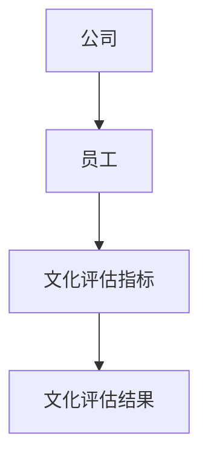
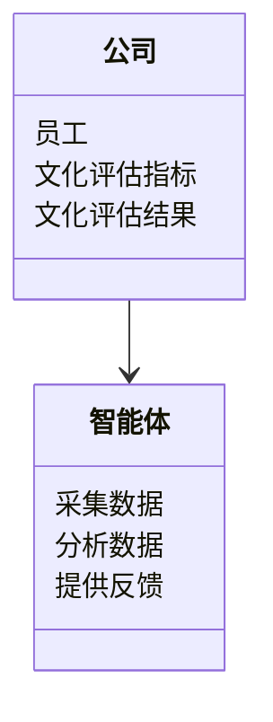
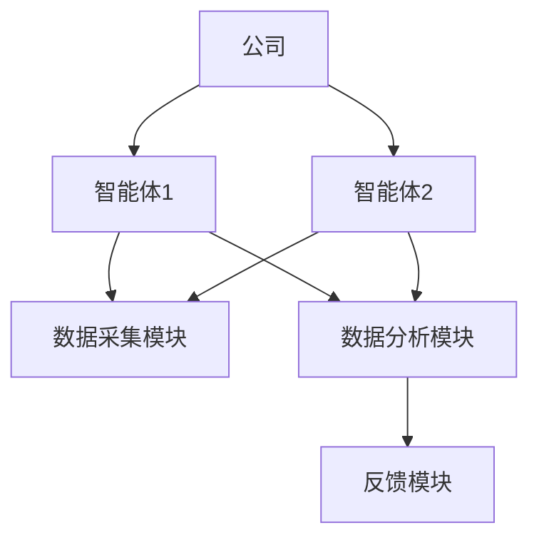
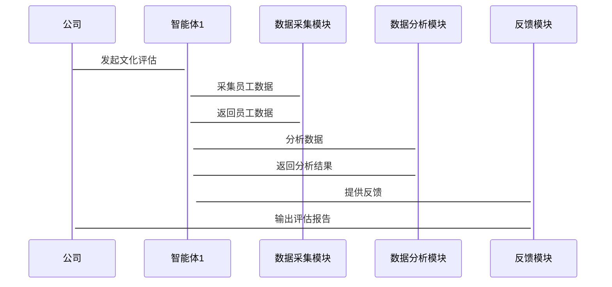

                 

<think>
嗯，好的，我需要帮用户写一篇关于《基于多智能体的自动化公司文化评估系统》的技术博客文章。首先，我得理解这个主题到底是什么，它涉及到多智能体系统和公司文化评估的结合。用户已经给出一个详细的目录大纲，我需要按照这个结构来展开内容。

我应该先从概述开始，介绍多智能体系统和公司文化评估的基本概念，然后分析它们如何结合。接下来，要详细讲解多智能体系统的核心概念，比如通信机制、协作机制，以及这些机制在公司文化评估中的应用。算法部分可能需要选择一种适合的算法，比如基于规则的分类或机器学习模型，并用图表和代码来说明。

在系统架构部分，我需要用Mermaid图来展示模块之间的关系，比如数据采集、分析、反馈等模块。项目实战部分需要一个具体的案例，从环境配置到代码实现，再到结果分析。最后，加上一些最佳实践和总结，确保读者能够应用这些知识。

写作时要保持逻辑清晰，每部分内容要详细但不冗杂，确保读者能够一步步理解整个系统的设计和实现过程。同时，要注意使用专业的术语，但解释要通俗易懂，避免过于深奥难懂。

好，现在我开始按照目录大纲一步步展开每个部分的内容，确保每个章节和小节都涵盖必要的信息，并且有实际的例子和图表支持。这样，整篇博客文章才能既有深度又易于理解。
</think>

# 基于多智能体的自动化公司文化评估系统

> 关键词：多智能体系统，公司文化评估，自动化评估，人工智能，系统架构

> 摘要：本文介绍了一种基于多智能体的自动化公司文化评估系统，详细分析了多智能体系统在公司文化评估中的应用，包括核心概念、算法原理、系统架构设计以及实际案例分析。通过本文的阐述，读者将能够理解如何利用多智能体系统来实现对公司文化的自动化评估。

---

# 第一部分: 基于多智能体的自动化公司文化评估系统概述

## 第1章: 多智能体系统与公司文化评估的结合

### 1.1 多智能体系统的定义与特点

#### 1.1.1 多智能体系统的定义
多智能体系统（Multi-Agent System, MAS）是由多个智能体组成的系统，这些智能体能够通过交互协作完成复杂任务。每个智能体都有一定的自主性，能够感知环境、做出决策并采取行动。

#### 1.1.2 多智能体系统的核心特点
- **分布式智能**：多个智能体协作完成任务，避免单点故障。
- **自主性**：智能体能够自主决策，无需外部集中控制。
- **反应性**：智能体能够实时感知环境变化并做出反应。
- **协作性**：智能体之间通过通信协作，共同完成复杂任务。

#### 1.1.3 多智能体系统在企业中的应用前景
多智能体系统在企业中的应用前景广阔，尤其是在公司文化评估、资源分配、决策支持等领域具有潜在价值。

### 1.2 公司文化评估的定义与方法

#### 1.2.1 公司文化的定义
公司文化是指企业在经营活动中形成的价值观、行为准则和思维方式的总和，是企业凝聚力和竞争力的重要来源。

#### 1.2.2 公司文化评估的传统方法
传统的公司文化评估方法通常依赖于问卷调查、访谈和数据分析，这种方式耗时且成本较高，且容易受到主观因素的影响。

#### 1.2.3 自动化公司文化评估的优势
自动化公司文化评估能够提高评估效率，降低成本，同时能够更客观地分析数据，发现潜在问题。

### 1.3 多智能体系统在公司文化评估中的应用背景

#### 1.3.1 传统公司文化评估的局限性
传统公司文化评估方法存在以下问题：
- **耗时**：需要大量的人力和时间。
- **成本高**：问卷设计、数据分析等都需要专业人员。
- **主观性**：容易受到主观因素的影响。

#### 1.3.2 多智能体系统在公司文化评估中的优势
多智能体系统能够在以下方面提升公司文化评估的效率和准确性：
- **自动化数据采集**：智能体可以自动收集员工反馈、行为数据等。
- **实时分析**：智能体能够实时分析数据，快速生成评估结果。
- **协作优化**：多个智能体协作，能够从不同角度分析公司文化。

#### 1.3.3 问题背景与目标
本系统的目标是通过多智能体协作，实现对公司文化的自动化评估，帮助企业更好地识别和优化企业文化。

---

## 第2章: 多智能体系统与公司文化评估的核心概念

### 2.1 多智能体系统的核心概念

#### 2.1.1 多智能体系统的组成要素
- **智能体**：能够感知环境、做出决策、采取行动的实体。
- **通信机制**：智能体之间交换信息的方式。
- **协作机制**：智能体之间协作完成任务的方式。

#### 2.1.2 多智能体系统在公司文化评估中的应用
- **数据采集**：智能体通过问卷、日志等方式采集员工数据。
- **数据分析**：智能体对数据进行分析，识别文化特征。
- **反馈与优化**：智能体根据分析结果提出改进建议。

### 2.2 自动化公司文化评估系统的组成

#### 2.2.1 数据采集模块
数据采集模块负责收集员工的行为数据、反馈数据等，为后续分析提供基础。

#### 2.2.2 数据分析模块
数据分析模块对采集的数据进行处理，识别公司文化中的问题和优势。

#### 2.2.3 反馈与优化模块
反馈与优化模块根据分析结果，生成反馈报告，并提出改进建议。

### 2.3 多智能体系统与公司文化评估的联系

#### 2.3.1 多智能体系统在公司文化评估中的角色
- **数据采集**：智能体负责采集员工数据。
- **数据分析**：智能体负责分析数据，识别文化特征。
- **反馈优化**：智能体根据分析结果，提出改进建议。

#### 2.3.2 多智能体系统如何提升公司文化评估的效率
- **自动化**：智能体能够自动完成数据采集和分析，节省时间和成本。
- **协作性**：多个智能体协作，能够从不同角度分析数据，提高评估的准确性。

#### 2.3.3 多智能体系统与公司文化评估的边界与外延
- **边界**：多智能体系统仅用于公司文化评估，不涉及企业的其他方面。
- **外延**：公司文化评估的结果可以用于企业决策、员工培训等方面。

---

## 第3章: 多智能体系统的核心原理

### 3.1 多智能体系统的原理

#### 3.1.1 多智能体系统的通信机制
通信机制是智能体之间交换信息的方式，通常包括消息传递、共享数据库等方式。

#### 3.1.2 多智能体系统的协作机制
协作机制是智能体之间协作完成任务的方式，通常包括任务分配、协调同步等方式。

#### 3.1.3 多智能体系统的决策机制
决策机制是智能体根据环境信息做出决策的方式，通常包括基于规则的决策、基于模型的决策等。

### 3.2 多智能体系统的属性特征对比

| 特性 | 独立性 | 协作性 | 动态性 |
|------|--------|--------|--------|
| 描述 | 智能体具有自主决策的能力 | 智能体之间需要协作完成任务 | 系统状态会随着时间变化 |

### 3.3 多智能体系统的ER实体关系图



---

## 第4章: 多智能体系统在公司文化评估中的算法实现

### 4.1 基于规则的分类算法

#### 4.1.1 算法原理
基于规则的分类算法通过预定义的规则对数据进行分类。规则通常基于经验或领域知识制定。

#### 4.1.2 算法流程
1. 数据采集：智能体采集员工数据。
2. 数据预处理：对数据进行清洗和转换。
3. 规则制定：根据经验或领域知识制定分类规则。
4. 数据分类：根据规则对数据进行分类。
5. 结果输出：输出分类结果。

#### 4.1.3 算法实现
```python
# 示例代码：基于规则的分类算法
def classify_culture(data, rules):
    for rule in rules:
        if rule.match(data):
            return rule.classify(data)
    return "未知类别"

# 示例规则
class Rule:
    def __init__(self, condition, classification):
        self.condition = condition
        self.classification = classification

    def match(self, data):
        return self.condition(data)

    def classify(self, data):
        return self.classification
```

#### 4.1.4 优缺点分析
- **优点**：规则简单易懂，适用于领域知识明确的情况。
- **缺点**：规则需要手动制定，难以应对复杂情况。

---

## 第5章: 多智能体系统的系统架构设计

### 5.1 系统功能设计

#### 5.1.1 领域模型


#### 5.1.2 系统架构


#### 5.1.3 系统交互


---

## 第6章: 项目实战

### 6.1 环境安装
- **Python**：安装Python 3.8或更高版本。
- **库依赖**：安装`mermaid`、`matplotlib`等库。

### 6.2 系统核心实现源代码

```python
# 示例代码：公司文化评估系统
import random

class Employee:
    def __init__(self, id):
        self.id = id
        self.feedback = {}

    def provide_feedback(self, questions):
        for q in questions:
            self.feedback[q] = random.choice(['是', '否', '部分是'])
        return self.feedback

class CultureAssessmentSystem:
    def __init__(self, employees):
        self.employees = employees
        self.questions = [
            "您是否感到公司对您的工作有支持？",
            "您是否认为公司文化促进了团队合作？"
        ]

    def collect_data(self):
        data = []
        for emp in self.employees:
            feedback = emp.provide_feedback(self.questions)
            data.append(feedback)
        return data

    def analyze_data(self, data):
        analysis = {}
        for feedback in data:
            for q, ans in feedback.items():
                if q not in analysis:
                    analysis[q] = {'是': 0, '否': 0, '部分是': 0}
                analysis[q][ans] += 1
        return analysis

    def generate_report(self, analysis):
        report = {}
        for q, counts in analysis.items():
            total = sum(counts.values())
            report[q] = {
                '是': counts['是'] / total,
                '否': counts['否'] / total,
                '部分是': counts['部分是'] / total
            }
        return report

# 示例使用
employees = [Employee(1), Employee(2), Employee(3)]
system = CultureAssessmentSystem(employees)
data = system.collect_data()
analysis = system.analyze_data(data)
report = system.generate_report(analysis)
print(report)
```

### 6.3 代码应用解读与分析
- **Employee类**：表示员工，提供反馈数据。
- **CultureAssessmentSystem类**：实现数据采集、分析和报告生成。
- **数据采集**：员工提供反馈数据。
- **数据分析**：统计员工反馈，生成分析结果。
- **报告生成**：根据分析结果生成评估报告。

### 6.4 实际案例分析
假设公司有100名员工，系统采集了员工的反馈数据，分析结果显示公司文化存在团队合作不足的问题。系统会根据分析结果，提出改进建议。

---

## 第7章: 最佳实践

### 7.1 小结
- 多智能体系统能够显著提高公司文化评估的效率和准确性。
- 通过自动化数据采集和分析，企业可以更快地识别文化问题。

### 7.2 注意事项
- 确保数据隐私和员工信息安全。
- 定期更新评估规则，以适应企业文化的动态变化。

### 7.3 拓展阅读
- 多智能体系统的相关书籍和论文。
- 公司文化评估的其他方法和技术。

---

# 结语

通过本文的详细阐述，读者可以了解基于多智能体的自动化公司文化评估系统的核心概念、算法原理和系统架构设计。这种系统能够帮助企业更高效地评估和优化公司文化，提升企业的竞争力和员工满意度。

作者：AI天才研究院/AI Genius Institute & 禅与计算机程序设计艺术 /Zen And The Art of Computer Programming

