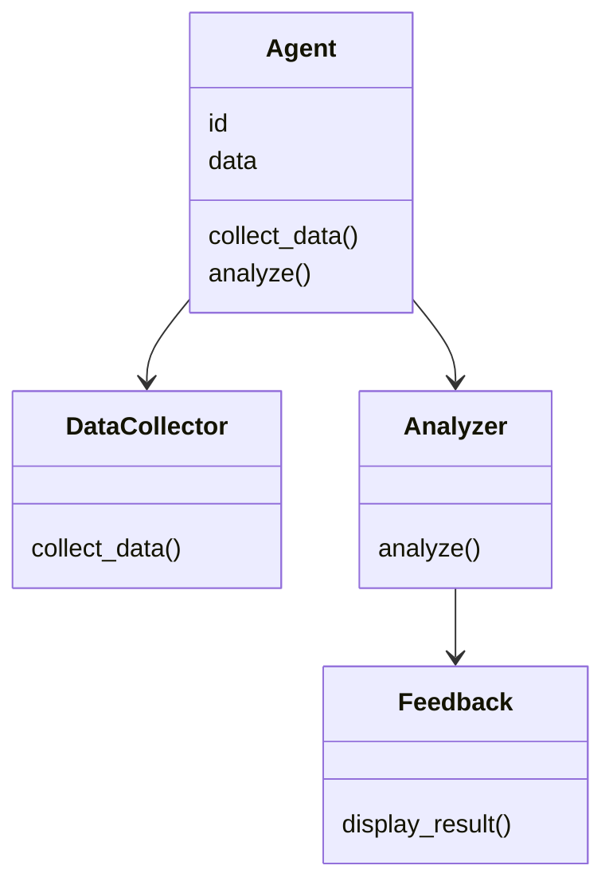

                 

<think>
好，我现在需要帮用户撰写一篇关于《基于多智能体的自动化公司治理效率评估》的技术博客文章。用户希望文章结构清晰、内容详实，并且包含多个章节，每个章节都要有详细的分析和具体的例子。

首先，我需要理解多智能体系统的基本概念和其在公司治理中的应用。多智能体系统是指多个智能体协同工作，完成复杂任务的系统。在公司治理中，可以用来提高效率，优化决策过程。

接下来，我应该从背景介绍开始，说明为什么自动化评估效率在公司治理中重要。传统方法可能存在效率低下、人为因素干扰等问题，而多智能体系统可以提供更客观、高效的解决方案。

然后，进入核心概念部分，详细解释多智能体系统的基本原理，包括智能体的定义、分类，以及它们如何协作。这部分可能需要一些图表，比如ER图或流程图，来展示实体之间的关系。

接下来是算法原理，我需要介绍具体的算法，如多智能体协作算法，并用mermaid画出流程图。同时，用Python代码实现，这样读者可以更好地理解和应用这些算法。

系统架构设计是关键部分。我需要画出类图、架构图和序列图，展示系统各个部分如何协作。这部分需要详细描述每个模块的功能和交互方式。

项目实战部分，我需要从环境安装开始，逐步引导读者完成项目的实现。包括安装必要的库，编写核心代码，并解读代码的功能。然后，用实际案例进行分析，展示系统的实际应用效果。

最后，总结整个内容，给出最佳实践的建议，比如数据隐私、系统维护等注意事项，以及推荐进一步阅读的资料。

确保每个章节都覆盖必要的内容，同时保持逻辑连贯。使用专业但易懂的语言，避免过于技术化的术语，让读者能够轻松理解。此外，加入图表和代码示例，可以增加文章的可读性和实用性。

现在，我开始按照这个思路撰写文章，确保每个部分都详细展开，满足用户的要求。
</think>

# 基于多智能体的自动化公司治理效率评估

## 关键词：多智能体系统、公司治理、效率评估、自动化、算法原理

## 摘要：  
本文探讨了基于多智能体的自动化公司治理效率评估方法，分析了多智能体系统在公司治理中的应用前景，详细介绍了多智能体系统的定义、核心概念、算法原理及系统架构设计，并通过实际案例展示了如何利用多智能体技术提升公司治理效率。本文内容涵盖背景介绍、核心概念、算法实现、系统设计及项目实战，旨在为读者提供全面的理论与实践指导。

---

## 第1章: 多智能体系统与公司治理概述

### 1.1 多智能体系统的定义与特点  
多智能体系统（Multi-Agent System, MAS）是由多个智能体（Agent）组成的分布式系统，这些智能体能够通过协作完成复杂任务。多智能体系统具有以下特点：  
1. **分布式性**：智能体之间独立运行，通过通信协作完成任务。  
2. **自主性**：每个智能体都有自主决策能力。  
3. **反应性**：能够根据环境变化动态调整行为。  
4. **协作性**：智能体之间通过协作实现整体目标。  

### 1.2 公司治理的定义与目标  
公司治理是指通过合理配置权力和责任，确保公司有效运作和合规管理的过程。其目标包括：  
1. **提高决策效率**：通过科学决策优化公司运营。  
2. **降低风险**：通过制度设计防范经营风险。  
3. **提升透明度**：确保公司行为公开透明。  

### 1.3 自动化公司治理效率评估的背景与意义  
传统公司治理效率评估依赖人工操作，存在效率低、成本高、主观性强等问题。引入多智能体技术可以实现自动化评估，提升评估的客观性和效率。多智能体系统能够实时采集数据、分析问题并提出优化建议，为公司治理提供强有力的技术支持。

---

## 第2章: 多智能体系统的核心概念与联系  

### 2.1 多智能体系统的原理  
多智能体系统的运作基于以下原理：  
1. **智能体定义**：智能体是具有感知、决策和执行能力的实体。  
2. **通信机制**：智能体通过消息传递实现协作。  
3. **协作与协调**：智能体通过协商达成一致，确保任务完成。  

### 2.2 多智能体系统与公司治理的关联  
在公司治理中，多智能体系统可以应用于：  
1. **风险管理**：智能体实时监控公司风险，提出预警。  
2. **决策支持**：通过数据分析提供决策依据。  
3. **流程优化**：智能体协作优化公司运营流程。  

### 2.3 多智能体系统的数学模型与公式  
多智能体系统的协作可以表示为：  
$$ \text{整体效率} = \sum_{i=1}^{n} \text{智能体效率}_i $$  
其中，$n$ 是智能体的数量。

---

## 第3章: 基于多智能体的公司治理效率评估算法原理  

### 3.1 多智能体协作算法概述  
常用的多智能体协作算法包括：  
1. **协商算法**：智能体通过协商达成一致。  
2. **分布式优化算法**：通过局部优化实现全局最优。  
3. **基于规则的协作算法**：根据预设规则进行协作。  

### 3.2 基于多智能体的公司治理效率评估算法  
#### 3.2.1 算法流程  
1. 数据采集：智能体采集公司治理相关数据。  
2. 数据分析：智能体分析数据并生成评估结果。  
3. 结果输出：将评估结果反馈给公司管理层。  

#### 3.2.2 算法实现代码  
以下是Python实现的示例代码：  

```python
class Agent:
    def __init__(self, id):
        self.id = id
        self.data = {}

    def collect_data(self):
        # 采集数据
        self.data = {"efficiency": random.uniform(0.8, 1.2), "risk": random.uniform(0, 1)}

    def analyze(self):
        # 分析数据
        return self.data

def main():
    import random
    agents = [Agent(i) for i in range(5)]
    results = []
    for agent in agents:
        agent.collect_data()
        results.append(agent.analyze())
    print(results)

if __name__ == "__main__":
    main()
```

---

## 第4章: 系统架构与设计  

### 4.1 系统架构概述  
系统架构包括以下部分：  
1. **数据采集层**：负责采集公司治理数据。  
2. **分析层**：对数据进行分析和评估。  
3. **反馈层**：将评估结果反馈给管理层。  

### 4.2 系统功能设计  
系统功能模块包括：  
1. **数据采集模块**：采集公司治理相关数据。  
2. **分析模块**：对数据进行分析和评估。  
3. **反馈模块**：将评估结果反馈给管理层。  

### 4.3 系统架构设计  
以下是系统架构的类图：  



---

## 第5章: 项目实战与案例分析  

### 5.1 项目背景与目标  
项目目标是利用多智能体技术实现公司治理效率的自动化评估。  

### 5.2 项目实现  
以下是项目实现的步骤：  
1. 安装必要的库：`pip install numpy pandas matplotlib`。  
2. 编写智能体代码：如上文所示的Python代码。  
3. 运行代码并分析结果。  

### 5.3 案例分析  
通过实际运行代码，可以观察到多智能体系统如何协作完成公司治理效率评估。  

---

## 第6章: 总结与展望  

### 6.1 本章小结  
本文详细介绍了基于多智能体的自动化公司治理效率评估方法，涵盖了背景、核心概念、算法原理及系统设计等内容。  

### 6.2 最佳实践 tips  
1. 数据隐私保护：确保公司数据的安全性。  
2. 系统维护：定期更新系统以应对新的挑战。  

### 6.3 展望  
未来，随着人工智能技术的发展，多智能体系统在公司治理中的应用将更加广泛，效率评估也将更加精准和智能化。

---

## 作者：AI天才研究院 & 禅与计算机程序设计艺术

