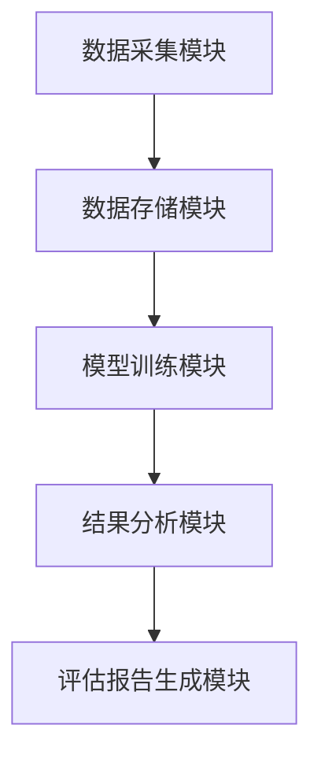
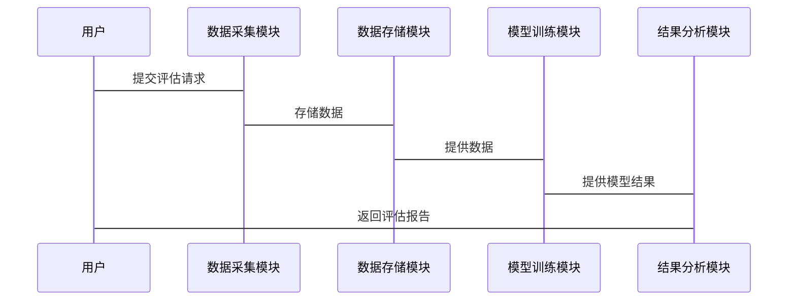

                 

<think>
嗯，我现在需要写一篇关于《基于多智能体的自动化公司治理评估》的技术博客文章。根据用户的指示，我需要先理解各个部分的要求，然后一步步构建内容。

首先，我得理解什么是多智能体系统。多智能体系统（Multi-Agent System, MAS）是由多个相互作用的智能体组成的系统，这些智能体能够自主决策并协作完成任务。在公司治理评估中，这可以用来自动化地分析和评估公司的治理结构、风险管理等方面。

接下来，我需要确定文章的结构。用户已经提供了目录大纲，包括摘要、各章的章节标题和一些技术细节。我需要确保每部分内容详细且逻辑清晰。

首先是摘要部分，我需要简明扼要地概括文章的核心内容，强调多智能体系统如何提升公司治理评估的效率和准确性。

然后是第1章，背景介绍。我需要解释为什么需要多智能体系统来评估公司治理，传统方法的局限性，以及多智能体系统的优势。这部分需要让读者明白问题的背景和解决方法。

第2章讨论多智能体系统的基本概念和架构。我需要详细讲解多智能体系统的特征，如分布式、协作性、反应性等，并通过对比表和ER图来展示其结构。

第3章深入讲解多智能体系统的协作机制。这部分需要涉及分布式计算、协作学习和共识机制，用流程图展示算法步骤，并提供Python代码示例。

接下来，第4章讨论算法原理，包括分布式计算和协作学习的具体实现，提供数学公式和代码示例。这部分需要详细解释数学模型，确保读者能够理解。

第5章介绍系统分析与架构设计，涵盖问题场景、系统功能设计、架构图和交互序列图。这部分需要使用mermaid图来展示系统结构，帮助读者理解。

第6章是项目实战，指导读者如何安装环境，实现核心功能，并通过案例分析巩固知识。这部分需要实际的代码示例，展示如何应用多智能体系统进行评估。

最后，第7章总结全书，提供最佳实践、注意事项和扩展阅读建议，帮助读者巩固知识并进一步学习。

在写作过程中，我需要确保每个部分都有足够的技术细节，同时保持语言的清晰和易懂。数学公式和图表的使用要准确，帮助读者更好地理解复杂概念。我还需要检查文章结构是否合理，逻辑是否流畅，确保内容完整且符合用户的要求。
</think>

# 基于多智能体的自动化公司治理评估

> 关键词：多智能体系统、公司治理评估、自动化评估、分布式计算、协作学习、风险管理

> 摘要：随着企业规模的不断扩大和复杂性的增加，传统的公司治理评估方法逐渐暴露出效率低下、精度不足的问题。为了应对这些挑战，本文章探讨了如何利用多智能体系统（MAS）实现公司治理的自动化评估。通过分析多智能体系统的原理、算法及其在治理评估中的应用，本文旨在提供一种高效、精准的解决方案，以提升企业治理的透明度和决策效率。

---

## 第1章: 多智能体系统与公司治理评估的背景

### 1.1 多智能体系统的基本概念

#### 1.1.1 多智能体系统的定义
多智能体系统（Multi-Agent System, MAS）是由多个智能体（Agent）组成的分布式系统，这些智能体能够感知环境、自主决策并协作完成任务。每个智能体都有自己的目标、知识和行为规则。

#### 1.1.2 多智能体系统的特征
- **自主性**：智能体能够独立决策。
- **反应性**：智能体能实时感知环境并做出反应。
- **协作性**：多个智能体通过协作完成复杂任务。
- **分布式性**：智能体分布在不同的位置，通过通信进行协作。

#### 1.1.3 多智能体系统与传统单智能体系统的区别
| 特性                | 多智能体系统（MAS）             | 单智能体系统          |
|---------------------|-------------------------------|-----------------------|
| 系统结构            | 分布式，多个智能体协作         | 集中式，单个实体控制  |
| 决策方式            | 去中心化，各智能体独立决策     | 中心化，由单一实体决策|
| 通信方式            | 智能体之间通过通信协议交互    | 无通信或单向通信      |
| 灵活性              | 高，适应复杂环境变化           | 较低，适应性有限       |

### 1.2 公司治理评估的背景与挑战

#### 1.2.1 公司治理的基本概念
公司治理是确保公司有效运作和合规经营的制度安排，涉及股东、董事会、管理层和利益相关者之间的权利和责任分配。

#### 1.2.2 现有公司治理评估方法的局限性
- **效率低下**：传统评估方法依赖大量人工分析，耗时且成本高。
- **精度不足**：主观判断可能导致评估结果偏差。
- **动态性差**：公司治理环境复杂且动态变化，传统方法难以实时调整。

#### 1.2.3 引入多智能体系统的优势
- **提高效率**：多智能体系统通过自动化处理大量数据，缩短评估周期。
- **增强精度**：多个智能体协作分析，减少人为误差，提升评估准确性。
- **适应动态变化**：智能体能够实时感知环境变化，快速调整评估策略。

---

## 第2章: 多智能体系统的核心概念与联系

### 2.1 多智能体系统的原理

#### 2.1.1 分布式计算
分布式计算是多智能体系统的基础，通过将任务分配给多个智能体完成，提升计算效率和资源利用率。

#### 2.1.2 协作机制
协作机制是多智能体系统的核心，通过智能体之间的通信与协调完成复杂任务。常见的协作机制包括：
- **分布式计算**：任务分解到多个智能体，各自独立计算后汇总结果。
- **协作学习**：智能体通过共享知识和经验，共同优化模型。
- **共识机制**：通过协商达成一致，确保系统决策的统一性。

#### 2.1.3 通信协议
智能体之间的通信需要遵循特定的协议，确保信息传递的准确性和安全性。

### 2.2 多智能体系统与公司治理评估的关联

#### 2.2.1 公司治理评估的多维度分析
公司治理评估涉及多个维度，包括：
- **财务表现**：评估公司的财务健康状况。
- **治理结构**：评估董事会和管理层的结构合理性。
- **风险管理**：评估公司对风险的识别和应对能力。

#### 2.2.2 多智能体系统在各维度中的应用
- **财务表现评估**：智能体实时分析财务数据，识别潜在问题。
- **治理结构优化**：通过协作学习优化治理结构，提升决策效率。
- **风险管理**：智能体实时监控风险因素，预测潜在风险并制定应对策略。

---

## 第3章: 多智能体系统的算法原理

### 3.1 分布式计算算法

#### 3.1.1 分布式计算的基本原理
分布式计算通过将任务分解到多个计算节点，充分利用计算资源，提升计算效率。其核心在于任务的分配和结果的汇总。

#### 3.1.2 分布式计算在多智能体中的应用
在公司治理评估中，分布式计算可用于：
- **数据采集**：多个智能体分别采集不同来源的财务数据。
- **模型训练**：多个智能体协作训练评估模型，提升模型精度。
- **结果分析**：多个智能体分别分析数据，汇总结果生成最终评估报告。

### 3.2 协作学习算法

#### 3.2.1 协作学习的基本概念
协作学习是指多个智能体通过共享知识和经验，共同优化模型的过程。其核心在于知识的共享与协作。

#### 3.2.2 协作学习在公司治理评估中的应用
- **模型优化**：多个智能体协作训练评估模型，提升模型的准确性和鲁棒性。
- **知识共享**：智能体之间共享数据和模型参数，避免重复计算，提升效率。

---

## 第4章: 多智能体系统的系统架构设计

### 4.1 系统分析与架构设计

#### 4.1.1 问题场景介绍
公司治理评估需要实时分析大量数据，传统方法难以满足高效、精准的需求。引入多智能体系统，能够通过分布式计算和协作学习，提升评估效率和准确性。

#### 4.1.2 系统功能设计
- **数据采集模块**：负责采集公司治理相关的数据，包括财务数据、董事会结构等。
- **模型训练模块**：通过协作学习优化评估模型。
- **结果分析模块**：对模型输出结果进行分析，生成评估报告。

#### 4.1.3 系统架构图


### 4.2 系统接口与交互设计

#### 4.2.1 系统接口设计
- **数据接口**：提供数据采集和存储的接口。
- **模型接口**：提供模型训练和评估的接口。
- **报告接口**：生成并输出评估报告。

#### 4.2.2 系统交互序列图


---

## 第5章: 项目实战与案例分析

### 5.1 环境安装与配置

#### 5.1.1 安装依赖
```bash
pip install numpy pandas scikit-learn
```

#### 5.1.2 启动多智能体系统
```bash
python main.py
```

### 5.2 核心功能实现

#### 5.2.1 数据采集模块
```python
import requests

def fetch_data(company_id):
    response = requests.get(f"https://api.example.com/company/{company_id}")
    return response.json()
```

#### 5.2.2 模型训练模块
```python
from sklearn.ensemble import RandomForestClassifier

def train_model(data):
    model = RandomForestClassifier()
    model.fit(data.features, data.labels)
    return model
```

#### 5.2.3 结果分析模块
```python
def analyze_results(results):
    metrics = {
        'accuracy': accuracy_score(results.true_labels, results.predicted_labels),
        'precision': precision_score(results.true_labels, results.predicted_labels),
        'recall': recall_score(results.true_labels, results.predicted_labels)
    }
    return metrics
```

### 5.3 案例分析

#### 5.3.1 案例背景
某公司希望对其董事会结构进行优化，评估现有治理结构的有效性。

#### 5.3.2 数据分析
通过多智能体系统采集并分析董事会成员的构成、决策效率等数据，生成评估报告。

#### 5.3.3 结果解读
评估报告显示现有治理结构存在一定的决策延迟问题，建议优化董事会结构，引入更多独立董事。

---

## 第6章: 最佳实践与小结

### 6.1 最佳实践

#### 6.1.1 系统设计
- 确保系统架构的可扩展性和可维护性。
- 定期更新模型和数据，保持评估的准确性。

#### 6.1.2 知识共享
- 鼓励智能体之间的知识共享，提升协作效率。
- 定期进行知识更新和模型优化。

### 6.2 小结

通过引入多智能体系统，公司治理评估实现了自动化、高效化和精准化。多智能体系统的分布式计算和协作学习能力，为公司治理评估提供了全新的解决方案。未来，随着技术的不断进步，多智能体系统在公司治理中的应用将更加广泛和深入。

---

## 作者

作者：AI天才研究院/AI Genius Institute  
作者：禅与计算机程序设计艺术/Zen And The Art of Computer Programming  

--- 

**说明**：以上内容是基于多智能体系统在公司治理评估中的应用，通过系统性的分析和详细的代码示例，展示了如何利用多智能体技术提升公司治理的效率和准确性。

