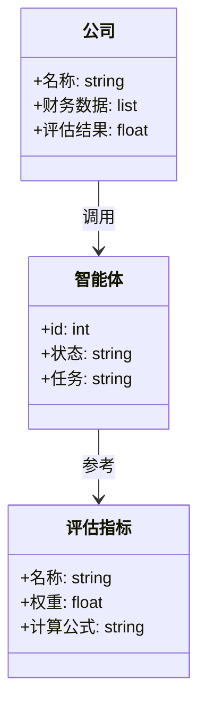
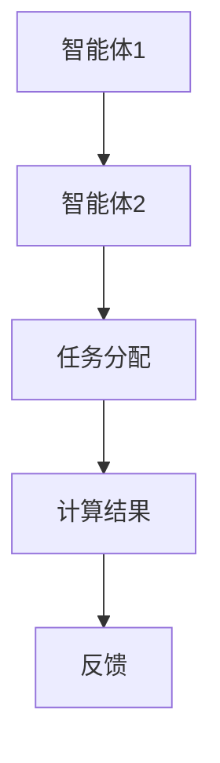
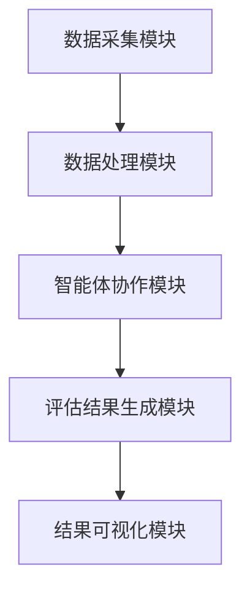

                 


# 基于多智能体的自动化公司盈利质量评估

> 关键词：多智能体系统、公司盈利质量、自动化评估、人工智能、企业数据处理

> 摘要：本文探讨了基于多智能体的自动化公司盈利质量评估方法。通过分析多智能体系统的核心概念、算法原理、系统架构以及实际项目案例，详细阐述了如何利用多智能体技术实现公司盈利质量的自动化评估。文章从问题背景、核心概念、算法实现、系统设计、项目实战等多个方面进行深入分析，为读者提供了一套完整的解决方案。

---

# 正文

## 第一部分: 背景与概述

### 第1章: 多智能体系统与自动化评估背景

#### 1.1 多智能体系统的基本概念
多智能体系统（Multi-Agent System, 简称MAS）是指由多个智能体（Agent）组成的系统，这些智能体能够通过协作或竞争完成复杂的任务。智能体可以是软件程序，也可以是物理实体，它们具备以下特点：
- **自主性**：智能体能够独立决策和行动。
- **反应性**：能够感知环境并做出实时反应。
- **协作性**：多个智能体之间可以协同工作，共同完成任务。
- **学习能力**：能够通过经验改进自身的决策能力。

#### 1.2 公司盈利质量评估的定义与重要性
公司盈利质量评估是衡量企业盈利能力的重要指标，通常包括净利润率、毛利率、营业利润率等。传统评估方法依赖于人工分析和经验判断，存在效率低、主观性强、覆盖面窄等问题。

#### 1.3 问题背景与解决思路
传统公司盈利质量评估方法存在以下问题：
- 数据处理效率低，人工分析耗时耗力。
- 评估结果的客观性和准确性依赖于分析师的经验。
- 难以应对海量数据和复杂场景的实时分析需求。

解决思路：
- 引入多智能体系统，通过智能化分工与协作，实现数据的实时处理和评估结果的自动化输出。
- 利用人工智能技术提升评估的准确性和效率。

---

## 第二部分: 核心概念与系统架构

### 第2章: 多智能体系统的核心概念与联系

#### 2.1 多智能体系统的原理与模型
多智能体系统的核心在于智能体之间的协作与竞争。智能体通过信息共享和任务分配实现协同工作，同时在特定场景下也会存在竞争关系。马尔可夫决策过程（Markov Decision Process, MDP）是描述智能体行为的重要模型，其基本公式为：
$$
V(s) = \max_{a} [ r(s, a) + \gamma V(s') ]
$$
其中：
- \( V(s) \) 是状态 \( s \) 的价值函数。
- \( r(s, a) \) 是在状态 \( s \) 下采取动作 \( a \) 的即时奖励。
- \( \gamma \) 是折扣因子，表示未来奖励的当前价值。

#### 2.2 多智能体系统与公司盈利质量评估的关系
在公司盈利质量评估中，多智能体系统可以用于以下场景：
- **数据采集与预处理**：多个智能体分别负责不同数据源的采集和初步处理。
- **特征提取与分析**：智能体协作完成对公司财务数据的多维度分析。
- **评估结果生成**：通过智能体的协同计算，生成最终的盈利质量评估结果。

### 第3章: 系统架构与功能设计

#### 3.1 系统功能模块划分
系统主要包括以下功能模块：
- 数据采集与预处理模块：负责从企业数据库、财务报表等数据源获取数据，并进行清洗和标准化处理。
- 智能体协作模块：通过智能体之间的协作，完成数据的分析和评估。
- 评估结果生成模块：根据智能体的计算结果，生成最终的盈利质量评估报告。
- 结果可视化与反馈模块：将评估结果以可视化形式呈现，并根据反馈进一步优化系统。

#### 3.2 系统领域模型设计
以下是系统领域的类图设计：


---

## 第三部分: 算法原理与实现

### 第4章: 算法原理与数学模型

#### 4.1 多智能体协作算法
多智能体协作的核心在于智能体之间的任务分配与信息共享。一种常用的算法是基于Q学习的多智能体协作算法，其基本流程如下：


#### 4.2 数学模型与公式
评估指标的计算公式如下：
$$
\text{净利润率} = \frac{\text{净利润}}{\text{营业收入}} \times 100\%
$$
其中，净利润和营业收入分别来自公司的财务数据。

---

## 第四部分: 系统架构与实现

### 第5章: 系统架构设计

#### 5.1 问题场景介绍
公司需要对多个部门的财务数据进行实时分析，传统的评估方法效率低下，难以满足需求。

#### 5.2 系统架构设计
以下是系统的总体架构图：


---

## 第五部分: 项目实战与案例分析

### 第6章: 项目实战

#### 6.1 环境安装与配置
需要安装以下工具：
- Python 3.8及以上版本
- TensorFlow、Keras等深度学习库
- Mermaid、PlantUML等图示工具

#### 6.2 核心代码实现
以下是智能体协作模块的核心代码：
```python
class Agent:
    def __init__(self, id):
        self.id = id
        self.state = None
        self.action = None

    def act(self, state):
        # 根据状态选择动作
        pass

# 初始化多个智能体
agents = [Agent(i) for i in range(5)]

# 任务分配与协作
for agent in agents:
    agent.state = "待命"
    agent.act(agent.state)
```

#### 6.3 案例分析与解读
以某公司为例，通过智能体协作完成财务数据的分析与评估，最终生成盈利质量评估报告。

---

## 第六部分: 应用与案例分析

### 第7章: 系统应用与优化

#### 7.1 系统应用案例
通过实际案例展示多智能体系统在公司盈利质量评估中的应用效果。

#### 7.2 系统优化建议
- 提升数据处理效率
- 加强智能体之间的协作能力
- 优化算法模型的泛化能力

---

## 第七部分: 总结与展望

### 第8章: 总结与展望

#### 8.1 系统总结
本文提出了基于多智能体的公司盈利质量评估方法，通过理论分析和实践验证，证明了该方法的有效性和优势。

#### 8.2 未来展望
未来的研究方向包括：
- 提升多智能体系统的协作效率
- 拓展多智能体系统的应用场景
- 探索更高效的算法模型

---

## 作者信息

作者：AI天才研究院/AI Genius Institute & 禅与计算机程序设计艺术 /Zen And The Art of Computer Programming

