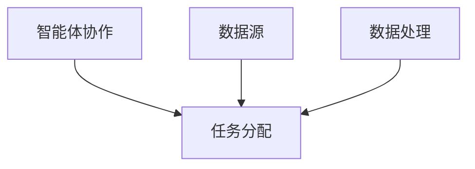
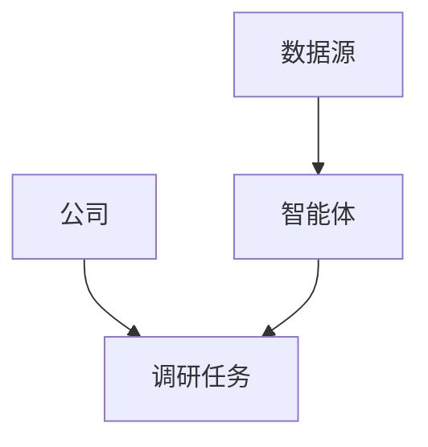
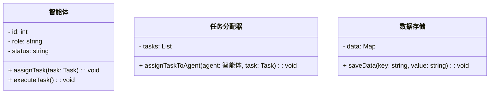
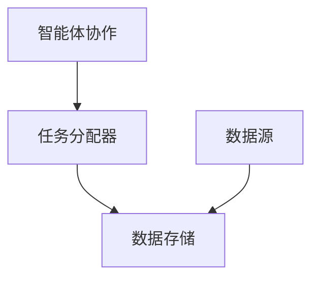
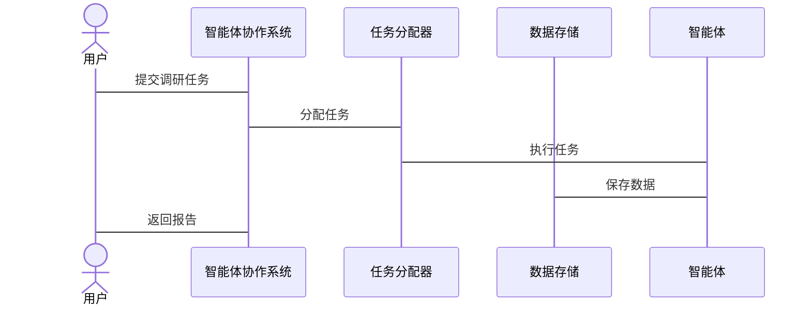

                 


# 基于多智能体的自动化公司调研系统

> 关键词：多智能体系统、自动化公司调研、协作算法、系统架构、项目实战

> 摘要：本文详细探讨了基于多智能体的自动化公司调研系统的构建与应用。从问题背景出发，分析了传统公司调研的痛点与自动化调研的需求，介绍了多智能体协作的核心原理与算法实现，详细阐述了系统的架构设计，通过实际案例展示了系统的功能实现，并总结了项目实施中的注意事项与最佳实践。

---

# 第一章: 背景介绍

## 1.1 问题背景

### 1.1.1 传统公司调研的痛点
传统的公司调研过程通常依赖人工操作，存在以下问题：
- **效率低下**：调研人员需要手动收集、整理和分析数据，耗时较长。
- **信息不全**：人工调研难以覆盖所有潜在信息来源。
- **一致性不足**：不同调研人员的调研结果可能存在偏差。
- **成本高昂**：需要大量人力资源和时间投入。

### 1.1.2 自动化调研的需求
随着企业对数据驱动决策的需求增加，自动化公司调研系统应运而生。自动化系统能够快速、准确地收集和分析数据，帮助企业做出更明智的决策。

### 1.1.3 多智能体协作的优势
多智能体系统通过分工协作，能够高效完成复杂任务。每个智能体负责特定模块的调研任务，通过协同工作实现整体目标。

## 1.2 问题描述

### 1.2.1 公司调研的核心任务
公司调研的核心任务包括：
- 收集公司基本信息（如成立时间、主营业务等）。
- 分析公司财务数据（如收入、利润等）。
- 评估公司市场表现（如市场份额、竞争对手分析等）。

### 1.2.2 自动化调研的关键问题
- 如何实现数据的自动化采集与处理。
- 如何确保数据的准确性和完整性。
- 如何高效协调多个智能体完成调研任务。

### 1.2.3 多智能体协作的目标
通过多智能体协作，实现以下目标：
- 提高调研效率。
- 降低调研成本。
- 增强调研结果的准确性。

## 1.3 问题解决

### 1.3.1 多智能体协作的解决方案
- **任务分解**：将调研任务分解为多个子任务，分配给不同的智能体。
- **协同机制**：设计高效的协同机制，确保智能体之间的信息共享与任务协调。
- **反馈优化**：通过反馈机制优化智能体的行为，提高整体效率。

### 1.3.2 自动化调研的实现路径
- **数据采集**：通过爬虫等技术自动采集公司数据。
- **数据处理**：使用自然语言处理技术分析文本数据。
- **数据存储**：将数据存储在数据库中，便于后续分析。
- **数据分析**：通过数据挖掘技术提取有价值的信息。

### 1.3.3 系统架构的设计思路
系统架构需要考虑以下几个方面：
- **模块划分**：将系统划分为数据采集、数据处理、数据分析等模块。
- **智能体协作**：设计智能体之间的协作机制，确保任务高效完成。
- **用户界面**：提供友好的用户界面，方便用户查看调研结果。

## 1.4 边界与外延

### 1.4.1 系统的边界定义
- **输入**：公司名称、调研任务需求。
- **输出**：公司调研报告。
- **接口**：与外部数据源（如公司官网、新闻网站等）的接口。

### 1.4.2 外延的适用场景
- **行业扩展**：适用于不同行业的公司调研。
- **数据源扩展**：支持多种数据源（如社交媒体、行业报告等）。

### 1.4.3 与其他系统的接口关系
- **数据存储系统**：调研数据需要存储到数据库中。
- **数据可视化系统**：将调研结果可视化展示。

## 1.5 概念结构与核心要素

### 1.5.1 系统的核心要素
- **智能体**：负责执行特定任务的组件。
- **任务分配**：将任务分配给不同的智能体。
- **协同机制**：智能体之间协作的规则和流程。
- **数据源**：数据采集的对象。

### 1.5.2 要素之间的关系
- **智能体与任务分配**：智能体根据任务分配执行任务。
- **协同机制与数据源**：智能体通过协同机制共享数据源。

### 1.5.3 系统的总体架构


---

# 第二章: 核心概念与联系

## 2.1 多智能体系统的核心原理

### 2.1.1 多智能体的定义与特点
多智能体系统由多个智能体组成，每个智能体都有自己的目标和行为规则。智能体之间通过通信和协作完成共同的目标。

### 2.1.2 多智能体协作的机制
- **通信机制**：智能体之间通过消息传递进行通信。
- **协商机制**：智能体之间通过协商确定任务分工。
- **协调机制**：通过协调机制确保任务顺利进行。

### 2.1.3 多智能体的通信协议
通信协议定义了智能体之间消息的格式和传输方式。常见的通信协议包括HTTP、WebSocket等。

## 2.2 多智能体与自动化调研的联系

### 2.2.1 多智能体在调研中的角色
- **数据采集智能体**：负责从不同数据源采集数据。
- **数据处理智能体**：负责对数据进行清洗和预处理。
- **数据分析智能体**：负责对数据进行分析和挖掘。

### 2.2.2 多智能体协作的调研流程
1. **任务分配**：系统将调研任务分配给不同的智能体。
2. **数据采集**：智能体从指定数据源采集数据。
3. **数据处理**：对采集到的数据进行清洗和预处理。
4. **数据分析**：对数据进行分析，提取有价值的信息。
5. **结果汇总**：将各个智能体的分析结果汇总成最终报告。

### 2.2.3 多智能体的分工与协同
- **分工**：每个智能体负责特定的任务。
- **协同**：智能体之间通过通信和协作完成整体任务。

## 2.3 核心概念的属性对比

| 属性         | 单智能体          | 多智能体          |
|--------------|------------------|------------------|
| 系统复杂度   | 低               | 高               |
| 并行处理能力 | 低               | 高               |
| 可扩展性     | 低               | 高               |
| 故障容错性   | 低               | 高               |

### 2.3.1 多智能体与单智能体的对比
- **单智能体**：适合简单任务，处理能力有限。
- **多智能体**：适合复杂任务，处理能力更强。

### 2.3.2 自动化调研与人工调研的对比
- **人工调研**：效率低，成本高。
- **自动化调研**：效率高，成本低。

### 2.3.3 多智能体协作的优缺点
- **优点**：提高效率，增强灵活性。
- **缺点**：实现复杂，需要较高的开发成本。

## 2.4 ER实体关系图

### 2.4.1 实体关系


### 2.4.2 关系描述
- **公司**：调研的目标。
- **调研任务**：系统的输出。
- **智能体**：完成任务的组件。
- **数据源**：数据采集的对象。

---

# 第三章: 算法原理讲解

## 3.1 算法原理概述

### 3.1.1 多智能体协作的基本算法
- **分布式计算**：任务分解到多个智能体，各自计算。
- **共识算法**：智能体之间通过共识算法达成一致。

### 3.1.2 自动化调研的核心算法
- **数据采集算法**：从多个数据源采集数据。
- **数据处理算法**：对数据进行清洗和预处理。
- **数据分析算法**：对数据进行分析和挖掘。

### 3.1.3 算法的数学模型
$$ f(x) = \sum_{i=1}^{n} f_i(x_i) $$

## 3.2 算法实现流程

### 3.2.1 算法步骤分解
1. **任务分配**：将任务分配给不同的智能体。
2. **数据采集**：智能体从指定数据源采集数据。
3. **数据处理**：对数据进行清洗和预处理。
4. **数据分析**：对数据进行分析，提取有价值的信息。
5. **结果汇总**：将各个智能体的分析结果汇总成最终报告。

### 3.2.2 算法的优化策略
- **负载均衡**：确保每个智能体的任务量均衡。
- **通信优化**：减少智能体之间的通信开销。

### 3.2.3 算法的收敛性分析
- **收敛性**：算法是否能够收敛到最优解。
- **收敛速度**：算法收敛的速度有多快。

---

# 第四章: 系统分析与架构设计方案

## 4.1 问题场景介绍

### 4.1.1 项目介绍
本项目旨在构建一个基于多智能体的自动化公司调研系统，实现公司信息的自动采集、处理和分析。

### 4.1.2 系统功能设计
- **数据采集模块**：从公司官网、新闻网站等数据源采集数据。
- **数据处理模块**：对数据进行清洗和预处理。
- **数据分析模块**：对数据进行分析，提取有价值的信息。
- **报告生成模块**：生成公司调研报告。

## 4.2 系统架构设计

### 4.2.1 领域模型类图


### 4.2.2 系统架构图


### 4.2.3 系统接口设计
- **智能体接口**：智能体与任务分配器之间的接口。
- **数据存储接口**：数据存储与智能体之间的接口。

### 4.2.4 系统交互序列图


---

# 第五章: 项目实战

## 5.1 环境安装

### 5.1.1 安装Python
```bash
python --version
pip install --upgrade pip
```

### 5.1.2 安装依赖库
```bash
pip install requests
pip install beautifulsoup4
pip install pandas
```

## 5.2 系统核心实现源代码

### 5.2.1 智能体类
```python
class Agent:
    def __init__(self, id, role):
        self.id = id
        self.role = role
        self.status = "idle"
    
    def assign_task(self, task):
        self.status = "busy"
        self.task = task
    
    def execute_task(self):
        if self.role == "data_collector":
            self.collect_data()
        elif self.role == "data_processor":
            self.process_data()
        self.status = "idle"
    
    def collect_data(self):
        # 数据采集逻辑
        pass
    
    def process_data(self):
        # 数据处理逻辑
        pass
```

### 5.2.2 任务分配器类
```python
class TaskAllocator:
    def __init__(self):
        self.agents = []
        self.tasks = []
    
    def assign_task(self, agent, task):
        agent.assign_task(task)
        agent.execute_task()
```

### 5.2.3 数据存储类
```python
class DataStorage:
    def __init__(self):
        self.data = {}
    
    def save(self, key, value):
        self.data[key] = value
```

## 5.3 代码应用解读与分析

### 5.3.1 智能体类解读
- **属性**：每个智能体都有ID、角色和状态。
- **方法**：包括任务分配、任务执行等方法。

### 5.3.2 任务分配器类解读
- **属性**：包含智能体列表和任务列表。
- **方法**：包括任务分配方法。

### 5.3.3 数据存储类解读
- **属性**：包含数据字典。
- **方法**：包括数据保存方法。

## 5.4 实际案例分析和详细讲解剖析

### 5.4.1 案例分析
假设我们需要调研一家公司，系统会执行以下步骤：
1. **任务分配**：任务分配器将任务分配给数据采集智能体。
2. **数据采集**：数据采集智能体从公司官网采集数据。
3. **数据处理**：数据处理智能体对数据进行清洗和预处理。
4. **数据分析**：数据分析智能体对数据进行分析，提取有价值的信息。
5. **结果汇总**：系统生成最终的调研报告。

### 5.4.2 详细讲解
- **数据采集**：使用爬虫技术从公司官网采集数据。
- **数据处理**：使用自然语言处理技术分析文本数据。
- **数据分析**：使用数据挖掘技术提取有价值的信息。

## 5.5 项目小结

---

# 第六章: 总结与最佳实践

## 6.1 小结

### 6.1.1 核心内容回顾
- 多智能体协作的基本原理。
- 自动化调研系统的实现流程。
- 系统架构设计的关键点。

### 6.1.2 项目总结
通过本项目，我们成功构建了一个基于多智能体的自动化公司调研系统，实现了公司信息的自动采集、处理和分析。

## 6.2 注意事项

### 6.2.1 系统设计中的注意事项
- 确保智能体之间的通信畅通。
- 设计高效的任务分配机制。
- 处理数据源的不可用情况。

### 6.2.2 项目实施中的注意事项
- 确保数据的准确性和完整性。
- 优化系统性能，提高处理效率。
- 处理智能体之间的冲突和协调问题。

## 6.3 拓展阅读

### 6.3.1 相关技术
- 分布式计算
- 数据挖掘
- 自然语言处理

### 6.3.2 推荐书籍
- 《分布式系统：概念与设计》
- 《数据挖掘导论》
- 《自然语言处理实战》

---

# 作者：AI天才研究院 & 禅与计算机程序设计艺术

---

本文详细探讨了基于多智能体的自动化公司调研系统的构建与应用，从问题背景到系统架构，再到项目实战，全面解析了系统的实现过程和关键点。希望本文能够为相关领域的读者提供有价值的参考和启发。

