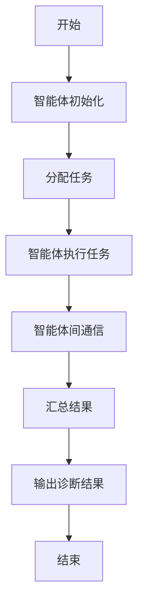
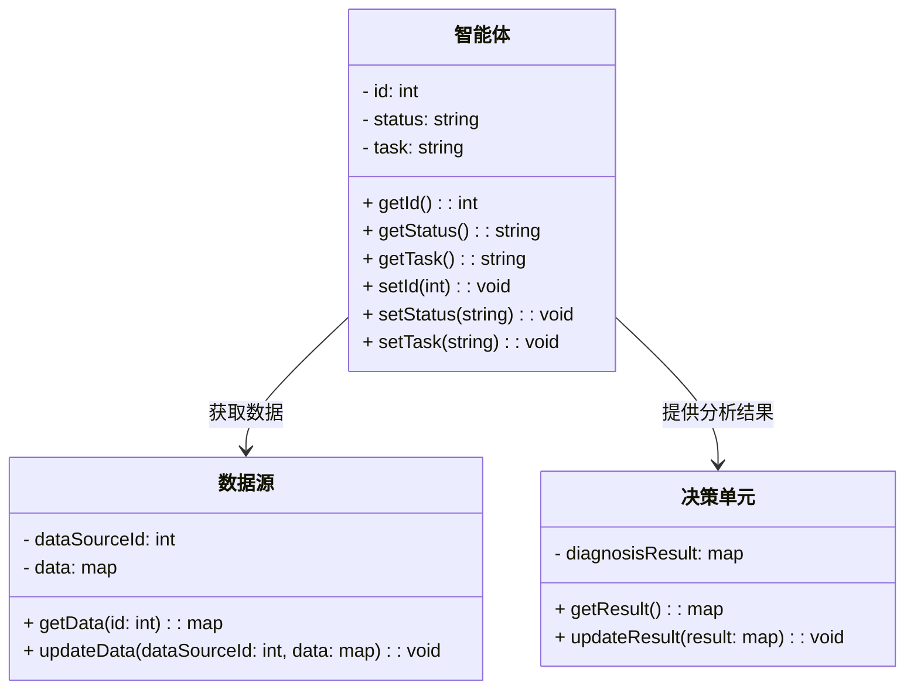
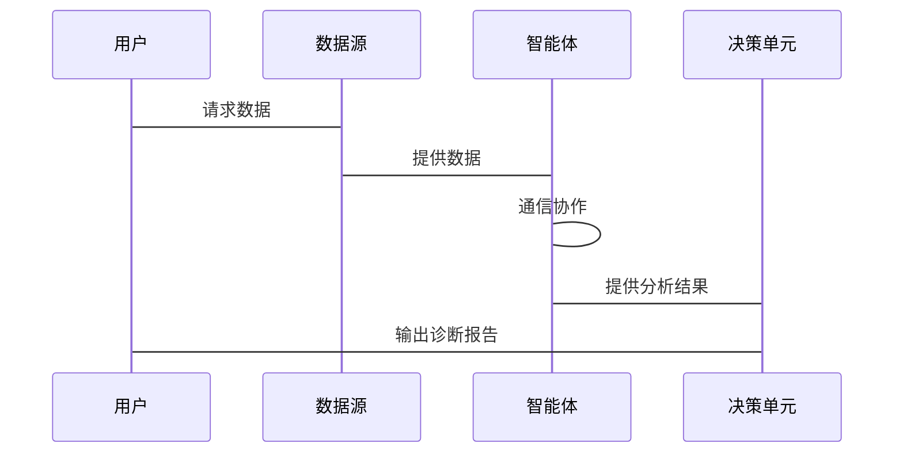

                 


# 基于多智能体的自动化公司财务健康诊断系统

> 关键词：多智能体系统, 财务健康诊断, 自动化诊断, 分布式计算, 系统架构设计, 算法原理

> 摘要：本文探讨了基于多智能体的自动化公司财务健康诊断系统的构建与实现。从多智能体系统的概念出发，分析其在财务健康诊断中的应用潜力，详细阐述了系统的算法原理、架构设计、功能模块实现及实际案例应用。通过系统的分析与设计，结合具体的项目实战，展示了多智能体系统如何在财务健康诊断领域发挥其独特优势。

---

# 第一部分: 多智能体系统与财务健康诊断概述

## 第1章: 多智能体系统与财务健康诊断概述

### 1.1 多智能体系统的定义与特点

#### 1.1.1 多智能体系统的定义
多智能体系统（Multi-Agent System, 简称MAS）是由多个智能体（Agent）组成的分布式系统，这些智能体通过协作完成特定任务。智能体是具有感知环境、自主决策和行动能力的实体，能够独立工作，同时与其他智能体进行通信和协作。

#### 1.1.2 多智能体系统的核心特点
- **自主性**：每个智能体都能自主决策，无需外部干预。
- **反应性**：智能体能够根据环境变化实时调整行为。
- **协作性**：多个智能体通过通信和协作共同完成任务。
- **分布性**：智能体之间分布在网络中，不存在中心化的控制节点。

#### 1.1.3 多智能体系统与传统单智能体系统的区别
单智能体系统通常依赖一个中心化的决策单元，而多智能体系统通过多个分布式智能体协作完成任务。多智能体系统能够更好地应对复杂环境和大规模数据处理，但在设计和实现上更为复杂。

### 1.2 财务健康诊断的定义与重要性

#### 1.2.1 财务健康诊断的定义
财务健康诊断是对企业财务状况进行全面评估的过程，旨在识别潜在的财务风险，并为企业提供优化财务管理的建议。常见的财务健康诊断指标包括盈利能力、偿债能力、运营能力和成长能力。

#### 1.2.2 财务健康诊断的重要性
- **风险预警**：及时发现财务问题，避免企业陷入财务危机。
- **优化管理**：通过诊断结果，优化企业的财务结构和管理流程。
- **支持决策**：为企业的战略规划和投资决策提供数据支持。

#### 1.2.3 财务健康诊断的常见方法与工具
- **财务报表分析**：通过资产负债表、利润表和现金流量表进行分析。
- **比率分析**：计算偿债能力、运营能力和盈利能力等关键指标。
- **趋势分析**：通过时间序列数据，识别财务状况的变化趋势。

### 1.3 多智能体系统在财务健康诊断中的应用前景

#### 1.3.1 多智能体系统在企业财务管理中的潜在应用
- **数据采集与处理**：多个智能体协同采集和处理财务数据。
- **风险评估与预警**：通过分布式计算快速识别财务风险。
- **决策支持**：智能体协同分析数据，为管理层提供决策支持。

#### 1.3.2 多智能体系统的优势与挑战
- **优势**：高并发处理能力、分布式计算能力强、能够处理大规模数据。
- **挑战**：智能体之间的通信开销、系统复杂性增加、安全性问题。

#### 1.3.3 财务健康诊断的未来发展趋势
随着人工智能和大数据技术的快速发展，财务健康诊断将更加智能化和自动化。多智能体系统将在这一领域发挥越来越重要的作用。

### 1.4 本章小结
本章介绍了多智能体系统的定义和特点，分析了财务健康诊断的重要性和常见方法，最后探讨了多智能体系统在财务健康诊断中的应用前景和挑战。

---

## 第2章: 多智能体系统的核心概念与联系

### 2.1 多智能体系统的组成与结构

#### 2.1.1 多智能体系统的组成要素
- **智能体**：独立的决策单元，能够感知环境并采取行动。
- **通信机制**：智能体之间进行信息交换的通道。
- **协作协议**：智能体协作的规则和流程。

#### 2.1.2 多智能体系统的层次结构
- **物理层**：智能体的硬件实现。
- **逻辑层**：智能体的行为逻辑和决策规则。
- **通信层**：智能体之间的信息交互。

#### 2.1.3 多智能体系统与财务健康诊断的关系
多智能体系统通过协同工作，能够高效地处理财务数据，提供实时的财务诊断结果。

### 2.2 多智能体系统与财务健康诊断的关系

#### 2.2.1 多智能体系统在财务诊断中的角色
- **数据采集**：智能体负责采集企业的财务数据。
- **数据分析**：多个智能体协同分析数据，识别潜在风险。
- **决策支持**：智能体根据分析结果，提供优化建议。

#### 2.2.2 多智能体系统如何实现财务数据的协同分析
- **分布式计算**：多个智能体协同处理数据，提高计算效率。
- **实时通信**：智能体之间实时交换信息，确保数据的及时性。

#### 2.2.3 多智能体系统与财务健康诊断的结合点
- **数据来源**：智能体可以从多个数据源采集财务数据。
- **分析模型**：智能体协同应用多种分析模型，提供全面的诊断结果。

### 2.3 多智能体系统的ER实体关系图

```mermaid
erDiagram
    actor 用户
    actor 管理员
    actor 智能体
    actor 数据源
    actor 决策单元
    用户 -> 数据源 : 查询数据
    管理员 -> 智能体 : 配置参数
    智能体 -> 数据源 : 获取数据
    智能体 -> 决策单元 : 提供分析结果
```

### 2.4 本章小结
本章详细介绍了多智能体系统的组成与结构，并分析了其在财务健康诊断中的角色和作用，最后通过ER实体关系图展示了系统的整体架构。

---

## 第3章: 基于多智能体的财务健康诊断算法原理

### 3.1 算法原理概述

#### 3.1.1 多智能体协同算法的基本原理
多智能体协同算法通过智能体之间的协作，实现对复杂问题的分布式求解。算法的核心是智能体之间的通信与协作机制。

#### 3.1.2 基于多智能体的分布式计算方法
- **任务分配**：智能体根据自身能力分配任务。
- **数据交换**：智能体之间实时交换数据和信息。
- **结果汇总**：智能体将局部结果汇总，形成全局解决方案。

#### 3.1.3 多智能体系统中的任务分配与协作机制
- **任务分配**：基于智能体的能力和当前负载进行动态分配。
- **协作机制**：智能体通过通信协议协同完成任务。

### 3.2 算法流程图



### 3.3 算法的数学模型与公式

#### 3.3.1 多智能体协同的基本数学模型
$$ f(x) = \sum_{i=1}^{n} f_i(x_i) $$

其中，$f_i(x_i)$ 表示第 $i$ 个智能体的局部目标函数，$x_i$ 是智能体的决策变量。

#### 3.3.2 财务健康诊断的数学公式
$$ \text{健康指数} = \frac{\text{资产总额}}{\text{负债总额}} \times 100 $$

#### 3.3.3 算法的优化与改进
通过对智能体的通信机制和任务分配策略进行优化，提高系统的计算效率和诊断准确性。

### 3.4 本章小结
本章详细介绍了基于多智能体的财务健康诊断算法的原理，包括分布式计算方法和协作机制，并通过流程图和数学公式展示了算法的实现过程。

---

## 第4章: 系统分析与架构设计方案

### 4.1 问题场景介绍

#### 4.1.1 财务健康诊断的典型问题场景
- **数据分散**：企业的财务数据分布在多个系统中，难以统一管理。
- **数据量大**：需要处理大量的财务数据，传统方法效率低下。
- **实时性要求高**：需要快速诊断财务问题，避免企业损失。

#### 4.1.2 多智能体系统在问题场景中的应用
- **数据采集**：智能体从多个数据源采集财务数据。
- **实时分析**：智能体协同分析数据，快速识别潜在风险。
- **动态调整**：根据实时数据动态调整诊断结果。

#### 4.1.3 系统目标与需求分析
- **目标**：构建一个高效、准确的财务健康诊断系统。
- **需求**：实时性、高并发处理能力、易扩展性。

### 4.2 系统功能设计

#### 4.2.1 领域模型设计



#### 4.2.2 功能模块划分
- **数据采集模块**：负责从多个数据源采集财务数据。
- **数据分析模块**：对数据进行清洗、分析和建模。
- **诊断模块**：根据分析结果生成诊断报告。
- **决策支持模块**：为用户提供优化建议。

#### 4.2.3 功能模块之间的关系
数据采集模块将数据传递给数据分析模块，数据分析模块将结果传递给诊断模块，诊断模块生成诊断报告并传递给决策支持模块。

### 4.3 系统架构设计

#### 4.3.1 系统架构的整体设计
系统采用分布式架构，智能体分布在不同的节点上，通过通信机制协同工作。

#### 4.3.2 多智能体系统的架构实现
- **通信层**：智能体之间的通信通过消息队列实现。
- **数据层**：数据存储在分布式数据库中，支持高并发访问。
- **业务层**：智能体协同完成数据处理和诊断任务。

#### 4.3.3 系统的可扩展性与可维护性
系统采用模块化设计，支持动态扩展智能体数量和功能模块。

### 4.4 系统接口设计

#### 4.4.1 系统接口的定义与规范
- **数据采集接口**：定义智能体如何从数据源获取数据。
- **通信接口**：定义智能体之间的通信协议。
- **结果输出接口**：定义诊断结果的输出格式。

#### 4.4.2 多智能体系统之间的接口设计
- **任务分配接口**：智能体根据负载动态分配任务。
- **数据同步接口**：智能体之间同步数据，确保一致性。

#### 4.4.3 系统与外部系统的接口设计
- **数据源接口**：与企业的财务系统对接，获取数据。
- **用户接口**：为用户提供诊断结果和优化建议。

### 4.5 系统交互流程图



### 4.6 本章小结
本章详细分析了系统的功能设计和架构设计，展示了多智能体系统如何实现财务健康诊断的高效性和准确性。

---

## 第5章: 项目实战与实现

### 5.1 环境安装与配置

#### 5.1.1 开发环境的选择与安装
- **开发工具**：使用Python和Java进行开发。
- **运行环境**：建议使用虚拟机或云服务器部署。

#### 5.1.2 多智能体系统的依赖库安装
- **Python依赖**：安装`multiprocessing`和`socket`库。
- **Java依赖**：使用Spring Boot框架。

### 5.2 系统核心实现源代码

#### 5.2.1 数据采集模块的实现

```python
import socket
import threading

class Agent:
    def __init__(self, id):
        self.id = id
        self.task = None
        self.data = {}

    def run(self):
        while True:
            if self.task:
                # 处理任务
                self.process_task()
                self.task = None
```

#### 5.2.2 数据分析模块的实现

```python
import pandas as pd

class Analyzer:
    def __init__(self):
        self.data = {}

    def analyze(self, data):
        # 数据分析逻辑
        return pd.DataFrame(data)
```

#### 5.2.3 诊断模块的实现

```python
class Diagnoser:
    def __init__(self):
        self.results = {}

    def diagnose(self, data):
        # 诊断逻辑
        return self.results
```

### 5.3 代码应用解读与分析

#### 5.3.1 数据采集模块
智能体从数据源获取数据，存储在`data`属性中。

#### 5.3.2 数据分析模块
使用Pandas库对数据进行清洗和建模，生成分析结果。

#### 5.3.3 诊断模块
根据分析结果，生成诊断报告，并存储在`results`属性中。

### 5.4 实际案例分析和详细讲解剖析

#### 5.4.1 案例背景
某企业财务数据分散在多个系统中，需要快速诊断财务健康状况。

#### 5.4.2 系统实现步骤
1. **安装环境**：安装开发工具和依赖库。
2. **配置数据源**：设置数据采集模块连接多个数据源。
3. **启动智能体**：运行多个智能体，协同完成数据处理。
4. **生成诊断报告**：智能体协同分析数据，生成诊断结果。

### 5.5 本章小结
本章通过实际案例展示了系统的实现过程，详细解读了关键模块的代码实现，并分析了系统的实际应用效果。

---

## 第6章: 系统优化与未来展望

### 6.1 系统优化建议

#### 6.1.1 提高系统的计算效率
- **优化任务分配策略**：根据智能体的负载动态分配任务。
- **减少通信开销**：优化通信协议，减少数据传输量。

#### 6.1.2 提升系统的安全性
- **数据加密**：对传输和存储的数据进行加密。
- **访问控制**：设置权限控制，防止数据泄露。

### 6.2 未来研究方向

#### 6.2.1 智能体的自适应能力
研究智能体的自适应能力，使其能够更好地应对动态变化的环境。

#### 6.2.2 多智能体系统的可扩展性
研究如何进一步提高系统的可扩展性，支持更大规模的数据处理。

#### 6.2.3 智能诊断算法的改进
研究更高效的诊断算法，提高诊断的准确性和实时性。

### 6.3 本章小结
本章总结了系统的优化建议，并展望了未来的研究方向，为系统的进一步发展提供了参考。

---

## 作者：AI天才研究院/AI Genius Institute & 禅与计算机程序设计艺术 /Zen And The Art of Computer Programming

---

这篇文章系统地介绍了基于多智能体的自动化公司财务健康诊断系统的构建与实现，从理论到实践，全面分析了系统的各个方面，为读者提供了深入的技术见解。

