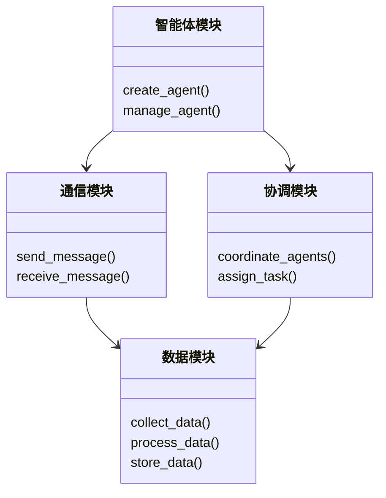
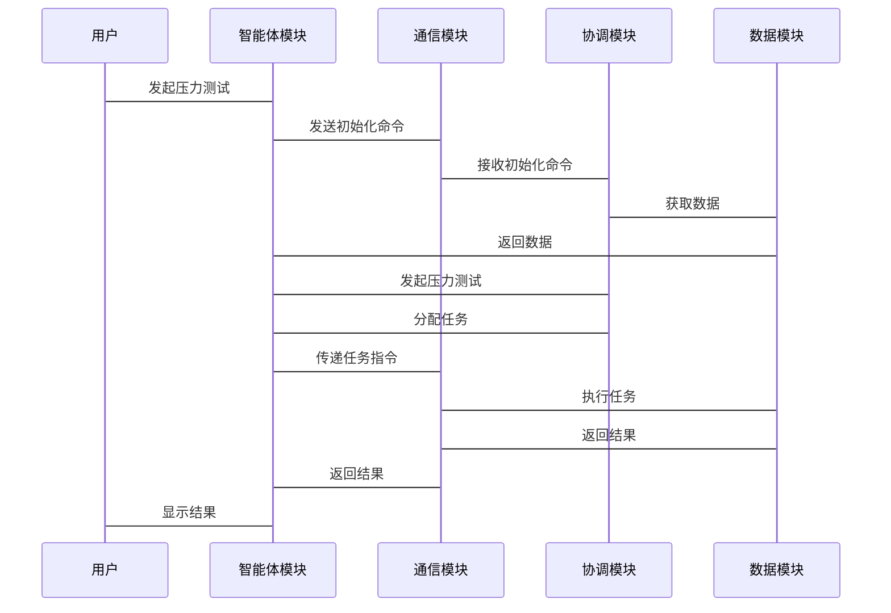

                 

<think>
好的，现在我要帮用户完成一个关于《基于多智能体的自动化公司财务压力测试系统》的技术博客文章。用户已经提供了一个详细的目录大纲，现在需要根据这个大纲，逐步完成每个章节的内容。

首先，我需要理解每个章节的重点。第一部分是背景介绍，包括多智能体系统和财务压力测试的背景、核心概念和应用价值。接下来是算法原理，详细讲解多智能体系统的协调算法和财务压力测试的数学模型。然后是系统架构设计，包括模块划分、接口设计和交互流程。之后是项目实战，展示如何实现系统，最后是最佳实践和总结。

在写作过程中，我需要确保每个部分都详细且逻辑清晰。例如，在介绍多智能体系统时，需要定义术语，解释其特征和优势，同时结合财务压力测试的背景，说明两者结合的意义。在算法部分，需要使用mermaid流程图和数学公式来展示原理，确保读者能够理解复杂的概念。

系统架构设计部分，我会用类图和序列图来展示模块之间的关系和交互流程，帮助读者更好地理解系统的构建。项目实战部分，我需要提供实际的代码示例，并进行详细解读，让读者能够动手实现系统。最后，总结部分要回顾关键点，并提出未来的扩展方向。

整个过程中，我需要保持语言的专业性，同时确保内容易于理解。使用清晰的标题和小结，帮助读者分阶段消化信息。此外，数学公式和图表的正确使用也是关键，确保技术细节准确无误。

现在，我可以开始逐章撰写内容，确保每一步都符合用户的要求，最终完成一篇高质量的技术博客文章。
</think>

```

# 基于多智能体的自动化公司财务压力测试系统

> 关键词：多智能体系统，财务压力测试，自动化系统，算法原理，系统架构

> 摘要：本文将介绍一种基于多智能体的自动化公司财务压力测试系统，分析其背景、核心概念、算法原理、系统架构、项目实战及最佳实践。通过结合多智能体系统的优势与财务压力测试的需求，提出一种高效、准确的解决方案，帮助公司在复杂多变的经济环境中更好地应对财务风险。

---

# 第一部分: 多智能体系统与财务压力测试背景

## 第1章: 多智能体系统与财务压力测试背景

### 1.1 多智能体系统的基本概念

#### 1.1.1 多智能体系统的定义
多智能体系统（Multi-Agent System, MAS）是由多个智能体（Agent）组成的分布式系统，这些智能体能够通过协作完成复杂的任务。每个智能体都有自己的目标、知识、推理能力以及与环境和其他智能体交互的能力。

#### 1.1.2 多智能体系统的特征
- **自主性**：智能体能够自主决策和行动。
- **反应性**：智能体能够感知环境并实时调整行为。
- **协作性**：多个智能体通过协作完成共同目标。
- **分布式性**：智能体分布在不同的位置，通过通信和协调完成任务。

#### 1.1.3 多智能体系统的优势
- 提高系统的鲁棒性：通过分布式计算和协作，系统能够容忍部分智能体的故障。
- 增强系统的灵活性：智能体可以根据环境变化动态调整行为。
- 降低系统的复杂性：通过模块化设计，复杂问题可以分解为多个简单任务。

### 1.2 财务压力测试的定义与重要性

#### 1.2.1 财务压力测试的定义
财务压力测试是一种评估公司财务状况在极端市场条件下的表现的方法。通过对公司财务数据进行模拟和分析，识别潜在的财务风险，并制定应对策略。

#### 1.2.2 财务压力测试的目的
- 评估公司在极端市场条件下的财务稳定性。
- 发现潜在的财务风险点。
- 为公司制定风险管理策略提供依据。

#### 1.2.3 财务压力测试的常见方法
- **情景分析**：假设不同的市场情景，分析公司财务状况的变化。
- **敏感性分析**：分析财务指标对某些变量的敏感程度。
- **压力测试**：模拟极端市场条件，评估公司财务状况的承受能力。

### 1.3 多智能体系统在财务压力测试中的应用价值

#### 1.3.1 提高测试效率
多智能体系统可以通过分布式计算和并行处理，显著提高财务压力测试的效率。

#### 1.3.2 增强测试准确性
通过多个智能体的协作，可以更全面地考虑各种因素对财务状况的影响，提高测试结果的准确性。

#### 1.3.3 降低测试成本
多智能体系统可以通过自动化的方式完成测试任务，减少人工干预，降低测试成本。

## 1.4 本章小结
本章介绍了多智能体系统的基本概念、特征及其在财务压力测试中的应用价值。通过结合多智能体系统的分布式计算和协作能力，可以显著提高财务压力测试的效率和准确性。

---

## 第2章: 多智能体系统与财务压力测试的核心概念

### 2.1 多智能体系统的组成与功能

#### 2.1.1 智能体的定义与特征
智能体是一个能够感知环境、自主决策并采取行动的实体。智能体可以是软件程序、机器人或其他能够与环境交互的实体。

#### 2.1.2 多智能体系统的组成结构
多智能体系统由多个智能体、通信机制、协调机制和环境组成。智能体之间通过通信机制进行信息交换，通过协调机制实现协作。

#### 2.1.3 多智能体系统的功能模块
- **感知模块**：感知环境信息。
- **决策模块**：基于感知信息做出决策。
- **行动模块**：根据决策采取行动。
- **通信模块**：与其他智能体或环境进行信息交换。

### 2.2 财务压力测试的数学模型

#### 2.2.1 财务压力测试的指标体系
- **流动性指标**：如流动资产与流动负债的比例。
- **偿债能力指标**：如资产负债率、速动比率。
- **盈利能力指标**：如净利润率、ROE（净资产收益率）。

#### 2.2.2 财务压力测试的数学模型
财务压力测试的数学模型通常包括以下几个步骤：
1. **数据收集**：收集公司财务数据和市场数据。
2. **模型建立**：建立财务指标与市场变量之间的关系模型。
3. **情景模拟**：模拟不同市场情景下的财务状况。
4. **结果分析**：分析模拟结果，识别潜在风险。

#### 2.2.3 财务压力测试的边界条件
边界条件是指在模拟过程中设定的限制条件，例如：
- 市场波动范围
- 财务指标的变动范围
- 模拟的时间范围

### 2.3 多智能体系统与财务压力测试的关联性

#### 2.3.1 多智能体系统在压力测试中的作用
- **数据收集与处理**：智能体可以实时收集和处理财务数据。
- **情景模拟**：多个智能体可以协作完成复杂的情景模拟。
- **结果分析**：智能体可以对模拟结果进行分析和报告。

#### 2.3.2 多智能体系统与压力测试的交互机制
- **通信机制**：智能体之间通过通信机制交换信息。
- **协调机制**：智能体通过协调机制实现协作。
- **反馈机制**：智能体根据反馈调整行为。

#### 2.3.3 多智能体系统对压力测试结果的影响
- **提高效率**：通过分布式计算，显著提高测试效率。
- **增强准确性**：通过多个智能体的协作，提高测试结果的准确性。
- **降低风险**：通过实时监控和反馈，及时发现潜在风险。

## 2.4 本章小结
本章详细介绍了多智能体系统的核心概念及其在财务压力测试中的作用。通过结合多智能体系统的分布式计算和协作能力，可以显著提高财务压力测试的效率和准确性。

---

## 第3章: 多智能体系统与财务压力测试的算法原理

### 3.1 多智能体系统的协调算法

#### 3.1.1 分布式协调算法
分布式协调算法是一种基于分布式系统中智能体之间的通信和协调的算法。常见的分布式协调算法包括：
- **基于一致性算法**：如Paxos算法、Raft算法。
- **基于消息传递的算法**：如Gossip算法。

#### 3.1.2 集中式协调算法
集中式协调算法是一种通过一个中心节点协调多个智能体的算法。常见的集中式协调算法包括：
- **基于树状结构的算法**：如二叉树算法。
- **基于广播的算法**：如广播算法。

#### 3.1.3 混合式协调算法
混合式协调算法是结合分布式和集中式算法的一种算法。常见的混合式协调算法包括：
- **基于混合结构的算法**：如Hybrid算法。
- **基于分层结构的算法**：如分层协调算法。

### 3.2 财务压力测试的数学模型与算法

#### 3.2.1 财务压力测试的数学模型
财务压力测试的数学模型通常包括以下几个步骤：
1. **数据预处理**：对数据进行清洗和标准化处理。
2. **模型建立**：建立财务指标与市场变量之间的关系模型。
3. **情景模拟**：模拟不同市场情景下的财务状况。
4. **结果分析**：分析模拟结果，识别潜在风险。

#### 3.2.2 压力测试的蒙特卡洛模拟算法
蒙特卡洛模拟是一种基于随机数的模拟方法，常用于财务压力测试中。蒙特卡洛模拟的步骤如下：
1. **定义变量**：定义影响财务状况的变量，如市场波动、利率变化等。
2. **生成随机数**：根据变量的分布生成随机数。
3. **模拟情景**：根据随机数模拟不同情景下的财务状况。
4. **分析结果**：分析模拟结果，识别潜在风险。

#### 3.2.3 压力测试的马尔可夫链模型
马尔可夫链是一种描述系统状态转移的模型，常用于财务压力测试中。马尔可夫链的步骤如下：
1. **定义状态**：定义系统的状态，如正常状态、压力状态等。
2. **定义转移概率**：定义状态之间的转移概率。
3. **模拟过程**：根据转移概率模拟系统的状态变化。
4. **分析结果**：分析模拟结果，识别潜在风险。

### 3.3 多智能体系统与财务压力测试的联合算法

#### 3.3.1 多智能体系统与压力测试的联合模型
多智能体系统与压力测试的联合模型通常包括以下几个步骤：
1. **数据收集**：智能体收集财务数据和市场数据。
2. **模型建立**：建立财务指标与市场变量之间的关系模型。
3. **情景模拟**：多个智能体协作完成复杂的情景模拟。
4. **结果分析**：智能体对模拟结果进行分析和报告。

#### 3.3.2 联合算法的实现步骤
联合算法的实现步骤如下：
1. **初始化**：初始化智能体和系统参数。
2. **数据收集**：智能体收集数据。
3. **模型建立**：建立数学模型。
4. **情景模拟**：智能体协作完成情景模拟。
5. **结果分析**：分析模拟结果，识别潜在风险。

#### 3.3.3 联合算法的优化方法
联合算法的优化方法包括：
- **并行计算**：通过并行计算提高算法效率。
- **分布式优化**：通过分布式优化降低算法复杂度。
- **自适应优化**：通过自适应优化提高算法的鲁棒性。

## 3.4 本章小结
本章详细介绍了多智能体系统的协调算法及其在财务压力测试中的应用。通过结合多智能体系统的分布式计算和协作能力，可以显著提高财务压力测试的效率和准确性。

---

## 第4章: 系统架构与接口设计

### 4.1 系统架构设计

#### 4.1.1 系统模块划分
多智能体系统的架构通常包括以下几个模块：
- **智能体模块**：负责智能体的创建、管理和协调。
- **通信模块**：负责智能体之间的通信和数据交换。
- **协调模块**：负责智能体的协调和任务分配。
- **数据模块**：负责数据的收集、处理和存储。

#### 4.1.2 系统模块之间的关系
系统模块之间的关系可以通过类图表示，如下：



#### 4.1.3 系统架构的优缺点
- **优点**：模块化设计提高了系统的可扩展性和可维护性；智能体的协作提高了系统的灵活性和适应性。
- **缺点**：系统的复杂性较高，需要较高的开发和维护成本。

### 4.2 系统接口设计

#### 4.2.1 系统输入接口
系统输入接口通常包括以下几个部分：
- **数据输入接口**：用于输入财务数据和市场数据。
- **参数输入接口**：用于输入系统参数和配置。
- **用户输入接口**：用于用户与系统交互。

#### 4.2.2 系统输出接口
系统输出接口通常包括以下几个部分：
- **结果输出接口**：用于输出压力测试结果。
- **日志输出接口**：用于输出系统日志。
- **报告输出接口**：用于输出测试报告。

#### 4.2.3 接口数据格式与协议
- **数据格式**：常用的格式包括JSON、XML、CSV等。
- **通信协议**：常用的协议包括HTTP、TCP/IP、WebSocket等。

### 4.3 系统交互流程

#### 4.3.1 系统交互流程图
系统交互流程可以通过序列图表示，如下：



## 4.4 本章小结
本章详细介绍了基于多智能体的自动化公司财务压力测试系统的架构设计和接口设计。通过模块化设计和智能体的协作，可以实现系统的高效运行和灵活扩展。

---

## 第5章: 项目实战

### 5.1 项目介绍
本项目旨在开发一个基于多智能体的自动化公司财务压力测试系统。通过结合多智能体系统的分布式计算和协作能力，实现高效、准确的财务压力测试。

### 5.2 系统核心实现

#### 5.2.1 环境安装
需要安装以下环境和工具：
- **Python**：用于开发和测试。
- **NumPy**：用于数值计算。
- **Pandas**：用于数据处理。
- **Matplotlib**：用于数据可视化。
- **Flask**：用于 Web 服务开发。

#### 5.2.2 核心代码实现
以下是系统的核心代码实现：

```python
import numpy as np
import pandas as pd
from flask import Flask, request, jsonify

class Agent:
    def __init__(self, id):
        self.id = id
        self.data = None
    
    def collect_data(self, data):
        self.data = data
    
    def process_data(self):
        # 数据处理逻辑
        return self.data
    
    def send_data(self, data):
        # 发送数据到其他智能体或模块
        pass

class Coordinator:
    def __init__(self, agents):
        self.agents = agents
    
    def coordinate(self):
        for agent in self.agents:
            agent.collect_data(request.json)
            processed_data = agent.process_data()
            print(f"Agent {agent.id} processed data: {processed_data}")

app = Flask(__name__)

@app.route('/test', methods=['POST'])
def test():
    agents = [Agent(1), Agent(2), Agent(3)]
    coordinator = Coordinator(agents)
    coordinator.coordinate()
    return jsonify({"status": "success"})

if __name__ == '__main__':
    app.run(debug=True)
```

#### 5.2.3 代码应用解读与分析
- **Agent 类**：定义了智能体的基本功能，包括数据收集、处理和发送。
- **Coordinator 类**：负责智能体的协调和任务分配。
- **Flask 应用**：用于 Web 服务开发，接收数据并协调智能体进行处理。

### 5.3 实际案例分析与详细讲解

#### 5.3.1 案例背景
假设我们有一个公司，需要对其财务状况进行压力测试。我们可以通过多智能体系统模拟不同的市场情景，评估公司在不同情景下的财务状况。

#### 5.3.2 案例分析
1. **数据收集**：智能体收集公司的财务数据和市场数据。
2. **模型建立**：建立财务指标与市场变量之间的关系模型。
3. **情景模拟**：模拟不同市场情景下的财务状况。
4. **结果分析**：分析模拟结果，识别潜在风险。

#### 5.3.3 详细讲解
- **数据收集**：智能体通过 API 或文件读取数据。
- **模型建立**：使用 NumPy 和 Pandas 进行数据处理和建模。
- **情景模拟**：使用蒙特卡洛模拟或马尔可夫链模型进行情景模拟。
- **结果分析**：通过 Matplotlib 进行数据可视化和结果分析。

### 5.4 项目小结
本章通过实际案例分析，详细讲解了基于多智能体的自动化公司财务压力测试系统的实现过程。通过代码实现和案例分析，帮助读者更好地理解系统的构建和应用。

---

## 第6章: 最佳实践与总结

### 6.1 最佳实践

#### 6.1.1 系统设计
- **模块化设计**：通过模块化设计提高系统的可扩展性和可维护性。
- **分布式架构**：通过分布式架构提高系统的鲁棒性和效率。

#### 6.1.2 系统实现
- **代码规范**：遵循代码规范，提高代码的可读性和可维护性。
- **测试覆盖率**：通过单元测试和集成测试提高系统的稳定性。

#### 6.1.3 系统部署
- **容器化部署**：通过 Docker 等容器化技术实现系统的快速部署和扩展。
- **监控与日志**：通过监控和日志分析及时发现和解决问题。

### 6.2 小结
通过本章的总结，我们可以看到基于多智能体的自动化公司财务压力测试系统在实际应用中的优势和挑战。通过合理的设计和优化，可以显著提高系统的效率和准确性。

### 6.3 注意事项
- **数据安全**：注意数据的安全性和隐私保护。
- **系统稳定性**：确保系统的稳定性和可靠性。
- **性能优化**：通过性能优化提高系统的运行效率。

### 6.4 拓展阅读
- **多智能体系统**：深入学习多智能体系统的理论和应用。
- **财务压力测试**：研究财务压力测试的最新方法和工具。
- **算法优化**：学习更多关于算法优化的技术和方法。

---

# 作者：AI天才研究院/AI Genius Institute & 禅与计算机程序设计艺术 /Zen And The Art of Computer Programming

---

**摘要**：本文详细介绍了基于多智能体的自动化公司财务压力测试系统，分析了其背景、核心概念、算法原理、系统架构、项目实战及最佳实践。通过结合多智能体系统的分布式计算和协作能力，可以显著提高财务压力测试的效率和准确性，帮助公司在复杂多变的经济环境中更好地应对财务风险。

---

**全文完**
```

