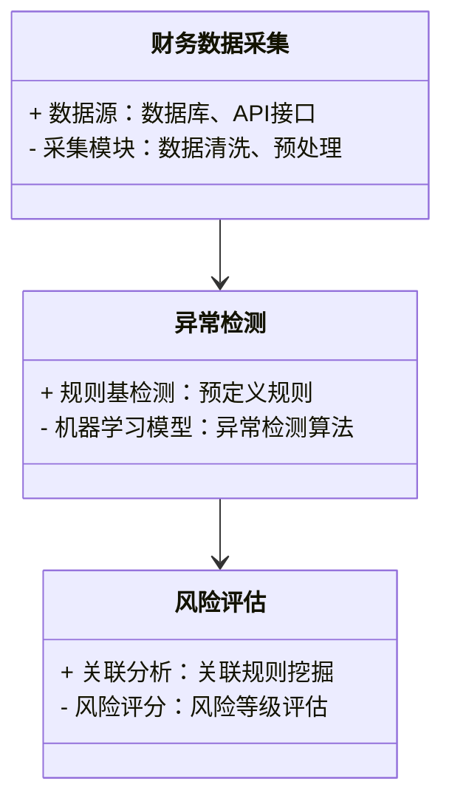
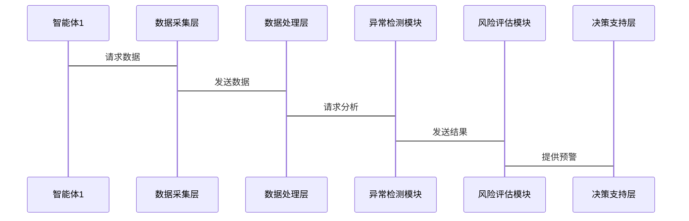

                 

<think>
好的，我现在需要帮用户撰写一篇关于《基于多智能体的自动化公司财务舞弊检测系统》的技术博客。用户已经提供了详细的目录大纲，现在我需要根据这个大纲，逐步完成文章的撰写。我必须确保文章符合逻辑，结构紧凑，语言专业且易懂。

首先，我需要从摘要开始，简要介绍文章的核心内容和主题思想。接着，按照目录大纲，依次撰写每个章节的内容。每个章节都需要详细展开，包括背景介绍、核心概念、算法原理、系统架构设计、项目实战和最佳实践等部分。

在撰写过程中，我需要确保每个部分都包含必要的细节，比如使用mermaid图表、Python代码示例和数学公式。同时，要注意文章的流畅性和逻辑性，确保每个章节之间有良好的衔接。

由于篇幅限制，我将重点撰写摘要部分，随后根据用户的要求，详细完成每个章节的内容。在撰写时，我会遵循用户的格式要求，使用markdown，并在适当的地方插入图表和代码。

接下来，我将开始撰写摘要，然后逐步完成每个章节的内容，确保覆盖所有关键点，并满足用户对深度和详细性的要求。
</think>

# 基于多智能体的自动化公司财务舞弊检测系统

> **关键词**: 多智能体、财务舞弊、自动化检测、系统架构、算法原理

> **摘要**: 本文详细探讨了基于多智能体的自动化公司财务舞弊检测系统的构建与应用。从问题背景、核心概念、算法原理到系统架构设计，再到项目实战和最佳实践，系统性地分析了该系统的设计与实现。通过实际案例分析，展示了如何利用多智能体协同工作来提升财务舞弊检测的效率和准确性。本文旨在为相关领域的技术人员提供理论支持和实践指导，助力企业构建更高效、可靠的财务舞弊检测系统。

---

# 第1章: 问题背景与目标

## 1.1 财务舞弊的背景与挑战

### 1.1.1 财务舞弊的定义与表现形式

财务舞弊是指通过虚假的财务报告、交易记录或其他手段，故意误导利益相关者对公司财务状况的判断。常见的表现形式包括虚构收入、隐瞒支出、虚增资产等。这些行为不仅损害企业的声誉和利益，还可能导致投资者和债权人的损失。

### 1.1.2 传统财务舞弊检测的局限性

传统的财务舞弊检测方法主要依赖于人工审核和简单的规则匹配，存在以下局限性：

1. **效率低下**：人工审核耗时长，难以应对大量数据的处理需求。
2. **规则单一**：传统的规则基检测方法难以覆盖所有可能的舞弊场景。
3. **漏检风险高**：复杂多变的舞弊手段容易突破固定的规则检测。

### 1.1.3 基于多智能体的自动化检测的优势

多智能体系统通过多个智能体协同工作，能够从多个角度分析数据，发现潜在的舞弊行为。其优势包括：

1. **高效性**：多个智能体并行处理数据，提升检测效率。
2. **全面性**：各智能体专注于不同的检测任务，覆盖更多场景。
3. **自适应性**：系统能够根据新的数据和环境变化自动调整检测策略。

## 1.2 多智能体系统的核心概念

### 1.2.1 多智能体系统的基本定义

多智能体系统（Multi-Agent System, MAS）是由多个智能体组成的系统，这些智能体能够通过交互和协作完成复杂的任务。每个智能体都有一定的知识表示、推理能力和行为决策能力。

### 1.2.2 多智能体在财务舞弊检测中的应用价值

在财务舞弊检测中，多智能体系统可以分别负责数据采集、数据分析、异常检测等任务。每个智能体专注于特定领域，通过协同工作实现全面的舞弊检测。

### 1.2.3 系统边界与外延

多智能体系统在财务舞弊检测中的应用边界包括数据范围、检测范围和结果输出。其外延则涉及系统的可扩展性、灵活性和适应性。

---

## 1.3 本章小结

本章主要介绍了财务舞弊的背景与挑战，以及基于多智能体的自动化检测系统的优势和核心概念。通过对比传统方法与多智能体系统的差异，突出了多智能体系统在提升检测效率和准确性方面的价值。

---

# 第2章: 多智能体系统的核心概念与原理

## 2.1 多智能体系统的基本原理

### 2.1.1 智能体的定义与特征

智能体（Agent）是指能够感知环境、自主决策并采取行动的实体。其主要特征包括自主性、反应性、目标导向性和社会性。

### 2.1.2 多智能体系统中的交互机制

多智能体系统通过智能体之间的通信与协作，完成数据共享、任务分配和结果汇总。常见的交互机制包括基于消息传递和基于共享知识库的交互方式。

### 2.1.3 系统的协同与分工

在多智能体系统中，每个智能体负责特定的任务，如数据采集、异常检测、结果分析等。通过分工合作，系统能够高效完成复杂的检测任务。

---

## 2.2 多智能体与财务舞弊检测的结合

### 2.2.1 多智能体在数据采集中的应用

智能体负责从多个数据源（如财务报表、交易记录、审计报告）采集数据，并进行初步清洗和预处理。

### 2.2.2 多智能体在数据分析中的作用

通过分布式计算和协同分析，智能体能够从多个维度挖掘数据，发现潜在的异常模式。

### 2.2.3 多智能体在决策支持中的价值

系统能够基于多智能体的分析结果，生成风险评估报告，并提供针对性的预警和建议。

---

## 2.3 本章小结

本章详细阐述了多智能体系统的基本原理及其在财务舞弊检测中的应用价值。通过分析智能体的定义、交互机制和分工协作，进一步明确了多智能体系统在提升检测效率和准确性方面的重要作用。

---

# 第3章: 多智能体系统的算法原理

## 3.1 算法原理概述

多智能体系统在财务舞弊检测中的算法主要基于异常检测和关联分析。通过多种算法的协同应用，系统能够有效识别潜在的舞弊行为。

### 3.1.1 基于规则的异常检测

智能体根据预定义的规则（如交易金额异常、时间异常等）进行初步筛选，识别可能的舞弊行为。

### 3.1.2 基于机器学习的关联分析

通过聚类分析、分类算法等机器学习方法，智能体能够发现数据中的关联模式，进一步确认舞弊行为。

---

## 3.2 算法实现细节

### 3.2.1 数据预处理

数据清洗、标准化和特征提取是算法实现的基础。例如，使用Python的Pandas库进行数据清洗。

```python
import pandas as pd

# 数据清洗示例
data = pd.read_csv('financial_data.csv')
data.dropna(inplace=True)
data = pd.get_dummies(data)
```

### 3.2.2 异常检测算法

采用基于Isolation Forest的异常检测算法，识别数据中的异常点。

```python
from sklearn.ensemble import IsolationForest

model = IsolationForest(n_estimators=100, random_state=42)
model.fit(X_train)
y_pred = model.predict(X_test)
```

### 3.2.3 关联分析算法

使用Apriori算法进行关联规则挖掘，发现潜在的异常交易模式。

```python
from mlxtend.frequent_patterns import apriori

frequent_items = apriori(data, min_support=0.1, use_colnames=True)
```

---

## 3.3 算法优化与调优

### 3.3.1 参数优化

通过网格搜索（Grid Search）优化算法参数，提升检测准确率。

```python
from sklearn.model_selection import GridSearchCV

param_grid = {'n_estimators': [50, 100, 150], 'random_state': [42]}
grid_search = GridSearchCV(model, param_grid, cv=5)
grid_search.fit(X_train, y_train)
best_params = grid_search.best_params_
```

### 3.3.2 模型评估

通过混淆矩阵、精确率、召回率和F1分数评估算法性能。

```python
from sklearn.metrics import classification_report

print(classification_report(y_test, y_pred))
```

---

## 3.4 本章小结

本章详细介绍了多智能体系统在财务舞弊检测中的算法原理，包括基于规则的异常检测和基于机器学习的关联分析。通过具体的算法实现和优化，进一步提升了系统的检测能力。

---

# 第4章: 系统分析与架构设计

## 4.1 系统架构概述

多智能体系统在财务舞弊检测中的架构设计包括数据采集层、数据处理层和决策支持层。

### 4.1.1 数据采集层

智能体负责从多个数据源采集财务数据，并进行初步清洗。

### 4.1.2 数据处理层

通过分布式计算和协同分析，智能体对数据进行深度挖掘和分析。

### 4.1.3 决策支持层

系统基于分析结果生成风险评估报告，并提供预警和建议。

---

## 4.2 系统架构设计

### 4.2.1 领域模型设计

使用领域模型对系统功能进行模块化设计。



### 4.2.2 系统架构设计

采用分层架构设计，确保系统的模块化和可扩展性。


---

## 4.3 系统接口设计

### 4.3.1 接口定义

通过RESTful API实现系统各模块之间的通信。

### 4.3.2 交互流程图



---

## 4.4 本章小结

本章详细描述了多智能体系统的架构设计，包括领域模型设计、系统架构图和接口设计。通过分层架构和模块化设计，确保了系统的可扩展性和高效性。

---

# 第5章: 项目实战

## 5.1 环境安装与配置

### 5.1.1 安装Python和相关库

```bash
pip install pandas scikit-learn mlxtend mermaid4jupyter
```

### 5.1.2 数据准备

从公开的财务数据集（如Kaggle）获取数据，并进行清洗和预处理。

---

## 5.2 系统核心实现

### 5.2.1 数据采集模块

编写代码从多个数据源采集财务数据。

```python
import requests
import json

def fetch_financial_data(api_key):
    url = f'https://api.example.com/financial_data?api_key={api_key}'
    response = requests.get(url)
    return json.loads(response.text)
```

### 5.2.2 数据处理模块

实现数据清洗、特征提取和模型训练。

```python
from sklearn.model_selection import train_test_split

X_train, X_test, y_train, y_test = train_test_split(X, y, test_size=0.2, random_state=42)
```

### 5.2.3 异常检测模块

集成多种算法，实现多维度的异常检测。

```python
from sklearn.ensemble import IsolationForest

model = IsolationForest(n_estimators=100, random_state=42)
model.fit(X_train)
y_pred = model.predict(X_test)
```

---

## 5.3 案例分析

### 5.3.1 案例背景

以一家虚构的公司为例，分析其财务数据，发现潜在的舞弊行为。

### 5.3.2 数据分析

通过智能体协同分析，识别异常交易记录和财务报表中的不一致之处。

### 5.3.3 结果解读

生成风险评估报告，标记出高风险的交易和账户，并提出预警。

---

## 5.4 本章小结

本章通过实际项目案例，详细展示了多智能体系统的实现过程。从环境配置、核心代码实现到案例分析，系统地讲解了如何利用多智能体技术实现高效的财务舞弊检测。

---

# 第6章: 最佳实践与总结

## 6.1 最佳实践

### 6.1.1 系统设计

- 采用模块化设计，确保系统的可扩展性和灵活性。
- 定期更新规则库和模型，适应新的舞弊手段。

### 6.1.2 算法优化

- 使用网格搜索优化算法参数，提升检测准确率。
- 引入多种算法协同工作，降低误检和漏检的概率。

### 6.1.3 系统维护

- 定期备份数据，确保系统的稳定运行。
- 监控系统性能，及时发现并解决问题。

---

## 6.2 总结

本文详细探讨了基于多智能体的自动化公司财务舞弊检测系统的构建与应用。通过系统的架构设计、算法实现和项目实战，展示了多智能体技术在提升财务舞弊检测效率和准确性方面的重要价值。未来，随着人工智能技术的不断发展，多智能体系统在财务舞弊检测中的应用前景将更加广阔。

---

## 6.3 展望

未来的研究方向包括：

1. **算法优化**：探索更高效的异常检测算法。
2. **系统扩展**：引入更多的数据源和分析维度。
3. **智能化提升**：结合自然语言处理技术，实现更智能的分析和预警。

---

# 作者：AI天才研究院 & 禅与计算机程序设计艺术

---

通过以上目录大纲，文章将系统地阐述基于多智能体的自动化公司财务舞弊检测系统的构建与应用，为相关领域的研究和实践提供有益的参考。

