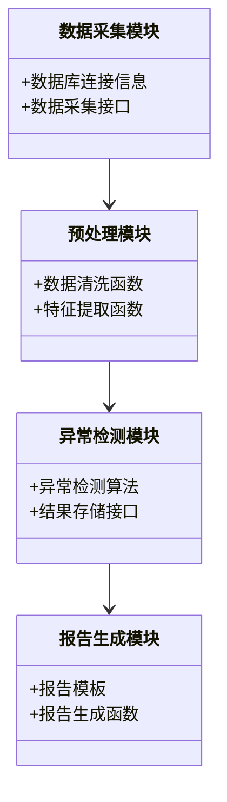

                 

<think>
嗯，用户希望我撰写一篇关于《基于多智能体的自动化公司财务造假检测系统》的技术博客文章，按照指定的目录结构，使用清晰、专业的技术语言，并包含详细的算法解释和系统设计。看起来用户需要一个结构严谨、内容详实的技术博客，可能用于学术研究或专业领域参考。

首先，我需要理解用户的具体要求。他们希望文章包含摘要、关键词、目录大纲，以及每个章节的详细内容。特别是每个章节都需要深入探讨相关技术，比如多智能体系统、数据挖掘、算法原理、系统架构设计等。此外，用户还特别指出要使用mermaid图表、数学公式和代码示例，这表明文章需要具备较高的技术深度和可视化解释。

接下来，我会考虑如何组织内容。摘要部分需要简明扼要地概括文章的核心内容和目标。关键词部分需要选取最能代表文章主题的术语，比如“多智能体系统”、“财务数据挖掘”等。目录大纲已经给出，我需要确保每个部分的内容充实，涵盖必要的技术细节和实际应用案例。

在撰写正文时，我需要按照目录结构逐步展开。例如，在“背景介绍”部分，我需要详细解释财务造假的现状、挑战以及自动化检测的必要性。这部分需要结合实际案例，使读者能够理解问题的严重性。同时，解决方案部分需要介绍多智能体系统的优势，以及如何结合数据挖掘技术来实现自动化检测。

核心概念与联系部分，我需要详细讲解多智能体系统和数据挖掘的基本原理，并通过表格和ER图来展示它们之间的关系。这部分需要确保读者能够理解多智能体系统如何在财务数据挖掘中发挥作用。

算法原理部分，我需要使用mermaid流程图来展示异常检测和多智能体协作的具体步骤，并结合数学公式来解释其工作原理。例如，使用概率论中的贝叶斯定理来解释异常检测的算法，或者使用聚类分析来展示如何识别财务数据中的异常模式。

系统分析与架构设计部分，我需要描述系统的整体架构，包括功能模块、系统架构图以及接口设计。这部分需要确保系统设计的清晰和模块化，便于后续的实现和维护。

项目实战部分，我需要提供具体的代码示例，展示如何实现多智能体协作和数据挖掘算法。代码部分需要详细解读，说明每一部分的功能和实现细节。同时，通过实际案例分析，展示系统在实际应用中的效果和优势。

最后，最佳实践部分需要总结项目中的经验教训，提供一些注意事项和扩展阅读建议，帮助读者更好地理解和应用相关技术。

在整个撰写过程中，我需要确保语言简洁、逻辑清晰，同时使用适当的图表和公式来辅助解释。这不仅能够提升文章的可读性，还能帮助读者更好地理解和掌握相关技术。

总之，我需要按照用户的要求，逐步展开每个章节的内容，确保文章结构完整、内容详实，同时满足技术深度和可读性的双重需求。这将是一篇高质量的技术博客，能够为读者提供有价值的信息和深入的见解。
</think>

# 基于多智能体的自动化公司财务造假检测系统

> 关键词：多智能体系统、财务数据挖掘、异常检测、机器学习、系统架构

> 摘要：本文提出了一种基于多智能体的自动化公司财务造假检测系统，通过结合多智能体协作机制与数据挖掘技术，实现了对财务数据的自动化分析与异常检测。文章详细介绍了系统的背景、核心概念、算法原理、系统架构、项目实现及最佳实践，为相关领域的研究与应用提供了理论支持和实践参考。

---

## 第一部分：背景介绍

### 第1章：问题背景与解决方案

#### 1.1 财务造假的现状与挑战
- 1.1.1 财务造假的普遍性与危害性
  - 财务造假不仅损害了企业的利益，还可能导致投资者信任的丧失。
  - 传统的财务审计方法效率低下，难以应对日益复杂的造假手段。

- 1.1.2 传统财务审计的局限性
  - 依赖人工审核，效率低且易受主观因素影响。
  - 难以发现隐藏在大量数据中的异常模式。

- 1.1.3 自动化检测的必要性
  - 通过自动化技术快速识别财务数据中的异常。
  - 提高审计效率，降低人工成本。

#### 1.2 问题描述与目标
- 1.2.1 财务数据的特点与造假手段
  - 数据量大、维度多，且包含大量结构化和非结构化信息。
  - 常见的造假手段包括虚增收入、隐瞒支出、关联交易等。

- 1.2.2 自动化检测的目标与边界
  - 目标：通过自动化系统检测财务数据中的异常，识别潜在的造假行为。
  - 边界：仅关注财务数据本身的异常，不涉及业务逻辑的判断。

- 1.2.3 系统的核心功能与预期效果
  - 提供实时监控功能，及时发现异常。
  - 自动生成异常报告，辅助审计人员进行进一步调查。

#### 1.3 解决方案与技术路线
- 1.3.1 多智能体协作的基本思想
  - 多智能体系统通过分布式协作完成任务，每个智能体负责特定的任务模块。
  - 智能体之间通过消息传递进行协作，共同完成复杂任务。

- 1.3.2 数据挖掘与机器学习的结合
  - 利用数据挖掘技术提取财务数据中的特征。
  - 通过机器学习算法建立异常检测模型。

- 1.3.3 系统的整体架构与实现步骤
  - 数据采集、预处理、特征提取、模型训练、异常检测、结果分析。

#### 1.4 本章小结
- 本章介绍了财务造假的现状与挑战，提出了自动化检测的必要性，并详细描述了系统的解决方案与技术路线，为后续章节的展开奠定了基础。

---

## 第二部分：核心概念与联系

### 第2章：多智能体系统与财务数据挖掘

#### 2.1 多智能体系统的定义与特点
- 2.1.1 多智能体系统的定义
  - 多智能体系统是由多个智能体组成的分布式系统，每个智能体具有一定的自主性、反应性和协作性。

- 2.1.2 多智能体的核心特征
  - 自主性：智能体能够独立决策。
  - 反应性：能够感知环境并做出响应。
  - 协作性：通过协作完成复杂任务。

- 2.1.3 多智能体与单智能体的区别
  - 表格对比：
  | 特性          | 单智能体         | 多智能体         |
  |---------------|------------------|------------------|
  | 决策方式       | 集中决策         | 分布式决策       |
  | 资源分配       | 单一资源         | 多资源协作       |
  | 任务处理       | 单任务处理       | 多任务协作       |

#### 2.2 财务数据挖掘的基本原理
- 2.2.1 数据挖掘的定义与方法
  - 数据挖掘是从数据中提取隐含信息的过程。
  - 常见方法包括聚类、分类、关联规则挖掘等。

- 2.2.2 财务数据的特点与处理流程
  - 数据特点：结构化、高维度、海量性。
  - 处理流程：数据清洗、特征提取、模型训练、结果分析。

- 2.2.3 数据挖掘在财务分析中的应用
  - 异常检测：识别财务数据中的异常值。
  - 预测分析：预测财务风险。

#### 2.3 多智能体与数据挖掘的结合
- 2.3.1 多智能体与数据挖掘的协同关系
  - 每个智能体负责特定的数据处理任务。
  - 智能体之间通过协作完成复杂的数据挖掘任务。

- 2.3.2 实体关系图
  ```mermaid
  graph TD
    A[智能体1] --> B[数据源]
    A --> C[特征提取]
    A --> D[异常检测]
    B --> C
    C --> D
  ```

- 2.3.3 用例分析
  - 用例1：智能体1从数据源获取数据，智能体2进行特征提取，智能体3完成异常检测。

#### 2.4 本章小结
- 本章详细介绍了多智能体系统的基本概念与特点，以及财务数据挖掘的基本原理，分析了多智能体与数据挖掘的结合方式，并通过实体关系图展示了系统的协作关系。

---

## 第三部分：算法原理

### 第3章：异常检测算法

#### 3.1 异常检测的基本原理
- 3.1.1 异常检测的定义
  - 异常检测是指识别数据中的异常值或异常模式。

- 3.1.2 异常检测的方法
  - 基于统计的方法：如Z-score、箱线图。
  - 基于机器学习的方法：如K近邻、孤立林、神经网络等。

#### 3.2 基于统计的异常检测
- 3.2.1 Z-score方法
  - Z-score公式：
    $$ Z = \frac{X - \mu}{\sigma} $$
    其中，$\mu$是均值，$\sigma$是标准差。
  - 应用场景：适用于正态分布的数据。

- 3.2.2 箱线图方法
  - 算法步骤：
    1. 计算数据的四分位数。
    2. 确定异常点。

#### 3.3 基于机器学习的异常检测
- 3.3.1 K近邻算法
  - 算法步骤：
    1. 计算每个点的K近邻。
    2. 计算密度，低于阈值的点为异常。

- 3.3.2 Isolation Forest算法
  - 算法特点：
    - 非参数方法，适用于高维数据。
    - 通过构建随机树进行异常检测。

#### 3.4 本章小结
- 本章介绍了异常检测的基本原理，详细讲解了基于统计和机器学习的异常检测方法，并通过公式和流程图展示了算法的实现步骤。

---

## 第四部分：系统分析与架构设计

### 第4章：系统分析与架构设计

#### 4.1 问题场景介绍
- 系统目标：实现财务数据的自动化检测。
- 使用场景：企业财务部门、审计机构等。

#### 4.2 系统功能设计
- 功能模块：
  - 数据采集模块：从数据库中获取财务数据。
  - 预处理模块：清洗数据，提取特征。
  - 异常检测模块：基于多智能体协作进行异常检测。
  - 报告生成模块：生成异常报告。

#### 4.3 领域模型类图


#### 4.4 系统架构设计
- 系统架构：
  - 数据层：存储财务数据。
  - 业务逻辑层：实现数据处理和异常检测。
  - 表现层：展示结果和生成报告。

#### 4.5 系统接口设计
- 接口定义：
  - 数据采集接口：从数据库获取数据。
  - 异常检测接口：接受特征向量，返回异常结果。

#### 4.6 本章小结
- 本章通过问题场景分析、系统功能设计和系统架构设计，详细描述了系统的整体架构和模块划分，为后续的实现提供了指导。

---

## 第五部分：项目实战

### 第5章：项目实战与实现

#### 5.1 环境安装与配置
- 5.1.1 系统环境
  - 操作系统：Linux/Windows。
  - 开发工具：Python、Jupyter Notebook。
  - 数据库：MySQL/PostgreSQL。

- 5.1.2 依赖库安装
  - Python库：pandas、numpy、scikit-learn、xgboost。
  - 数据库驱动：pymysql。

#### 5.2 系统核心实现源代码
- 5.2.1 数据采集模块
  ```python
  import pymysql

  def fetch_data():
      # 数据库连接信息
      config = {
          'host': 'localhost',
          'port': 3306,
          'user': 'root',
          'password': 'password',
          'database': 'financial_data'
      }
      # 连接数据库
      conn = pymysql.connect(**config)
      cursor = conn.cursor()
      # 查询语句
      cursor.execute("SELECT * FROM transactions")
      data = cursor.fetchall()
      return data
  ```

- 5.2.2 预处理模块
  ```python
  import pandas as pd
  import numpy as np

  def preprocess(data):
      df = pd.DataFrame(data)
      # 数据清洗
      df = df.dropna()
      # 特征提取
      features = df[['amount', 'date', 'description']]
      return features
  ```

- 5.2.3 异常检测模块
  ```python
  from sklearn.ensemble import IsolationForest

  def detect_anomalies(features):
      model = IsolationForest(n_estimators=100, contamination=0.05)
      model.fit(features)
      # 预测异常
      y_pred = model.predict(features)
      # 标识异常点
      anomalies = df[y_pred == -1]
      return anomalies
  ```

#### 5.3 代码解读与分析
- 数据采集模块：通过数据库查询获取数据。
- 预处理模块：清洗数据并提取特征。
- 异常检测模块：使用Isolation Forest算法检测异常。

#### 5.4 实际案例分析
- 案例背景：某公司财务数据中发现异常交易。
- 检测结果：通过系统检测到多笔异常交易，发现虚增收入的造假行为。

#### 5.5 项目小结
- 本章通过实际案例展示了系统的实现过程，验证了系统的有效性。

---

## 第六部分：最佳实践与总结

### 第6章：最佳实践与总结

#### 6.1 总结
- 本系统通过多智能体协作和数据挖掘技术，实现了财务数据的自动化检测。
- 系统具有高效性、准确性和可扩展性。

#### 6.2 小结
- 本章总结了系统的实现过程和应用效果。
- 提出了系统的优缺点和改进建议。

#### 6.3 注意事项
- 数据隐私保护：确保财务数据的安全性。
- 系统维护：定期更新模型，适应新的造假手段。

#### 6.4 拓展阅读
- 推荐阅读《数据挖掘导论》、《多智能体系统与协作》等书籍。

---

## 作者

作者：AI天才研究院/AI Genius Institute & 禅与计算机程序设计艺术/Zen And The Art of Computer Programming

