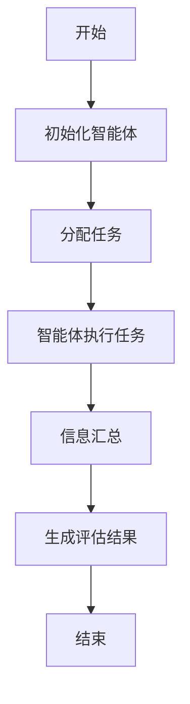

                 


# 基于多智能体的自动化公司质量评估

## 关键词：多智能体系统，公司质量评估，自动化评估，协作决策，智能体算法

## 摘要：  
本文探讨了基于多智能体的自动化公司质量评估系统的构建与应用。通过分析多智能体系统的核心概念、算法原理、数学模型以及系统架构，详细阐述了如何利用多智能体协作实现公司质量的自动化评估。文章从背景介绍到系统实现，从理论分析到实际应用，全面展示了基于多智能体的公司质量评估系统的设计与优化过程。

---

# 第1章: 自动化公司质量评估的背景与意义

## 1.1 多智能体系统的概念与特点

### 1.1.1 多智能体系统的定义  
多智能体系统（Multi-Agent System, MAS）是由多个智能体（Agent）组成的分布式系统，这些智能体通过协作完成复杂的任务。每个智能体都是一个能够感知环境、做出决策并采取行动的实体。

### 1.1.2 多智能体系统的组成要素  
- **智能体**：具有感知、决策和执行能力的实体。  
- **环境**：智能体所处的外部世界，包括物理环境和任务要求。  
- **通信机制**：智能体之间的信息交互方式。  
- **任务分配**：智能体之间如何分配任务以实现整体目标。  

### 1.1.3 多智能体系统的优势与挑战  
**优势**：  
- 分布式计算能力，提升系统整体性能。  
- 智能体协作能够处理复杂任务。  
- 系统具有良好的可扩展性和灵活性。  

**挑战**：  
- 智能体之间的通信与协调复杂。  
- 任务分配和决策需要高效的算法支持。  
- 系统的安全性和稳定性需要高度关注。  

## 1.2 自动化公司质量评估的背景

### 1.2.1 传统公司质量评估的局限性  
传统公司质量评估主要依赖人工审核和主观判断，存在以下问题：  
- **效率低**：人工审核耗时长，难以满足大规模评估需求。  
- **主观性**：评估结果受主观因素影响，缺乏客观性。  
- **成本高**：需要大量人力资源，成本较高。  

### 1.2.2 自动化评估的需求与趋势  
随着人工智能技术的发展，自动化评估成为趋势：  
- **高效性**：自动化评估能够快速处理大量数据。  
- **客观性**：基于数据和算法的评估结果更具客观性。  
- **低成本**：自动化评估能够显著降低人力成本。  

### 1.2.3 多智能体在自动化评估中的作用  
多智能体系统能够通过协作实现对公司质量的多维度评估：  
- **分布式评估**：多个智能体分别负责不同的评估维度。  
- **协作决策**：智能体之间协同完成复杂的评估任务。  
- **动态调整**：根据实时数据动态优化评估结果。  

## 1.3 本章小结  
本章介绍了多智能体系统的概念、组成要素及其优势与挑战，重点分析了传统公司质量评估的局限性和自动化评估的需求与趋势。同时，探讨了多智能体系统在自动化评估中的作用，为后续章节奠定了基础。

---

# 第2章: 多智能体系统的核心概念与联系

## 2.1 多智能体系统的原理

### 2.1.1 智能体的定义与属性  
**智能体**是一个能够感知环境、做出决策并采取行动的实体。其主要属性包括：  
- **自主性**：能够在没有外部干预的情况下自主运行。  
- **反应性**：能够感知环境并实时调整行为。  
- **协作性**：能够与其他智能体协作完成任务。  

### 2.1.2 智能体之间的通信机制  
智能体之间的通信是多智能体系统的核心之一，主要通过以下方式实现：  
- **直接通信**：智能体之间直接交换信息。  
- **间接通信**：通过中间媒介（如共享数据库）进行信息交换。  
- **发布-订阅模式**：智能体发布信息，其他智能体订阅感兴趣的信息。  

### 2.1.3 智能体的任务分配与协作  
任务分配是多智能体系统中的关键问题，常用算法包括：  
- **基于角色的分配**：根据智能体的职责分配任务。  
- **基于能力的分配**：根据智能体的能力分配任务。  
- **基于优先级的分配**：根据任务的优先级分配资源。  

## 2.2 多智能体系统的核心要素

### 2.2.1 问题背景与目标  
公司质量评估的目标是通过多智能体协作，实现对公司多个维度的综合评估。  
- **问题背景**：公司质量评估涉及财务、管理、市场等多个维度。  
- **目标**：通过多智能体协作，快速、准确地生成公司质量评估结果。  

### 2.2.2 智能体的属性与行为  
智能体在公司质量评估中的主要行为包括：  
- **数据采集**：智能体从公司系统中获取相关数据。  
- **数据处理**：对采集到的数据进行清洗、分析和计算。  
- **结果生成**：根据分析结果生成评估报告。  

### 2.2.3 系统的边界与外延  
- **系统边界**：多智能体系统仅负责公司质量评估，不涉及其他业务系统。  
- **系统外延**：评估结果可以与其他系统（如决策支持系统）进行交互。  

## 2.3 多智能体系统的概念结构

### 2.3.1 概念属性特征对比表格  
| 智能体属性 | 定义 | 示例 |
|------------|------|------|
| 自主性     | 能够自主运行 | 智能体可以独立完成数据采集任务 |
| 反应性     | 能够感知环境 | 智能体可以根据实时数据调整评估策略 |
| 协作性     | 能够与其他智能体协作 | 智能体之间可以共享数据并协同完成任务 |

### 2.3.2 ER实体关系图架构  
```mermaid
erd
    Company
    --------
    id: int
    name: string
    financial_data: string
    management_data: string
    market_data: string

    Agent
    -----
    id: int
    role: string
    task: string
    status: string

    relationship between Company and Agent:
    1..n: Company --> Agent
```

## 2.4 本章小结  
本章详细介绍了多智能体系统的原理、核心要素及其概念结构，为后续章节的算法设计和系统实现奠定了基础。

---

# 第3章: 多智能体系统在公司质量评估中的算法原理

## 3.1 算法原理概述

### 3.1.1 多智能体协作的基本原理  
多智能体协作的基本原理是通过智能体之间的通信与协作，共同完成复杂的评估任务。  
- **通信机制**：智能体之间通过消息传递进行信息交换。  
- **协作机制**：智能体之间通过任务分配和协同决策完成任务。  

### 3.1.2 基于多智能体的评估算法流程  
1. 初始化：智能体接收任务并初始化评估参数。  
2. 数据采集：智能体从公司系统中采集相关数据。  
3. 数据处理：智能体对采集到的数据进行清洗和分析。  
4. 任务协作：智能体之间协作完成评估任务。  
5. 结果生成：智能体生成评估报告并输出结果。  

### 3.1.3 算法的输入输出与中间过程  
- **输入**：公司数据、评估任务需求。  
- **输出**：公司质量评估报告。  
- **中间过程**：数据处理、任务协作、结果生成。  

## 3.2 算法实现细节

### 3.2.1 任务分配算法  
任务分配是多智能体协作的关键步骤，常用算法包括：  
- **基于角色的分配**：根据智能体的职责分配任务。  
- **基于能力的分配**：根据智能体的能力分配任务。  
- **基于优先级的分配**：根据任务的优先级分配资源。  

### 3.2.2 信息传递机制  
信息传递机制是智能体之间通信的核心，常用方式包括：  
- **直接通信**：智能体之间直接交换信息。  
- **间接通信**：通过中间媒介（如共享数据库）进行信息交换。  
- **发布-订阅模式**：智能体发布信息，其他智能体订阅感兴趣的信息。  

### 3.2.3 协作决策过程  
协作决策过程是多智能体系统的核心，常用算法包括：  
- **分布式决策算法**：智能体基于局部信息做出决策。  
- **集中式决策算法**：通过中央控制器做出决策。  
- **混合式决策算法**：结合分布式和集中式决策的优点。  

## 3.3 算法流程图  


## 3.4 本章小结  
本章详细介绍了多智能体系统在公司质量评估中的算法原理，包括任务分配、信息传递和协作决策等关键步骤，为后续章节的系统实现提供了理论基础。

---

# 第4章: 数学模型与公式

## 4.1 数学模型概述

### 4.1.1 模型的输入变量  
公司质量评估的输入变量包括：  
- 财务数据：收入、利润、资产负债率等。  
- 管理数据：组织结构、管理效率等。  
- 市场数据：市场份额、客户满意度等。  

### 4.1.2 模型的输出变量  
公司质量评估的输出变量包括：  
- 评估结果：公司质量得分。  
- 评估报告：详细的质量评估分析。  

### 4.1.3 模型的假设条件  
- 输入数据准确无误。  
- 智能体协作效率最大化。  
- 评估任务需求明确。  

## 4.2 关键公式推导

### 4.2.1 智能体协作的概率模型  
$$P(i) = \frac{1}{n} \sum_{j=1}^{n} w_{ij}$$  
其中，$P(i)$ 表示智能体 $i$ 的协作概率，$w_{ij}$ 表示智能体 $i$ 和 $j$ 之间的权重。

### 4.2.2 评估结果的优化公式  
$$R = \max_{i} \sum_{j=1}^{m} a_{ij}$$  
其中，$R$ 表示评估结果，$a_{ij}$ 表示智能体 $i$ 完成任务 $j$ 的能力。

## 4.3 公式应用实例

### 4.3.1 公式在任务分配中的应用  
假设我们有三个智能体，分别负责财务、管理

