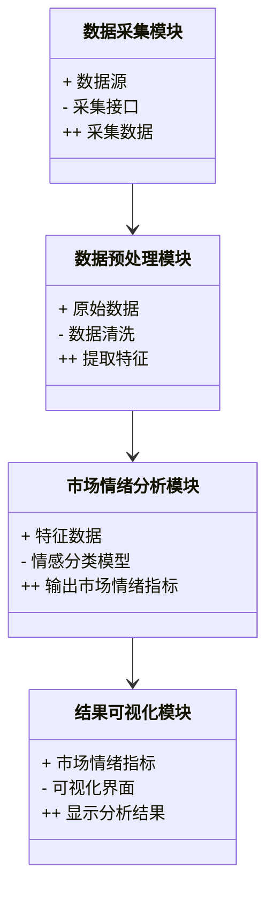
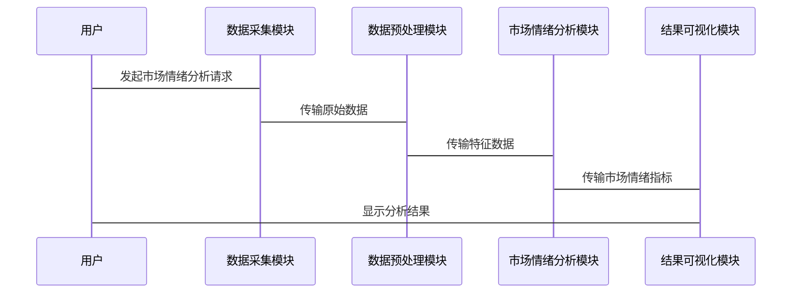

                 


# 基于多智能体的自动化市场情绪指标构建

> **关键词**: 多智能体系统, 市场情绪分析, 自动化指标, 协同学习, 市场分析

> **摘要**: 本文详细探讨了基于多智能体的市场情绪指标构建方法。通过分析多智能体系统与市场情绪分析的核心原理，结合具体算法实现和系统架构设计，提出了一种高效的市场情绪自动化分析框架。文章从背景介绍、核心概念、算法原理、系统设计、项目实战到扩展优化，全面阐述了基于多智能体的市场情绪指标构建的全过程，为实际应用提供了理论支持和实践指导。

---

# 第一部分: 基于多智能体的市场情绪分析背景与基础

## 第1章: 多智能体系统与市场情绪分析概述

### 1.1 多智能体系统的基本概念

#### 1.1.1 多智能体系统的定义与特点
多智能体系统（Multi-Agent System, MAS）是由多个智能体（Agent）组成的分布式系统，这些智能体能够通过协同工作完成复杂的任务。与传统的单智能体系统相比，MAS具有以下特点：
- **分布式性**: 每个智能体独立运行，协同完成任务。
- **自主性**: 每个智能体能够自主决策，无需中央控制。
- **反应性**: 能够实时感知环境并做出反应。
- **社会性**: 智能体之间通过通信和协作完成任务。

#### 1.1.2 多智能体系统的核心要素
多智能体系统的核心要素包括：
- **智能体**: 具备感知、推理和行动能力的实体。
- **环境**: 智能体所处的物理或数字环境。
- **通信机制**: 智能体之间交换信息的方式。
- **协同机制**: 智能体之间协作完成任务的规则和策略。

#### 1.1.3 多智能体系统与传统单智能体算法的对比
传统的单智能体算法通常依赖于中心化的决策机制，而多智能体系统通过分布式的决策和协作实现了更高的灵活性和鲁棒性。例如，在股票交易中，多个智能体可以分别负责市场分析、风险评估和交易执行，从而提高整体决策的准确性。

### 1.2 市场情绪分析的定义与挑战

#### 1.2.1 市场情绪分析的定义
市场情绪分析是指通过分析市场参与者的言论、交易行为和新闻报道等信息，判断市场情绪是乐观、悲观还是中立的过程。市场情绪是影响资产价格波动的重要因素。

#### 1.2.2 市场情绪分析的关键指标
常见的市场情绪分析指标包括：
- **市场情感指数**: 通过文本分析计算市场整体情绪。
- **波动率**: 市场价格波动的幅度。
- **交易量**: 市场交易的活跃程度。

#### 1.2.3 市场情绪分析的难点与挑战
市场情绪分析的难点在于：
- 数据的实时性和多样性。
- 情感表达的主观性和模糊性。
- 市场参与者的复杂行为。

### 1.3 基于多智能体的市场情绪分析的可行性

#### 1.3.1 多智能体系统在市场情绪分析中的优势
多智能体系统能够通过分布式计算和协同学习，提高市场情绪分析的效率和准确性。例如，多个智能体可以分别负责不同的数据源，如新闻、社交媒体和交易数据，从而实现全面的市场情绪分析。

#### 1.3.2 市场情绪分析的复杂性与多智能体的契合点
市场情绪分析涉及多源异构数据的处理和复杂决策，这与多智能体系统的分布式计算和协同能力高度契合。

#### 1.3.3 基于多智能体的市场情绪分析的应用场景
多智能体系统可以应用于股票交易、金融风险管理、市场预测等领域。例如，在股票交易中，多智能体可以分别负责市场分析、交易决策和风险控制。

## 1.4 本章小结
本章介绍了多智能体系统的基本概念和市场情绪分析的定义、挑战及应用。多智能体系统通过分布式计算和协同学习，为市场情绪分析提供了新的解决方案。

---

# 第二部分: 多智能体系统与市场情绪分析的核心概念

## 第2章: 多智能体系统与市场情绪分析的核心原理

### 2.1 多智能体系统与市场情绪分析的核心原理

#### 2.1.1 多智能体系统的模型与算法
多智能体系统的模型通常包括：
- **BDI模型**: 基于信念（Belief）、愿望（Desire）、意图（Intention）的模型。
- **MAS模型**: 基于智能体和环境的模型。

常见的多智能体算法包括：
- **分布式问题求解算法**: 如分布式搜索算法。
- **协调算法**: 如基于协商的协调算法。

#### 2.1.2 市场情绪分析的数学模型
市场情绪分析的数学模型通常包括：
- **情感分类模型**: 如基于支持向量机（SVM）或随机森林（Random Forest）的分类模型。
- **情感强度预测模型**: 如基于回归的模型。

#### 2.1.3 多智能体系统的协同机制
多智能体系统的协同机制包括：
- **协商机制**: 智能体通过协商达成一致。
- **任务分配机制**: 根据智能体的能力分配任务。

### 2.2 市场情绪分析的数学模型与特征提取

#### 2.2.1 市场情绪分析的特征提取方法
常用的特征提取方法包括：
- **词袋模型**: 基于词频（TF）和逆文档频率（TF-IDF）的特征提取。
- **词嵌入模型**: 如Word2Vec、GloVe。

#### 2.2.2 基于多智能体的特征协同分析
通过多智能体协同分析，可以提高特征提取的准确性和鲁棒性。例如，多个智能体可以分别提取不同来源的数据特征，并通过协同机制整合特征。

### 2.3 基于多智能体的市场情绪分析的协同机制

#### 2.3.1 协同学习的基本原理
协同学习是指多个学习器通过协作提高整体学习效果。在市场情绪分析中，多个智能体可以协同学习，提高情感分类的准确率。

#### 2.3.2 多智能体协同的实现方式
多智能体协同的实现方式包括：
- **分布式学习**: 每个智能体在本地数据上进行训练，然后通过通信共享模型参数。
- **集中式学习**: 智能体将数据上传到中心服务器进行统一训练。

#### 2.3.3 协同机制对市场情绪分析的提升作用
协同学习可以提高市场情绪分析的泛化能力和鲁棒性，尤其是在处理复杂数据时表现更优。

## 2.4 核心概念对比分析

### 2.4.1 多智能体系统与传统单智能体系统的对比
- **计算效率**: 多智能体系统通过分布式计算提高了计算效率。
- **灵活性**: 多智能体系统更具灵活性，能够适应复杂环境的变化。

### 2.4.2 不同市场情绪分析方法的对比
- **传统方法**: 基于单智能体的情感分类模型。
- **多智能体方法**: 通过协同学习提高分类准确率。

### 2.4.3 协同机制对市场情绪分析效果的影响
协同机制能够显著提高市场情绪分析的准确性和稳定性。

## 2.5 本章小结
本章详细介绍了多智能体系统的核心原理和市场情绪分析的数学模型，分析了协同机制对市场情绪分析的提升作用。

---

# 第三部分: 基于多智能体的市场情绪分析算法原理

## 第3章: 基于多智能体的市场情绪分析算法

### 3.1 多智能体协同算法的实现原理

#### 3.1.1 多智能体协同的基本流程
多智能体协同的基本流程包括：
1. **任务分配**: 根据智能体的能力分配任务。
2. **数据收集**: 智能体从不同数据源收集数据。
3. **协同学习**: 智能体通过协商完成模型训练。
4. **结果整合**: 整合各智能体的分析结果，输出最终的市场情绪指标。

#### 3.1.2 基于强化学习的多智能体协同
强化学习是一种通过奖惩机制优化智能体行为的算法。在市场情绪分析中，多个智能体可以通过强化学习协同完成任务。

#### 3.1.3 基于博弈论的多智能体协同
博弈论为多智能体的决策提供了理论基础。通过模拟市场参与者的行为，可以提高市场情绪分析的准确性。

### 3.2 市场情绪分析的数学模型

#### 3.2.1 市场情绪分析的特征提取模型
特征提取模型包括：
- **词袋模型**: 基于TF-IDF的特征提取。
- **词嵌入模型**: 如Word2Vec。

#### 3.2.2 基于多智能体的协同分析模型
协同分析模型通过整合多个智能体的分析结果，提高市场情绪分析的准确率。

#### 3.2.3 情绪预测的数学公式
市场情绪预测的公式可以表示为：
$$
\text{预测情绪} = \sum_{i=1}^{n} w_i x_i
$$
其中，$w_i$ 是特征 $x_i$ 的权重。

### 3.3 算法实现的详细步骤

#### 3.3.1 数据预处理
数据预处理包括：
- **数据清洗**: 去除噪音数据。
- **特征提取**: 使用TF-IDF提取文本特征。

#### 3.3.2 模型训练
模型训练包括：
- **训练单个智能体模型**: 使用单智能体进行初步训练。
- **多智能体协同训练**: 通过协同学习提高模型性能。

#### 3.3.3 结果整合
结果整合包括：
- **集成分类器**: 将多个智能体的预测结果进行集成。
- **输出最终指标**: 输出市场情绪指标。

## 3.4 本章小结
本章详细介绍了多智能体协同算法的实现原理和市场情绪分析的数学模型，提供了具体的算法实现步骤。

---

# 第四部分: 系统分析与架构设计

## 第4章: 系统分析与架构设计

### 4.1 项目背景与目标

#### 4.1.1 项目背景
本项目旨在构建一个基于多智能体的市场情绪分析系统，实现自动化市场情绪指标的构建。

#### 4.1.2 项目目标
项目目标包括：
- **实时市场情绪分析**: 实时分析市场参与者的言论和行为。
- **多源数据融合**: 整合新闻、社交媒体和交易数据。
- **自动化指标构建**: 输出市场情绪指标。

### 4.2 系统功能设计

#### 4.2.1 系统功能模块
系统功能模块包括：
- **数据采集模块**: 采集市场数据。
- **数据预处理模块**: 对数据进行清洗和特征提取。
- **市场情绪分析模块**: 进行市场情绪分析。
- **结果可视化模块**: 可视化分析结果。

#### 4.2.2 功能模块的类图
以下是功能模块的类图：


### 4.3 系统架构设计

#### 4.3.1 系统架构图
以下是系统架构图：


### 4.4 系统接口设计

#### 4.4.1 数据接口
数据接口包括：
- **输入接口**: 接收市场数据。
- **输出接口**: 输出分析结果。

#### 4.4.2 算法接口
算法接口包括：
- **训练接口**: 对模型进行训练。
- **预测接口**: 进行市场情绪预测。

#### 4.4.3 用户界面接口
用户界面接口包括：
- **输入界面**: 用户输入查询条件。
- **输出界面**: 显示分析结果。

### 4.5 系统交互流程

#### 4.5.1 系统交互流程图
以下是系统交互流程图：


## 4.6 本章小结
本章详细介绍了系统的功能设计、架构设计和交互流程，为系统的实现提供了理论基础。

---

# 第五部分: 项目实战

## 第5章: 项目实战

### 5.1 环境安装

#### 5.1.1 安装Python环境
需要安装以下Python库：
- `numpy`
- `pandas`
- `scikit-learn`
- ` nltk`
- `xgboost`

安装命令：
```bash
pip install numpy pandas scikit-learn nltk xgboost
```

#### 5.1.2 安装其他工具
安装Jupyter Notebook和其他数据处理工具。

### 5.2 核心代码实现

#### 5.2.1 数据预处理代码
```python
import pandas as pd
from sklearn.feature_extraction.text import TfidfVectorizer

# 加载数据
data = pd.read_csv('market_comments.csv')

# 使用TF-IDF提取特征
vectorizer = TfidfVectorizer()
X = vectorizer.fit_transform(data['comment'])
```

#### 5.2.2 情感分类模型实现
```python
from sklearn.ensemble import RandomForestClassifier

# 训练模型
model = RandomForestClassifier()
model.fit(X, data['sentiment'])

# 预测市场情绪
new_comment = "市场表现强劲"
new_X = vectorizer.transform([new_comment])
predicted_sentiment = model.predict(new_X)
print(predicted_sentiment)
```

### 5.3 实际案例分析
通过具体案例分析，展示如何使用构建的指标进行市场情绪分析，并解读结果。

### 5.4 项目小结
总结项目实现过程中的经验教训，提出改进建议。

---

# 第六部分: 扩展与优化

## 第6章: 扩展与优化

### 6.1 多智能体系统的扩展

#### 6.1.1 多智能体系统的深度学习结合
探讨如何将深度学习技术与多智能体系统结合，提升市场情绪分析的精度。

#### 6.1.2 系统优化策略
提出系统的优化策略，如算法优化和数据优化。

### 6.2 案例分析与效果对比
通过具体案例分析，展示优化后的系统在实际应用中的效果提升。

## 6.3 本章小结
本章提出了系统的扩展方向和优化策略，并通过案例分析验证了优化效果。

---

# 第七部分: 总结与展望

## 第7章: 总结与展望

### 7.1 全文总结
总结全文内容，强调多智能体系统在市场情绪分析中的优势。

### 7.2 未来展望
展望未来的研究方向，如多智能体系统的深度学习结合和边缘计算的应用。

---

# 作者：AI天才研究院 & 禅与计算机程序设计艺术

---

**联系方式**: [email protected]  
**网址**: [https://www.zenofprogramming.com](https://www.zenofprogramming.com)  

---

**相关链接**:
1. [GitHub代码仓库](https://github.com/zenofprogramming/market-mood-index)
2. [更多技术文章](https://www.zenofprogramming.com/articles)

---

感谢您的阅读！如需转载请注明出处。

