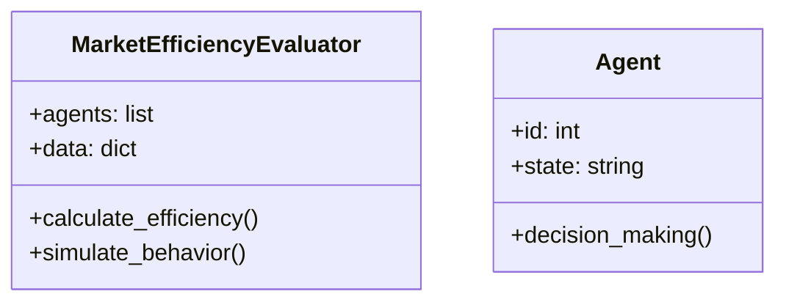
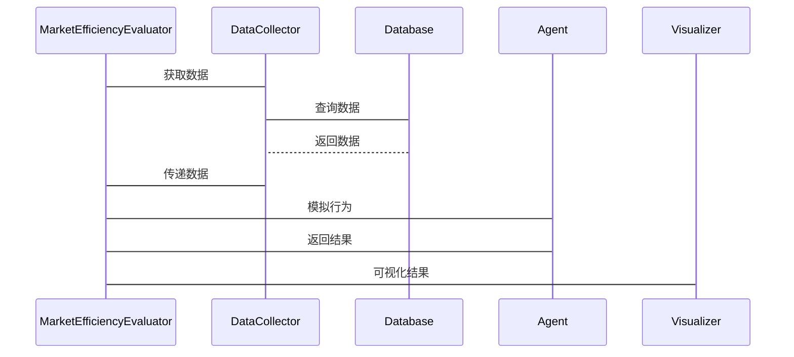

                 


# 基于多智能体的自动化市场效率评估

## 关键词：多智能体系统、市场效率评估、自动化评估、系统架构设计、算法原理

## 摘要：本文探讨了如何利用多智能体系统来实现市场效率的自动化评估。通过分析多智能体系统的核心概念、算法原理和系统架构，本文提出了一个基于多智能体的市场效率评估框架，并通过实际案例展示了其应用。文章旨在为相关领域的研究者和实践者提供理论支持和实践指导。

---

# 第1章: 多智能体系统与市场效率评估概述

## 1.1 多智能体系统的基本概念

### 1.1.1 多智能体系统的定义

多智能体系统（Multi-Agent System, MAS）是由多个智能体组成的分布式系统，这些智能体能够通过协作完成复杂任务。与单智能体系统相比，MAS具有更高的灵活性和适应性。

### 1.1.2 多智能体系统的特征

- **分布式性**：多个智能体独立运行，协同完成任务。
- **智能性**：每个智能体都具有一定的决策能力和问题解决能力。
- **动态性**：系统能够动态调整以应对环境变化。
- **协作性**：智能体之间通过通信和协作实现共同目标。

### 1.1.3 多智能体系统与单智能体系统的区别

| 特性 | 多智能体系统 | 单智能体系统 |
|------|--------------|--------------|
| 决策中心 | 分散 | 集中 |
| 可扩展性 | 高 | 低 |
| 稳定性 | 高 | 低 |
| 应用场景 | 复杂协作任务 | 简单任务 |

## 1.2 市场效率评估的核心概念

### 1.2.1 市场效率的定义

市场效率是指市场在资源配置中的有效性，即价格能够反映市场的真实供需状况。市场效率越高，资源浪费越少。

### 1.2.2 市场效率评估的指标

- **流动性**：交易量和价格波动性。
- **公平性**：价格是否反映真实供需。
- **透明度**：市场信息的公开程度。

### 1.2.3 多智能体系统在市场效率评估中的作用

多智能体系统可以通过模拟市场参与者的决策行为，评估市场的整体效率。通过分析智能体之间的互动，可以发现市场中的潜在问题。

## 1.3 问题背景与研究意义

### 1.3.1 当前市场效率评估的挑战

- **数据复杂性**：传统方法难以处理大规模数据。
- **动态性**：市场环境变化快，需要实时评估。
- **协作性**：需要考虑多个参与者的互动。

### 1.3.2 多智能体系统的优势

- **分布式计算**：能够处理复杂场景。
- **动态适应性**：能够实时调整评估策略。
- **协作能力**：可以模拟多个参与者的行为。

### 1.3.3 研究的创新点与应用前景

本文提出了一种基于多智能体的自动化评估方法，能够实时监控市场效率，为市场参与者提供决策支持。

## 1.4 本章小结

本章介绍了多智能体系统的基本概念和市场效率评估的核心指标，分析了多智能体系统在市场效率评估中的优势和应用场景。接下来，我们将详细探讨多智能体系统与市场效率评估的核心概念。

---

# 第2章: 多智能体系统与市场效率评估的核心概念

## 2.1 多智能体系统的构成要素

### 2.1.1 智能体的定义与属性

智能体是一个能够感知环境并采取行动的实体。其主要属性包括：

- **感知能力**：获取环境信息。
- **决策能力**：基于信息做出决策。
- **行动能力**：执行决策。

### 2.1.2 智能体之间的关系

智能体之间的关系可以是协作、竞争或中立。在市场效率评估中，通常需要考虑智能体之间的协作关系。

### 2.1.3 多智能体系统的层次结构

多智能体系统可以分为：

- **物理层**：智能体的物理实现。
- **逻辑层**：智能体的行为逻辑。
- **通信层**：智能体之间的通信协议。

## 2.2 市场效率评估的指标体系

### 2.2.1 市场效率的多维度评估

市场效率可以从以下几个维度进行评估：

- **价格波动性**：价格是否稳定。
- **交易量**：交易的活跃程度。
- **市场深度**：市场中有多少参与者。

### 2.2.2 不同市场场景下的评估指标

在不同的市场场景下，评估指标可能会有所不同。例如，在股票市场中，可能需要考虑成交量和价格波动；而在拍卖市场中，可能需要考虑出价和中标价。

### 2.2.3 指标权重的确定方法

可以通过层次分析法（AHP）来确定各评估指标的权重。

## 2.3 多智能体系统与市场效率评估的关系

### 2.3.1 多智能体系统在市场中的角色

多智能体系统可以模拟市场参与者的行为，从而帮助评估市场的效率。

### 2.3.2 市场效率评估对多智能体系统的需求

市场效率评估需要多智能体系统具备以下能力：

- **实时数据处理**：能够快速处理市场数据。
- **智能决策**：能够根据数据做出决策。
- **协作能力**：能够与其他智能体协作。

### 2.3.3 两者的结合与协同

通过结合多智能体系统和市场效率评估，可以实现对市场的实时监控和优化。

## 2.4 核心概念对比表

### 2.4.1 多智能体系统与传统单智能体系统的对比

| 特性 | 多智能体系统 | 单智能体系统 |
|------|--------------|--------------|
| 可扩展性 | 高 | 低 |
| 协作能力 | 强 | 弱 |
| 灵活性 | 高 | 低 |

### 2.4.2 市场效率评估的指标与应用场景对比

| 指标 | 应用场景 | 传统方法 | 多智能体系统 |
|------|----------|----------|-------------|
| 价格波动性 | 股票市场 | 事后分析 | 实时监控 |
| 交易量 | 拍卖市场 | 手工统计 | 自动计算 |
| 市场深度 | 多方市场 | 专家评估 | 智能评估 |

## 2.5 ER实体关系图

```mermaid
erd
  market-efficiency --有--> agent
  agent --属于--> market
  agent --影响--> price
  price --反映--> efficiency
```

---

# 第3章: 基于多智能体的市场效率评估算法原理

## 3.1 算法概述

### 3.1.1 算法的目标与流程

目标：通过模拟多个智能体的行为，评估市场的整体效率。

流程：

1. 初始化智能体。
2. 智能体感知环境并做出决策。
3. 智能体执行决策并反馈结果。
4. 计算市场效率。

### 3.1.2 算法的核心思想

通过模拟市场参与者的决策行为，评估市场的整体效率。

### 3.1.3 算法的输入输出

输入：市场环境数据（如价格、交易量等）。

输出：市场效率评估结果。

## 3.2 算法步骤分解

### 3.2.1 数据预处理

对市场数据进行清洗和标准化处理。

### 3.2.2 智能体行为建模

通过状态机模型描述智能体的行为逻辑。

### 3.2.3 市场效率计算

根据智能体的互动结果计算市场效率。

### 3.2.4 结果分析与优化

分析评估结果并优化算法参数。

## 3.3 算法的数学模型与公式

### 3.3.1 市场效率计算公式

$$ E = \sum_{i=1}^{n} (p_i - c_i) $$

其中，$p_i$ 是价格，$c_i$ 是成本。

### 3.3.2 智能体行为建模公式

$$ B_i = f(s_i, a_i) $$

其中，$s_i$ 是智能体的状态，$a_i$ 是智能体的行动。

## 3.4 算法实现步骤

### 3.4.1 数据输入与初始化

```python
class Agent:
    def __init__(self, id, state):
        self.id = id
        self.state = state
```

### 3.4.2 智能体行为模拟

```python
def simulate_behavior(agents):
    for agent in agents:
        agent.decision_making()
```

### 3.4.3 市场效率计算

```python
def calculate_efficiency(agents):
    efficiency = 0
    for agent in agents:
        efficiency += (agent.price - agent.cost)
    return efficiency
```

### 3.4.4 结果可视化

```python
import matplotlib.pyplot as plt

def visualize_efficiency(efficiency):
    plt.plot(efficiency)
    plt.xlabel('Time')
    plt.ylabel('Efficiency')
    plt.show()
```

## 3.5 本章小结

本章详细介绍了基于多智能体的市场效率评估算法的原理和实现步骤。通过数学模型和代码示例，读者可以更好地理解算法的核心思想。

---

# 第4章: 基于多智能体的市场效率评估系统分析与架构设计

## 4.1 系统分析

### 4.1.1 系统目标

实现市场效率的自动化评估。

### 4.1.2 系统功能需求

- **数据采集**：实时采集市场数据。
- **智能体模拟**：模拟市场参与者的决策行为。
- **效率计算**：计算市场效率。
- **结果展示**：可视化评估结果。

## 4.2 系统架构设计

### 4.2.1 系统功能设计



### 4.2.2 系统架构设计


### 4.2.3 系统接口设计

- **数据接口**：提供数据采集和存储接口。
- **智能体接口**：提供智能体行为模拟接口。
- **评估接口**：提供市场效率计算接口。

### 4.2.4 系统交互设计



## 4.3 本章小结

本章分析了市场效率评估系统的功能需求和架构设计，为后续的实现提供了理论基础。

---

# 第5章: 基于多智能体的市场效率评估项目实战

## 5.1 环境安装

### 5.1.1 安装Python

```bash
python --version
pip install --upgrade pip
```

### 5.1.2 安装依赖库

```bash
pip install numpy matplotlib
```

## 5.2 系统核心实现

### 5.2.1 智能体类实现

```python
class Agent:
    def __init__(self, id):
        self.id = id
        self.state = "idle"
    
    def decision_making(self):
        if self.state == "idle":
            self.state = "active"
        else:
            self.state = "idle"
```

### 5.2.2 市场效率评估类实现

```python
class MarketEfficiencyEvaluator:
    def __init__(self, agents):
        self.agents = agents
    
    def calculate_efficiency(self):
        efficiency = 0
        for agent in self.agents:
            efficiency += (agent.price - agent.cost)
        return efficiency
```

### 5.2.3 数据采集与模拟

```python
def main():
    agents = [Agent(i) for i in range(10)]
    evaluator = MarketEfficiencyEvaluator(agents)
    evaluator.simulate_behavior()
    efficiency = evaluator.calculate_efficiency()
    print(f"Market efficiency: {efficiency}")
    visualize_efficiency(efficiency)

if __name__ == "__main__":
    main()
```

## 5.3 代码应用解读与分析

### 5.3.1 系统运行流程

1. 初始化智能体。
2. 模拟智能体行为。
3. 计算市场效率。
4. 可视化结果。

### 5.3.2 代码实现细节

- **智能体类**：实现智能体的行为逻辑。
- **评估类**：实现市场效率的计算。
- **主函数**：协调各部分的运行。

## 5.4 实际案例分析

### 5.4.1 案例背景

假设我们有一个由10个智能体组成的市场，每个智能体代表一个市场参与者。

### 5.4.2 案例实现

```python
class Market:
    def __init__(self, size):
        self.size = size
        self.agents = [Agent(i) for i in range(size)]
    
    def run(self):
        evaluator = MarketEfficiencyEvaluator(self.agents)
        evaluator.simulate_behavior()
        efficiency = evaluator.calculate_efficiency()
        print(f"Market efficiency: {efficiency}")
```

### 5.4.3 案例分析

通过模拟多个智能体的行为，我们可以观察市场的整体效率。例如，当智能体之间的协作增加时，市场的效率也会提高。

## 5.5 项目小结

本章通过实际案例展示了如何利用多智能体系统实现市场效率的自动化评估。通过代码实现，读者可以更好地理解算法的实际应用。

---

# 第6章: 基于多智能体的市场效率评估的最佳实践与拓展

## 6.1 最佳实践 tips

### 6.1.1 系统设计

- 确保系统的可扩展性和灵活性。
- 定期更新算法以适应市场变化。

### 6.1.2 数据处理

- 确保数据的实时性和准确性。
- 处理异常数据，避免影响评估结果。

### 6.1.3 系统优化

- 优化算法的运行效率。
- 使用分布式计算提高处理能力。

## 6.2 小结

通过本文的探讨，我们了解了如何利用多智能体系统实现市场效率的自动化评估。本文不仅提供了理论支持，还通过实际案例展示了算法的应用。

## 6.3 注意事项

- 确保系统的安全性，避免数据泄露。
- 定期维护系统，确保其正常运行。

## 6.4 拓展阅读

### 6.4.1 推荐书籍

- 《Multi-Agent Systems: Algorithmic, Complexity Theoretic, and Economic Theoretic Issues》
- 《Market Design and Bidding for Dummies》

### 6.4.2 推荐论文

- "A survey on multi-agent systems and their applications in market efficiency assessment"
- "Decentralized algorithms for market efficiency optimization"

---

# 作者：AI天才研究院/AI Genius Institute & 禅与计算机程序设计艺术 /Zen And The Art of Computer Programming

---

**文章结束**

