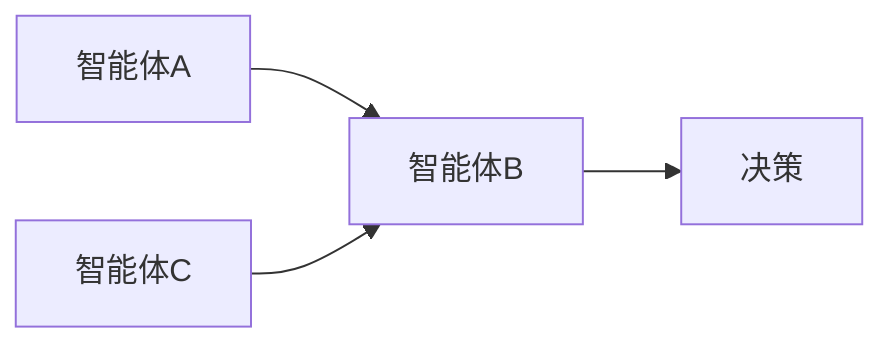
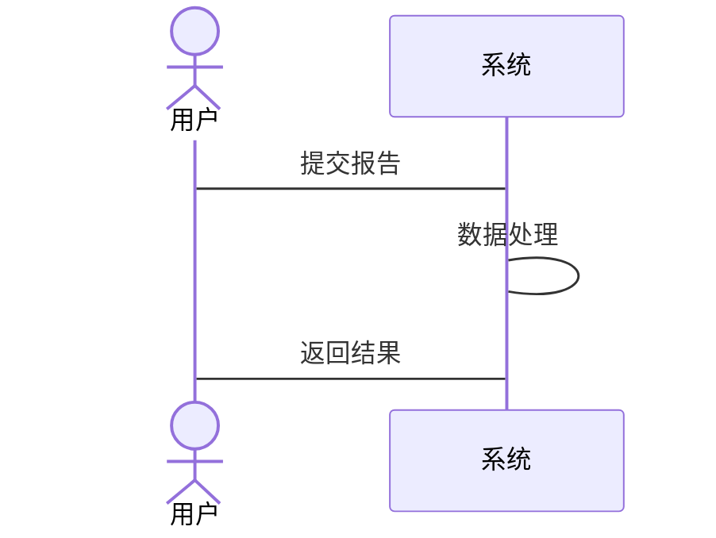

                 


# 基于多智能体的自动化年报和季报分析系统

> 关键词：多智能体系统，自动化分析，财务报告，协作机制，强化学习

> 摘要：本文探讨了基于多智能体的自动化年报和季报分析系统的设计与实现。系统利用多智能体协同技术，结合强化学习算法，实现了对财务数据的高效分析和决策支持。通过模块化设计和系统架构优化，确保了系统的可扩展性和高性能。

---

## 目录大纲：基于多智能体的自动化年报和季报分析系统

---

### 第一部分：背景与基础

#### 第1章：多智能体系统概述

##### 1.1 多智能体系统的基本概念
- 1.1.1 智能体的定义与特征
- 1.1.2 多智能体系统的定义与特点
- 1.1.3 多智能体系统的应用场景

##### 1.2 自动化年报和季报分析的背景
- 1.2.1 财务报告分析的传统方法
- 1.2.2 自动化分析的需求与挑战
- 1.2.3 多智能体系统在财务分析中的优势

##### 1.3 问题背景与目标
- 1.3.1 问题背景分析
- 1.3.2 问题描述与解决思路
- 1.3.3 系统的边界与外延

---

### 第二部分：系统核心概念与联系

#### 第2章：核心概念与原理

##### 2.1 多智能体系统的组成与功能
- 2.1.1 智能体的类型与角色
- 2.1.2 智能体之间的协作机制
- 2.1.3 系统的核心功能模块

##### 2.2 财务报告分析的流程与模型
- 2.2.1 财务数据的特征与结构
- 2.2.2 自动化分析的关键步骤
- 2.2.3 基于多智能体的分析模型

##### 2.3 核心概念的ER实体关系图
```mermaid
er
actor: 用户
goal: 自动化分析
system: 多智能体系统
```

---

### 第三部分：算法原理与实现

#### 第3章：多智能体协同算法

##### 3.1 任务分配与协作机制
- 3.1.1 任务分配算法
- 3.1.2 协作机制的设计
- 3.1.3 冲突解决策略

##### 3.2 基于强化学习的智能体训练


##### 3.3 算法的数学模型
- 3.3.1 任务分配的数学模型
  $$ \text{目标函数} = \sum_{i=1}^{n} w_i x_i $$
- 3.3.2 协作机制的数学公式
  $$ P(\text{协作成功}) = \prod_{i=1}^{m} p_i $$

---

### 第四部分：系统分析与架构设计

#### 第4章：系统功能设计

##### 4.1 系统功能概述
- 4.1.1 数据采集模块
- 4.1.2 数据处理模块
- 4.1.3 分析与决策模块
- 4.1.4 用户界面模块

##### 4.2 系统的架构设计


##### 4.3 系统接口设计
- 4.3.1 数据接口
- 4.3.2 用户接口
- 4.3.3 第三方服务接口

##### 4.4 系统交互流程


---

### 第五部分：项目实战

#### 第5章：项目实现

##### 5.1 环境配置
- 5.1.1 安装必要的库和工具
- 5.1.2 系统部署与测试环境配置

##### 5.2 核心代码实现
```python
# 多智能体协作算法实现
class Agent:
    def __init__(self, id):
        self.id = id
        self.state = None
    def receive_task(self, task):
        self.task = task
    def collaborate(self):
        # 协作逻辑
        pass
```

##### 5.3 实际案例分析
- 5.3.1 案例背景介绍
- 5.3.2 数据准备与预处理
- 5.3.3 系统运行与结果分析

##### 5.4 系统优化与改进
- 5.4.1 性能优化建议
- 5.4.2 功能扩展方向
- 5.4.3 系统维护与更新

---

### 第六部分：总结与展望

#### 第6章：总结与展望

##### 6.1 系统总结
- 6.1.1 系统的主要功能与特点
- 6.1.2 系统的优势与不足

##### 6.2 未来展望
- 6.2.1 技术发展的趋势
- 6.2.2 系统的潜在应用场景
- 6.2.3 可能的改进方向

---

## 作者：AI天才研究院 & 禅与计算机程序设计艺术

