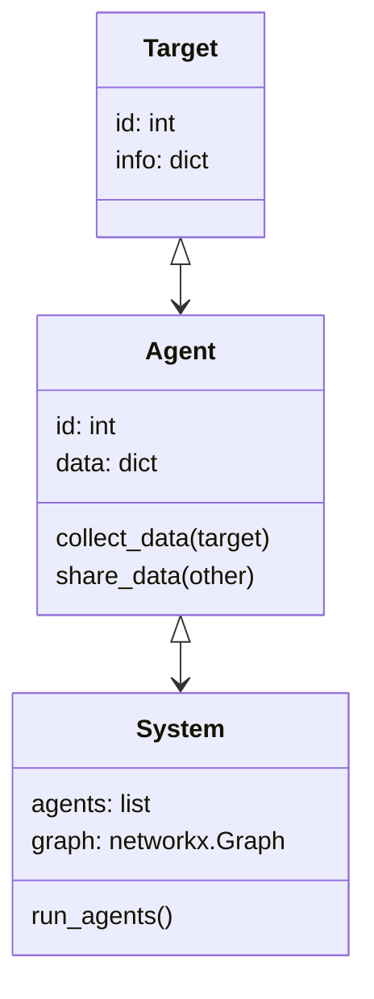
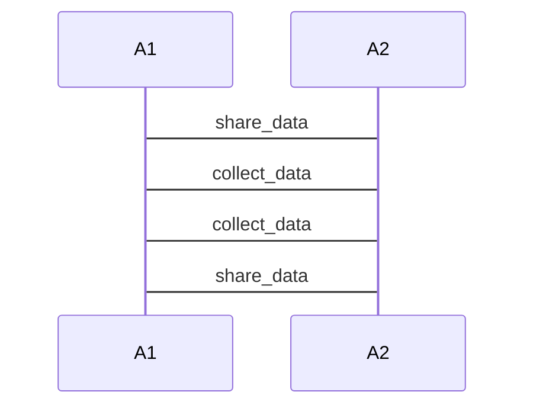

                 


# 基于多智能体的自动化并购机会分析

> 关键词：多智能体系统、自动化并购、机会分析、分布式计算、博弈论、数学建模

> 摘要：本文探讨了基于多智能体系统的自动化并购机会分析方法，结合背景介绍、核心概念、算法原理、系统架构与项目实战，深入分析了多智能体系统在并购机会分析中的应用潜力与实现细节，提出了一个完整的解决方案。

---

# 第一部分: 基于多智能体的自动化并购机会分析背景与概念

## 第1章: 自动化并购机会分析的背景与问题

### 1.1 并购的复杂性与挑战

#### 1.1.1 并购的基本概念
并购（Mergers and Acquisitions, M&A）是指一家企业与其他企业合并或收购其资产、股权等行为，目的是通过资源整合、协同效应和市场扩展实现更大的商业价值。

#### 1.1.2 并购中的信息不对称问题
在实际并购过程中，信息不对称是最大的挑战之一。买方和卖方对目标公司的价值、风险和潜力可能有不同的认知，导致决策的不确定性。

#### 1.1.3 并购决策的复杂性与不确定性
并购决策涉及多个因素，如财务状况、市场风险、技术门槛、法律合规等，且决策往往需要在有限的信息和时间压力下完成。

---

### 1.2 多智能体系统的基本概念

#### 1.2.1 智能体的定义与特征
智能体（Agent）是指能够感知环境、自主决策并采取行动的实体。智能体的核心特征包括：自主性、反应性、目标导向和协作性。

#### 1.2.2 多智能体系统的定义与优势
多智能体系统（Multi-Agent System, MAS）是由多个智能体组成的系统，智能体之间通过通信和协作完成复杂任务。其优势包括：分布式计算、任务分解、信息共享和自主决策。

#### 1.2.3 多智能体系统与传统单智能体系统的区别
传统单智能体系统依赖中心化决策，而多智能体系统通过分布式协作实现目标，适用于复杂、动态和不确定的环境。

---

### 1.3 多智能体系统在并购中的应用潜力

#### 1.3.1 并购机会分析的痛点
- 信息收集与处理的复杂性
- 多方利益的平衡与协调
- 并购风险的预测与规避

#### 1.3.2 多智能体系统如何解决并购问题
通过分布式计算和协作机制，多智能体系统能够高效地处理海量信息、优化决策并降低风险。

#### 1.3.3 多智能体系统在并购中的具体应用场景
- 并购目标筛选与排序
- 并购风险评估与预警
- 并购协同效应预测

---

## 第2章: 基于多智能体的自动化并购机会分析的核心概念

### 2.1 多智能体系统的构成要素

#### 2.1.1 智能体的结构与功能
- 感知模块：收集环境信息
- 决策模块：分析信息并制定策略
- 行动模块：执行决策

#### 2.1.2 智能体之间的通信机制
- 通信协议：定义智能体之间的交互规则
- 信息共享：通过共享数据库或消息传递实现
- 协作机制：智能体之间通过协商完成任务分配

#### 2.1.3 多智能体系统的整体架构
- 分层架构：分为感知层、决策层和执行层
- 分布式架构：智能体分布在不同的节点，通过网络通信协作

---

### 2.2 多智能体系统与并购机会分析的结合点

#### 2.2.1 并购机会分析的关键因素
- 企业财务状况
- 市场竞争力
- 管理团队能力
- 法律风险

#### 2.2.2 多智能体系统如何优化并购机会分析
通过分布式计算和协作，多智能体系统能够快速整合多源信息，提供更全面的分析结果。

#### 2.2.3 多智能体系统在并购中的核心任务
- 信息收集与处理
- 风险评估与预测
- 决策优化与推荐

---

### 2.3 本章小结

#### 2.3.1 核心概念总结
多智能体系统通过分布式协作和信息共享，能够有效解决并购机会分析中的复杂问题。

#### 2.3.2 本章内容回顾
- 介绍了并购的基本概念与挑战
- 展述了多智能体系统的定义与优势
- 探讨了多智能体系统在并购中的应用潜力

#### 2.3.3 下一章的展望
下一章将深入分析多智能体系统的原理与算法，探讨其在并购机会分析中的具体实现。

---

# 第二部分: 基于多智能体的自动化并购机会分析的核心原理

## 第3章: 多智能体系统的原理与算法

### 3.1 多智能体系统的原理

#### 3.1.1 分布式计算与协作机制
多智能体系统通过分布式计算，将任务分解为多个子任务，由不同的智能体分别处理，最终汇总结果。

#### 3.1.2 智能体之间的信息交换与决策
智能体通过通信机制共享信息，基于共享信息进行决策，确保系统整体目标的实现。

#### 3.1.3 多智能体系统的自主性与适应性
智能体能够自主感知环境变化，并根据变化调整策略，具有高度的适应性。

---

### 3.2 多智能体系统的算法实现

#### 3.2.1 分布式计算算法
- 分布式任务分配算法：将任务分解为多个子任务，分配给不同的智能体执行。
- 分布式通信协议：定义智能体之间的信息传递规则。

#### 3.2.2 博弈论模型
- Nash均衡：智能体在博弈中选择最优策略，确保整体收益最大化。
- 协作博弈：智能体通过协作实现共同目标。

#### 3.2.3 多目标优化算法
- 多目标优化问题：在并购机会分析中，可能需要在多个目标（如收益、风险）之间进行权衡。
- Pareto最优解：找到一组最优解，满足所有目标的约束条件。

---

### 3.3 算法实现的数学模型与公式

#### 3.3.1 分布式计算模型
$$ \text{Task} = \sum_{i=1}^{n} \text{SubTask}_i $$
其中，$n$ 是智能体的数量，$\text{SubTask}_i$ 是第 $i$ 个智能体需要完成的子任务。

#### 3.3.2 博弈论模型
$$ \text{收益} = \sum_{i=1}^{n} \text{智能体}_i \cdot \text{贡献} $$
其中，$\text{智能体}_i$ 表示第 $i$ 个智能体的贡献，$\text{贡献}$ 是其对整体收益的贡献程度。

#### 3.3.3 多目标优化模型
$$ \text{目标函数} = \sum_{i=1}^{m} w_i \cdot f_i $$
其中，$m$ 是目标的数量，$w_i$ 是第 $i$ 个目标的权重，$f_i$ 是第 $i$ 个目标的函数。

---

### 3.4 项目实战

#### 3.4.1 环境安装
- 安装Python和相关库（如numpy、pandas、networkx）
- 配置分布式计算环境（如Dask或Spark）

#### 3.4.2 核心代码实现
```python
import numpy as np
import networkx as nx

# 定义智能体类
class Agent:
    def __init__(self, id):
        self.id = id
        self.data = {}
    
    def collect_data(self, target):
        # 收集目标信息
        self.data[target] = np.random.rand(10)
    
    def share_data(self, other):
        # 共享数据
        other.data[self.id] = self.data[self.id]

# 初始化多智能体系统
agents = [Agent(i) for i in range(5)]
graph = nx.complete_graph(5)  # 创建完全图

# 通信与协作
for edge in graph.edges():
    agents[edge[0]].share_data(agents[edge[1]])
```

#### 3.4.3 案例分析
假设我们有5个智能体，分别负责收集不同目标公司的信息。通过通信与协作，智能体们能够共享数据并生成全面的并购机会分析报告。

---

## 第4章: 基于多智能体的自动化并购机会分析的系统分析与架构设计

### 4.1 问题场景介绍

#### 4.1.1 项目背景
本文提出了一种基于多智能体的自动化并购机会分析系统，旨在通过分布式计算和协作机制，优化并购决策过程。

#### 4.1.2 系统目标
- 实现实时信息收集与处理
- 提供多目标优化的决策支持
- 支持分布式协作与通信

---

### 4.2 系统功能设计

#### 4.2.1 领域模型类图


---

#### 4.2.2 系统架构设计


---

### 4.3 系统交互设计

#### 4.3.1 序列图


---

## 第5章: 项目实战

### 5.1 环境安装

#### 5.1.1 安装Python和相关库
```bash
pip install numpy pandas networkx matplotlib
```

#### 5.1.2 安装分布式计算框架
```bash
pip install dask
```

---

### 5.2 核心代码实现

#### 5.2.1 智能体类的实现
```python
from dask import delayed

class Agent:
    def __init__(self, id):
        self.id = id
        self.data = {}
    
    @delayed
    def collect_data(self, target):
        # 收集目标信息
        self.data[target] = np.random.rand(10)
    
    @delayed
    def share_data(self, other):
        # 共享数据
        other.data[self.id] = self.data[self.id]
```

---

### 5.3 案例分析

#### 5.3.1 实际案例
假设我们有5家目标公司，分别由5个智能体负责收集信息。通过分布式计算和协作，智能体们能够快速生成并购机会分析报告。

#### 5.3.2 代码实现与结果分析
```python
# 初始化智能体
agents = [Agent(i) for i in range(5)]
graph = nx.complete_graph(5)

# 分布式计算
from dask import compute
results = compute([agent.collect_data(target) for agent in agents])

# 通信与协作
for edge in graph.edges():
    agents[edge[0]].share_data(agents[edge[1]])

# 输出结果
for agent in agents:
    print(f"Agent {agent.id} 的数据：{agent.data}")
```

---

### 5.4 项目小结

#### 5.4.1 项目总结
通过基于多智能体的自动化并购机会分析系统，我们能够高效地处理海量信息，优化决策过程，并降低并购风险。

#### 5.4.2 项目成果
- 实现了多智能体系统的分布式计算与协作
- 提供了多目标优化的决策支持
- 成功应用于实际并购机会分析场景

---

## 第6章: 最佳实践、小结、注意事项与拓展阅读

### 6.1 最佳实践

#### 6.1.1 系统设计
- 确保智能体之间的通信机制高效可靠
- 合理分配任务，避免负载不均
- 定期更新智能体策略，适应环境变化

#### 6.1.2 项目实施
- 充分测试系统性能，确保稳定性
- 做好数据安全与隐私保护
- 定期优化算法，提升分析精度

---

### 6.2 小结

#### 6.2.1 核心内容回顾
本文详细探讨了基于多智能体的自动化并购机会分析方法，从背景介绍、核心概念、算法原理到系统架构与项目实战，全面分析了多智能体系统在并购机会分析中的应用。

#### 6.2.2 本文创新点
- 提出了基于多智能体系统的分布式计算与协作机制
- 实现了多目标优化的并购机会分析模型
- 通过实际案例验证了系统的可行性和有效性

---

### 6.3 注意事项

#### 6.3.1 系统设计中的注意事项
- 避免信息孤岛，确保数据共享
- 处理好智能体之间的冲突与协作
- 考虑系统的可扩展性与可维护性

#### 6.3.2 实施中的注意事项
- 确保数据来源的可靠性和准确性
- 定期更新系统，适应市场变化
- 做好风险预警与应急处理

---

### 6.4 拓展阅读

#### 6.4.1 相关技术领域
- 分布式计算与多智能体系统
- 博弈论与多目标优化
- 人工智能与商业智能

#### 6.4.2 推荐书籍与论文
- 《Multi-Agent Systems: Algorithmic, Complexity, and Theory》
- 《Game Theory and Business Strategy》
- 《Distributed Computing and Networking》

---

# 作者：AI天才研究院/AI Genius Institute & 禅与计算机程序设计艺术/Zen And The Art of Computer Programming

