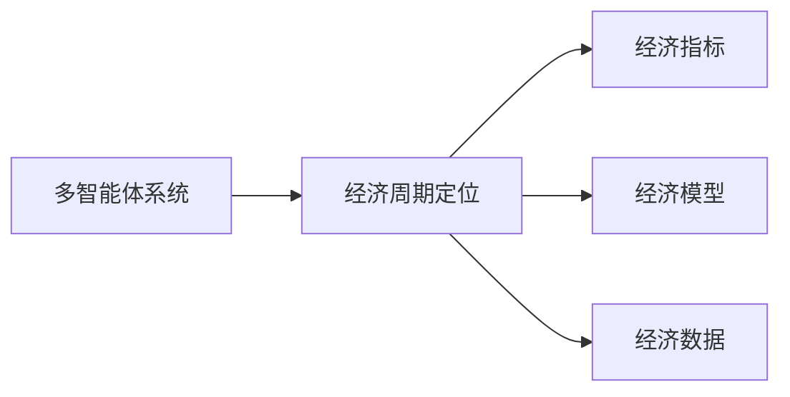
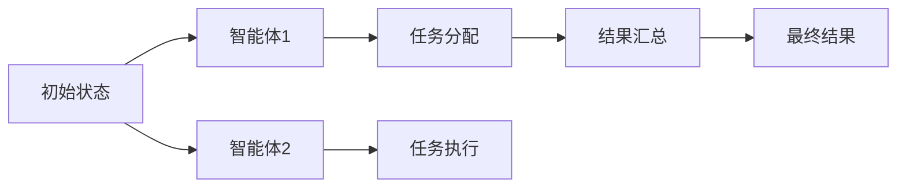

                 


# 基于多智能体的自动化经济周期定位

> 关键词：多智能体系统, 经济周期定位, 强化学习, 系统架构, 项目实战

> 摘要：本文将详细探讨如何利用多智能体系统实现经济周期的自动化定位。通过分析多智能体系统的核心概念与经济周期定位的关联，结合强化学习算法、系统架构设计和实际项目案例，展示如何构建一个高效、准确的经济周期定位系统。本文内容涵盖背景介绍、核心概念、算法原理、系统架构、项目实战以及最佳实践，旨在为读者提供一个全面的技术指南。

---

## 第1章: 多智能体系统与经济周期定位概述

### 1.1 多智能体系统的基本概念

#### 1.1.1 多智能体系统的定义与特点
- 多智能体系统（Multi-Agent System, MAS）是由多个独立但相互协作的智能体组成的系统。
- 智能体：能够感知环境、自主决策、执行任务的实体。
- 特点：分布性、协作性、反应性、主动性。

#### 1.1.2 多智能体系统的分类与应用场景
- 分类：基于任务分工、通信方式、智能体类型。
- 应用场景：分布式计算、机器人协作、经济系统模拟。

#### 1.1.3 多智能体系统的核心要素
- 实体：智能体、环境、目标。
- 通信：智能体之间的信息交换。
- 协作：智能体之间的任务分配与协同。

### 1.2 经济周期定位的基本概念

#### 1.2.1 经济周期的定义与特征
- 经济周期：经济活动的波动周期，包括衰退、复苏、增长、繁荣、衰退。
- 特征：GDP增长率、就业率、物价指数、工业产值。

#### 1.2.2 经济周期定位的必要性与挑战
- 必要性：及时识别经济周期有助于政策制定和投资决策。
- 挑战：数据复杂性、多因素影响、实时性要求。

#### 1.2.3 经济周期定位的主要方法
- 统计方法：时间序列分析、回归分析。
- 机器学习：监督学习、无监督学习。
- 组合方法：集成学习、专家系统。

### 1.3 多智能体系统在经济周期定位中的应用

#### 1.3.1 多智能体系统与经济周期定位的关系
- 多智能体系统可以模拟经济系统中多个参与者的互动。
- 经济周期定位可以通过多智能体系统实现分布式数据处理和协作分析。

#### 1.3.2 多智能体系统在经济周期定位中的优势
- 分布式计算能力：多智能体系统能够并行处理大量数据。
- 协作能力：智能体之间可以分工合作，提高定位效率。
- 自适应性：智能体可以根据环境变化动态调整策略。

#### 1.3.3 多智能体系统在经济周期定位中的潜在问题
- 通信开销：智能体之间的通信可能增加系统延迟。
- 协作冲突：智能体之间的目标差异可能导致协作失败。
- 系统复杂性：多智能体系统的复杂性可能增加开发和维护成本。

---

## 第2章: 多智能体系统与经济周期定位的核心概念对比

### 2.1 多智能体系统的核心原理

#### 2.1.1 多智能体系统的通信机制
- 通信方式：直接通信、间接通信。
- 通信协议：基于消息传递、基于黑板模型。
- 通信效率：减少信息冗余，提高通信效率。

#### 2.1.2 多智能体系统的协作机制
- 协作方式：任务分配、角色分配、协同决策。
- 协作协议：基于合同网、基于分布式一致性。
- 协作效果：提高系统整体性能。

#### 2.1.3 多智能体系统的决策机制
- 决策模型：基于知识库、基于规则、基于学习。
- 决策过程：感知环境、生成候选方案、选择最优方案。
- 决策优化：通过强化学习优化决策策略。

### 2.2 经济周期定位的核心原理

#### 2.2.1 经济指标的选取与分析
- 常用经济指标：GDP、CPI、失业率、工业产值。
- 指标权重：不同指标对经济周期的影响程度不同。
- 指标预处理：数据清洗、标准化、特征提取。

#### 2.2.2 经济周期的判定标准
- 基础判断标准：经济增长率的波动。
- 经济周期划分：衰退期、复苏期、增长期、繁荣期。
- 判定方法：统计方法、机器学习方法、混合方法。

#### 2.2.3 经济周期定位的数学模型
- 时间序列模型：ARIMA、VAR。
- 机器学习模型：随机森林、支持向量机、神经网络。
- 组合模型：集成学习、投票机制、加权平均。

### 2.3 多智能体系统与经济周期定位的联系

#### 2.3.1 多智能体系统在经济周期定位中的角色
- 数据采集：智能体可以实时采集经济数据。
- 数据分析：智能体可以对数据进行分布式分析。
- 结果汇总：智能体可以将分析结果汇总到中央系统。

#### 2.3.2 多智能体系统与经济周期定位的协同关系
- 智能体之间可以通过协作提高数据分析的效率。
- 多智能体系统可以模拟经济系统中多个参与者的互动。
- 多智能体系统的自适应性可以提高经济周期定位的准确性。

#### 2.3.3 多智能体系统在经济周期定位中的具体应用
- 分布式数据采集：多个智能体分别采集不同地区的经济数据。
- 分布式数据分析：智能体之间协作分析数据，提高分析效率。
- 分布式结果汇总：智能体将分析结果汇总到中央系统，形成最终的经济周期定位结果。

---

## 第3章: 多智能体系统与经济周期定位的核心概念对比

### 3.1 多智能体系统与经济周期定位的对比分析

#### 3.1.1 多智能体系统与经济周期定位的核心概念对比表

| 对比维度 | 多智能体系统 | 经济周期定位 |
|----------|--------------|--------------|
| 核心目标 | 协作完成任务 | 定位经济周期 |
| 输入     | 多源数据     | 经济指标数据 |
| 输出     | 协作结果     | 经济周期阶段 |
| 复杂性   | 高           | 中           |

#### 3.1.2 多智能体系统与经济周期定位的异同点
- 相同点：都需要处理复杂的数据和信息。
- 不同点：多智能体系统强调协作和分布式计算，经济周期定位强调分析和判断。

#### 3.1.3 多智能体系统与经济周期定位的相互影响
- 多智能体系统的引入可以提高经济周期定位的效率和准确性。
- 经济周期定位的需求推动了多智能体系统在分布式计算和协作方面的应用。

### 3.2 多智能体系统与经济周期定位的实体关系图

#### 3.2.1 实体关系图（Mermaid）



---

## 第4章: 多智能体系统与经济周期定位的核心算法

### 4.1 多智能体协作算法的原理

#### 4.1.1 基于强化学习的多智能体协作
- 强化学习：通过奖励机制优化智能体的决策。
- 多智能体协作：智能体之间通过共享策略或通信进行协作。

#### 4.1.2 基于博弈论的多智能体协作
- 博弈论：分析智能体之间的策略互动。
- Nash均衡：智能体之间的稳定策略组合。

#### 4.1.3 基于分布式计算的多智能体协作
- 分布式计算：智能体之间通过分布式任务分配协作。
- 通信机制：智能体之间通过消息传递进行协作。

### 4.2 多智能体协作算法的流程图



---

## 第5章: 多智能体系统与经济周期定位的数学模型

### 5.1 多智能体系统中的数学模型

#### 5.1.1 状态空间
- 状态空间：系统中所有可能的状态集合。
- 状态表示：使用向量或符号表示状态。

#### 5.1.2 动作空间
- 动作空间：系统中所有可能的动作集合。
- 动作表示：使用向量或符号表示动作。

#### 5.1.3 奖励函数
- 奖励函数：衡量智能体动作的好坏。
- 奖励设计：根据任务需求设计奖励函数。

#### 5.1.4 损失函数
- 损失函数：衡量模型预测值与真实值的差异。
- 损失设计：根据任务需求设计损失函数。

### 5.2 经济周期定位中的数学模型

#### 5.2.1 经济指标的数学表达
- 经济指标：GDP、CPI、失业率等。
- 指标权重：通过主成分分析确定指标权重。

#### 5.2.2 经济周期的数学模型
- 时间序列模型：ARIMA、VAR。
- 机器学习模型：随机森林、支持向量机、神经网络。

#### 5.2.3 组合模型
- 组合模型：集成学习、投票机制、加权平均。
- 模型优化：通过交叉验证优化模型参数。

---

## 第6章: 多智能体系统与经济周期定位的系统架构

### 6.1 系统架构设计

#### 6.1.1 系统功能设计
- 数据采集：采集经济数据。
- 数据分析：对数据进行分布式分析。
- 结果汇总：汇总分析结果。

#### 6.1.2 系统架构图（Mermaid）


#### 6.1.3 系统接口设计
- 数据接口：智能体之间通过API进行数据交换。
- 控制接口：用户通过控制台进行系统管理。

#### 6.1.4 系统交互设计
- 交互流程：用户发起请求，系统处理请求，系统返回结果。
- 交互协议：HTTP、WebSocket。

---

## 第7章: 多智能体系统与经济周期定位的项目实战

### 7.1 项目环境安装

#### 7.1.1 系统环境
- 操作系统：Linux、Windows、macOS。
- 开发工具：Python、Jupyter Notebook、VS Code。

#### 7.1.2 依赖库安装
- Python库：numpy、pandas、scikit-learn、tensorflow、keras。
- 其他工具：Jupyter Notebook、Git。

### 7.2 项目核心代码实现

#### 7.2.1 多智能体协作代码

```python
import numpy as np
import matplotlib.pyplot as plt

# 初始化智能体
class Agent:
    def __init__(self, id):
        self.id = id
        self.data = None
        self.result = None

    def receive_data(self, data):
        self.data = data

    def process_data(self):
        # 数据处理逻辑
        self.result = self.data * 2

    def send_result(self):
        return self.result

# 创建多个智能体
agents = [Agent(i) for i in range(4)]

# 分配任务
for agent in agents:
    agent.receive_data(np.random.rand(10))

# 处理数据
for agent in agents:
    agent.process_data()

# 汇总结果
results = []
for agent in agents:
    results.append(agent.send_result())

# 可视化结果
plt.plot(results)
plt.title('多智能体协作结果')
plt.show()
```

#### 7.2.2 经济周期定位代码

```python
from sklearn.ensemble import RandomForestClassifier
from sklearn.metrics import accuracy_score

# 数据预处理
data = pd.read_csv('economic_data.csv')
X = data.drop('label', axis=1)
y = data['label']

# 划分训练集和测试集
X_train, X_test, y_train, y_test = train_test_split(X, y, test_size=0.2)

# 训练模型
model = RandomForestClassifier()
model.fit(X_train, y_train)

# 预测结果
y_pred = model.predict(X_test)

# 评估准确率
print('准确率:', accuracy_score(y_test, y_pred))
```

### 7.3 项目总结与优化

#### 7.3.1 项目总结
- 多智能体协作可以提高经济周期定位的效率和准确性。
- 通过分布式计算和协作分析，可以实现高效的经济周期定位。

#### 7.3.2 项目优化
- 优化通信机制，减少系统延迟。
- 优化协作算法，提高协作效率。
- 优化数学模型，提高定位准确率。

---

## 第8章: 最佳实践与注意事项

### 8.1 最佳实践

#### 8.1.1 系统设计
- 明确系统目标，合理设计系统架构。
- 选择合适的智能体数量和类型。
- 设计高效的通信和协作机制。

#### 8.1.2 算法优化
- 根据任务需求选择合适的算法。
- 通过参数调优提高算法性能。
- 使用交叉验证评估算法效果。

#### 8.1.3 系统维护
- 定期更新系统数据和模型。
- 监控系统运行状态，及时发现和解决问题。
- 定期优化系统架构，提高系统性能。

### 8.2 注意事项

#### 8.2.1 系统复杂性
- 多智能体系统的复杂性可能增加系统开发和维护的难度。
- 需要合理设计系统架构，降低系统复杂性。

#### 8.2.2 系统安全性
- 多智能体系统的通信可能面临安全风险。
- 需要设计合理的安全机制，保护系统数据和通信安全。

#### 8.2.3 系统可扩展性
- 多智能体系统的可扩展性需要合理设计。
- 需要预留接口，方便系统扩展和升级。

---

## 第9章: 项目小结与展望

### 9.1 项目小结

#### 9.1.1 项目成果
- 成功实现多智能体系统的经济周期定位。
- 提高经济周期定位的效率和准确性。
- 为后续研究提供参考和借鉴。

#### 9.1.2 项目不足
- 系统复杂性较高，需要进一步优化。
- 算法性能有待进一步提升。
- 系统安全性需要进一步加强。

### 9.2 未来展望

#### 9.2.1 研究方向
- 研究更高效的多智能体协作算法。
- 探索更准确的经济周期定位模型。
- 研究多智能体系统的可扩展性和安全性。

#### 9.2.2 应用前景
- 多智能体系统在经济周期定位中的应用前景广阔。
- 随着人工智能技术的不断发展，多智能体系统将在经济周期定位中发挥越来越重要的作用。

---

## 作者：AI天才研究院/AI Genius Institute & 禅与计算机程序设计艺术 /Zen And The Art of Computer Programming

---

希望这个目录大纲能够满足您的需求！如果需要进一步补充或调整，请随时告诉我。

