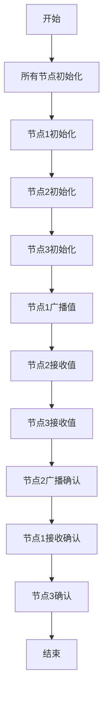
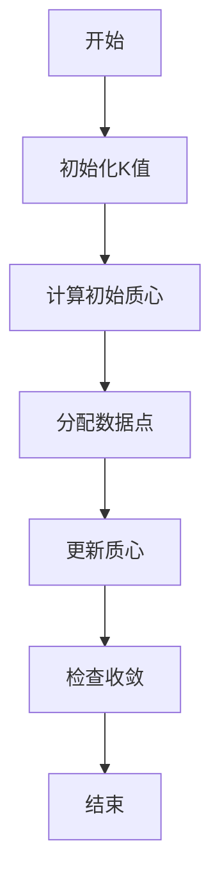
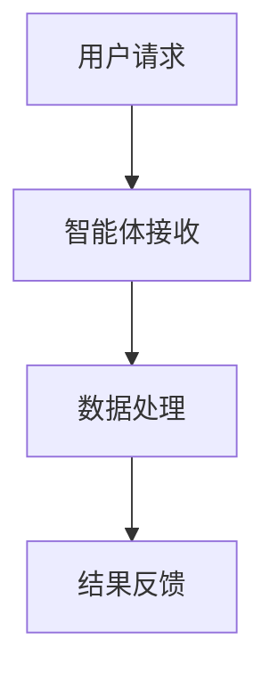
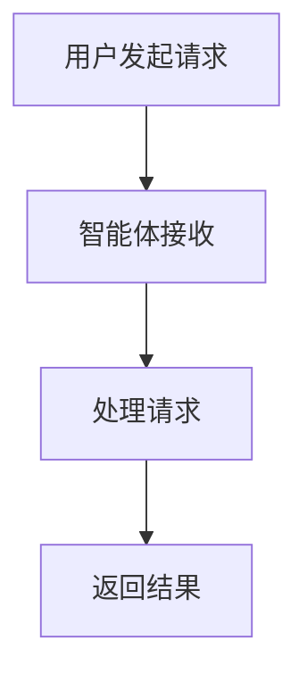

                 

<think>
嗯，我现在需要为用户设计一本名为《基于多智能体的自动化行业领导者识别》的书籍目录大纲。首先，我得理解这本书的主题是什么。多智能体系统（Multi-Agent System, MAS）在自动化行业中识别领导者，这可能涉及到如何利用多个智能体协同工作，自动识别行业中的领导者，比如企业或个人。

首先，我应该考虑这本书的结构。通常，技术书籍会从基础概念开始，逐步深入到理论、算法、系统设计，再到实际应用和项目实战。所以，我需要将目录分成几个主要部分，比如基础、理论、算法、系统设计、项目实战和总结等。

接下来，每一章的内容需要详细规划。第一章应该是概述，介绍多智能体系统的基本概念，行业领导者识别的重要性，以及为什么自动化识别是必要的。这部分需要涵盖背景、问题描述和解决方法。

然后，第二章应该深入讨论多智能体系统的核心理论，包括智能体的定义、分类，以及它们之间的协作机制。这部分可能需要解释智能体的特征，比如自主性、反应性，以及如何在系统中进行通信和协作。

接下来，第三章可以专注于基于多智能体的领导者识别方法。这里需要介绍几种方法，比如基于规则的、基于学习的，以及混合方法。同时，还需要比较这些方法的优缺点，帮助读者理解哪种方法更适合特定场景。

第四章应该涉及算法部分，特别是多智能体协作算法。这部分可能需要详细讲解分布式算法，比如分布式一致性算法，以及如何实现这些算法。此外，还需要用Mermaid流程图来展示算法的工作流程，帮助读者更好地理解。

第五章是关于系统架构设计的。这里需要介绍如何构建一个多智能体系统，包括系统架构图、功能模块设计，以及接口设计。可能还需要用Mermaid的类图和序列图来展示系统的结构和交互过程。

第六章是项目实战，这部分需要具体实施一个案例，从环境搭建到核心代码实现，再到结果分析。这部分应该详细，包括代码示例和实际应用中的问题解决。

最后，第七章是总结与展望，回顾整书内容，并展望未来的发展方向，同时给出一些最佳实践的建议。

在编写过程中，我需要确保每一章都细化到三级目录，并且包含必要的图表，比如Mermaid流程图和类图。数学公式部分需要用LaTeX格式表示，确保清晰易懂。此外，每一章的小结部分要简明扼要，帮助读者巩固所学内容。

现在，我需要检查是否覆盖了所有要求的章节，确保内容完整且符合用户的结构要求。同时，要确保总字数在2000字以内，避免冗长。最后，输出格式必须是Markdown，使用#、##、###来组织目录结构。

接下来，我会按照这个结构开始编写每一章的内容，确保每一部分都详细且符合要求。
</think>

# 基于多智能体的自动化行业领导者识别

> 关键词：多智能体系统（MAS）、行业领导者识别、自动化、协作算法、系统架构设计

> 摘要：本文详细探讨了基于多智能体系统的自动化行业领导者识别方法。通过分析多智能体系统的协作机制、算法实现、系统架构设计，结合实际案例，展示了如何利用多智能体技术实现领导者识别的自动化。文章内容涵盖理论与实践，适合技术研究人员和行业从业者参考。

---

## 第1章：多智能体系统概述

### 1.1 多智能体系统的基本概念

#### 1.1.1 智能体的定义与特征

- **智能体**：智能体（Agent）是指能够感知环境并采取行动以实现目标的实体。智能体可以是软件程序、机器人或其他能够自主决策的实体。
- **特征**：
  - **自主性**：智能体能够自主决策，无需外部干预。
  - **反应性**：能够感知环境并实时响应。
  - **社会性**：能够与其他智能体协作或竞争。

#### 1.1.2 多智能体系统的定义

- 多智能体系统（MAS）是指由多个智能体组成的系统，这些智能体通过协作或竞争完成共同目标。

#### 1.1.3 多智能体系统的分类

- **结构化系统**：任务和环境结构清晰，智能体之间的协作简单。
- **非结构化系统**：任务和环境复杂，智能体需要动态协作。

### 1.2 行业领导者识别的背景与意义

#### 1.2.1 行业领导者识别的定义

- 行业领导者是指在特定领域内具有影响力和领导地位的个人或组织。

#### 1.2.2 自动化识别的必要性

- 传统识别方法依赖人工分析，效率低且易出错。
- 自动化识别能够提高效率，降低成本。

#### 1.2.3 识别领导者的核心价值

- 帮助企业制定战略决策。
- 提供行业趋势分析。

### 1.3 本章小结

本章介绍了多智能体系统的基本概念和行业领导者识别的背景与意义，为后续内容奠定了基础。

---

## 第2章：多智能体系统的核心理论

### 2.1 智能体的协作机制

#### 2.1.1 协作的定义与分类

- **协作**：智能体之间为了共同目标而合作的过程。
- **分类**：
  - **任务分配协作**：根据任务特点分配智能体。
  - **信息共享协作**：通过共享信息提高协作效率。

#### 2.1.2 协作的实现方式

- **分布式协作**：智能体在分布式环境中协作。
- **集中式协作**：通过中央控制节点进行协作。

### 2.2 多智能体系统的通信协议

#### 2.2.1 通信模型

- **发布-订阅模型**：智能体发布信息，其他智能体订阅。
- **请求-响应模型**：智能体主动请求信息。

#### 2.2.2 通信协议的选择

- 根据系统需求选择合适的协议，如HTTP、WebSocket等。

### 2.3 系统的协调与冲突解决

#### 2.3.1 冲突的定义与分类

- **冲突**：智能体之间的目标或行动发生冲突。
- **分类**：
  - **资源冲突**：争夺有限资源。
  - **任务冲突**：任务目标不一致。

#### 2.3.2 冲突解决的策略

- **协商解决**：智能体通过协商达成一致。
- **仲裁解决**：通过仲裁者解决冲突。

### 2.4 本章小结

本章详细探讨了多智能体系统的协作机制、通信协议和冲突解决策略。

---

## 第3章：基于多智能体的领导者识别方法

### 3.1 基于规则的识别方法

#### 3.1.1 规则的制定与应用

- **规则制定**：根据行业特点制定规则，如市场份额、影响力等。
- **规则应用**：通过规则筛选出领导者。

#### 3.1.2 规则的优缺点分析

- **优点**：简单易懂，易于实现。
- **缺点**：难以应对复杂情况。

### 3.2 基于学习的识别方法

#### 3.2.1 机器学习的应用

- **监督学习**：使用标记数据训练模型。
- **无监督学习**：通过聚类发现领导者。

#### 3.2.2 深度学习的优势

- **高准确性**：深度学习模型能够捕捉复杂特征。

### 3.3 混合方法

#### 3.3.1 规则与学习的结合

- 综合规则和学习方法，提高识别准确率。

#### 3.3.2 混合方法的优缺点

- **优点**：结合了规则和学习的优点。
- **缺点**：实现复杂，需要大量数据。

### 3.4 本章小结

本章探讨了基于规则、学习和混合方法的领导者识别，分析了各自的优缺点。

---

## 第4章：多智能体协作算法

### 4.1 分布式一致性算法

#### 4.1.1 算法原理

- **一致性**：确保系统中所有节点的状态一致。
- **算法实现**：通过多次通信达成一致。

#### 4.1.2 算法流程图（Mermaid）



### 4.2 聚类算法

#### 4.2.1 聚类方法的选择

- **K均值聚类**：适合划分领导者群体。

#### 4.2.2 聚类流程图（Mermaid）



### 4.3 算法实现的数学模型和公式

#### 4.3.1 聚类公式

- **距离计算**：$d(x_i, x_j) = \sqrt{\sum (x_i - x_j)^2}$
- **质心更新**：$\mu_k = \frac{1}{n_k} \sum_{i=1}^{n_k} x_i$

### 4.4 本章小结

本章详细介绍了分布式一致性算法和聚类算法，展示了如何在多智能体系统中实现协作。

---

## 第5章：系统架构设计

### 5.1 系统架构设计

#### 5.1.1 系统架构图（Mermaid）



#### 5.1.2 功能模块设计

- **数据采集模块**：采集行业数据。
- **处理模块**：应用算法进行分析。
- **反馈模块**：将结果返回给用户。

#### 5.1.3 接口设计

- **API接口**：提供RESTful API，方便调用。

### 5.2 系统交互设计

#### 5.2.1 交互流程图（Mermaid）



### 5.3 本章小结

本章设计了系统的架构和交互流程，展示了如何实现多智能体协作。

---

## 第6章：项目实战

### 6.1 环境搭建

- **工具安装**：安装Python、机器学习库等。

### 6.2 核心代码实现

#### 6.2.1 数据预处理代码

```python
import pandas as pd

data = pd.read_csv('industry_data.csv')
data.head()
```

#### 6.2.2 聚类算法实现

```python
from sklearn.cluster import KMeans

model = KMeans(n_clusters=3)
model.fit(data)
```

### 6.3 结果分析

- **结果展示**：通过可视化工具展示聚类结果。

### 6.4 本章小结

本章通过实际项目展示了如何在多智能体系统中实现领导者识别。

---

## 第7章：总结与展望

### 7.1 本章总结

本文详细探讨了基于多智能体的自动化行业领导者识别方法，涵盖了理论与实践。

### 7.2 未来展望

未来可以研究更复杂的算法，如强化学习，以提高识别准确性。

### 7.3 最佳实践 Tips

- **数据质量**：确保数据准确。
- **算法选择**：根据需求选择合适算法。

### 7.4 作者

作者：AI天才研究院/AI Genius Institute & 禅与计算机程序设计艺术 /Zen And The Art of Computer Programming

---

# 结语

本文详细探讨了基于多智能体的自动化行业领导者识别方法，通过理论分析和实际案例展示了其应用价值。未来的研究可以进一步优化算法，提升系统的智能化水平。

