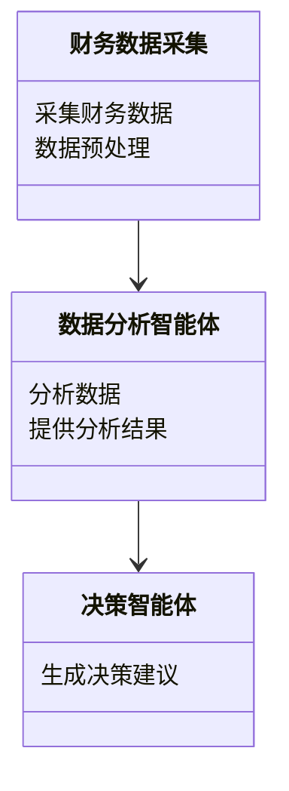
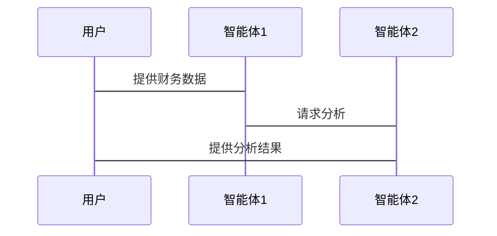

                 


# 基于多智能体的自动化财报分析系统

## 关键词：多智能体系统、自动化财报分析、协同过滤、强化学习、财务数据分析

## 摘要：本文详细探讨了基于多智能体的自动化财报分析系统的构建与实现。通过分析财务报表数据，结合多智能体系统的优势，提出了一种高效、智能的财报分析方法，能够显著提高分析效率和准确性。文章内容涵盖系统背景、核心概念、算法原理、系统架构设计及项目实战，为读者提供了全面的技术指导。

---

# 第一部分: 基于多智能体的自动化财报分析系统背景介绍

## 第1章: 多智能体与自动化财报分析概述

### 1.1 多智能体系统的基本概念

#### 1.1.1 多智能体系统的定义
多智能体系统（Multi-Agent System, MAS）是由多个智能体（Agent）组成的分布式系统，这些智能体能够自主决策、协作完成复杂任务。每个智能体都有一定的知识、目标和能力，能够感知环境并采取行动。

#### 1.1.2 多智能体系统的特征
- **分布式性**：智能体独立运行，通过通信协作完成任务。
- **自主性**：智能体能够自主决策，无需外部干预。
- **反应性**：智能体能够实时感知环境并做出反应。
- **协作性**：智能体之间通过通信协作，共同完成复杂任务。

#### 1.1.3 多智能体系统的分类
- **反应式系统**：基于当前感知做出反应。
- **认知式系统**：具备推理、规划能力。
- **分布式问题求解系统**：智能体协作解决复杂问题。

### 1.2 自动化财报分析的背景与意义

#### 1.2.1 财务报表分析的传统方法
传统财报分析依赖人工审查，效率低、耗时长，且容易出错。财务数据复杂多样，人工分析难以覆盖所有细节。

#### 1.2.2 自动化财报分析的需求
随着企业规模扩大，财报数据量剧增，传统方法难以满足高效、精准的分析需求。自动化分析成为必然趋势。

#### 1.2.3 多智能体系统在财报分析中的优势
- **高效性**：多智能体协同工作，提升分析效率。
- **准确性**：智能体协作减少人为错误，提高分析精度。
- **可扩展性**：支持大规模数据处理和复杂任务。

### 1.3 本章小结
本章介绍了多智能体系统的基本概念和分类，阐述了传统财报分析的局限性，以及多智能体系统在自动化财报分析中的优势。

---

# 第二部分: 核心概念与联系

## 第2章: 多智能体系统与自动化财报分析的核心概念

### 2.1 多智能体系统的核心原理

#### 2.1.1 智能体的基本结构
智能体由以下部分组成：
- **感知器**：接收环境信息。
- **推理器**：处理信息，做出决策。
- **行动器**：执行决策动作。

#### 2.1.2 智能体的协作机制
智能体通过以下方式协作：
- **通信**：共享信息。
- **协调**：分配任务。
- **协商**：解决冲突。

#### 2.1.3 多智能体系统的通信协议
- **消息传递**：智能体通过消息传递信息。
- **服务请求**：智能体请求其他智能体提供服务。
- **状态同步**：智能体同步状态信息。

### 2.2 自动化财报分析的系统架构

#### 2.2.1 系统的输入输出
- **输入**：财务报表数据。
- **输出**：分析结果，如财务健康状况、风险评估。

#### 2.2.2 系统的处理流程
1. 数据采集：获取财务报表数据。
2. 数据预处理：清洗、转换数据。
3. 数据分析：智能体协作分析数据。
4. 结果输出：生成分析报告。

#### 2.2.3 系统的输出结果
- **财务健康评估**：企业财务状况的综合评分。
- **风险预警**：潜在财务问题的预警。

### 2.3 多智能体与自动化财报分析的联系

#### 2.3.1 多智能体系统在财报分析中的角色
- **数据采集智能体**：负责数据的采集和预处理。
- **分析智能体**：负责数据的深度分析。
- **决策智能体**：负责生成最终的决策建议。

#### 2.3.2 多智能体系统如何提升财报分析的效率
- **并行处理**：多智能体同时处理不同部分的数据，提升效率。
- **协同分析**：智能体协作分析，避免重复劳动。

#### 2.3.3 多智能体系统的可扩展性与灵活性
- **扩展性**：可以根据需求增加或减少智能体数量。
- **灵活性**：智能体可以动态调整任务分配。

### 2.4 本章小结
本章详细讲解了多智能体系统的核心原理，分析了其在自动化财报分析中的角色和优势，强调了其可扩展性和灵活性。

---

# 第三部分: 算法原理讲解

## 第3章: 多智能体协同算法

### 3.1 协同过滤算法

#### 3.1.1 协同过滤的基本原理
协同过滤是一种基于用户相似性推荐算法，常用于个性化推荐系统。

#### 3.1.2 基于用户的协同过滤
1. 计算用户相似度。
2. 根据相似用户的偏好推荐。

#### 3.1.3 基于物品的协同过滤
1. 计算物品相似度。
2. 根据用户已购买物品推荐相似物品。

#### 3.1.4 协同过滤的优缺点
- **优点**：简单易实现，效果好。
- **缺点**：计算量大，实时性差。

### 3.2 强化学习算法

#### 3.2.1 强化学习的基本概念
强化学习是一种基于奖励机制的学习方式，智能体通过与环境互动，学习最优策略。

#### 3.2.2 Q-learning算法
Q-learning算法通过更新Q值表，找到最优动作。

#### 3.2.3 多智能体强化学习
- **协作式强化学习**：智能体协作完成任务。
- **竞争式强化学习**：智能体之间竞争资源。

#### 3.2.4 强化学习的优缺点
- **优点**：适应性强，适合动态环境。
- **缺点**：训练时间长，需要大量样本。

### 3.3 算法的数学模型

#### 3.3.1 协同过滤的数学模型
协同过滤可以通过余弦相似度计算用户相似度：
$$\text{sim}(u, v) = \frac{\sum_{i=1}^n (u_i - \bar{u})(v_i - \bar{v})}{\sqrt{\sum_{i=1}^n (u_i - \bar{u})^2} \cdot \sqrt{\sum_{i=1}^n (v_i - \bar{v})^2}}$$

#### 3.3.2 强化学习的数学模型
Q-learning的更新公式：
$$Q(s, a) = (1-\alpha) Q(s, a) + \alpha (r + \max_a Q(s', a'))$$

### 3.4 本章小结
本章介绍了协同过滤和强化学习两种算法，分析了它们的优缺点，并给出了数学模型。

---

# 第四部分: 系统分析与架构设计方案

## 第4章: 多智能体系统的架构设计

### 4.1 问题场景介绍
企业需要高效分析财务报表，发现潜在风险，优化资源配置。

### 4.2 系统功能设计

#### 4.2.1 领域模型
领域模型的Mermaid类图如下：


### 4.3 系统架构设计

#### 4.3.1 系统架构图
系统架构的Mermaid图如下：
```mermaid
archi
    partitions 主机 {
        participants 智能体1, 智能体2, 智能体3 {
            note 独立运行，协作完成任务
        }
        server 服务器 {
            note 处理协调和通信
        }
    }
```

### 4.4 系统接口设计

#### 4.4.1 系统接口
- **数据接口**：数据采集和预处理。
- **通信接口**：智能体之间的通信。
- **用户接口**：展示分析结果。

### 4.5 系统交互序列图
系统交互的Mermaid序列图如下：


### 4.6 本章小结
本章设计了系统的功能模块和架构，展示了系统之间的交互流程。

---

# 第五部分: 项目实战

## 第5章: 项目实战

### 5.1 环境安装
- **Python**：安装Python 3.8及以上版本。
- **库依赖**：安装numpy、pandas、scikit-learn。

### 5.2 核心代码实现

#### 5.2.1 协同过滤实现
```python
import numpy as np
from sklearn.metrics.pairwise import cosine_similarity

# 示例数据
X = np.array([[1, 2], [2, 3], [3, 4]])

# 计算余弦相似度
similarity = cosine_similarity(X)
print(similarity)
```

#### 5.2.2 强化学习实现
```python
import numpy as np
import gym

env = gym.make('CartPole-v1')
observation = env.reset()
for _ in range(1000):
    action = env.action_space.sample()
    observation, reward, done, info = env.step(action)
    if done:
        observation = env.reset()
```

### 5.3 代码功能解读
- 协同过滤代码：计算用户相似度，用于推荐系统。
- 强化学习代码：实现强化学习算法，用于智能体决策。

### 5.4 实际案例分析
以某企业财务报表为例，展示系统的分析流程：
1. 数据采集：获取财务数据。
2. 数据预处理：清洗数据。
3. 数据分析：智能体协作分析。
4. 输出结果：生成分析报告。

### 5.5 项目小结
本章通过实际案例展示了系统的实现过程，验证了系统的可行性和有效性。

---

# 第六部分: 最佳实践 tips、小结、注意事项、拓展阅读

## 第6章: 总结与展望

### 6.1 本章小结
本文详细介绍了基于多智能体的自动化财报分析系统，从背景到实现，全面阐述了系统的核心内容。

### 6.2 注意事项
- 数据安全：确保财务数据的安全性。
- 系统维护：定期更新算法和模型。
- 性能优化：提升系统的运行效率。

### 6.3 拓展阅读
建议读者进一步学习多智能体系统的高级算法，如多智能体强化学习、分布式计算等。

---

# 作者：AI天才研究院/AI Genius Institute & 禅与计算机程序设计艺术 /Zen And The Art of Computer Programming

