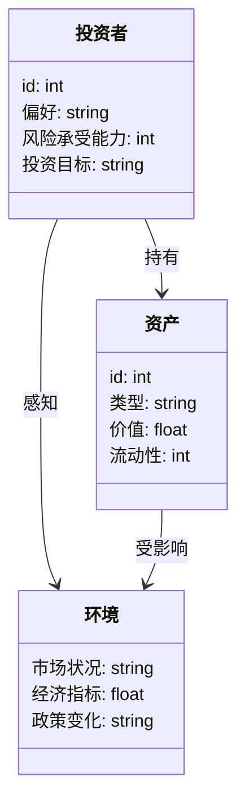
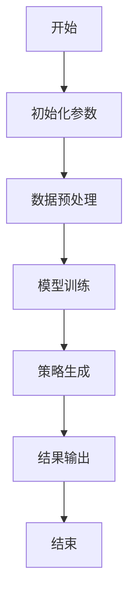
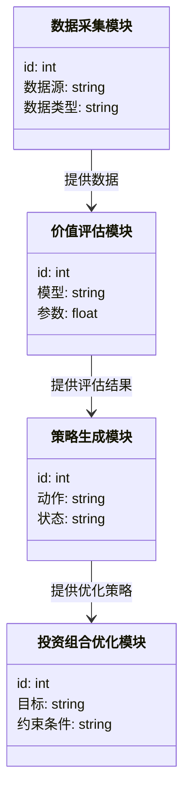
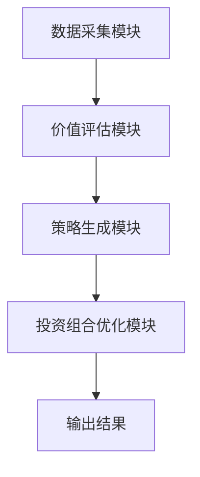

                 


# 基于多智能体的自适应价值投资策略

## 关键词：多智能体系统、自适应投资策略、价值投资、金融建模、算法设计

## 摘要：  
本文将探讨如何利用多智能体系统构建自适应价值投资策略，通过详细分析多智能体系统的核心原理、算法设计、系统架构以及实际项目案例，展示如何在复杂金融环境中实现动态优化投资决策。

---

# 第一部分: 基于多智能体的自适应价值投资策略概述

## 第1章: 多智能体系统与自适应价值投资策略背景

### 1.1 多智能体系统概述  
#### 1.1.1 多智能体系统的定义  
多智能体系统（Multi-Agent System, MAS）是由多个智能体（Agent）组成的分布式系统，这些智能体能够通过协作完成复杂的任务。智能体具有自主性、反应性、目标导向性和社会性等特征，能够感知环境、自主决策并与其他智能体或人类进行交互。  

#### 1.1.2 多智能体系统的特征  
- **自主性**：智能体能够自主决策，无需外部干预。  
- **反应性**：智能体能够实时感知环境变化并做出响应。  
- **协作性**：多个智能体能够通过协作完成复杂的任务。  
- **分布式性**：系统中的智能体分布在不同的位置，通过通信和协调完成任务。  

#### 1.1.3 多智能体系统在金融领域的应用  
在金融领域，多智能体系统可以用于股票交易、风险管理、投资组合优化等场景。通过多智能体的协作，可以实现对市场动态的实时感知和快速响应。

### 1.2 自适应价值投资策略  
#### 1.2.1 价值投资的定义与核心理念  
价值投资是一种投资策略，旨在通过分析企业的内在价值，寻找被市场低估的投资标的。其核心理念是长期持有优质资产，而非短期市场波动。

#### 1.2.2 自适应投资策略的特点  
自适应投资策略能够根据市场环境的变化动态调整投资策略，具有高度的灵活性和适应性。与传统固定的投资策略不同，自适应策略能够实时感知市场变化并做出相应的调整。

#### 1.2.3 多智能体在自适应价值投资中的作用  
多智能体系统能够通过协作实现对市场环境的全面感知和分析，帮助投资者快速识别市场机会和风险。通过多智能体的分工协作，可以实现对投资策略的动态优化。

### 1.3 问题背景与研究意义  
#### 1.3.1 传统价值投资的局限性  
传统价值投资策略依赖于人工分析和判断，具有一定的主观性和滞后性。在复杂多变的市场环境中，传统策略难以实现快速响应和动态优化。

#### 1.3.2 多智能体系统的优势  
多智能体系统具有分布式计算、协作能力强、实时性强等优势，能够为自适应价值投资策略提供强有力的技术支持。

#### 1.3.3 研究的创新点与实际应用价值  
本文的研究创新点在于将多智能体系统与自适应价值投资策略相结合，提出了一种基于多智能体的自适应价值投资策略框架。该框架能够实现对市场环境的实时感知和动态调整，具有重要的理论意义和实际应用价值。

---

## 第2章: 多智能体系统的核心概念与联系  

### 2.1 多智能体系统的原理  
#### 2.1.1 实体关系图（ER图）分析  
通过ER图可以清晰地展示系统中各个实体之间的关系，为后续的系统设计提供基础。  

```mermaid
er
    entity 投资者 {
        key: id
       属性: 偏好，风险承受能力，投资目标
    }
    entity 资产 {
        key: id
        属性: 类型，价值，流动性
    }
    entity 环境 {
        属性: 市场状况，经济指标，政策变化
    }
    relationship 投资者-资产 {
        关系: 投资者持有资产
    }
    relationship 投资者-环境 {
        关系: 投资者感知环境变化
    }
```

#### 2.1.2 类图分析  
通过类图可以展示系统中各个类之间的关系，为系统设计提供直观的视图。  



### 2.2 自适应价值投资策略的核心要素  
#### 2.2.1 价值评估模型  
价值评估模型是自适应价值投资策略的核心，用于对资产的内在价值进行评估。常见的价值评估模型包括市盈率模型、市净率模型等。

#### 2.2.2 风险管理机制  
风险管理机制用于识别和控制投资过程中的风险，确保投资组合的稳定性。

#### 2.2.3 策略调整逻辑  
策略调整逻辑是自适应价值投资策略的关键，用于根据市场环境的变化动态调整投资策略。

### 2.3 多智能体与自适应价值投资的关系  
#### 2.3.1 多智能体系统的协作机制  
多智能体系统通过协作实现对市场环境的全面感知和分析，为自适应价值投资策略提供支持。

#### 2.3.2 自适应策略的动态调整过程  
自适应价值投资策略通过多智能体系统的协作，能够实现对投资策略的动态调整，确保投资组合的优化。

#### 2.3.3 两者结合的系统架构  
通过将多智能体系统与自适应价值投资策略相结合，可以构建一个高效、灵活的自适应价值投资系统。

---

## 第3章: 基于多智能体的自适应价值投资策略算法原理  

### 3.1 算法原理概述  
#### 3.1.1 算法核心思想  
基于多智能体的自适应价值投资策略算法的核心思想是通过多智能体的协作，实现对市场环境的实时感知和动态调整。

#### 3.1.2 算法输入输出  
- **输入**：市场数据、资产信息、投资者偏好等。  
- **输出**：投资策略、投资组合优化结果等。  

#### 3.1.3 算法流程图  


### 3.2 数学模型与公式  
#### 3.2.1 价值函数  
价值函数用于衡量资产的内在价值，公式如下：  
$$ V(s) = \max_{a} \left( r(s,a) + \gamma V(s') \right) $$  
其中，$s$表示当前状态，$a$表示动作，$r(s,a)$表示奖励，$\gamma$表示折扣率，$s'$表示下一个状态。

#### 3.2.2 策略优化  
策略优化的目标是找到最优的投资策略，公式如下：  
$$ \theta^{*} = \arg\max_{\theta} \sum_{t=1}^{T} r(s_t, a_t) $$  
其中，$\theta$表示策略参数，$T$表示时间步数。

---

## 第4章: 系统架构设计  

### 4.1 系统分析与设计  
#### 4.1.1 系统功能模块  
系统功能模块包括数据采集、价值评估、策略生成、投资组合优化等。

#### 4.1.2 领域模型（类图）  


#### 4.1.3 系统架构图  


---

## 第5章: 项目实战  

### 5.1 环境安装  
#### 5.1.1 安装Python环境  
安装Python 3.8及以上版本，并安装相关依赖库，如numpy、pandas、scikit-learn等。

### 5.2 核心实现代码  
#### 5.2.1 数据预处理代码  
```python
import numpy as np
import pandas as pd

# 读取数据
data = pd.read_csv('market_data.csv')

# 数据清洗
data.dropna(inplace=True)
data = data.astype(float)
```

#### 5.2.2 价值评估模型代码  
```python
from sklearn.linear_model import LinearRegression

# 训练价值评估模型
model = LinearRegression()
model.fit(X_train, y_train)

# 预测价值
y_pred = model.predict(X_test)
```

#### 5.2.3 策略生成代码  
```python
def generate_strategy(data, model):
    # 数据预处理
    processed_data = preprocess(data)
    
    # 生成策略
    strategy = model.predict(processed_data)
    
    return strategy
```

### 5.3 实际案例分析  
#### 5.3.1 股票投资组合优化  
以股票投资组合优化为例，通过多智能体系统的协作，实现对投资组合的动态优化。

#### 5.3.2 优化结果解读  
通过分析优化结果，验证自适应价值投资策略的有效性。

---

## 第6章: 总结与展望  

### 6.1 总结  
本文通过详细分析多智能体系统的核心原理、算法设计、系统架构以及实际项目案例，展示了如何利用多智能体系统构建自适应价值投资策略。

### 6.2 展望  
未来的研究方向可以包括多智能体系统的优化、自适应策略的进一步改进以及在更多金融场景中的应用。

---

## 作者：AI天才研究院/AI Genius Institute & 禅与计算机程序设计艺术 /Zen And The Art of Computer Programming  

---

**注**：以上内容为基于《基于多智能体的自适应价值投资策略》的详细技术博客文章，涵盖了从背景到系统架构设计、项目实战等各个方面，为读者提供了全面的技术解读和实际操作指南。

