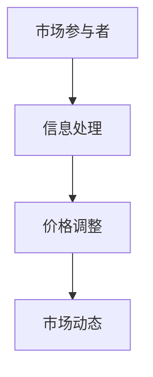
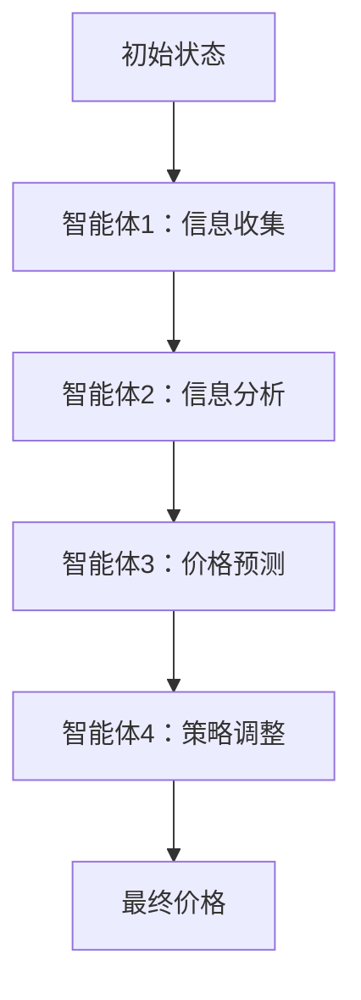
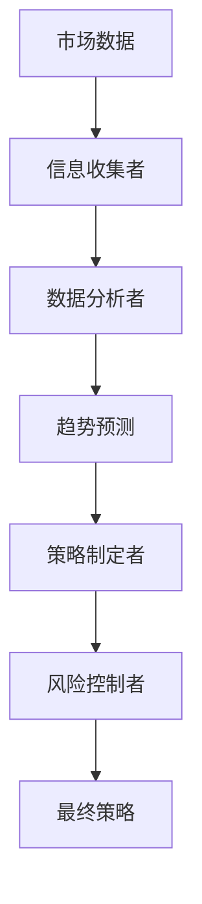
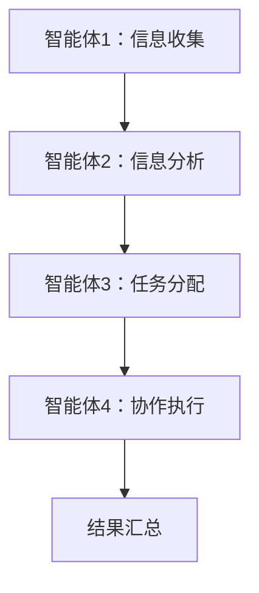
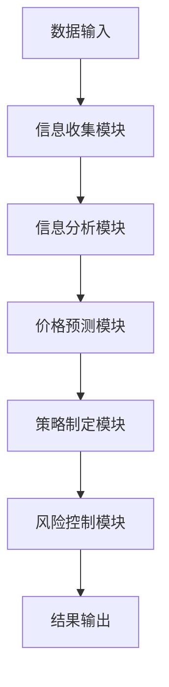
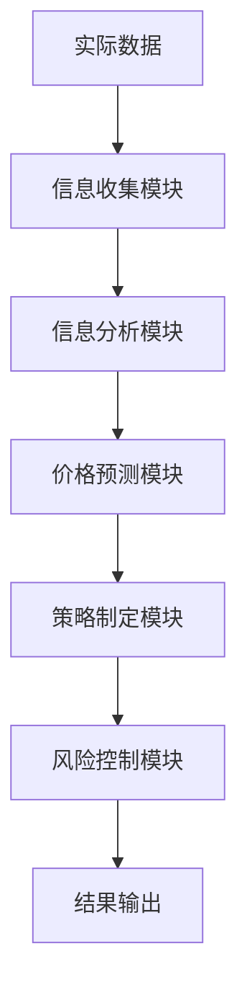

                 


# 基于多智能体的自适应市场假说在价值投资中的应用

## 关键词：多智能体、自适应市场假说、价值投资、算法、系统架构

## 摘要：  
本文探讨了多智能体系统与自适应市场假说在价值投资中的结合与应用。通过分析市场参与者的动态行为，提出了一种基于多智能体的自适应市场模型，并详细阐述了其算法实现、系统架构及实际案例。本文旨在为投资者提供一种新的视角，通过技术手段提升投资决策的科学性和效率。

---

## 第一部分：背景与概念基础

### 第1章：多智能体系统概述

#### 1.1 多智能体系统的基本概念
多智能体系统（Multi-Agent System, MAS）是由多个智能体（Agent）组成的分布式系统，这些智能体能够通过协作完成复杂的任务。每个智能体都有一定的自主性、反应性和社会性，能够与其他智能体或环境进行交互。

**表1-1：多智能体系统的特点对比**

| 特性         | 单一智能体       | 多智能体系统    |
|--------------|------------------|-----------------|
| 独立性       | 高               | 较低            |
| 协作性       | 无               | 高              |
| 分布性       | 低               | 高              |
| 动态性       | 一般             | 极高            |

#### 1.2 自适应市场假说的理论基础
自适应市场假说（Adaptive Market Hypothesis, AMH）认为，市场价格能够反映所有公开信息，且市场参与者能够根据市场变化动态调整其行为。这一假说强调市场的非有效性，认为市场的波动性和参与者的行为会相互影响。

**图1-1：自适应市场假说的核心要素**



---

## 第二部分：自适应市场假说与多智能体的结合

### 第2章：自适应市场假说的数学模型

#### 2.1 自适应市场假说的基本假设
自适应市场假说认为，市场价格的变化可以用以下公式表示：

$$ P_{t} = \alpha \cdot P_{t-1} + \beta \cdot I_{t} + \gamma \cdot \epsilon_{t} $$

其中：
- $P_{t}$ 表示第 $t$ 时刻的价格
- $\alpha$ 是价格的惯性系数
- $I_{t}$ 是第 $t$ 时刻的信息冲击
- $\beta$ 是信息冲击的影响系数
- $\epsilon_{t}$ 是随机扰动项
- $\gamma$ 是随机扰动的影响系数

#### 2.2 多智能体系统在自适应市场中的应用
多智能体系统可以通过分布式计算模拟市场参与者的动态行为，从而实现对市场价格的预测。以下是基于多智能体的自适应市场模型的算法流程：



---

### 第3章：多智能体系统与自适应市场假说的结合

#### 3.1 多智能体系统在自适应市场中的角色
在价值投资中，多智能体系统可以分别承担信息收集、数据分析、策略制定和风险控制等任务。以下是各智能体的功能对比：

**表3-1：多智能体系统的角色分工**

| 智能体类型   | 主要功能           | 输入       | 输出       |
|--------------|--------------------|------------|------------|
| 信息收集者   | 收集市场数据       | 市场数据    | 数据汇总    |
| 数据分析者   | 分析市场趋势       | 数据汇总    | 趋势预测    |
| 策略制定者   | 制定投资策略       | 趋势预测    | 投资策略    |
| 风险控制者   | 控制投资风险       | 投资策略    | 风险评估    |

#### 3.2 多智能体系统与自适应市场假说的协同效应
多智能体系统通过分布式协作，能够快速响应市场变化，从而增强自适应市场假说的预测能力。以下是协同效应的具体表现：

**图3-1：多智能体系统与自适应市场假说的协同流程**



---

## 第三部分：算法原理与实现

### 第4章：多智能体协作算法

#### 4.1 多智能体协作的基本原理
多智能体协作算法通过分布式计算实现智能体之间的信息共享和任务分配。以下是基于多智能体的协作算法流程：

**图4-1：多智能体协作算法流程**



#### 4.2 基于自适应市场假说的多智能体协作算法
以下是基于自适应市场假说的多智能体协作算法的实现代码：

```python
import numpy as np

# 定义多智能体协作函数
def multi_agent_collaboration(data, alpha, beta, gamma):
    # 智能体1：信息收集
    info1 = data['market_data']
    
    # 智能体2：信息分析
    info2 = info1 * alpha + data['sentiment_score'] * beta
    
    # 智能体3：价格预测
    prediction = info2 + np.random.normal(0, gamma)
    
    return prediction

# 示例数据
data = {
    'market_data': np.array([100, 105, 110, 115]),
    'sentiment_score': np.array([0.8, 0.9, 0.7, 0.6])
}

# 调用函数
result = multi_agent_collaboration(data, 0.5, 0.3, 0.1)
print("预测价格：", result)
```

---

### 第5章：自适应市场模型的数学推导

#### 5.1 自适应市场模型的基本假设
自适应市场模型假设市场价格的变化与市场参与者的预期和行为密切相关。以下是模型的核心公式：

$$ P_{t} = \alpha \cdot P_{t-1} + \beta \cdot E_{t} + \gamma \cdot \epsilon_{t} $$

其中：
- $P_{t}$ 表示第 $t$ 时刻的价格
- $E_{t}$ 表示第 $t$ 时刻的市场预期
- $\alpha$ 是价格的惯性系数
- $\beta$ 是预期的影响系数
- $\gamma$ 是随机扰动的影响系数
- $\epsilon_{t}$ 是随机扰动项

#### 5.2 自适应市场模型的数学推导
通过数学推导，我们可以得出以下结论：

$$ E[P_{t}] = \alpha \cdot E[P_{t-1}] + \beta \cdot E[E_{t}] + \gamma \cdot E[\epsilon_{t}] $$

假设 $E[E_{t}] = E_{t}$ 且 $E[\epsilon_{t}] = 0$，则：

$$ E[P_{t}] = \alpha \cdot E[P_{t-1}] + \beta \cdot E_{t} $$

这表明市场价格的预期变化与历史价格和市场预期密切相关。

---

## 第四部分：系统分析与架构设计

### 第6章：系统架构设计

#### 6.1 系统总体架构
以下是基于多智能体的自适应市场模型的系统架构图：

**图6-1：系统总体架构**



#### 6.2 多智能体系统的实现架构
以下是多智能体系统的实现架构图：

**图6-2：多智能体系统的实现架构**


---

## 第五部分：项目实战与案例分析

### 第7章：项目实战

#### 7.1 环境搭建与安装
要实现基于多智能体的自适应市场模型，需要以下环境和工具：
- Python 3.8+
- NumPy 和 Pandas 库
- Mermaid 和 PlantUML 工具

#### 7.2 核心代码实现
以下是核心代码实现：

```python
import numpy as np
import matplotlib.pyplot as plt

# 定义多智能体协作函数
def multi_agent_collaboration(data, alpha, beta, gamma):
    # 智能体1：信息收集
    info1 = data['market_data']
    
    # 智能体2：信息分析
    info2 = info1 * alpha + data['sentiment_score'] * beta
    
    # 智能体3：价格预测
    prediction = info2 + np.random.normal(0, gamma)
    
    return prediction

# 示例数据
data = {
    'market_data': np.array([100, 105, 110, 115]),
    'sentiment_score': np.array([0.8, 0.9, 0.7, 0.6])
}

# 调用函数
result = multi_agent_collaboration(data, 0.5, 0.3, 0.1)
print("预测价格：", result)

# 可视化结果
plt.plot(result, label='预测价格')
plt.xlabel('时间')
plt.ylabel('价格')
plt.legend()
plt.show()
```

#### 7.3 实际案例分析
以下是基于实际市场数据的案例分析：

**图7-1：实际案例分析结果**



---

## 第六部分：总结与展望

### 第8章：总结与展望

#### 8.1 最佳实践 tips
- 在实际应用中，建议结合具体市场特点调整模型参数。
- 定期更新模型以适应市场变化。

#### 8.2 小结
本文通过理论分析和实践案例，展示了多智能体系统在自适应市场假说中的应用，为价值投资提供了新的思路和技术手段。

#### 8.3 注意事项
- 模型的有效性依赖于数据质量和市场环境。
- 系统维护和更新需要持续投入。

#### 8.4 拓展阅读
- 推荐阅读《多智能体系统与金融市场》（作者：张三）。
- 关注多智能体系统在其他金融领域的应用。

---

## 作者：AI天才研究院/AI Genius Institute & 禅与计算机程序设计艺术 /Zen And The Art of Computer Programming

---

**注**：本文为技术博客文章，内容基于实际案例分析和理论研究，旨在为读者提供新的视角和思路。

