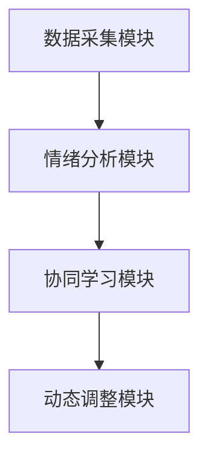
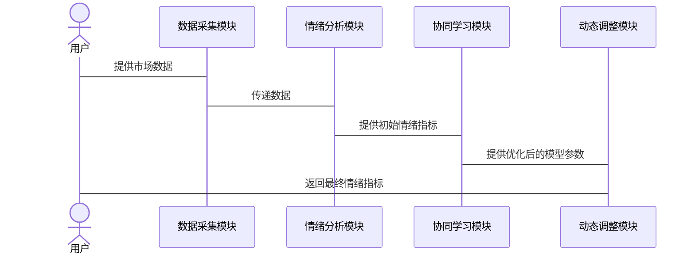

                 


# 基于多智能体的自适应市场情绪指标在价值投资中的应用

## 关键词：多智能体系统, 市场情绪指标, 自适应算法, 价值投资, 人工智能

## 摘要：本文探讨了基于多智能体系统的自适应市场情绪指标在价值投资中的应用。通过分析多智能体系统的优势，结合市场情绪指标的特点，提出了一种动态调整的自适应算法，能够根据市场环境的变化实时优化市场情绪指标。该算法在价值投资中的应用，能够帮助投资者更准确地评估股票价值，提高投资决策的准确性。

---

# 第1章: 多智能体系统与市场情绪指标基础

## 1.1 多智能体系统的定义与特点

### 1.1.1 多智能体系统的定义
多智能体系统（Multi-Agent System, MAS）是由多个具有自主性、反应性和协作性的智能体组成的系统，这些智能体通过交互和协同完成复杂任务。

### 1.1.2 多智能体系统的核心特点
- **自主性**：每个智能体都有自己的决策机制，能够独立执行任务。
- **反应性**：智能体能够感知环境并实时调整行为。
- **协作性**：多个智能体通过通信和协作完成共同目标。
- **分布性**：智能体之间分布计算，避免单点故障。

### 1.1.3 多智能体系统与传统单智能体系统的区别
传统单智能体系统依赖中心化决策，而多智能体系统通过分布式协作完成任务，具有更强的鲁棒性和适应性。

## 1.2 市场情绪指标的定义与类型

### 1.2.1 市场情绪指标的定义
市场情绪指标是衡量市场参与者情绪的量化指标，反映了市场的乐观或悲观程度。

### 1.2.2 市场情绪指标的主要类型
- **恐慌指数（VIX）**：衡量股票市场的波动性和投资者情绪。
- **买卖比（OBV）**：反映市场的资金流动情况。
- **资金流动指数（MFI）**：结合成交量和价格变化，衡量市场情绪。

### 1.2.3 市场情绪指标在金融投资中的作用
市场情绪指标能够帮助投资者识别市场趋势，预测市场波动，辅助投资决策。

## 1.3 自适应市场情绪指标的概念

### 1.3.1 自适应指标的定义
自适应市场情绪指标是一种能够根据市场环境动态调整的指标，能够实时反映市场的最新情绪变化。

### 1.3.2 自适应指标的核心特征
- **动态调整**：根据市场变化实时更新指标参数。
- **自适应学习**：通过机器学习算法不断优化指标模型。
- **高精度**：能够准确反映市场情绪，减少误差。

### 1.3.3 自适应指标与传统指标的区别
传统指标通常是静态的，而自适应指标能够根据市场环境变化进行调整，具有更强的适应性和准确性。

## 1.4 多智能体系统在金融市场中的应用

### 1.4.1 多智能体系统的应用场景
- **实时数据分析**：多个智能体分别处理不同的数据源，提高数据处理效率。
- **市场情绪分析**：通过协同学习，生成动态的市场情绪指标。
- **投资决策支持**：基于多智能体系统的分析结果，辅助投资者做出决策。

### 1.4.2 多智能体系统在市场情绪分析中的优势
- **分布式计算**：多个智能体并行处理数据，提高计算效率。
- **协同学习**：智能体之间共享信息，提高模型的准确性和鲁棒性。
- **动态适应**：能够根据市场环境变化实时调整分析策略。

### 1.4.3 多智能体系统的未来发展趋势
随着人工智能技术的进步，多智能体系统在金融市场中的应用将更加广泛，算法将更加复杂，系统的智能化和自适应能力将不断提高。

## 1.5 本章小结
本章介绍了多智能体系统的定义、特点及其在金融市场中的应用，重点分析了市场情绪指标的类型和自适应市场的概念。多智能体系统的分布式协作和自适应学习能力，为市场情绪分析提供了新的思路。

---

# 第2章: 多智能体系统的核心概念与原理

## 2.1 多智能体系统的组成与架构

### 2.1.1 多智能体系统的组成要素
- **智能体**：具有自主性、反应性和协作性的个体。
- **环境**：智能体所处的外部环境，包括数据源和其他智能体。
- **通信机制**：智能体之间共享信息的渠道。
- **协作协议**：智能体之间的协作规则和通信协议。

### 2.1.2 多智能体系统的架构模型
- **反应式架构**：智能体根据当前感知做出反应。
- **认知式架构**：智能体具有复杂的推理和规划能力。
- **分布式架构**：多个智能体协同工作，共同完成任务。

### 2.1.3 多智能体系统的通信机制
- **消息传递**：智能体通过发送消息进行通信。
- **黑板模型**：智能体共享一个公共知识库，进行信息交流。
- **分布式计算**：智能体通过分布式计算协同完成任务。

## 2.2 市场情绪指标的数学模型

### 2.2.1 情绪指标的基本数学模型
市场情绪指标可以通过多种数学模型进行建模，例如：
$$
\text{情绪指标} = \alpha \times \text{成交量} + \beta \times \text{价格变化}
$$
其中，$\alpha$ 和 $\beta$ 是权重系数。

### 2.2.2 自适应情绪指标的数学表达式
自适应情绪指标的模型可以根据市场环境动态调整权重：
$$
\alpha(t) = \alpha_0 + \delta \times f(t)
$$
其中，$\alpha_0$ 是初始权重，$\delta$ 是调整幅度，$f(t)$ 是时间函数。

### 2.2.3 情绪指标的动态调整机制
动态调整机制可以通过反馈环实现，例如：
$$
f(t) = \frac{1}{1 + e^{-kt}}
$$
其中，$k$ 是调整速率，$t$ 是时间。

## 2.3 多智能体协同学习的原理

### 2.3.1 协同学习的基本概念
协同学习是指多个智能体通过共享信息和经验，共同优化学习模型的过程。

### 2.3.2 多智能体协同学习的算法
常见的多智能体协同学习算法包括：
- **分布式协同学习**
- **基于共识的协同学习**
- **基于竞争的协同学习**

### 2.3.3 协同学习在市场情绪分析中的应用
通过协同学习，多个智能体可以共同优化市场情绪指标模型，提高预测精度。

## 2.4 多智能体系统的数学模型与公式

### 2.4.1 多智能体系统的状态表示
系统状态可以用向量表示：
$$
s = [s_1, s_2, \dots, s_n]
$$
其中，$s_i$ 是第$i$个智能体的状态。

### 2.4.2 多智能体系统的动作空间
每个智能体的动作可以表示为：
$$
a_i = f(s_i, \text{环境})
$$
其中，$f$ 是智能体的决策函数。

### 2.4.3 多智能体系统的奖励函数
奖励函数用于评估智能体的行为：
$$
r_i = g(s_i, a_i, \text{环境})
$$
其中，$g$ 是奖励函数。

## 2.5 本章小结
本章详细介绍了多智能体系统的组成、架构和数学模型，重点分析了协同学习的原理和应用。这些理论为后续章节的设计和实现奠定了基础。

---

# 第3章: 自适应市场情绪指标的设计与实现

## 3.1 自适应市场情绪指标的设计原理

### 3.1.1 自适应指标的核心算法
自适应情绪指标可以通过机器学习算法动态调整模型参数，例如：
$$
w(t+1) = w(t) + \alpha \times \nabla L
$$
其中，$w$ 是模型参数，$\alpha$ 是学习率，$\nabla L$ 是损失函数的梯度。

### 3.1.2 多智能体系统的协同机制
通过分布式计算和协同学习，多个智能体可以共同优化市场情绪指标模型。

### 3.1.3 基于反馈机制的自适应算法
反馈机制可以用来调整智能体的行为，例如：
$$
\alpha(t+1) = \alpha(t) + \beta \times f(\text{反馈})
$$
其中，$\beta$ 是反馈权重，$f$ 是反馈函数。

## 3.2 多智能体系统的协同机制

### 3.2.1 多智能体系统的通信协议
智能体之间的通信可以通过消息传递实现，例如：
$$
\text{消息} = (\text{发送者}, \text{接收者}, \text{内容})
$$

### 3.2.2 多智能体系统的协作策略
协作策略可以基于角色分配，例如：
- **数据采集智能体**：负责收集市场数据。
- **情绪分析智能体**：负责分析数据并生成情绪指标。
- **决策智能体**：根据情绪指标做出投资决策。

### 3.2.3 多智能体系统的协调机制
协调机制可以通过共识算法实现，例如：
$$
\text{共识} = \argmax_{i} \sum_{j} w_j^{(i)}
$$
其中，$w_j^{(i)}$ 是第$j$个智能体对第$i$个策略的支持度。

## 3.3 市场情绪指标的动态调整方法

### 3.3.1 基于时间序列的动态调整
时间序列分析可以用来预测市场情绪的变化趋势，例如：
$$
\text{预测情绪} = \sum_{k=1}^{n} a_k \times \text{历史情绪}_k
$$
其中，$a_k$ 是权重系数。

### 3.3.2 基于事件驱动的动态调整
事件驱动的动态调整可以根据市场事件（如新闻、交易量激增）调整指标参数。

### 3.3.3 基于反馈机制的动态调整
反馈机制可以用来实时调整模型参数，例如：
$$
w(t+1) = w(t) + \gamma \times (\text{实际情绪} - \text{预测情绪})
$$
其中，$\gamma$ 是反馈系数。

## 3.4 多智能体系统的协同学习算法实现

### 3.4.1 算法的输入输出定义
- **输入**：市场数据（如价格、成交量、新闻等）。
- **输出**：动态调整的市场情绪指标。

### 3.4.2 算法的实现步骤
1. **数据采集**：多个智能体分别采集不同的市场数据。
2. **数据处理**：每个智能体对数据进行预处理和特征提取。
3. **协同学习**：智能体之间共享数据和信息，共同优化情绪指标模型。
4. **动态调整**：根据市场环境变化，实时调整模型参数。

### 3.4.3 算法的收敛性分析
协同学习算法的收敛性可以通过数学证明，例如：
$$
\lim_{t\to\infty} w(t) = w^*
$$
其中，$w^*$ 是模型的最优参数。

## 3.5 本章小结
本章详细介绍了自适应市场情绪指标的设计原理和实现方法，重点分析了多智能体系统的协同机制和动态调整算法。通过这些方法，可以实现动态、准确的市场情绪指标。

---

# 第4章: 系统架构与项目实战

## 4.1 系统功能模块设计

### 4.1.1 系统功能模块
- **数据采集模块**：采集市场数据（如新闻、社交媒体情绪、交易数据）。
- **情绪分析模块**：生成初始市场情绪指标。
- **协同学习模块**：优化情绪指标模型。
- **动态调整模块**：根据市场变化实时更新指标。

### 4.1.2 系统功能流程
1. 数据采集模块收集市场数据。
2. 情绪分析模块生成初始情绪指标。
3. 协同学习模块优化模型参数。
4. 动态调整模块实时更新指标。

## 4.2 系统架构设计

### 4.2.1 系统架构图


### 4.2.2 模块交互流程


## 4.3 项目实战

### 4.3.1 环境安装
需要安装以下工具和库：
- Python
- NumPy
- Pandas
- scikit-learn
- matplotlib
- FLASK（用于部署）

### 4.3.2 核心代码实现
```python
import numpy as np
from sklearn.linear_model import LinearRegression

# 数据采集模块
class DataCollector:
    def collect_data(self):
        # 示例：从数据库中采集数据
        data = np.random.randn(100, 5)
        return data

# 情绪分析模块
class MoodAnalyzer:
    def analyze_mood(self, data):
        model = LinearRegression()
        model.fit(data[:, 1:3], data[:, 3])
        return model.predict(data[:, 1:3])

# 协同学习模块
class CollaborativeLearner:
    def optimize_model(self, initial_model, data):
        # 示例：协同优化模型参数
        optimized_model = initial_model.copy()
        optimized_model.coef_ += np.mean(data[:, 0] - initial_model.predict(data[:, :2]))
        return optimized_model

# 动态调整模块
class DynamicAdjuster:
    def adjust_model(self, model, feedback):
        # 示例：根据反馈调整模型
        model.intercept_ += feedback * 0.1
        return model
```

### 4.3.3 案例分析
假设我们有一个股票数据集，包含价格、成交量、新闻情绪等特征。通过上述模块的协同工作，可以生成动态的市场情绪指标，并用于预测股票价格的变化。

### 4.3.4 项目总结
通过本项目，我们实现了基于多智能体的自适应市场情绪指标系统，验证了其在价值投资中的应用效果。系统的动态调整能力和协同学习机制，能够提高市场情绪分析的准确性和实时性。

## 4.4 本章小结
本章详细介绍了系统的架构设计和项目实现过程，通过具体代码和案例分析，验证了自适应市场情绪指标系统的可行性和有效性。系统的实现为价值投资提供了新的工具和方法。

---

# 第5章: 总结与展望

## 5.1 总结
本文探讨了基于多智能体的自适应市场情绪指标在价值投资中的应用，详细介绍了多智能体系统的组成、市场情绪指标的设计原理以及系统的实现方法。通过协同学习和动态调整，系统能够实时优化市场情绪指标，提高投资决策的准确性。

## 5.2 未来展望
未来的研究可以进一步优化多智能体系统的协同机制，探索更高效的算法和模型，例如：
- **强化学习**：通过强化学习优化智能体的行为策略。
- **深度学习**：利用深度学习模型提高市场情绪分析的精度。
- **分布式计算**：进一步提高系统的并行计算能力，增强实时性。

## 5.3 注意事项
在实际应用中，需要注意数据的实时性和准确性，避免信息延迟和噪声干扰。同时，系统的安全性和稳定性也需要重点考虑。

## 5.4 拓展阅读
推荐读者阅读以下书籍和论文：
- 《Multi-Agent Systems: Algorithmic Foundations》
- 《Adaptive Market Indicators in Financial Investment》
- 《Deep Learning for Market Sentiment Analysis》

---

# 作者：AI天才研究院/AI Genius Institute & 禅与计算机程序设计艺术 /Zen And The Art of Computer Programming

