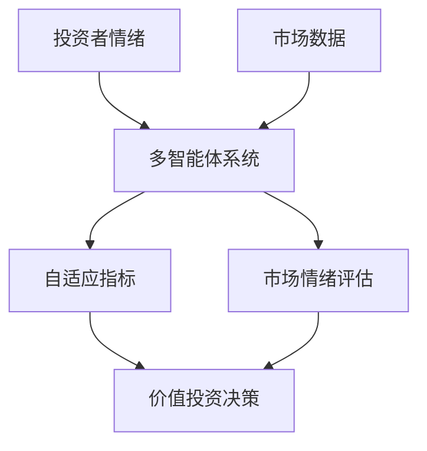

                 

<think>
嗯，用户现在需要我帮忙撰写一篇技术博客文章，标题是《基于多智能体的自适应市场情绪指标在价值投资中的应用》。看起来用户对这个主题有深入的需求，可能是一位技术专家或CTO，想要分享他们的专业知识。他们希望文章结构清晰，内容专业且深入，同时要吸引读者。

首先，我需要明确文章的核心关键词，比如多智能体、自适应市场情绪指标、价值投资等。摘要部分要简明扼要，概括文章的核心内容，让读者一目了然。

接下来是目录结构。用户已经提供了一个大纲，分为背景、概念、算法、系统架构、项目实战和总结几个部分。我需要确保每个部分都有足够的细节，并且用专业的技术语言来描述。

在撰写时，每个章节需要详细展开，比如在“问题背景”中，要解释传统市场情绪分析的局限性，以及多智能体系统如何解决这些问题。同时，要对比多智能体和单智能体，突出多智能体的优势。

在“算法原理”部分，我需要使用Mermaid流程图和Python代码来展示具体的步骤，确保读者能够理解如何实现这些算法。数学公式要用Latex表示，让内容看起来更专业。

系统架构部分，我需要设计类图、架构图和交互图，展示系统的各个模块和它们之间的关系。项目实战部分要提供实际的操作步骤，让读者能够动手实现，同时附上代码和案例分析。

最后，在总结部分，要回顾文章的主要内容，并给出未来的展望和注意事项，帮助读者巩固所学内容。

整体来看，用户的需求是撰写一篇高质量的技术博客，不仅要有理论分析，还要有实际应用和代码示例，这需要我在内容上做到理论与实践相结合，确保文章既有深度又易于理解。

在写作过程中，我需要确保逻辑清晰，每一部分之间有良好的衔接，同时避免过于技术化的术语，让不同层次的读者都能理解。此外，引用相关的数学模型和图表，可以增强文章的可读性和专业性。

最后，检查文章是否符合字数要求，确保每个部分都详细而不过于冗长，结构紧凑，吸引读者一步步深入探讨主题。
</think>

# 基于多智能体的自适应市场情绪指标在价值投资中的应用

> 关键词：多智能体，自适应市场情绪指标，价值投资，算法原理，系统架构

> 摘要：本文探讨了如何利用多智能体系统构建自适应市场情绪指标，并将其应用于价值投资中。通过分析市场情绪的多维度特征，结合多智能体的协同优势，提出了一种基于自适应指标的投资策略。文章从问题背景、核心概念、算法原理、系统架构到项目实战进行了全面阐述，旨在为投资者提供一种新的视角和工具，以更精准地捕捉市场情绪变化，优化投资决策。

---

# 第1章: 多智能体与自适应市场情绪指标的背景介绍

## 1.1 问题背景

### 1.1.1 传统市场情绪分析的局限性
传统市场情绪分析主要依赖于单一指标（如成交量、价格波动等）或简单的统计模型，难以捕捉市场的复杂性和动态变化。例如，传统的波动率指标仅能反映市场的波动程度，而无法区分市场的乐观或悲观情绪。

### 1.1.2 多智能体系统的优势
多智能体系统通过多个分布式智能体的协同工作，能够从多个维度、多层次地分析市场情绪。每个智能体负责特定的任务（如数据采集、情绪分类），并通过协同机制实现整体目标。

### 1.1.3 自适应市场情绪指标的必要性
市场环境复杂多变，传统静态指标难以适应不同市场条件下的情绪变化。自适应指标能够根据市场动态调整权重和参数，提供更准确的市场情绪评估。

## 1.2 问题描述

### 1.2.1 市场情绪的多维度特征
市场情绪受到多种因素的影响，包括市场参与者的心理、宏观经济指标、新闻事件等。单一指标难以全面捕捉这些特征。

### 1.2.2 传统指标的不足
传统指标通常基于历史数据，无法实时反映市场的动态变化，且缺乏对复杂市场行为的建模能力。

### 1.2.3 多智能体系统的解决方案
通过多智能体系统的分布式计算和协同优化，能够更高效地处理复杂数据，并实时更新市场情绪指标。

## 1.3 问题解决

### 1.3.1 多智能体协同的优势
多智能体系统能够从多个角度分析市场情绪，例如通过自然语言处理智能体分析新闻 sentiment，通过价格波动智能体分析市场波动。

### 1.3.2 自适应指标的设计思路
自适应指标通过动态调整权重和参数，结合多源数据，提供更精准的市场情绪评估。

### 1.3.3 价值投资中的应用前景
通过自适应市场情绪指标，投资者可以更好地识别市场低估或高估的资产，优化投资组合。

## 1.4 边界与外延

### 1.4.1 系统边界
本系统专注于市场情绪指标的构建，不涉及具体的投资策略执行。

### 1.4.2 外延与相关领域
自适应指标可以应用于风险管理、高频交易等领域，但本文仅聚焦于价值投资。

### 1.4.3 应用场景的限制
由于市场情绪受多种因素影响，自适应指标的效果可能受到数据质量和市场参与度的限制。

## 1.5 概念结构与核心要素

### 1.5.1 多智能体系统的组成
- **智能体1**：负责数据采集与预处理
- **智能体2**：负责情绪分类与分析
- **智能体3**：负责指标合成与优化

### 1.5.2 自适应指标的核心要素
- 数据源：市场数据、新闻、社交媒体等
- 情绪分类：乐观、中性、悲观
- 权重调整：动态调整各情绪源的权重

### 1.5.3 价值投资中的关键因素
- 资产估值
- 市场情绪
- 长期回报

---

# 第2章: 多智能体系统与自适应市场情绪指标的核心概念

## 2.1 多智能体系统原理

### 2.1.1 多智能体系统的基本概念
多智能体系统由多个智能体组成，每个智能体负责特定任务，并通过通信协议协同工作。

### 2.1.2 多智能体系统的分类
- 分散式
- 集中式
- 混合式

### 2.1.3 多智能体系统的协同机制
- 任务分配
- 信息共享
- 协作决策

## 2.2 自适应市场情绪指标

### 2.2.1 情绪指标的定义
市场情绪指标是反映市场参与者情绪状态的量化工具。

### 2.2.2 自适应指标的特点
- 动态调整
- 多源数据融合
- 高效计算

### 2.2.3 指标与市场行为的关系
市场情绪指标可以通过影响投资者行为间接影响市场价格。

## 2.3 多智能体与自适应指标的联系

### 2.3.1 多智能体如何影响情绪指标
多智能体通过协同计算，提供更全面的市场情绪评估。

### 2.3.2 情绪指标如何指导投资决策
情绪指标可以帮助投资者识别市场泡沫或低估资产。

### 2.3.3 两者的协同优化
通过多智能体协同，自适应指标能够更准确地反映市场情绪。

## 2.4 核心概念对比分析

### 2.4.1 多智能体与单智能体的对比
| 特性        | 多智能体                 | 单智能体                 |
|-------------|--------------------------|--------------------------|
| 计算能力     | 强大                    | 有限                    |
| 任务处理     | 多任务                  | 单任务                  |
| 协作能力     | 高                     | 低                     |

### 2.4.2 自适应指标与传统指标的对比
| 特性        | 自适应指标               | 传统指标                |
|-------------|--------------------------|--------------------------|
| 动态性       | 高                     | 低                     |
| 数据源       | 多源                   | 单一                   |
| 精度         | 高                     | 低                     |

### 2.4.3 价值投资中的关键区别
- 自适应指标更注重实时性和动态性
- 传统指标更注重历史性和稳定性

## 2.5 实体关系图



---

# 第3章: 自适应市场情绪指标的算法原理

## 3.1 数据收集与预处理

### 3.1.1 数据来源
- 市场数据（价格、成交量等）
- 新闻数据
- 社交媒体数据

### 3.1.2 数据清洗
- 去除噪声数据
- 填补缺失值

### 3.1.3 数据特征提取
- 时间序列特征
- 文本特征（情感分析）

## 3.2 情绪分类与分析

### 3.2.1 情绪分类算法
- 使用自然语言处理（NLP）技术对新闻和社交媒体数据进行情感分类。

### 3.2.2 情绪强度计算
- 使用加权平均法计算整体情绪强度。

## 3.3 指标合成与优化

### 3.3.1 指标合成
- 综合市场数据和情绪分析结果，生成自适应市场情绪指标。

### 3.3.2 动态调整
- 根据市场变化动态调整指标权重。

## 3.4 算法实现

### 3.4.1 数据预处理
```python
import pandas as pd

# 假设data是原始数据
data = pd.read_csv('market_data.csv')
# 去除缺失值
data = data.dropna()
# 填充缺失值
data = data.fillna(data.mean())
```

### 3.4.2 情绪分类
```python
from sklearn.model

