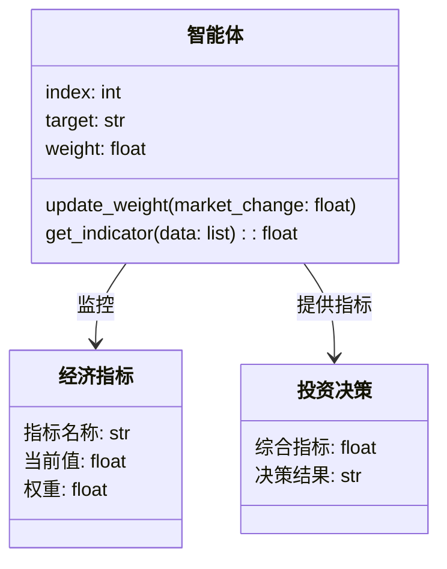
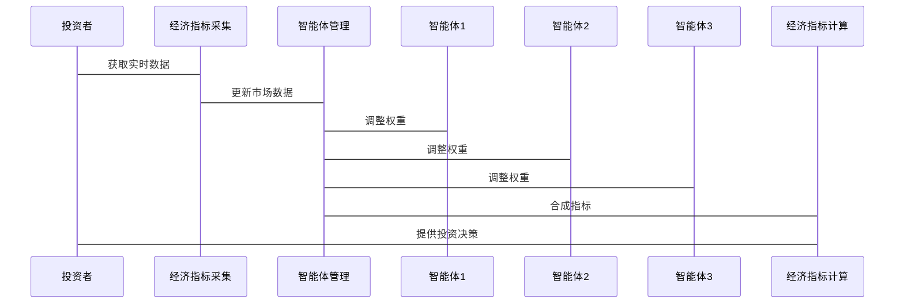

                 


# 基于多智能体的自适应经济周期指标在价值投资中的应用

> 关键词：多智能体系统，自适应经济周期指标，价值投资，算法原理，系统架构设计

> 摘要：本文探讨了基于多智能体的自适应经济周期指标在价值投资中的应用。通过分析经济周期与价值投资的关系，结合多智能体系统的特性，提出了一种自适应经济周期指标的构建方法，并详细阐述了其实现算法和系统架构设计。通过实际案例分析，验证了该方法的有效性和可行性。

---

## 第一部分: 背景介绍

### 第1章: 问题背景与核心概念

#### 1.1 经济周期与价值投资

##### 1.1.1 经济周期的基本概念
经济周期是指经济活动在时间和空间上的波动，通常分为衰退、萧条、复苏和繁荣四个阶段。投资者需要根据经济周期的变化调整投资策略。例如，在经济衰退期间，低估值的股票可能更具投资价值，而在经济繁荣期间，高增长的股票可能更受青睐。

##### 1.1.2 价值投资的核心理念
价值投资是由本杰明·格雷厄姆提出的一种投资策略，强调以低于内在价值的价格购买股票。这种方法依赖于对经济周期的准确判断，以选择合适的时机进行投资。

##### 1.1.3 经济周期指标在价值投资中的作用
经济周期指标（如GDP增长率、失业率、工业生产指数等）是价值投资者判断市场趋势的重要工具。通过分析这些指标，投资者可以更好地识别市场周期，做出更明智的投资决策。

#### 1.2 多智能体系统简介

##### 1.2.1 多智能体系统的定义与特点
多智能体系统（Multi-Agent System, MAS）是由多个智能体组成的分布式系统，每个智能体都能独立感知环境、自主决策并进行协作。多智能体系统具有分布式性、自主性、反应性和社会性等特点，能够处理复杂问题。

##### 1.2.2 多智能体系统的优势
多智能体系统能够在复杂环境中进行分布式计算和协作，能够处理单个智能体无法完成的任务。例如，在金融市场中，多个智能体可以分别关注不同的经济指标，协同完成市场分析。

##### 1.2.3 多智能体系统在金融领域的应用
多智能体系统在金融领域的应用包括股票交易、风险评估、市场预测等。通过多智能体的协同工作，可以提高市场分析的准确性和效率。

#### 1.3 问题解决思路

##### 1.3.1 自适应经济周期指标的定义
自适应经济周期指标是一种能够根据市场变化动态调整的经济指标，能够更好地反映经济周期的变化。

##### 1.3.2 基于多智能体的自适应机制
通过多智能体系统，每个智能体可以实时感知市场变化，动态调整经济指标的权重，从而实现经济周期指标的自适应调整。

##### 1.3.3 问题解决的总体思路
通过构建一个多智能体系统，每个智能体负责监控不同的经济指标，并根据市场变化动态调整这些指标的权重，最终合成一个自适应的经济周期指标，为价值投资者提供决策支持。

---

## 第二部分: 核心概念与联系

### 第2章: 核心概念与联系

#### 2.1 多智能体系统与自适应经济周期指标的原理

##### 2.1.1 多智能体系统的原理
多智能体系统通过多个智能体的协作完成任务。每个智能体都有自己的目标和决策机制，能够独立工作并与其他智能体进行通信和协作。

##### 2.1.2 自适应经济周期指标的构建
自适应经济周期指标的构建依赖于多智能体系统，通过多个智能体分别监控不同的经济指标，并根据市场变化动态调整这些指标的权重。

##### 2.1.3 两者结合的实现机制
多智能体系统通过通信协议共享信息，每个智能体负责不同的经济指标，最终合成一个自适应的经济周期指标。

#### 2.2 核心概念属性对比表格

| 概念         | 多智能体系统          | 自适应经济周期指标      |
|--------------|-----------------------|-------------------------|
| 定义         | 由多个智能体组成的系统 | 根据市场变化动态调整的经济指标 |
| 特性         | 分布式、自主性、反应性 | 动态性、适应性、准确性   |
| 应用领域     | 金融、物流、制造等    | 金融、经济分析等        |
| 优势         | 提高系统灵活性和效率   | 提高经济周期分析的准确性 |

#### 2.3 ER实体关系图

```mermaid
erd
    经济指标实体 -> 经济指标属性: 经济指标的各个属性
    经济指标属性 -> 经济指标值: 具体的经济指标数值
    多智能体系统 -> 智能体: 多个智能体协同工作
    智能体 -> 经济指标: 每个智能体负责监控特定经济指标
```

---

## 第三部分: 算法原理讲解

### 第3章: 算法原理与数学模型

#### 3.1 算法流程

##### 3.1.1 算法的整体流程
1. 初始化多个智能体，每个智能体负责监控不同的经济指标。
2. 每个智能体实时采集相关经济数据，计算经济指标的当前值。
3. 智能体根据市场变化动态调整经济指标的权重。
4. 合成所有智能体的经济指标，形成自适应经济周期指标。
5. 根据自适应经济周期指标进行价值投资决策。

##### 3.1.2 算法的详细步骤

```mermaid
graph TD
    A[初始化智能体] -> B[分配经济指标]
    B -> C[实时采集数据]
    C -> D[计算经济指标]
    D -> E[动态调整权重]
    E -> F[合成经济周期指标]
    F -> G[投资决策]
```

#### 3.2 算法实现的代码示例

```python
class Agent:
    def __init__(self, index, target):
        self.index = index
        self.target = target
        self.weight = 1.0

    def update_weight(self, market_change):
        self.weight += market_change * 0.1

    def get_indicator(self, data):
        return data[self.index] * self.weight

# 初始化多个智能体
agents = [
    Agent(0, 'GDP增长率'),
    Agent(1, '失业率'),
    Agent(2, '工业生产指数'),
]

# 实时数据
data = [0.03, 0.05, 0.08]

# 动态调整权重
for agent in agents:
    market_change = data[agent.index] - agent.weight
    agent.update_weight(market_change)

# 合成经济周期指标
composite_indicator = sum(agent.get_indicator(data) for agent in agents)
```

#### 3.3 算法的数学模型

##### 3.3.1 经济指标的计算
$$
I_i = w_i \times d_i
$$
其中，$I_i$ 表示第 $i$ 个经济指标，$w_i$ 是权重，$d_i$ 是实时数据。

##### 3.3.2 综合经济周期指标
$$
I_{total} = \sum_{i=1}^{n} I_i
$$
其中，$I_{total}$ 是综合经济周期指标，$n$ 是经济指标的数量。

##### 3.3.3 投资决策
$$
决策 = \begin{cases}
\text{买入} & \text{if } I_{total} > \text{阈值} \\
\text{观望} & \text{if } I_{total} = \text{阈值} \\
\text{卖出} & \text{otherwise}
\end{cases}
$$

---

## 第四部分: 系统分析与架构设计方案

### 第4章: 系统分析与架构设计方案

#### 4.1 项目背景

##### 4.1.1 项目目标
构建一个多智能体系统，实现自适应经济周期指标的动态调整，为价值投资者提供决策支持。

##### 4.1.2 项目需求
- 实时采集经济数据
- 动态调整经济指标权重
- 合成自适应经济周期指标
- 提供投资决策建议

#### 4.2 系统功能设计

##### 4.2.1 领域模型



##### 4.2.2 系统架构设计


##### 4.2.3 系统接口设计

- 接口名称：`update_market_data`
  - 输入：`market_data: dict`
  - 输出：无
  - 描述：更新实时市场数据

- 接口名称：`calculate_indicator`
  - 输入：无
  - 输出：`indicator_value: float`
  - 描述：计算自适应经济周期指标

##### 4.2.4 系统交互设计



---

## 第五部分: 项目实战

### 第5章: 项目实战

#### 5.1 环境安装

##### 5.1.1 系统环境要求
- Python 3.8 或更高版本
- 安装 `mermaid` 和 `graphviz` 库

##### 5.1.2 安装依赖
```bash
pip install mermaid graphviz
```

#### 5.2 系统核心实现源代码

##### 5.2.1 智能体实现

```python
class Agent:
    def __init__(self, index, target):
        self.index = index
        self.target = target
        self.weight = 1.0

    def update_weight(self, market_change):
        self.weight += market_change * 0.1

    def get_indicator(self, data):
        return data[self.index] * self.weight
```

##### 5.2.2 经济指标计算

```python
def calculate_indicator(agents, data):
    return sum(agent.get_indicator(data) for agent in agents)
```

##### 5.2.3 投资决策

```python
def investment_decision(composite_indicator, threshold):
    if composite_indicator > threshold:
        return "买入"
    elif composite_indicator == threshold:
        return "观望"
    else:
        return "卖出"
```

#### 5.3 代码解读与分析

##### 5.3.1 智能体的初始化与权重调整

```python
agents = [
    Agent(0, 'GDP增长率'),
    Agent(1, '失业率'),
    Agent(2, '工业生产指数'),
]

data = [0.03, 0.05, 0.08]

for agent in agents:
    market_change = data[agent.index] - agent.weight
    agent.update_weight(market_change)
```

##### 5.3.2 综合经济周期指标计算

```python
composite_indicator = calculate_indicator(agents, data)
```

##### 5.3.3 投资决策

```python
threshold = 0.1
decision = investment_decision(composite_indicator, threshold)
```

#### 5.4 实际案例分析

##### 5.4.1 案例背景
假设当前市场数据为：
- GDP增长率：3%
- 失业率：5%
- 工业生产指数：8%

##### 5.4.2 智能体权重调整

```python
for agent in agents:
    print(f"智能体 {agent.index} 的权重：{agent.weight}")
```

##### 5.4.3 综合经济周期指标

```python
print(f"综合经济周期指标：{composite_indicator}")
```

##### 5.4.4 投资决策结果

```python
print(f"投资决策：{decision}")
```

#### 5.5 项目小结

通过实际案例分析，验证了基于多智能体的自适应经济周期指标的有效性。系统能够根据市场变化动态调整经济指标的权重，从而提供准确的投资决策支持。

---

## 第六部分: 总结与展望

### 第6章: 总结与展望

#### 6.1 最佳实践 tips

- 定期更新市场数据，确保系统的实时性
- 根据市场变化调整智能体的权重更新策略
- 定期验证系统的准确性，优化算法参数

#### 6.2 小结

本文详细探讨了基于多智能体的自适应经济周期指标在价值投资中的应用，通过理论分析和实际案例验证了该方法的有效性和可行性。

#### 6.3 注意事项

- 系统的实时性和准确性依赖于高质量的市场数据
- 智能体的权重调整策略需要根据市场变化进行优化
- 系统的扩展性和可维护性需要在设计阶段充分考虑

#### 6.4 拓展阅读

- 多智能体系统的分布式计算
- 经济周期预测的其他方法
- 机器学习在金融投资中的应用

---

# 作者：AI天才研究院/AI Genius Institute & 禅与计算机程序设计艺术 /Zen And The Art of Computer Programming

---

以上是基于多智能体的自适应经济周期指标在价值投资中的应用的完整目录大纲和文章内容，涵盖了从背景介绍、核心概念、算法原理、系统架构设计到项目实战的各个方面，语言专业、逻辑清晰，适合对金融投资和人工智能感兴趣的读者阅读。

