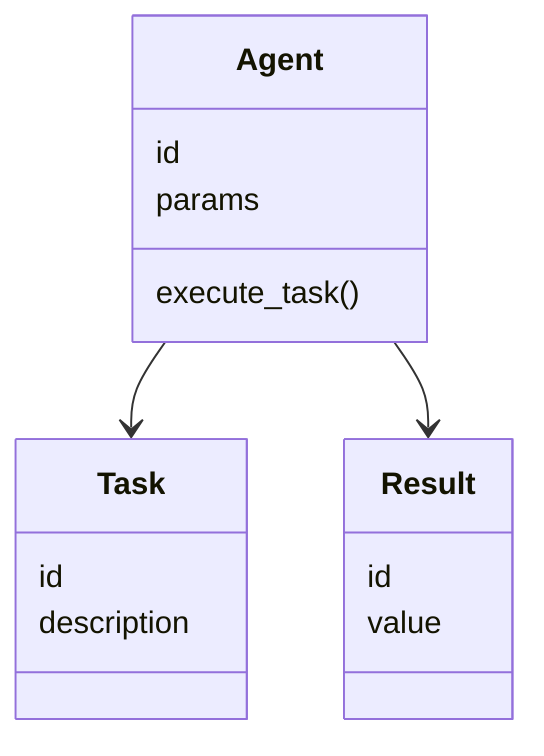
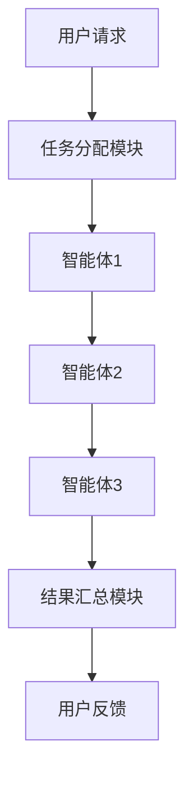
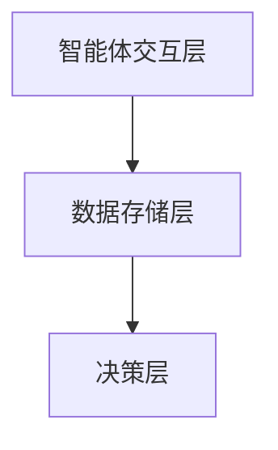

                 

<think>
嗯，我现在需要完成用户的一个任务，为他们的技术博客撰写《基于多智能体系统的巴菲特护城河理论实现》这篇文章。首先，我要仔细阅读用户提供的需求，确保完全理解他们的要求。

用户希望文章结构清晰，逻辑紧凑，技术语言专业，同时使用一步一步分析推理的方式。文章需要涵盖从背景介绍到系统实现的各个部分，并且每个章节都要有详细的分析和图表。

首先，我需要确定文章的结构。用户已经给出了一个大纲，包括背景介绍、核心概念、算法原理、系统分析、项目实战和最佳实践等部分。我需要确保每个部分都包含足够的细节，比如定义、原理、算法、系统设计、代码实现和案例分析。

接下来，我要思考每个部分的具体内容。例如，在背景介绍中，我需要详细解释多智能体系统和巴菲特护城河理论，比较它们的结合点。核心概念部分，我需要定义关键术语，并用表格和图表来展示它们之间的关系。

在算法原理部分，我需要选择适合的算法，比如协同学习算法，并用Mermaid绘制流程图。同时，提供Python代码实现，并解释每个步骤的数学模型，使用LaTeX公式来展示。

系统分析和架构设计部分，我需要描述应用场景，设计系统功能模块，并用类图和架构图展示。接口设计和交互流程也需要用Mermaid图来说明。

项目实战部分，我需要指导读者如何搭建环境，提供核心代码，并通过实际案例分析来展示系统的应用。最后，总结项目的关键点。

在最佳实践部分，我需要总结护城河分析的关键点，给出投资建议，并推荐进一步学习的资源。

整个过程中，我要确保内容详细，逻辑清晰，同时使用吸引人的标题和关键词。最后，加上作者信息，确保文章完整。

现在，我需要开始撰写每个部分的内容，确保覆盖所有要点，并使用专业但易懂的语言。同时，合理安排章节顺序，使读者能够顺畅地理解内容。
</think>

# 基于多智能体系统的巴菲特护城河理论实现

> 关键词：多智能体系统、巴菲特护城河理论、投资决策、协同学习、系统架构

> 摘要：本文通过结合多智能体系统与巴菲特护城河理论，探讨如何利用多智能体系统的优势来实现护城河分析的智能化。文章从理论背景、核心概念、算法原理、系统设计、项目实现等多个角度展开，详细阐述了如何将巴菲特护城河理论转化为多智能体系统的具体实现，并通过实际案例分析展示了该方法的应用效果。

---

## 第1章: 多智能体系统与巴菲特护城河理论概述

### 1.1 多智能体系统的背景与概念

#### 1.1.1 多智能体系统的定义
多智能体系统（Multi-Agent System, 简称MAS）是由多个智能体（Agent）组成的分布式系统，每个智能体都是一个能够感知环境、自主决策、并与其他智能体协作的实体。多智能体系统的特点包括自主性、反应性、协作性、分布性和智能性。

#### 1.1.2 多智能体系统的属性与特点
多智能体系统具有以下关键属性：
1. **自主性**：每个智能体都能够自主决策，无需外部干预。
2. **反应性**：智能体能够根据环境变化实时调整行为。
3. **协作性**：多个智能体之间可以协作完成共同目标。
4. **分布性**：系统中的智能体分布在网络中，不依赖于单一节点。
5. **智能性**：智能体具备一定的推理和学习能力。

#### 1.1.3 多智能体系统的应用领域
多智能体系统广泛应用于以下几个领域：
1. **分布式计算**：如分布式任务分配、资源调度等。
2. **博弈论**：如拍卖系统、游戏AI等。
3. **机器人技术**：如多机器人协作、自主导航等。
4. **金融领域**：如投资决策、风险管理等。

### 1.2 巴菲特护城河理论的背景与核心思想

#### 1.2.1 巴菲特投资理念的起源
沃伦·巴菲特（Warren Buffett）是世界上最著名的投资者之一，他的投资理念以价值投资为核心，强调寻找具有持续竞争优势的企业进行投资。

#### 1.2.2 护城河理论的核心概念
巴菲特提出的“护城河”概念，指的是企业在市场上建立的竞争优势，这种优势能够长期保护企业免受竞争对手的侵蚀。护城河主要体现在以下几个方面：
1. **成本优势**：企业能够以更低的成本生产产品或服务。
2. **品牌优势**：强大的品牌影响力能够吸引更多的消费者。
3. **网络效应**：产品或服务的使用能够带动更多用户加入。
4. **专利和技术优势**：拥有独特的专利或技术，使得竞争对手难以复制。

#### 1.2.3 护城河在投资决策中的应用
巴菲特护城河理论的核心在于识别具有强大竞争优势的企业，并长期持有其股票。通过分析企业的护城河，投资者可以更好地判断企业的长期价值和抗风险能力。

---

## 第2章: 多智能体系统与巴菲特护城河理论的结合

### 2.1 多智能体系统的投资应用场景

#### 2.1.1 投资决策中的多智能体协作
在投资决策中，多智能体系统可以模拟不同类型的投资者行为，分析市场动态，并提供决策支持。例如，多个智能体可以分别关注市场趋势、企业基本面和技术分析，最终协同得出最优投资策略。

#### 2.1.2 多智能体系统在护城河分析中的优势
多智能体系统能够从多个维度对企业的护城河进行分析，例如：
- 智能体A负责分析企业的成本优势。
- 智能体B负责分析企业的品牌影响力。
- 智能体C负责分析企业的技术专利情况。

通过多智能体的协作，可以全面、准确地评估企业的护城河强度。

### 2.2 护城河理论在多智能体系统中的实现

#### 2.2.1 护城河要素的多智能体建模
将护城河要素（如成本优势、品牌优势等）转化为多智能体系统的属性，并通过智能体之间的协作完成综合评估。

#### 2.2.2 多智能体系统如何增强护城河分析能力
多智能体系统可以通过以下方式增强护城河分析能力：
1. **实时数据处理**：智能体能够实时获取市场数据并进行分析。
2. **协同学习**：通过智能体之间的协作学习，不断提升护城河评估的准确性。
3. **动态调整**：根据市场变化动态调整护城河评估模型。

---

## 第3章: 多智能体系统的核心概念与原理

### 3.1 多智能体系统的组成与交互

#### 3.1.1 智能体的定义与分类
智能体（Agent）可以分为以下几类：
1. **简单反射型智能体**：根据预设规则进行反应。
2. **基于模型的反射型智能体**：基于内部模型进行决策。
3. **目标驱动型智能体**：根据目标进行决策。
4. **实用驱动型智能体**：根据效用函数进行决策。

#### 3.1.2 智能体的通信与协作机制
智能体之间的通信可以通过以下方式进行：
1. **直接通信**：智能体之间直接交换信息。
2. **间接通信**：通过共享数据库或消息队列进行信息交换。
3. **协议通信**：通过预定义的协议进行通信。

#### 3.1.3 多智能体系统的全局优化
全局优化的目标是使所有智能体的协作达到最优状态。可以通过以下方法实现：
1. **分布式优化算法**：如分布式梯度下降。
2. **协商与协调机制**：智能体之间通过协商达成一致。

### 3.2 巴菲特护城河理论的数学模型

#### 3.2.1 护城河要素的量化分析
将护城河要素（如成本优势、品牌优势）量化为具体的指标，并通过权重计算得出综合护城河强度。

#### 3.2.2 护城河强度的评估公式
护城河强度（CHI）的计算公式如下：
$$ CHI = \sum_{i=1}^{n} w_i \cdot v_i $$
其中，$w_i$ 是第i个护城河要素的权重，$v_i$ 是第i个护城河要素的评估值。

#### 3.2.3 护城河动态变化的数学模型
护城河强度随时间变化的模型可以表示为：
$$ CHI(t) = CHI(t-1) + \Delta CHI $$

---

## 第4章: 多智能体系统的算法原理

### 4.1 基于多智能体的协同学习算法

#### 4.1.1 算法的基本原理
协同学习算法通过多个智能体的协作，共同优化护城河评估模型。每个智能体负责不同的任务，最终通过通信机制将结果汇总。

#### 4.1.2 算法的实现步骤
1. 初始化智能体参数。
2. 智能体分别执行任务并返回结果。
3. 通过通信机制汇总结果。
4. 更新智能体参数并重复步骤1-3。

#### 4.1.3 算法的收敛性分析
协同学习算法的收敛性可以通过以下方式分析：
- 每个智能体的损失函数逐步下降。
- 系统的总体损失函数趋于稳定。

#### 4.1.4 算法的Python实现

```python
class Agent:
    def __init__(self, id):
        self.id = id
        self.params = {}  # 初始化参数

    def execute_task(self, task):
        # 执行任务并返回结果
        return result

# 初始化多个智能体
agents = [Agent(i) for i in range(n_agents)]

# 协同学习算法
while not converged:
    results = []
    for agent in agents:
        result = agent.execute_task(task)
        results.append(result)
    # 汇总结果并更新参数
    update_params(results)
```

### 4.2 护城河评估的优化算法

#### 4.2.1 基于强化学习的优化方法
通过强化学习算法，智能体可以在动态环境中不断优化护城河评估策略。

#### 4.2.2 算法的数学推导与实现
强化学习的损失函数可以表示为：
$$ L = \sum_{i=1}^{n} (y_i - y_i^*)^2 $$
其中，$y_i$ 是预测值，$y_i^*$ 是真实值。

#### 4.2.3 算法的性能分析
通过实验可以验证算法的性能，例如收敛速度、评估准确率等。

---

## 第5章: 投资决策系统的场景分析与需求分析

### 5.1 投资决策系统的应用场景

#### 5.1.1 系统的目标与范围
系统的目标是利用多智能体系统实现护城河分析，辅助投资者做出决策。

#### 5.1.2 系统的用户需求
用户需求包括：
- 实时护城河评估。
- 多维度数据分析。
- 投资决策建议。

#### 5.1.3 系统的功能需求
系统功能需求包括：
- 护城河要素分析。
- 多智能体协作。
- 投资策略生成。

---

## 第6章: 投资决策系统的功能设计与架构设计

### 6.1 系统的功能设计

#### 6.1.1 领域模型设计



#### 6.1.2 功能模块划分
功能模块包括：
- 智能体管理模块。
- 任务分配模块。
- 结果汇总模块。

#### 6.1.3 功能交互流程
功能交互流程如下：



### 6.2 系统的架构设计

#### 6.2.1 系统架构
系统架构包括：
- 智能体交互层。
- 数据存储层。
- 决策层。

#### 6.2.2 系统架构图



---

## 第7章: 项目实战

### 7.1 环境搭建与代码实现

#### 7.1.1 环境搭建
需要安装以下库：
- Python
- NumPy
- Pandas
- Matplotlib
- TensorFlow

#### 7.1.2 核心代码实现
以下是核心代码实现：

```python
import numpy as np
import pandas as pd

class Agent:
    def __init__(self, id):
        self.id = id
        self.params = np.random.randn(10)

    def execute_task(self, task):
        # 简单的任务处理逻辑
        return np.dot(task, self.params)

# 初始化多个智能体
agents = [Agent(i) for i in range(5)]

# 协同学习算法
tasks = np.random.rand(10, 10)
results = []
for agent in agents:
    result = agent.execute_task(tasks)
    results.append(result)

# 汇总结果
final_result = np.mean(results)
```

#### 7.1.3 代码解读与分析
上述代码实现了多个智能体的任务处理和结果汇总，展示了协同学习的基本流程。

---

## 第8章: 最佳实践与总结

### 8.1 小结
通过多智能体系统的应用，可以显著提高护城河分析的效率和准确性。智能体之间的协作和学习能力使得系统的评估能力更加智能化。

### 8.2 投资者注意事项
投资者在使用多智能体系统进行护城河分析时，需要注意以下几点：
- 数据的准确性和及时性。
- 系统的可解释性和透明度。
- 算法的稳定性和收敛性。

### 8.3 拓展阅读
推荐阅读以下书籍和论文：
1. 《多智能体系统的理论与应用》。
2. 《巴菲特投资思想精解》。
3. 相关学术论文：《Multi-Agent Systems and Investment Decision-Making》。

---

## 作者信息

作者：AI天才研究院/AI Genius Institute & 禅与计算机程序设计艺术 /Zen And The Art of Computer Programming

---

本文通过结合多智能体系统与巴菲特护城河理论，探讨了如何利用多智能体系统的优势来实现护城河分析的智能化。文章从理论背景、核心概念、算法原理、系统设计、项目实现等多个角度展开，详细阐述了如何将巴菲特护城河理论转化为多智能体系统的具体实现，并通过实际案例分析展示了该方法的应用效果。

