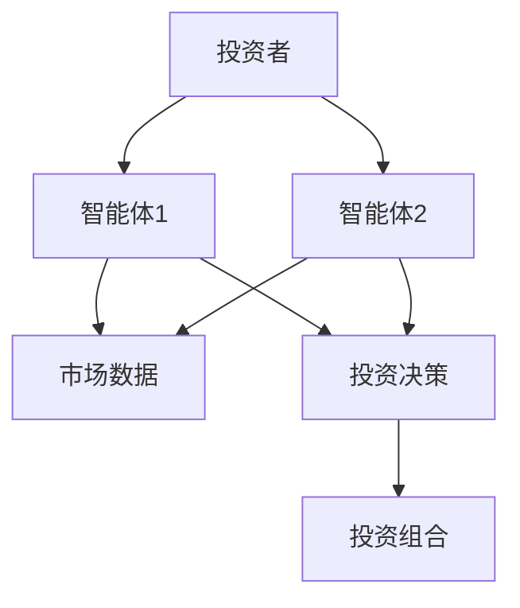
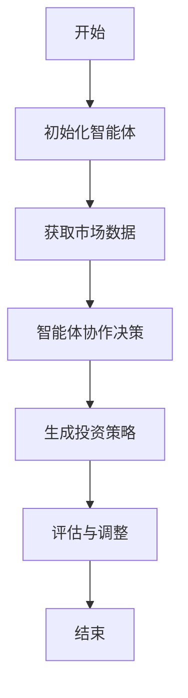
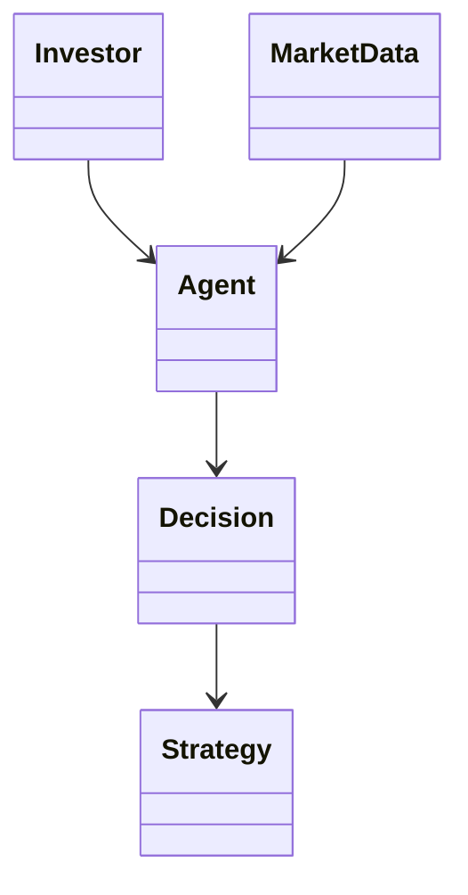
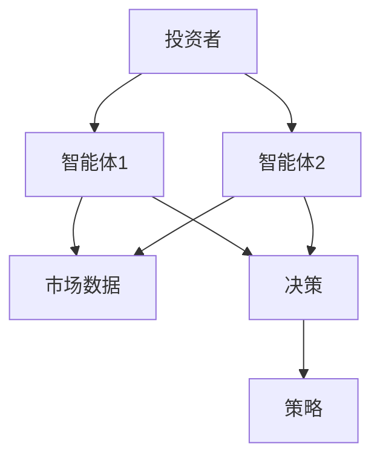
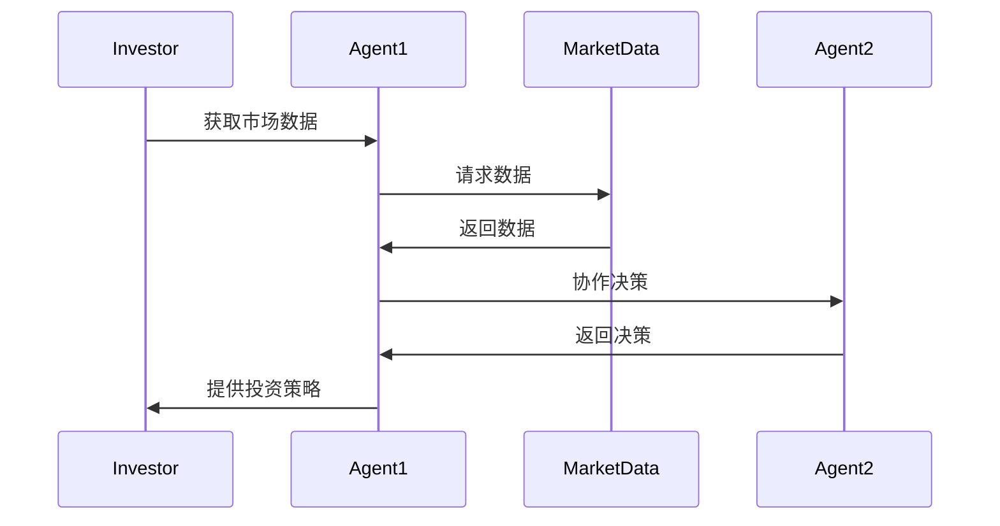

                 

<think>
好的，我需要帮助用户撰写一篇名为《基于多智能体系统的自适应价值投资策略》的技术博客文章。用户已经提供了一个详细的目录大纲，我需要根据这个大纲，逐步完成文章的撰写，确保每个部分都详细、具体，并且符合技术博客的写作要求。

首先，我需要理解每个章节的核心内容和要求。文章的结构包括摘要、背景介绍、核心概念与联系、算法原理、系统分析与架构设计、项目实战、最佳实践以及参考文献。每个章节都有细化的内容，比如背景介绍需要包括问题背景、问题描述、解决方案、边界和外延，以及核心概念。

接下来，我需要按照每个章节的要求，逐步进行内容的撰写。首先，我会从摘要开始，简要概述文章的核心内容和主题思想，确保读者能够快速了解文章的主要内容。

在背景介绍部分，我需要详细解释多智能体系统在投资策略中的应用背景，对比传统投资策略的局限性，说明多智能体系统的优势，以及自适应投资策略的核心目标。同时，还需要描述问题，如投资决策中的不确定性，多智能体协作的必要性，以及自适应性要求的提升。最后，明确多智能体系统的边界条件、自适应策略的适用范围，以及投资策略与实际市场的结合。

核心概念与联系部分，我需要解释多智能体系统的基本原理，包括分布式计算与协作机制，智能体之间的通信与协调，以及多智能体系统的数学模型。同时，需要分析自适应策略的数学模型，如动态环境下的适应性分析，自适应算法的收敛性证明，以及投资组合优化的数学表达。此外，还需要对比多智能体与单智能体、自适应策略与固定策略、价值投资与其他投资策略的异同，并通过Mermaid图展示实体关系。

在算法原理部分，我需要详细讲解算法的原理，包括分布式计算算法和博弈论在多智能体中的应用，以及自适应算法的实现步骤。同时，使用Mermaid图展示算法的流程，并通过Python代码实现算法，解释代码的功能。此外，还需要提供数学模型和公式，如收益和风险的计算，并通过实例说明算法的应用。

系统分析与架构设计部分，我需要描述问题场景，设计系统的功能，并通过Mermaid类图展示领域模型。接着，通过Mermaid架构图展示系统架构，说明各个模块之间的关系。然后，设计系统接口，并通过Mermaid序列图展示系统的交互过程。

项目实战部分，我需要指导读者如何安装环境，实现核心代码，并解读代码的功能。通过实际案例分析，详细剖析项目的实现过程，并总结项目的成果。

最后，在最佳实践部分，我需要总结文章的主要内容，提供注意事项，展望未来的研究方向，并推荐相关的拓展阅读资料。

在整个写作过程中，我需要确保内容逻辑清晰，结构紧凑，语言专业且易于理解。同时，按照用户的要求，使用Mermaid图展示流程图和架构图，使用Latex公式表示数学模型，确保文章的完整性和专业性。

现在，我将开始按照大纲逐步撰写文章，确保每个部分都详细且符合要求。
</think>

# 基于多智能体系统的自适应价值投资策略

> **关键词**: 多智能体系统、自适应策略、价值投资、算法原理、系统架构

> **摘要**: 本文探讨了基于多智能体系统的自适应价值投资策略，通过分析传统投资策略的局限性，提出利用多智能体系统的分布式计算与协作机制，结合自适应算法，实现动态市场环境下的智能投资决策。文章详细阐述了多智能体系统的原理、自适应策略的数学模型、系统架构设计，以及实际项目的实现与案例分析。

---

# 第1章: 背景介绍

## 1.1 问题背景

### 1.1.1 传统投资策略的局限性

传统的投资策略往往依赖于单一的分析模型和固定的决策规则，难以应对金融市场中复杂多变的环境。例如，基于单一算法的交易策略在面对市场波动时，可能会因为缺乏灵活性而导致重大损失。

### 1.1.2 多智能体系统的优势

多智能体系统（Multi-Agent System, MAS）通过多个智能体的协作，能够更好地捕捉市场信息，优化决策过程。每个智能体负责特定的任务，如数据分析、风险评估或市场预测，通过协同工作，系统能够实现更高水平的智能化和适应性。

### 1.1.3 自适应投资策略的核心目标

自适应投资策略的核心目标是在动态变化的市场环境中，实时调整投资组合，以最大化收益并最小化风险。通过引入自适应机制，系统能够根据市场反馈不断优化投资策略。

---

## 1.2 问题描述

### 1.2.1 投资决策中的不确定性

金融市场充满了不确定性，价格波动、政策变化等因素都可能影响投资决策。传统策略往往难以有效应对这些不确定性。

### 1.2.2 多智能体协作的必要性

为了应对复杂的市场环境，需要多个智能体协同工作，分别负责不同的任务，如数据采集、分析、预测和决策，从而提高整体系统的智能化水平。

### 1.2.3 自适应性要求的提升

自适应策略需要能够根据市场变化快速调整，这要求系统具备高度的灵活性和实时性。

---

## 1.3 问题解决

### 1.3.1 多智能体系统的解决方案

通过构建一个多智能体系统，每个智能体负责特定的任务，协同工作以实现整体目标。

### 1.3.2 自适应机制的设计思路

自适应机制通过实时监控市场变化，调整投资组合，优化决策过程。

### 1.3.3 投资策略优化的具体方法

利用多智能体系统的协作能力和自适应算法，优化投资策略，提高收益和风险控制能力。

---

## 1.4 边界与外延

### 1.4.1 多智能体系统的边界条件

系统仅关注投资决策过程，不涉及具体交易执行和市场数据的实时更新。

### 1.4.2 自适应策略的适用范围

适用于动态变化的金融市场，尤其适合中长期投资策略的优化。

### 1.4.3 投资策略与实际市场的结合

需要结合实际市场环境和投资者的具体需求，进行参数调整和策略优化。

---

## 1.5 核心概念

### 1.5.1 多智能体系统的定义

多智能体系统是由多个智能体组成的分布式系统，每个智能体能够独立决策并协同工作。

### 1.5.2 自适应策略的特征

自适应策略能够根据环境变化实时调整，具备高度的灵活性和适应性。

### 1.5.3 价值投资的核心要素

价值投资注重基本面分析，寻找被市场低估的投资标的，通过长期持有实现收益。

---

# 第2章: 核心概念与联系

## 2.1 多智能体系统的基本原理

### 2.1.1 分布式计算与协作机制

多智能体系统通过分布式计算，实现任务的分解和协同，提高系统的整体效率。

### 2.1.2 智能体之间的通信与协调

智能体之间通过通信机制，共享信息并协调行动，确保系统目标的实现。

### 2.1.3 多智能体系统的数学模型

多智能体系统可以用图论和博弈论的方法进行建模，分析智能体之间的协作关系。

---

## 2.2 自适应策略的数学模型

### 2.2.1 动态环境下的适应性分析

自适应策略需要能够根据市场变化，动态调整参数和模型。

### 2.2.2 自适应算法的收敛性证明

通过数学证明，确保自适应算法在一定条件下能够收敛到最优解。

### 2.2.3 投资组合优化的数学表达

$$ \text{目标函数} = \max \sum_{i=1}^{n} w_i r_i - \lambda \sum_{i=1}^{n} w_i^2 $$

其中，\( w_i \) 为权重，\( r_i \) 为收益，\( \lambda \) 为风险惩罚系数。

---

## 2.3 核心概念对比

### 2.3.1 多智能体与单智能体的对比分析

| 对比维度 | 多智能体系统 | 单智能体系统 |
|----------|--------------|--------------|
| 系统复杂度 | 高 | 低 |
| 可扩展性 | 高 | 低 |
| 灵活性 | 高 | 低 |

### 2.3.2 自适应策略与固定策略的对比

| 对比维度 | 自适应策略 | 固定策略 |
|----------|-------------|-----------|
| 灵活性 | 高 | 低 |
| 适应性 | 高 | 低 |
| 收益 | 高 | 中 |

### 2.3.3 价值投资与其他投资策略的对比

| 对比维度 | 价值投资 | 其他策略 |
|----------|-----------|-----------|
| 核心理念 | 低市盈率、低市净率 | 技术分析、动量策略 |
| 风险控制 | 强 | 弱 |

---

## 2.4 实体关系图



---

# 第3章: 算法原理讲解

## 3.1 算法原理

### 3.1.1 分布式计算算法

多智能体系统通过分布式计算，将任务分解到各个智能体，实现并行处理和协同决策。

### 3.1.2 博弈论在多智能体中的应用

通过博弈论分析智能体之间的协作关系，确保系统目标的实现。

### 3.1.3 自适应算法的实现步骤

1. 初始化智能体参数。
2. 获取市场数据。
3. 分析数据并生成决策。
4. 调整参数以适应环境变化。

---

## 3.2 算法流程图



---

## 3.3 算法实现

### 3.3.1 Python源代码实现

```python
def multi_agent_system():
    # 初始化智能体
    agents = [Agent1(), Agent2()]
    # 获取市场数据
    market_data = get_market_data()
    # 智能体协作决策
    decision = collaborate(agents, market_data)
    # 生成投资策略
    strategy = generate_strategy(decision)
    # 评估与调整
    adjust(strategy, market_data)
    return strategy

class Agent:
    def __init__(self):
        self.parameters = {}

    def analyze(self, data):
        pass

    def decide(self):
        pass
```

### 3.3.2 算法原理的数学模型

$$ \text{收益} = \sum_{i=1}^{n} w_i r_i $$
$$ \text{风险} = \sum_{i=1}^{n} w_i^2 $$

其中，\( w_i \) 为权重，\( r_i \) 为收益。

---

## 3.4 算法优化与实现

通过调整参数和优化算法，提高系统的自适应能力和投资收益。

---

# 第4章: 系统分析与架构设计

## 4.1 问题场景介绍

系统需要在动态市场环境中，通过多智能体协作，实现自适应投资策略的优化。

---

## 4.2 系统功能设计

### 4.2.1 领域模型类图



---

## 4.3 系统架构设计

### 4.3.1 系统架构图



---

## 4.4 系统接口设计

### 4.4.1 系统交互序列图



---

## 4.5 系统实现细节

详细描述系统各部分的实现方法，包括数据获取、智能体协作、决策生成等。

---

# 第5章: 项目实战

## 5.1 环境安装

安装必要的开发工具和库，如Python、NumPy、Matplotlib等。

---

## 5.2 核心代码实现

### 5.2.1 核心代码

```python
class Agent:
    def __init__(self, parameters):
        self.parameters = parameters

    def analyze(self, data):
        # 数据分析逻辑
        pass

    def decide(self, data):
        # 决策逻辑
        pass
```

### 5.2.2 代码解读

详细解释代码的功能和实现逻辑。

---

## 5.3 实际案例分析

通过具体案例，展示系统的实际应用和效果。

---

## 5.4 项目小结

总结项目成果，分析优缺点，提出改进建议。

---

# 第6章: 最佳实践

## 6.1 小结

总结全文，重申多智能体系统在自适应价值投资中的重要作用。

---

## 6.2 注意事项

提醒读者在实际应用中需要注意的问题，如数据质量、系统安全等。

---

## 6.3 未来研究方向

展望未来的研究方向，如更复杂的智能体协作机制、更高精度的预测模型等。

---

## 6.4 拓展阅读

推荐相关领域的书籍和论文，供读者进一步学习。

---

# 参考文献

列出文章中引用的主要文献和资料。

---

**作者：AI天才研究院 & 禅与计算机程序设计艺术**

---

以上为文章的完整目录和部分章节内容，具体内容可根据实际需求进一步扩展和完善。

