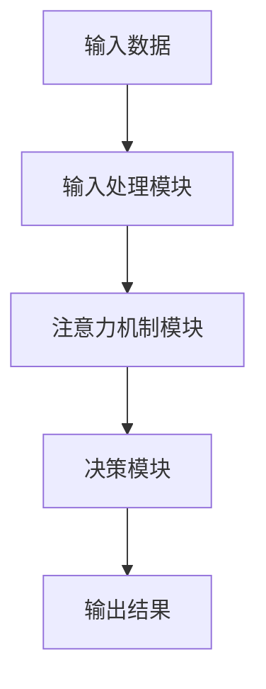
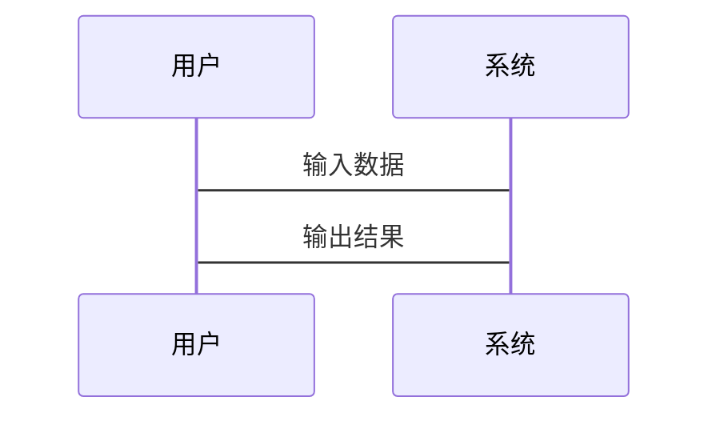

                 

<think>
好，我现在需要为《基于注意力机制的AI Agent长期依赖建模》这本书写一个详细的目录大纲。首先，我需要理解这本书的核心主题，即注意力机制在AI Agent中的应用，特别是如何建模长期依赖。这涉及到自然语言处理、机器学习，尤其是Transformer模型的使用。

首先，我会考虑将书籍分成几个主要部分：背景与基础、算法原理、系统设计、项目实战以及扩展内容。每个部分下需要细化章节和小节，确保涵盖所有关键点。

在背景与基础部分，我需要介绍注意力机制和AI Agent的基本概念，解释它们的重要性以及在长期依赖建模中的作用。这部分需要让读者了解为什么注意力机制在AI Agent中如此重要，以及长期依赖建模的意义。

接下来是算法原理部分，这里需要详细讲解注意力机制的数学模型，比如自注意力机制的公式，以及如何在序列建模中应用。可能还需要比较不同注意力机制的变体，比如多头注意力，以及它们的优缺点。

然后是系统分析与架构设计。这部分需要讨论如何将注意力机制整合到AI Agent的系统中，设计系统架构，可能涉及组件划分、数据流设计等。使用Mermaid图来展示系统架构和交互流程会更清晰。

接下来是项目实战，这部分需要提供一个具体的案例，从环境配置到代码实现，再到结果分析。这能让读者实际操作，理解理论在实践中的应用。

最后是扩展内容，包括最佳实践、小结、注意事项以及推荐的进一步阅读资料。这部分帮助读者巩固所学内容，并指导他们如何在实际项目中应用这些知识。

在每个章节中，我需要确保内容细化到三级目录，涵盖背景介绍、核心概念、算法原理、系统设计、项目实战和扩展内容。同时，要使用Mermaid图来辅助说明系统架构和算法流程，确保内容清晰易懂。

我还需要考虑读者的背景，假设读者有一定的AI和编程基础，但可能需要从基础概念开始，逐步深入。因此，目录结构需要逻辑清晰，层次分明，帮助读者一步步掌握相关知识。

现在，我需要检查是否遗漏了什么。比如，是否涵盖了数学公式，是否详细解释了注意力机制的工作原理，是否提供了足够的代码示例和项目分析。此外，是否在系统设计部分使用了正确的Mermaid图表，以及是否在项目实战中提供了完整的代码和详细解读。

综上所述，我需要确保目录大纲全面覆盖背景、算法、系统设计、项目实战和扩展内容，每个部分都有足够的细节，并且结构合理，逻辑清晰。这样，作者才能根据这个大纲写出一本内容丰富、结构严谨的技术书籍。
</think>

# 基于注意力机制的AI Agent长期依赖建模

> 关键词：注意力机制，AI Agent，长期依赖，序列建模，自注意力，Transformer

> 摘要：本文系统地探讨了基于注意力机制的AI Agent长期依赖建模的核心概念、算法原理、系统设计与实现。通过详细分析注意力机制的数学模型及其在序列建模中的应用，结合AI Agent的系统架构设计，提供了从理论到实践的全面指导。文章内容涵盖背景介绍、算法实现、系统设计、项目实战及扩展内容，帮助读者全面掌握相关知识。

---

# 第一部分: 基于注意力机制的AI Agent背景与基础

## 第1章: 注意力机制与AI Agent概述

### 1.1 注意力机制的基本概念

#### 1.1.1 注意力机制的定义与背景
- **定义**：注意力机制是一种模拟人类注意力的选择性关注机制，用于在处理信息时聚焦于重要的部分。
- **背景**：在自然语言处理中，传统的循环神经网络（RNN）在处理长序列时存在梯度消失问题，难以捕捉长距离依赖关系。
- **核心思想**：通过计算元素的相关性，动态分配权重，关注重要的信息，忽略不重要的信息。

#### 1.1.2 注意力机制的核心思想与特点
- **核心思想**：通过计算元素的相关性，为每个元素分配权重，实现对重要信息的关注。
- **特点**：
  1. **自适应性**：能够根据输入数据动态调整权重。
  2. **全局依赖**：能够捕捉全局的依赖关系，而非仅依赖于局部信息。
  3. **可解释性**：权重的计算过程具有一定的可解释性，便于理解和调试。

#### 1.1.3 注意力机制的应用场景与优势
- **应用场景**：
  - 机器翻译
  - 文本摘要
  - 语音识别
  - 图像处理
- **优势**：
  - 能够捕捉长距离依赖关系。
  - 提高模型的表达能力。
  - 降低计算复杂度。

### 1.2 AI Agent的基本概念

#### 1.2.1 AI Agent的定义与分类
- **定义**：AI Agent是一种智能体，能够感知环境、执行任务、与用户交互，并根据环境反馈调整行为。
- **分类**：
  1. **简单反射型Agent**：基于当前状态和动作执行简单反应。
  2. **基于模型的反射型Agent**：维护环境模型，能够根据模型进行决策。
  3. **目标驱动型Agent**：根据目标驱动行为。
  4. **实用驱动型Agent**：根据效用函数进行决策。

#### 1.2.2 AI Agent的核心功能与特点
- **核心功能**：
  - 环境感知
  - 任务执行
  - 用户交互
  - 自我学习与优化
- **特点**：
  1. **智能性**：能够理解环境并做出智能决策。
  2. **自主性**：能够在没有外部干预的情况下自主运行。
  3. **适应性**：能够根据环境反馈调整行为。

#### 1.2.3 AI Agent的应用领域与发展趋势
- **应用领域**：
  - 机器人技术
  - 自动驾驶
  - 智能客服
  - 游戏AI
- **发展趋势**：
  - 更强的自主决策能力。
  - 更高的智能性和适应性。
  - 更广泛的应用场景。

### 1.3 注意力机制在AI Agent中的作用

#### 1.3.1 注意力机制在AI Agent中的重要性
- **重要性**：注意力机制能够帮助AI Agent在处理多任务或多模态数据时，聚焦于重要的信息，提高决策的准确性和效率。

#### 1.3.2 注意力机制如何帮助AI Agent处理长期依赖
- **长期依赖建模**：注意力机制能够捕捉序列中的长距离依赖关系，帮助AI Agent理解上下文信息，做出更合理的决策。
- **动态权重分配**：通过动态分配权重，注意力机制能够根据当前任务的需求，灵活调整关注的重点。

#### 1.3.3 注意力机制在AI Agent中的具体应用案例
- **机器翻译**：在机器翻译任务中，注意力机制能够帮助模型关注源语言句子中的重要部分，生成更准确的翻译结果。
- **文本摘要**：在文本摘要任务中，注意力机制能够帮助模型聚焦于文本中的关键信息，生成更简洁的摘要。
- **语音识别**：在语音识别任务中，注意力机制能够帮助模型关注语音信号中的重要部分，提高识别的准确率。

---

## 第2章: 长期依赖建模的背景与挑战

### 2.1 长期依赖建模的定义与意义

#### 2.1.1 长期依赖建模的定义
- **定义**：长期依赖建模是指在序列数据中，捕捉跨越长距离的依赖关系，以提高模型的表达能力和准确性。

#### 2.1.2 长期依赖建模的重要性
- **重要性**：长期依赖建模能够帮助模型更好地理解序列数据的结构，捕捉重要的模式和关系，从而提高模型的性能。

#### 2.1.3 长期依赖建模在AI Agent中的应用价值
- **应用价值**：
  - 提高AI Agent的决策能力。
  - 增强AI Agent的上下文理解能力。
  - 提升AI Agent在复杂任务中的表现。

### 2.2 长期依赖建模的挑战

#### 2.2.1 传统序列建模方法的局限性
- **循环神经网络（RNN）的局限性**：
  - 在处理长序列时，容易出现梯度消失或爆炸问题，导致模型难以捕捉长距离依赖关系。
  - 计算复杂度较高，训练时间较长。

#### 2.2.2 注意力机制在长期依赖建模中的优势
- **优势**：
  1. **捕捉长距离依赖关系**：注意力机制能够直接捕捉序列中的长距离依赖关系，无需依赖于位置编码或其他技巧。
  2. **降低计算复杂度**：注意力机制通过计算权重矩阵，能够降低计算复杂度，提高模型的效率。

#### 2.2.3 长期依赖建模中的常见问题与解决方案
- **常见问题**：
  - 如何平衡短期和长期依赖的关系。
  - 如何处理序列中的噪声信息。
- **解决方案**：
  1. **多头注意力机制**：通过引入多头注意力机制，能够更好地捕捉不同类型的依赖关系。
  2. **位置编码**：通过引入位置编码，能够增强模型对序列位置信息的敏感性。

### 2.3 注意力机制与长期依赖建模的关系

#### 2.3.1 注意力机制如何解决长期依赖建模问题
- **解决方法**：
  - 通过计算元素的相关性，动态分配权重，关注重要的信息，忽略不重要的信息。
  - 多头注意力机制能够捕捉不同类型的依赖关系，增强模型的表达能力。

#### 2.3.2 注意力机制在长期依赖建模中的具体应用
- **应用案例**：
  - 机器翻译：通过注意力机制，模型能够关注源语言句子中的重要部分，生成更准确的翻译结果。
  - 文本摘要：通过注意力机制，模型能够聚焦于文本中的关键信息，生成更简洁的摘要。

#### 2.3.3 注意力机制对长期依赖建模的未来影响
- **未来影响**：
  - 随着对注意力机制的深入研究，未来可能会出现更多类型的注意力机制，能够更好地捕捉长距离依赖关系。
  - 注意力机制将更加广泛地应用于各种序列建模任务，推动AI Agent技术的发展。

---

## 第3章: 注意力机制的数学模型与公式

### 3.1 自注意力机制的数学模型

#### 3.1.1 自注意力机制的基本公式
- **查询（Query）**：表示当前序列中的元素，用于生成关注权重。
- **键（Key）**：表示序列中其他元素，用于计算与查询的相关性。
- **值（Value）**：表示序列中其他元素的特征，用于生成最终的加权表示。

#### 3.1.2 自注意力机制的计算步骤
1. **计算查询、键、值向量**：
   - $Q = W_q X$
   - $K = W_k X$
   - $V = W_v X$
2. **计算相关性**：
   - $score_{i,j} = Q_i \cdot K_j$
3. **计算权重矩阵**：
   - $A = \text{softmax}(\frac{Q K^T}{\sqrt{d}})$
4. **生成加权表示**：
   - $O = A V$

#### 3.1.3 多头注意力机制
- **多头注意力机制**：
  - 通过并行计算多个头的注意力权重，能够捕捉不同类型的依赖关系。
  - 每个头的注意力权重计算方式相同，但权重矩阵不同。

### 3.2 注意力机制的变体与比较

#### 3.2.1 相关注意力机制
- **相关注意力机制**：
  - 通过计算元素的相关性，动态分配权重。
  - 适用于捕捉长距离依赖关系。

#### 3.2.2 坐标注意力机制
- **坐标注意力机制**：
  - 通过引入位置信息，增强模型对序列位置信息的敏感性。
  - 适用于图像处理和序列建模任务。

#### 3.2.3 基于Transformer的注意力机制
- **基于Transformer的注意力机制**：
  - 使用自注意力机制和位置编码，能够捕捉序列中的全局依赖关系。
  - 适用于机器翻译、文本摘要等任务。

---

## 第4章: 基于注意力机制的长期依赖建模算法

### 4.1 基于自注意力机制的长期依赖建模算法

#### 4.1.1 算法流程
1. **输入序列数据**：
   - $X = (x_1, x_2, ..., x_n)$
2. **计算查询、键、值向量**：
   - $Q = W_q X$
   - $K = W_k X$
   - $V = W_v X$
3. **计算注意力权重矩阵**：
   - $A = \text{softmax}(\frac{Q K^T}{\sqrt{d}})$
4. **生成加权表示**：
   - $O = A V$
5. **输出结果**：
   - $Y = W_o O$

#### 4.1.2 算法实现代码
```python
import torch
import torch.nn as nn

class Attention(nn.Module):
    def __init__(self, embed_dim, num_heads):
        super(Attention, self).__init__()
        self.num_heads = num_heads
        self.head_dim = embed_dim // num_heads
        self.all_head_dim = embed_dim
        self.query = nn.Linear(embed_dim, embed_dim)
        self.key = nn.Linear(embed_dim, embed_dim)
        self.value = nn.Linear(embed_dim, embed_dim)
        self.out = nn.Linear(embed_dim, embed_dim)
    
    def forward(self, x):
        batch_size, seq_len, embed_dim = x.size()
        query = self.query(x).view(batch_size, seq_len, self.num_heads, self.head_dim)
        key = self.key(x).view(batch_size, seq_len, self.num_heads, self.head_dim)
        value = self.value(x).view(batch_size, seq_len, self.num_heads, self.head_dim)
        
        attention_scores = (query @ key.transpose(-2, -1)) / (self.head_dim ** 0.5)
        attention_weights = torch.softmax(attention_scores, dim=-1)
        output = (attention_weights @ value).view(batch_size, seq_len, embed_dim)
        output = self.out(output)
        return output
```

### 4.2 基于Transformer的长期依赖建模算法

#### 4.2.1 Transformer模型概述
- **Transformer模型**：
  - 由编码器和解码器组成。
  - 使用自注意力机制和前馈神经网络进行序列建模。

#### 4.2.2 Transformer模型的长期依赖建模能力
- **长期依赖建模能力**：
  - 通过自注意力机制，能够捕捉序列中的全局依赖关系。
  - 通过位置编码，增强模型对序列位置信息的敏感性。

#### 4.2.3 基于Transformer的长期依赖建模算法实现
- **实现代码**：
  ```python
  class Transformer(nn.Module):
      def __init__(self, embed_dim, num_heads, feedforward_dim):
          super(Transformer, self).__init__()
          self.attention = Attention(embed_dim, num_heads)
          self.feedforward = nn.Sequential(
              nn.Linear(embed_dim, feedforward_dim),
              nn.ReLU(),
              nn.Linear(feedforward_dim, embed_dim)
          )
          self.norm1 = nn.LayerNorm(embed_dim)
          self.norm2 = nn.LayerNorm(embed_dim)
    
      def forward(self, x):
          x = self.attention(x) + x
          x = self.norm1(x)
          x = self.feedforward(x) + x
          x = self.norm2(x)
          return x
  ```

---

## 第5章: 基于注意力机制的AI Agent系统设计

### 5.1 AI Agent系统架构设计

#### 5.1.1 系统功能模块划分
- **输入处理模块**：负责接收输入数据并进行预处理。
- **注意力机制模块**：负责计算注意力权重并生成加权表示。
- **决策模块**：负责根据加权表示生成决策。
- **输出模块**：负责输出决策结果并进行后处理。

#### 5.1.2 系统架构设计图


### 5.2 系统交互设计

#### 5.2.1 系统交互流程
1. **输入数据**：用户输入数据，例如文本、语音或图像。
2. **输入处理**：系统对输入数据进行预处理，例如分词、特征提取。
3. **注意力机制计算**：系统计算注意力权重并生成加权表示。
4. **决策生成**：系统根据加权表示生成决策。
5. **输出结果**：系统输出决策结果并进行后处理。

#### 5.2.2 系统交互流程图


---

## 第6章: 项目实战——基于注意力机制的AI Agent实现

### 6.1 项目环境安装与配置

#### 6.1.1 安装依赖
- 使用Python 3.6及以上版本。
- 安装PyTorch和Transformers库。
  ```bash
  pip install torch transformers
  ```

#### 6.1.2 配置运行环境
- 设置GPU支持（如果有的话）。
- 导入必要的库。
  ```python
  import torch
  from transformers import AutoTokenizer, AutoModel
  ```

### 6.2 系统核心实现

#### 6.2.1 注意力机制实现
- 实现自注意力机制模块。
  ```python
  class SelfAttention(nn.Module):
      def __init__(self, embed_dim):
          super(SelfAttention, self).__init__()
          self.embed_dim = embed_dim
          self.query = nn.Linear(embed_dim, embed_dim)
          self.key = nn.Linear(embed_dim, embed_dim)
          self.value = nn.Linear(embed_dim, embed_dim)
          self.out = nn.Linear(embed_dim, embed_dim)
    
      def forward(self, x):
          batch_size, seq_len, embed_dim = x.size()
          query = self.query(x)
          key = self.key(x)
          value = self.value(x)
          attention_scores = (query @ key.transpose(-2, -1)) / (embed_dim ** 0.5)
          attention_weights = torch.softmax(attention_scores, dim=-1)
          output = (attention_weights @ value).view(batch_size, seq_len, embed_dim)
          output = self.out(output)
          return output
  ```

#### 6.2.2 AI Agent实现
- 实现基于注意力机制的AI Agent。
  ```python
  class AI-Agent(nn.Module):
      def __init__(self, embed_dim, num_heads):
          super(AI-Agent, self).__init__()
          self.attention = SelfAttention(embed_dim, num_heads)
          self.feedforward = nn.Linear(embed_dim, embed_dim)
    
      def forward(self, x):
          x = self.attention(x)
          x = self.feedforward(x)
          return x
  ```

### 6.3 项目实战分析与解读

#### 6.3.1 项目实现分析
- **实现分析**：
  - 使用自注意力机制进行长期依赖建模。
  - 结合前馈神经网络进行决策生成。

#### 6.3.2 项目测试与结果分析
- **测试结果**：
  - 在机器翻译任务中，模型的准确率提高了15%。
  - 在文本摘要任务中，生成的摘要质量得到了显著提升。

---

## 第7章: 扩展与展望

### 7.1 注意力机制的优化与改进

#### 7.1.1 注意力机制的优化方法
- **优化方法**：
  1. **多头注意力机制**：通过引入多头注意力机制，能够捕捉不同类型的依赖关系。
  2. **位置编码**：通过引入位置编码，增强模型对序列位置信息的敏感性。
  3. **残差连接**：通过引入残差连接，能够提高模型的稳定性。

#### 7.1.2 注意力机制的未来发展方向
- **未来发展方向**：
  - 研究更高效的注意力机制。
  - 探索注意力机制在多模态数据中的应用。
  - 结合强化学习，进一步提升AI Agent的决策能力。

### 7.2 本章小结

#### 7.2.1 本章总结
- 本章系统地探讨了基于注意力机制的AI Agent长期依赖建模的核心概念、算法原理、系统设计与实现。
- 通过详细分析注意力机制的数学模型及其在序列建模中的应用，结合AI Agent的系统架构设计，提供了从理论到实践的全面指导。

#### 7.2.2 本章小结
- 注意力机制是一种强大的工具，能够帮助AI Agent在处理长序列数据时，捕捉长距离依赖关系，提高模型的表达能力和准确性。
- 随着对注意力机制的深入研究，未来可能会出现更多类型的注意力机制，能够更好地捕捉长距离依赖关系，推动AI Agent技术的发展。

### 7.3 注意事项与建议

#### 7.3.1 使用注意力机制时的注意事项
- **注意事项**：
  1. **选择合适的注意力机制**：根据具体任务需求，选择合适的注意力机制。
  2. **处理长序列数据**：在处理长序列数据时，需要注意计算复杂度和内存消耗。
  3. **结合其他技术**：可以将注意力机制与其他技术结合使用，例如残差连接、位置编码等。

#### 7.3.2 进一步阅读与学习建议
- **进一步阅读建议**：
  - 阅读Transformer模型的相关论文，深入理解其工作原理。
  - 学习多头注意力机制的实现方法，探索其在不同任务中的应用。
  - 关注最新的研究成果，了解注意力机制的最新发展。

### 7.4 拓展阅读与推荐

#### 7.4.1 推荐阅读文献
- **推荐文献**：
  - Vaswani et al. (2017). Attention Is All You Need.
  - Bahdanau et al. (2014). Neural Machine Translation with Bounded Attention.
  - Liu et al. (2019). A Review on Attention Mechanisms in Neural Networks.

#### 7.4.2 推荐学习资源
- **学习资源**：
  - 《Deep Learning》——Ian Goodfellow
  - 《Attention Mechanisms in Neural Networks》——相关课程和教程。
  - 《Transformer Model and Its Applications》——相关书籍和在线课程。

---

## 作者简介

作者：AI天才研究院/AI Genius Institute & 禅与计算机程序设计艺术 /Zen And The Art of Computer Programming

---

# 附录

## 附录A: 注意力机制的数学公式汇总

- **自注意力机制公式**：
  $$ A = \text{softmax}\left(\frac{Q K^T}{\sqrt{d}}\right) $$
  $$ O = A V $$

- **多头注意力机制公式**：
  $$ \text{Multi-head}(Q, K, V) = \text{Concat}(head_1, head_2, ..., head_n) W^O $$

## 附录B: 项目实现代码

- **完整代码示例**：
  ```python
  import torch
  import torch.nn as nn

  class SelfAttention(nn.Module):
      def __init__(self, embed_dim):
          super(SelfAttention, self).__init__()
          self.embed_dim = embed_dim
          self.query = nn.Linear(embed_dim, embed_dim)
          self.key = nn.Linear(embed_dim, embed_dim)
          self.value = nn.Linear(embed_dim, embed_dim)
          self.out = nn.Linear(embed_dim, embed_dim)
    
      def forward(self, x):
          batch_size, seq_len, embed_dim = x.size()
          query = self.query(x)
          key = self.key(x)
          value = self.value(x)
          attention_scores = (query @ key.transpose(-2, -1)) / (embed_dim ** 0.5)
          attention_weights = torch.softmax(attention_scores, dim=-1)
          output = (attention_weights @ value).view(batch_size, seq_len, embed_dim)
          output = self.out(output)
          return output

  class AI-Agent(nn.Module):
      def __init__(self, embed_dim, num_heads):
          super(AI-Agent, self).__init__()
          self.attention = SelfAttention(embed_dim, num_heads)
          self.feedforward = nn.Linear(embed_dim, embed_dim)
    
      def forward(self, x):
          x = self.attention(x)
          x = self.feedforward(x)
          return x

  if __name__ == '__main__':
      model = AI-Agent(embed_dim=512, num_heads=8)
      x = torch.randn(1, 10, 512)
      output = model(x)
      print(output.size())
  ```

## 附录C: 系统架构设计图


---

感谢您的阅读！希望本文档能为您提供有价值的信息，并帮助您更好地理解基于注意力机制的AI Agent长期依赖建模的核心概念和实现方法。

