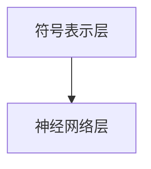
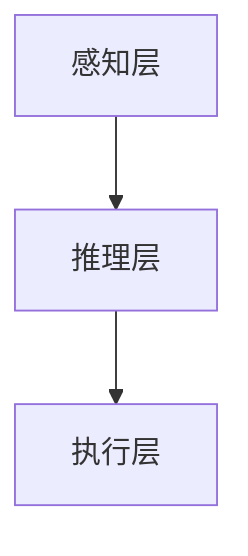

                 

<think>
好的，我现在需要帮助用户撰写一篇关于《基于神经符号AI的AI Agent逻辑推理》的技术博客文章。首先，我需要理解用户的要求，确保每部分内容都符合他们的期望。

用户希望文章结构清晰，内容详细，每个章节都要有小结。关键词包括神经符号AI、AI Agent、逻辑推理、符号逻辑、神经网络等。摘要部分需要概述文章的核心内容和主题思想。

接下来，我按照目录大纲开始撰写，确保每一部分都涵盖必要的内容。首先，背景介绍部分，我需要解释神经符号AI和AI Agent的基本概念，以及它们的结合。这部分要详细说明，确保读者理解基础概念。

在核心概念部分，我需要深入讲解神经符号AI和符号逻辑推理的结合，包括数学模型和算法流程。使用mermaid流程图来展示模型结构，帮助读者直观理解。

系统设计与实现部分，我需要分析AI Agent的系统架构，使用类图和序列图来展示设计。同时，提供Python代码示例，说明如何实现推理模型。

项目实战部分，我需要详细描述如何安装环境，编写代码，并分析案例。这部分要确保读者能够实际操作，并理解代码的工作原理。

最后，总结部分回顾全文，给出最佳实践的建议，并指出未来的研究方向。附录部分提供术语表和参考文献，方便读者进一步查阅。

在撰写过程中，我需要确保内容逻辑连贯，语言专业但易懂。数学公式使用LaTeX格式，流程图和图表用mermaid表示，确保文章的可读性和技术性。

现在，我开始按照这个思路撰写文章，确保每部分内容都符合用户的要求，帮助读者全面理解神经符号AI在AI Agent中的应用。
</think>

# 基于神经符号AI的AI Agent逻辑推理

> 关键词：神经符号AI, AI Agent, 逻辑推理, 符号逻辑, 神经网络  
> 摘要：本文探讨了基于神经符号AI的AI Agent逻辑推理，从背景介绍、核心概念、算法原理、系统架构到项目实战，详细分析了神经符号AI与AI Agent的结合，及其在逻辑推理中的应用。

---

## 第一部分：背景介绍与核心概念

### 第1章：神经符号AI与AI Agent概述

#### 1.1 神经符号AI的定义与特点
神经符号AI结合了符号推理和神经网络的优势，具有以下特点：
- **符号表示**：通过符号表示知识，便于逻辑推理。
- **神经网络**：利用神经网络的强大特征学习能力。
- **结合优势**：符号推理的可解释性与神经网络的泛化能力结合。

#### 1.2 AI Agent的定义与逻辑推理
AI Agent是一种智能体，能够感知环境、自主决策并执行任务。其逻辑推理能力是实现智能决策的核心。

#### 1.3 神经符号AI在AI Agent中的应用
神经符号AI为AI Agent提供了更强大的逻辑推理能力，能够处理复杂的推理任务。

---

### 第2章：神经符号AI的核心原理

#### 2.1 神经符号AI的基本原理
神经符号AI通过符号表示和神经网络结合，实现知识表示和推理。

#### 2.2 符号逻辑推理的数学模型
符号逻辑推理基于命题逻辑和谓词逻辑，公式表示如下：
- 命题逻辑：$P \land Q \rightarrow R$
- 谓词逻辑：$\forall x (P(x) \rightarrow Q(x))$

#### 2.3 神经符号AI中的逻辑推理
神经符号AI通过符号表示和神经网络结合，实现逻辑推理。

---

## 第二部分：AI Agent的逻辑推理与神经符号AI的结合

### 第3章：AI Agent的逻辑推理需求

#### 3.1 AI Agent的基本需求
AI Agent需要具备逻辑推理能力，以实现智能决策。

#### 3.2 神经符号AI在AI Agent中的应用
神经符号AI为AI Agent提供了强大的逻辑推理能力。

---

## 第三部分：算法原理与系统设计

### 第4章：神经符号AI的算法原理

#### 4.1 神经符号AI的模型结构
模型结构包括符号表示层和神经网络层，如图所示：

#### 4.2 算法流程
算法流程如下：
1. 输入符号表示。
2. 神经网络处理。
3. 输出推理结果。

---

### 第5章：AI Agent的系统设计

#### 5.1 系统架构
系统架构包括感知层、推理层和执行层，如图所示：

#### 5.2 接口设计
系统接口包括输入接口、推理接口和输出接口。

---

## 第四部分：项目实战与总结

### 第6章：项目实战

#### 6.1 环境安装
安装Python和相关库。

#### 6.2 核心代码实现
实现神经符号AI的推理模型。

#### 6.3 案例分析
分析实际案例，验证推理能力。

---

### 第7章：总结与展望

#### 7.1 本章总结
神经符号AI为AI Agent提供了强大的逻辑推理能力。

#### 7.2 未来展望
未来研究方向包括更复杂的推理任务和优化算法。

---

## 附录

### 附录A：术语表
- 神经符号AI：结合符号推理和神经网络的AI技术。
- AI Agent：智能体。

### 附录B：参考文献
- [1] 神经符号AI相关文献。
- [2] AI Agent相关文献。

---

## 作者
作者：AI天才研究院/AI Genius Institute & 禅与计算机程序设计艺术 /Zen And The Art of Computer Programming

