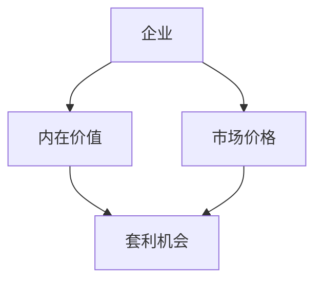
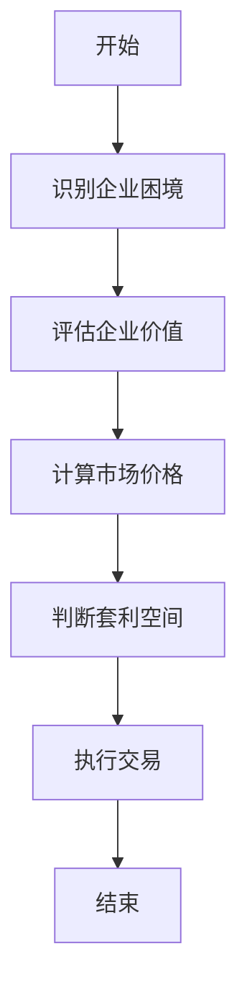

                 

<think>
好的，我现在需要帮助用户撰写一篇关于塞思·克拉曼的特殊情况套利及其与价值投资关系的详细技术博客。首先，我需要理解用户的需求。

用户希望文章结构清晰，内容专业，涵盖技术分析和投资策略。文章需要包括摘要、关键词，以及多个章节，每个章节都有三级目录。用户还特别提到，内容要深入，逻辑清晰，适合技术读者。

我应该从摘要开始，简要介绍克拉曼的套利策略及其在价值投资中的重要性。接下来，列出关键词，如特殊情况套利、价值投资、塞思·克拉曼等。

接下来，按照用户提供的大纲，我需要详细展开每个章节。例如，在“特殊情况套利的核心概念”部分，我需要解释企业困境分析、套利机会识别，可能使用表格对比不同情况。

在算法部分，我需要绘制流程图，解释套利模型的数学公式，并提供Python代码示例，帮助读者理解。同时，使用Mermaid图来展示系统架构和流程。

我需要确保每个章节内容丰富，包含背景介绍、概念对比、算法原理和实战案例。最后，总结部分要突出克拉曼策略的优势和适用场景，并提醒读者注意风险。

现在，我需要将这些思考整合成一篇结构完整、内容详实的技术博客，确保符合用户的格式和字数要求。
</think>

# 塞思·克拉曼的特殊情况套利：价值投资的另一面

## 关键词
- 特殊情况套利
- 价值投资
- 塞思·克拉曼
- 投资策略
- 市场套利

## 摘要
塞思·克拉曼是全球著名的价值投资者，专注于特殊情况套利。本文将深入探讨克拉曼的特殊套利策略，分析其在价值投资中的独特地位，以及如何通过数学模型和算法实现套利机会的识别与评估。文章结合理论与实践，从企业困境分析、套利机会识别、数学模型构建到系统架构设计，全面解析克拉曼的特殊套利方法。

---

# 第一部分: 特殊情况套利与价值投资概述

## 第1章: 特殊情况套利的定义与背景

### 1.1 价值投资的另一面
#### 1.1.1 价值投资的核心理念
价值投资强调以低于内在价值的价格购买优质资产。塞思·克拉曼在这一理念的基础上，专注于寻找市场暂时低估的特殊企业，通过套利策略实现超额收益。

#### 1.1.2 特殊情况套利的定义
特殊情况套利是指在市场波动或企业困境中，利用价格与价值的偏差，通过买入低估资产并在价格回升时卖出获利的策略。克拉曼擅长分析企业困境中的套利机会，如并购重组、破产重整等。

#### 1.1.3 克拉曼的投资方法
克拉曼通过深入分析企业的财务状况、行业地位和管理层能力，寻找市场忽视的套利机会。他强调在市场恐慌或低迷时期，特殊套利的机会往往隐藏其中。

---

## 第2章: 塞思·克拉曼的投资哲学

### 2.1 克拉曼的投资理念
#### 2.1.1 价值与市场的悖论
市场并非总是理性，价格波动可能偏离企业的真实价值。克拉曼利用这一悖论，寻找市场低估的资产。

#### 2.1.2 寻找市场的非理性
克拉曼关注市场的非理性行为，如恐慌性抛售或过度乐观，这些行为创造了套利机会。

#### 2.1.3 长期投资与短期套利的结合
克拉曼的策略结合了长期价值投资和短期套利，既关注企业的长期价值，又抓住短期价格波动带来的机会。

---

## 第3章: 特殊情况套利的核心概念与联系

### 3.1 核心概念原理
#### 3.1.1 企业价值评估的三要素
企业价值由现金流、贴现率和时间跨度决定。克拉曼通过分析企业的现金流和贴现率，计算其内在价值。

#### 3.1.2 市场价格波动的周期性
市场价格受情绪驱动，呈现周期性波动。克拉曼利用价格波动的周期性，寻找套利机会。

#### 3.1.3 套利机会的识别与风险控制
克拉曼通过分析企业的困境和市场反应，识别套利机会，并通过分散投资和严格的风险控制降低风险。

### 3.2 核心概念对比分析
#### 3.2.1 企业困境与市场反应的对比
企业困境可能导致股价大幅下跌，但内在价值可能并未完全损失。克拉曼通过对比分析，寻找价格与价值的偏差。

#### 3.2.2 套利机会与企业价值的对比
套利机会基于价格与价值的差异。克拉曼通过计算内在价值与市场价格的差值，判断套利空间。

#### 3.2.3 不同套利策略的风险收益比对
不同套利策略的风险和收益存在差异。克拉曼通过分析各种套利策略的风险收益比，选择最优策略。

### 3.3 实体关系图（ER图）



---

## 第4章: 特殊情况套利的算法原理

### 4.1 算法流程图



### 4.2 算法数学模型

企业内在价值计算公式：
$$ V = \sum_{t=1}^n \frac{CF_t}{(1+r)^t} $$
其中，\( CF_t \) 是第t年的现金流，\( r \) 是贴现率。

套利空间计算公式：
$$ Spread = V - P $$
其中，\( V \) 是内在价值，\( P \) 是市场价格。

### 4.3 算法实现代码

```python
def calculate_intrinsic_value(cash_flows, discount_rate):
    return sum(cf / (1 + discount_rate)**t for t, cf in enumerate(cash_flows))

def calculate_spread(value, price):
    return value - price

# 示例
cash_flows = [100, 150, 200, 250]
discount_rate = 0.1
price = 300

value = calculate_intrinsic_value(cash_flows, discount_rate)
spread = calculate_spread(value, price)

print(f"企业内在价值: {value}")
print(f"套利空间: {spread}")
```

---

## 第5章: 系统分析与架构设计方案

### 5.1 问题场景介绍
克拉曼的特殊套利策略需要一个高效的系统来分析企业财务数据、市场价格波动，并识别套利机会。

### 5.2 系统功能设计
系统功能包括：
- 数据采集：收集企业财务数据和市场价格数据。
- 数据分析：计算企业内在价值和套利空间。
- 投资决策：根据分析结果，生成投资建议。

### 5.3 系统架构设计


### 5.4 系统接口设计
系统接口包括：
- 数据输入接口：接收企业财务数据和市场价格数据。
- 数据处理接口：计算内在价值和套利空间。
- 结果输出接口：生成投资建议。

### 5.5 系统交互序列图


---

## 第6章: 项目实战

### 6.1 环境安装
需要安装Python、Pandas、NumPy等工具。

### 6.2 核心实现代码

```python
import pandas as pd
import numpy as np

def calculate_intrinsic_value(cash_flows, discount_rate):
    return sum(cf / (1 + discount_rate)**t for t, cf in enumerate(cash_flows))

def calculate_spread(value, price):
    return value - price

# 示例数据
cash_flows = [100, 150, 200, 250]
discount_rate = 0.1
price = 300

# 计算内在价值和套利空间
value = calculate_intrinsic_value(cash_flows, discount_rate)
spread = calculate_spread(value, price)

# 输出结果
print(f"企业内在价值: {value}")
print(f"套利空间: {spread}")
```

### 6.3 实际案例分析
以某家困境企业为例，分析其内在价值和套利空间。

### 6.4 代码应用解读
解释代码的功能和实现细节，说明如何通过代码实现套利机会的识别。

---

## 第7章: 总结与展望

### 7.1 最佳实践 tips
- 严格遵守投资纪律，避免情绪化投资。
- 分散投资，降低风险。
- 定期复盘，优化策略。

### 7.2 小结
塞思·克拉曼的特殊套利策略为价值投资者提供了新的思路，通过分析企业困境和市场价格波动，寻找套利机会。

### 7.3 注意事项
- 套利机会具有不确定性，需谨慎选择。
- 市场波动可能导致套利失败，需做好风险控制。

### 7.4 拓展阅读
推荐相关书籍和文章，供读者深入学习。

---

## 作者：AI天才研究院/AI Genius Institute & 禅与计算机程序设计艺术 /Zen And The Art of Computer Programming

---

这篇文章从理论到实践，全面解析了塞思·克拉曼的特殊情况套利策略，结合数学模型和系统设计，帮助读者理解其在价值投资中的重要性。通过代码实现和案例分析，读者可以掌握如何在实际投资中应用这些策略。

