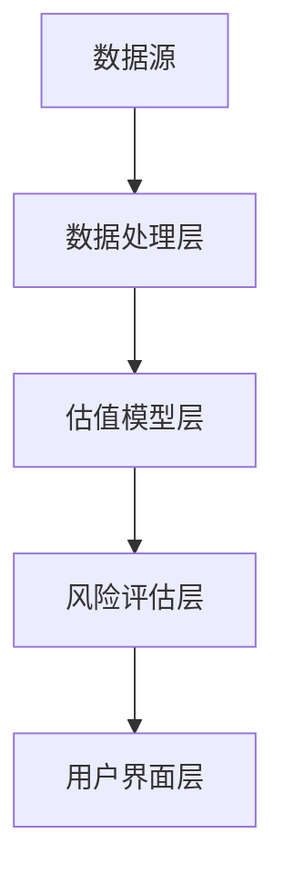
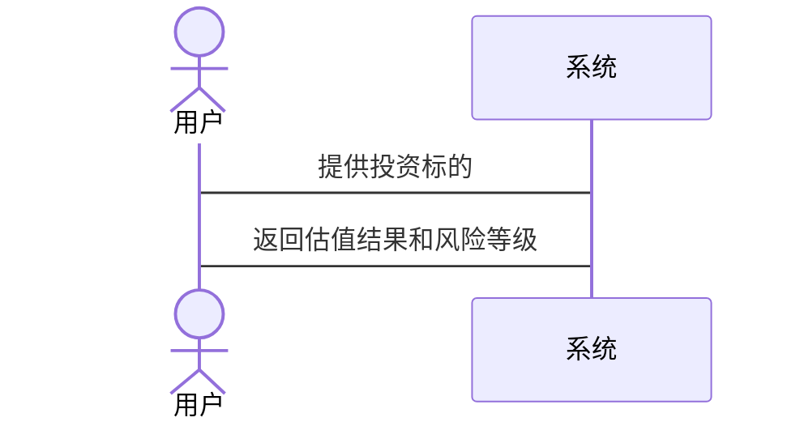

                 

<think>
好，我现在需要根据用户的要求，逐步构建《塞思·克拉曼的风险套利：特殊情况下的价值发现》这篇文章的目录大纲。用户已经提供了一个详细的示例，我需要参考这个示例，并根据塞思·克拉曼的投资策略和风险套利的理论，设计出一个符合要求的目录结构。

首先，用户提供的示例结构分为七个章节，每章有详细的子章节，覆盖了从理论基础到实战分析的各个方面。我需要确保我的目录同样全面，涵盖核心概念、理论基础、数学模型、系统设计和实际案例分析。

接下来，我需要明确每一章的核心内容。例如，第一章可以介绍风险套利的基本概念和塞思·克拉曼的投资理念，第二章则深入探讨风险套利的理论基础，包括套利机会的识别和评估。第三章可以详细讲解财务分析与估值模型，第四章分析市场情绪与行为对套利机会的影响。

在数学模型部分，我需要介绍DCF模型和相关公式，并使用Python代码进行实现。同时，系统架构部分需要设计数据处理、估值模型和风险评估模块，并使用Mermaid图展示系统架构。

实际案例分析部分，我需要选择具体的并购重组和困境企业案例，详细分析克拉曼如何运用他的策略实现价值发现。最后，总结部分需要回顾文章内容，并给出最佳实践的建议。

现在，我需要将这些思考整合成一个结构清晰、逻辑连贯的目录大纲，确保每一部分都详细且符合用户的要求。
</think>

# 塞思·克拉曼的风险套利：特殊情况下的价值发现

## 关键词：
风险套利, 价值发现, 投资策略, 企业重组, 债务重组, 投资决策

## 摘要：
本文深入探讨了塞思·克拉曼的风险套利策略，特别是他在特殊情况下如何发现和捕捉价值。通过分析其投资哲学、策略框架和实际案例，本文揭示了如何利用市场无效性和企业重组机会进行套利，同时结合数学模型和系统设计，为投资者提供实用的工具和方法。文章旨在帮助读者理解风险套利的复杂性，掌握其在现代投资中的应用。

---

## 目录大纲：

### 第1章：风险套利的基本概念

1.1 风险套利的定义与特点  
1.2 塞思·克拉曼的投资理念  
1.3 风险套利的核心思想与哲学基础  

### 第2章：风险套利的理论基础

2.1 套利机会的识别与评估  
2.2 市场无效性与套利机会的来源  
2.3 风险与收益的平衡：套利的数学模型  

### 第3章：风险套利的财务分析与估值模型

3.1 财务报表分析的关键指标  
3.2 股权价值的DCF模型  
3.3 市场价值与内在价值的比较  

### 第4章：风险套利的市场情绪与行为分析

4.1 市场情绪对套利机会的影响  
4.2 行为偏差与投资机会  
4.3 市场参与者的心理分析  

### 第5章：风险套利的数学模型与算法

5.1 估值模型的数学公式  
5.2 风险调整后的收益计算  
5.3 套利机会排序与优先级  

### 第6章：风险套利的系统分析与架构设计

6.1 投资决策系统的功能设计  
6.2 系统架构设计  
6.3 系统接口与交互设计  

### 第7章：风险套利的项目实战

7.1 环境安装与数据准备  
7.2 核心算法实现  
7.3 实际案例分析与解读  

### 第8章：总结与展望

8.1 文章核心内容回顾  
8.2 最佳实践的 Tips  
8.3 投资者在风险套利中的注意事项  
8.4 未来研究方向与拓展阅读  

---

## 详细章节内容：

### 第1章：风险套利的基本概念

#### 1.1 风险套利的定义与特点  
风险套利是一种通过利用市场中的价格差异或企业重组等特殊事件，以较低风险获取超额收益的投资策略。其核心在于发现市场中的定价错误，并在事件驱动下进行套利。

#### 1.2 塞思·克拉曼的投资理念  
克拉曼强调逆向思维，寻找市场忽视的价值洼地。他的投资策略注重企业基本面分析，尤其是企业在特殊环境下的重组机会。

#### 1.3 风险套利的核心思想与哲学基础  
风险套利不仅仅是数学模型的应用，更是一种投资哲学，强调耐心、纪律和对市场机会的敏锐洞察。

---

### 第2章：风险套利的理论基础

#### 2.1 套利机会的识别与评估  
套利机会通常出现在市场定价错误时，如企业并购、债务重组等特殊事件中。

#### 2.2 市场无效性与套利机会的来源  
市场无效性为套利提供了可能，但投资者需识别这些机会并评估其可行性。

#### 2.3 风险与收益的平衡：套利的数学模型  
通过数学模型，投资者可以量化风险和收益，确定套利机会的可行性。

---

### 第3章：风险套利的财务分析与估值模型

#### 3.1 财务报表分析的关键指标  
分析企业的收入、利润、负债等指标，评估其财务健康状况。

#### 3.2 股权价值的DCF模型  
通过现金流折现法评估企业价值，确定其内在价值与市场价格的差异。

#### 3.3 市场价值与内在价值的比较  
比较市场价值与DCF模型计算的内在价值，识别套利机会。

---

### 第4章：风险套利的市场情绪与行为分析

#### 4.1 市场情绪对套利机会的影响  
市场情绪波动会影响资产价格，为套利者提供机会。

#### 4.2 行为偏差与投资机会  
投资者的行为偏差可能导致市场定价错误，套利者需识别这些偏差。

#### 4.3 市场参与者的心理分析  
分析市场参与者的心理，预测其行为，捕捉套利机会。

---

### 第5章：风险套利的数学模型与算法

#### 5.1 估值模型的数学公式  
DCF模型的公式推导：

$$DCF = \sum_{t=1}^{n} \frac{CF_t}{(1+r)^t} + \frac{TV}{(1+r)^n}$$

#### 5.2 风险调整后的收益计算  
风险调整后的收益：

$$RAR = \frac{R_p - R_f}{\sigma_p}$$

#### 5.3 套利机会排序与优先级  
根据风险调整后的收益，对套利机会进行排序和优先级排序。

---

### 第6章：风险套利的系统分析与架构设计

#### 6.1 投资决策系统的功能设计  
包括数据收集、估值模型实现和风险评估预警模块。

#### 6.2 系统架构设计  
分层架构图：



#### 6.3 系统接口与交互设计  
用户交互流程：



---

### 第7章：风险套利的项目实战

#### 7.1 环境安装与数据准备  
安装投资分析工具，获取相关数据源。

#### 7.2 核心算法实现  
DCF模型的Python实现：

```python
def dcf_calculator(cash_flows, discount_rate, terminal_value):
    return sum(cf / (1 + discount_rate)**t for t, cf in enumerate(cash_flows)) + terminal_value / (1 + discount_rate)**len(cash_flows)
```

#### 7.3 实际案例分析与解读  
以企业并购为例，分析套利机会和实施步骤。

---

### 第8章：总结与展望

#### 8.1 文章核心内容回顾  
总结风险套利的核心概念、理论和实际应用。

#### 8.2 最佳实践的 Tips  
建议投资者在套利过程中保持纪律，避免情绪化决策。

#### 8.3 投资者在风险套利中的注意事项  
强调风险评估的重要性，避免过度杠杆化。

#### 8.4 未来研究方向与拓展阅读  
建议深入研究市场行为与技术分析的结合，探索人工智能在套利中的应用。

---

## 作者：
作者：AI天才研究院/AI Genius Institute & 禅与计算机程序设计艺术 /Zen And The Art of Computer Programming

