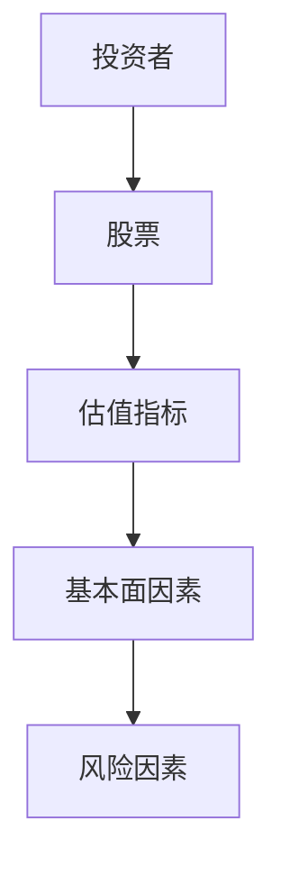
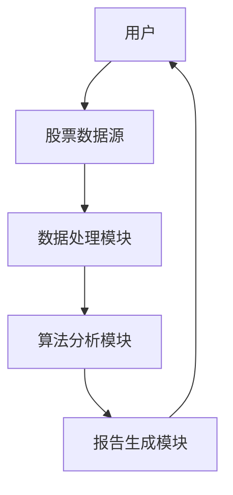

                 


# 《塞思·卡拉曼的价值陷阱避免策略》

> 关键词：价值陷阱，投资策略，基本面分析，估值指标，风险控制

> 摘要：本文深入探讨了塞思·卡拉曼提出的“价值陷阱”概念，分析其本质、类型及其对投资者的影响。通过详细讲解识别方法和避免策略，结合算法原理和系统设计，提供实际案例分析和最佳实践建议，帮助投资者有效避开价值陷阱，实现稳健投资。

---

## 第一部分: 价值陷阱的背景与核心概念

### 第1章: 价值陷阱的定义与背景

#### 1.1 价值陷阱的定义与本质

##### 1.1.1 价值陷阱的定义
价值陷阱是指那些表面上看似便宜，但实际存在严重问题，可能导致投资损失的股票。投资者可能因为只关注表面估值指标而忽视了公司基本面的问题，从而陷入陷阱。

##### 1.1.2 价值陷阱的本质特征
- **低估值**：市盈率、市净率等指标远低于行业平均水平。
- **基本面差**：盈利能力下降，财务状况恶化，竞争优势丧失。
- **行业周期性**：处于衰退期或周期低谷，复苏前景不明。

##### 1.1.3 价值陷阱与价值投资的联系与区别
- **联系**：两者都关注估值与基本面的匹配，但价值陷阱强调的是负面基本面。
- **区别**：价值投资寻找的是被市场低估的优质企业，而价值陷阱则强调看似低估但实际有问题的企业。

#### 1.2 价值陷阱的类型与表现形式

##### 1.2.1 低估值陷阱
公司估值指标远低于行业平均水平，但实际经营状况恶化，可能因债务过高或管理层问题导致崩盘。

##### 1.2.2 周期性陷阱
行业处于周期低谷，公司暂时业绩不佳，但可能复苏。需谨慎判断周期位置和公司韧性。

##### 1.2.3 质量下降陷阱
公司产品质量或服务标准下降，导致市场份额流失和盈利能力下滑，估值低但无反转可能。

#### 1.3 价值陷阱对投资者的影响

##### 1.3.1 对个人投资者的影响
- 易被表面低估值迷惑，忽视风险。
- 缺乏深入分析能力，可能错选价值陷阱股票，导致本金损失。

##### 1.3.2 对机构投资者的影响
- 影响投资组合表现，需投入更多资源进行基本面分析。
- 增加研究成本，需更严格筛选标的。

##### 1.3.3 对长期投资策略的影响
- 扰乱投资纪律，可能导致投资组合偏离长期目标。
- 需调整策略，加强基本面分析，避免短期波动影响决策。

### 第2章: 价值陷阱的核心概念与联系

#### 2.1 核心概念原理

##### 2.1.1 价值陷阱的核心要素
- 估值指标：市盈率、市净率、股息率等。
- 基本面因素：盈利能力、财务健康、管理团队、行业地位。

##### 2.1.2 价值陷阱的关键属性
- 表面低估值与实际高风险并存。
- 基本面恶化，缺乏长期竞争优势。
- 市场情绪影响，容易被误判。

##### 2.1.3 价值陷阱的形成机制
- 市场情绪导致低估，但公司内在价值持续下降。
- 行业周期性波动，公司无法适应变化。
- 管理层失误或欺诈行为，导致公司价值贬损。

#### 2.2 价值陷阱与相关概念对比

##### 2.2.1 价值陷阱与估值陷阱的对比
- 价值陷阱：基本面差，估值低。
- 估值陷阱：估值过高，被高估。

##### 2.2.2 价值陷阱与成长陷阱的对比
- 价值陷阱：低估值但基本面差。
- 成长陷阱：高估值但成长性不足。

##### 2.2.3 价值陷阱与周期性陷阱的对比
- 价值陷阱：基本面恶化，估值低。
- 周期性陷阱：行业周期性波动，暂时表现不佳。

#### 2.3 价值陷阱的ER实体关系图



### 第3章: 价值陷阱的识别与避免策略

#### 3.1 价值陷阱的识别方法

##### 3.1.1 基于基本面分析的识别方法
- 检查盈利能力：ROE、净利润率是否持续下降。
- 审查财务健康：高负债率、现金流恶化。
- 分析管理层：是否存在重大变更或负面新闻。

##### 3.1.2 基于估值指标的识别方法
- 市盈率低于行业平均，但营收或利润增速放缓。
- 市净率远低于行业均值，但资产质量下降。

##### 3.1.3 基于行业周期的识别方法
- 行业处于衰退期，公司市场份额持续流失。
- 周期性波动大，复苏前景不明。

#### 3.2 价值陷阱的避免策略

##### 3.2.1 选择优质企业
- 重点关注ROE高、净利润稳定增长的企业。
- 选择行业龙头或竞争优势明显的企业。

##### 3.2.2 严格估值纪律
- 设置估值指标的上下限，避免过低估值。
- 结合多种估值方法，如DCF模型，全面评估企业价值。

##### 3.2.3 长期投资视角
- 避免短期波动影响决策，关注企业的长期价值。
- 选择那些在周期波动中依然能保持稳定增长的企业。

---

## 第二部分: 价值陷阱的算法原理

### 第4章: 价值陷阱识别算法的设计与实现

#### 4.1 算法设计思路

##### 4.1.1 算法目标
- 识别低估值但基本面差的股票。
- 排除潜在价值陷阱，筛选优质投资标的。

##### 4.1.2 算法步骤
1. 数据收集：获取股票的估值指标和基本面数据。
2. 基本面分析：评估公司盈利能力、财务健康和管理层。
3. 估值指标筛选：排除低估值但基本面差的股票。
4. 结果输出：生成价值陷阱风险报告。

#### 4.2 算法实现代码

##### 4.2.1 数据预处理
```python
import pandas as pd

# 假设df为股票数据，包含估值指标和基本面指标
df = pd.DataFrame({
    '股票代码': ['A', 'B', 'C', 'D'],
    '市盈率': [15, 20, 10, 30],
    '市净率': [2, 3, 1, 4],
    'ROE': [10, 5, 15, 8],
    '净利润增长率': [10, -5, 20, 3]
})
```

##### 4.2.2 算法实现
```python
def identify_value_traps(df):
    # 基准：市盈率低于20且ROE低于10%
    traps = []
    for index, row in df.iterrows():
        if row['市盈率'] < 20 and row['ROE'] < 10:
            traps.append(row['股票代码'])
    return traps

# 示例应用
value_traps = identify_value_traps(df)
print(f"价值陷阱股票：{value_traps}")
```

#### 4.3 算法优化与改进

##### 4.3.1 参数调整
- 根据市场情况调整估值指标的阈值。
- 引入更多基本面指标，如现金流、债务水平等。

##### 4.3.2 处理方法优化
- 使用机器学习模型进行分类，提升识别准确性。
- 结合行业分析，避免因行业周期误判。

---

## 第三部分: 价值陷阱的系统设计与实现

### 第5章: 价值陷阱识别系统的设计

#### 5.1 系统设计概述

##### 5.1.1 系统目标
- 自动化识别价值陷阱，辅助投资决策。
- 提供详细报告，帮助投资者做出明智选择。

##### 5.1.2 系统架构


#### 5.2 系统功能设计

##### 5.2.1 数据采集模块
- 从数据库或API获取股票数据。
- 包括估值指标和基本面数据。

##### 5.2.2 数据处理模块
- 清洗数据，处理缺失值和异常值。
- 标准化数据，便于后续分析。

##### 5.2.3 算法分析模块
- 应用前面的算法识别价值陷阱。
- 生成风险评分。

##### 5.2.4 报告生成模块
- 生成详细报告，包括识别结果和投资建议。
- 可视化图表，帮助用户直观理解。

---

## 第四部分: 价值陷阱的项目实战

### 第6章: 价值陷阱识别的实战分析

#### 6.1 项目背景与目标
分析一只股票是否为价值陷阱，结合实际数据进行验证。

#### 6.2 数据收集与处理
收集某股票的历史数据，包括估值指标和基本面数据。

#### 6.3 算法应用与结果分析
应用前面的算法，识别该股票是否为价值陷阱，并分析原因。

#### 6.4 实战总结
总结经验教训，优化算法和系统设计。

---

## 第五部分: 最佳实践与总结

### 第7章: 最佳实践与投资策略

#### 7.1 投资策略优化
- 选择优质企业，避免价值陷阱。
- 结合长期投资视角，关注企业的持续盈利能力。

#### 7.2 风险管理技巧
- 设置止损点，控制投资风险。
- 分散投资，降低单一标的的风险影响。

#### 7.3 持续学习与跟踪
- 关注行业动态和公司新闻，及时发现潜在风险。
- 定期评估投资组合，调整策略。

---

## 作者：AI天才研究院 & 禅与计算机程序设计艺术

---

通过以上思考过程，我们逐步分析了价值陷阱的定义、识别方法和避免策略，结合算法设计和系统实现，提供了详细的指导和实战案例，帮助投资者有效识别和避免价值陷阱，实现稳健投资。

