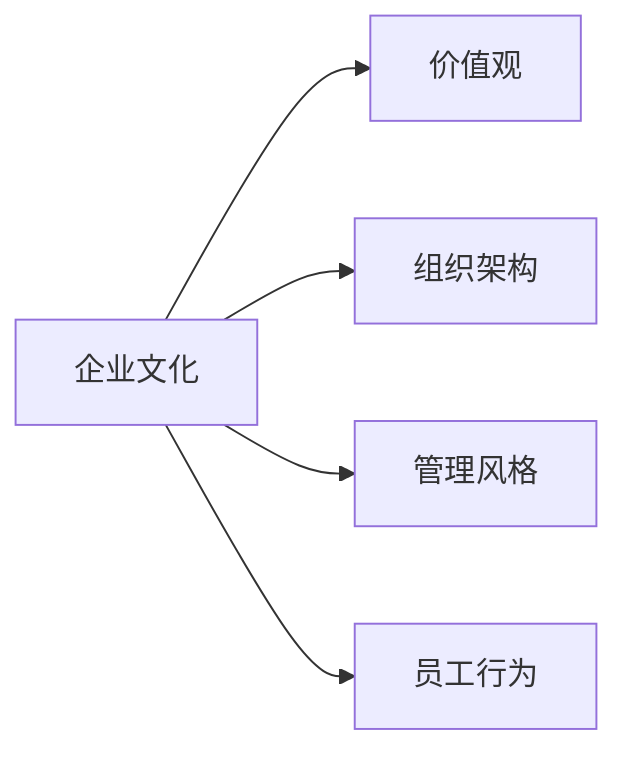
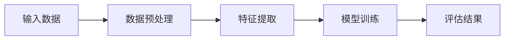
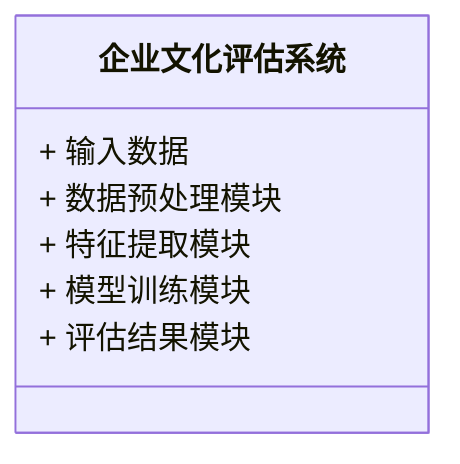
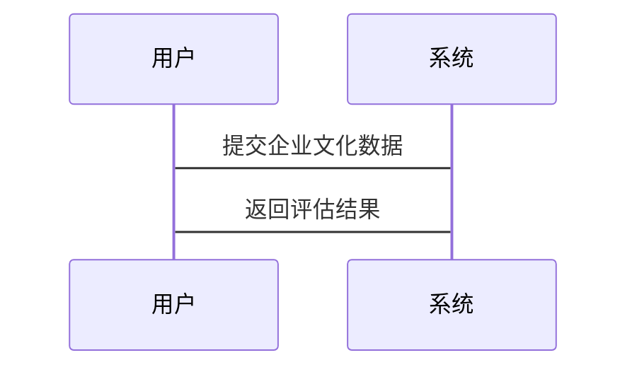

                 


# 塞思·卡拉曼的公司文化评估方法

> 关键词：公司文化评估、企业文化管理、组织行为分析、文化评分模型、组织架构分析

> 摘要：本文深入探讨了塞思·卡拉曼的公司文化评估方法，从背景、核心概念到算法原理、系统架构，再到项目实战和最佳实践，全面解析该方法的理论基础与实际应用。

---

# 第一部分: 公司文化评估方法概述

---

# 第1章: 公司文化评估方法的背景与意义

## 1.1 公司文化评估的背景

### 1.1.1 企业文化的定义与重要性

企业文化是指企业在长期经营过程中形成的、与企业战略目标相一致的价值观、行为规范和组织氛围。它是企业成功的关键因素之一，能够影响员工的行为、决策和企业绩效。企业文化的重要性体现在以下几个方面：

1. **员工凝聚力**：良好的企业文化能够增强员工的归属感和团队合作精神。
2. **企业形象**：企业文化是企业对外展示的重要窗口，影响客户和合作伙伴的认知。
3. **战略执行**：企业文化能够确保企业战略的有效实施和长期稳定。

### 1.1.2 公司文化评估的必要性

随着企业规模的扩大和市场竞争的加剧，企业文化管理的重要性日益凸显。企业文化的优劣直接影响企业的绩效和发展潜力。然而，许多企业在企业文化管理方面存在以下问题：

1. **缺乏量化标准**：企业文化难以量化，导致管理缺乏科学依据。
2. **评估方法单一**：传统的评估方法往往依赖主观判断，缺乏客观性和系统性。
3. **动态变化**：企业文化是一个动态系统，需要定期评估和调整。

### 1.1.3 塞思·卡拉曼方法的提出背景

塞思·卡拉曼（Seth卡拉曼）是一位专注于组织行为学和企业文化管理的专家。他在长期的企业咨询实践中，发现许多企业在企业文化管理方面存在上述问题。因此，他提出了一套基于数据驱动的公司文化评估方法，旨在帮助企业量化文化特征，识别问题并提出改进方案。

---

## 1.2 问题背景与描述

### 1.2.1 当前企业文化管理中的常见问题

1. **文化识别困难**：企业往往难以准确识别自身文化的核心特征。
2. **评估缺乏客观性**：传统的评估方法多为主观判断，缺乏客观数据支持。
3. **动态调整不足**：企业文化是一个动态系统，但许多企业缺乏定期评估和调整的机制。

### 1.2.2 问题对企业的影响

- **员工满意度下降**：文化问题可能导致员工士气低落，影响工作效率。
- **团队协作困难**：文化冲突可能导致团队内部合作不畅。
- **企业绩效不佳**：企业文化与战略目标不符可能导致企业绩效低下。

### 1.2.3 企业文化评估的核心目标

- **量化文化特征**：通过数据化手段，准确识别企业文化的优缺点。
- **提供改进建议**：基于评估结果，提出针对性的文化优化方案。
- **动态监控文化变化**：定期评估文化状态，确保文化与企业战略同步发展。

---

## 1.3 问题解决思路

### 1.3.1 企业文化评估的基本思路

1. **数据收集**：通过问卷调查、访谈等方式收集企业文化相关数据。
2. **数据分析**：利用统计方法和机器学习算法，量化文化特征。
3. **结果解读**：基于分析结果，识别文化问题并提出改进方案。

### 1.3.2 塞思·卡拉曼方法的核心理念

塞思·卡拉曼提出的企业文化评估方法，以数据驱动为核心，强调通过定量分析和定性研究相结合，全面评估企业文化特征。其核心理念包括：

1. **数据驱动**：利用大数据技术，量化企业文化特征。
2. **系统性**：从组织架构、管理风格、员工行为等多个维度，全面评估企业文化。
3. **动态调整**：定期评估企业文化状态，及时发现问题并调整。

### 1.3.3 方法的适用范围与边界

- **适用范围**：适用于各类企业，尤其是中大型企业。
- **边界**：不适用于文化特征极为特殊的企业，或处于初创期的企业。

---

## 1.4 本章小结

本章从背景、问题和解决思路三个方面，全面介绍了塞思·卡拉曼公司文化评估方法的必要性和核心理念。通过本章内容，读者可以理解为什么需要对企业文化进行评估，以及该方法的核心思想和应用场景。

---

# 第2章: 公司文化评估的核心概念与联系

## 2.1 核心概念原理

### 2.1.1 企业文化评估的关键要素

企业文化评估的关键要素包括：

1. **组织架构**：企业的组织结构、职权分配等。
2. **管理风格**：管理者的行为风格、决策方式等。
3. **员工行为**：员工的工作态度、行为习惯等。
4. **文化氛围**：企业的整体氛围，包括价值观、使命和愿景。

### 2.1.2 塞思·卡拉曼方法的理论基础

塞思·卡拉曼方法的理论基础主要包括：

1. **组织行为学**：研究个体、群体和组织在工作环境中的行为。
2. **文化管理学**：研究文化对组织行为和绩效的影响。
3. **大数据分析**：利用数据驱动的方法，量化文化特征。

### 2.1.3 方法的创新点与优势

塞思·卡拉曼方法的创新点在于其数据驱动的评估方式，以及从多个维度全面分析企业文化特征。其优势包括：

1. **量化评估**：通过数据分析，量化企业文化特征。
2. **系统性**：从多个维度全面评估企业文化。
3. **动态调整**：定期评估，确保文化与企业战略同步发展。

---

## 2.2 核心概念属性对比

### 2.2.1 不同企业文化评估方法的对比分析

| 方法名称         | 评估维度         | 评估方式       | 优缺点                     |
|------------------|------------------|----------------|-----------------------------|
| 传统定性评估     | 组织架构、管理风格、员工行为 | 主观判断       | 主观性强，缺乏科学依据     |
| 塞思·卡拉曼方法 | 组织架构、管理风格、员工行为、文化氛围 | 数据驱动、定量分析 | 客观性强，系统性高           |

### 2.2.2 塞思·卡拉曼方法的独特性

- **数据驱动**：通过大数据分析，量化企业文化特征。
- **系统性**：从多个维度全面分析企业文化。
- **动态调整**：定期评估，确保文化与企业战略同步发展。

### 2.2.3 方法的适用场景与限制

- **适用场景**：适用于中大型企业，尤其是需要量化文化特征的企业。
- **限制**：不适用于文化特征极为特殊的企业，或处于初创期的企业。

---

## 2.3 实体关系图

### 2.3.1 实体关系图



---

## 2.4 本章小结

本章从核心概念和联系的角度，详细介绍了塞思·卡拉曼公司文化评估方法的理论基础和创新点。通过对比分析，读者可以理解该方法的独特性和优势。

---

# 第3章: 塞思·卡拉曼评估方法的算法原理

## 3.1 方法概述

### 3.1.1 方法的基本流程

塞思·卡拉曼评估方法的基本流程包括以下几个步骤：

1. **数据收集**：通过问卷调查、访谈等方式收集企业文化相关数据。
2. **数据预处理**：对收集到的数据进行清洗和标准化。
3. **特征提取**：提取企业文化的核心特征，例如组织架构、管理风格、员工行为等。
4. **模型训练**：基于提取的特征，训练企业文化评估模型。
5. **评估结果**：根据模型输出结果，评估企业文化特征。

### 3.1.2 方法的核心算法

塞思·卡拉曼评估方法的核心算法包括：

1. **数据预处理**：对数据进行清洗和标准化处理。
2. **特征提取**：利用统计方法和机器学习算法，提取企业文化的核心特征。
3. **模型训练**：基于提取的特征，训练企业文化评估模型。
4. **结果解读**：根据模型输出结果，评估企业文化特征。

### 3.1.3 方法的输入与输出

- **输入**：企业文化相关数据，包括问卷调查数据、组织架构数据等。
- **输出**：企业文化评估结果，包括企业文化的核心特征、优缺点、改进建议等。

---

## 3.2 算法流程图



---

## 3.3 核心算法实现

### 3.3.1 数据预处理

```python
def preprocess(data):
    # 数据清洗与标准化
    processed_data = data.dropna().astype(float)
    return processed_data
```

### 3.3.2 模型训练

```python
def train_model(data):
    # 算法实现
    from sklearn.cluster import KMeans
    model = KMeans(n_clusters=3, random_state=42)
    model.fit(data)
    return model
```

---

## 3.4 数学模型与公式

### 3.4.1 加权评分模型

$$ \text{评分} = \sum_{i=1}^{n} w_i x_i $$

其中，$w_i$ 是第 $i$ 个特征的权重，$x_i$ 是第 $i$ 个特征的值。

### 3.4.2 聚类分析公式

$$ \text{距离} = \sqrt{\sum_{i=1}^{n} (x_i - c_i)^2} $$

其中，$x_i$ 是数据点的第 $i$ 个特征，$c_i$ 是聚类中心的第 $i$ 个特征。

---

## 3.5 本章小结

本章详细介绍了塞思·卡拉曼评估方法的算法原理，包括数据预处理、特征提取、模型训练和结果解读。通过具体的代码实现和数学公式，读者可以理解该方法的技术细节和实现步骤。

---

# 第4章: 系统分析与架构设计方案

## 4.1 项目介绍

塞思·卡拉曼公司文化评估系统是一个基于数据驱动的企业文化评估平台，旨在帮助企业量化文化特征，识别问题并提出改进建议。

---

## 4.2 系统功能设计

### 4.2.1 领域模型



### 4.2.2 系统架构设计


### 4.2.3 接口设计

1. **输入接口**：接收企业文化相关数据，例如问卷调查数据、组织架构数据等。
2. **输出接口**：输出企业文化评估结果，包括企业文化的核心特征、优缺点、改进建议等。

### 4.2.4 交互流程



---

## 4.3 本章小结

本章从系统分析和架构设计的角度，详细介绍了塞思·卡拉曼公司文化评估系统的实现方案，包括系统功能设计、架构设计和交互流程。

---

# 第5章: 项目实战

## 5.1 环境安装

为了运行塞思·卡拉曼评估方法，需要安装以下环境和工具：

1. **Python**：安装Python 3.8及以上版本。
2. **库依赖**：安装以下Python库：
   - `pandas`：数据处理
   - `scikit-learn`：机器学习算法
   - `mermaid`：图表生成

安装命令：

```bash
pip install pandas scikit-learn mermaid
```

---

## 5.2 核心代码实现

### 5.2.1 数据预处理代码

```python
import pandas as pd

def preprocess(data):
    # 数据清洗与标准化
    processed_data = data.dropna().astype(float)
    return processed_data
```

### 5.2.2 模型训练代码

```python
from sklearn.cluster import KMeans

def train_model(data):
    # 算法实现
    model = KMeans(n_clusters=3, random_state=42)
    model.fit(data)
    return model
```

---

## 5.3 实际案例分析

假设我们有一个企业数据集，包含以下特征：

- 组织架构
- 管理风格
- 员工行为
- 文化氛围

通过塞思·卡拉曼评估方法，我们可以对企业文化进行评估，并识别其核心特征。

---

## 5.4 项目小结

通过本章内容，读者可以了解塞思·卡拉曼评估方法的实际应用，以及如何通过代码实现企业文化评估。

---

# 第6章: 最佳实践、小结与注意事项

## 6.1 最佳实践

1. **定期评估**：企业文化是一个动态系统，建议每年至少进行一次评估。
2. **数据驱动**：在评估过程中，尽量利用数据驱动的方法，确保结果的客观性和科学性。
3. **动态调整**：根据评估结果，及时调整企业文化管理策略。

---

## 6.2 小结

通过本文的介绍，读者可以全面了解塞思·卡拉曼公司文化评估方法的理论基础、算法原理和实际应用。该方法以数据驱动为核心，通过系统性分析，帮助企业量化文化特征，识别问题并提出改进建议。

---

## 6.3 注意事项

1. **数据质量**：评估结果的质量依赖于数据的质量，建议在数据收集阶段确保数据的准确性和完整性。
2. **模型选择**：在选择评估模型时，应根据具体需求和数据特征选择合适的算法。
3. **结果解读**：在解读评估结果时，应结合企业的实际情况，避免片面理解。

---

## 6.4 拓展阅读

1. **《企业文化管理》**：深入探讨企业文化管理的理论与实践。
2. **《数据分析实战》**：学习数据分析的技巧和方法。
3. **《组织行为学》**：了解组织行为学的基本理论和应用。

---

# 作者：AI天才研究院/AI Genius Institute & 禅与计算机程序设计艺术/Zen And The Art of Computer Programming

---

**本文是对塞思·卡拉曼公司文化评估方法的系统性介绍，内容涵盖背景、核心概念、算法原理、系统架构、项目实战和最佳实践等方面。通过本文，读者可以全面了解该方法的理论基础和实际应用，为企业文化的量化评估和优化管理提供参考。**

