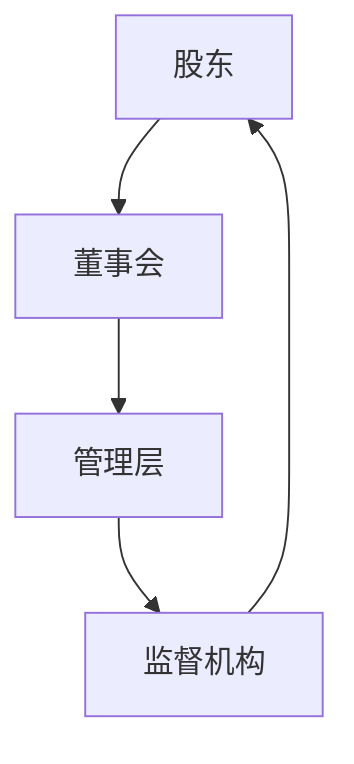
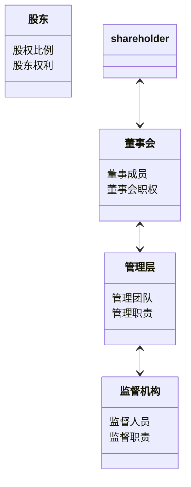
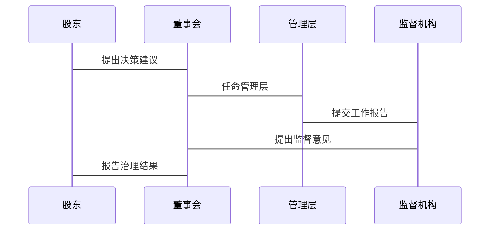

                 

<think>
好的，我现在需要帮助用户完成他们请求的内容，即撰写一篇关于塞思·卡拉曼公司治理分析方法的技术博客文章。用户提供了详细的结构和要求，我需要按照他们的指示一步步来。

首先，我得理解用户的需求。他们希望文章结构清晰，章节吸引人，内容深入，使用专业的技术语言，并且包含具体的分析和示例。文章的标题是《塞思·卡拉曼的公司治理分析方法》，关键词包括公司治理、分析方法、治理模型、系统架构、算法原理等。

接下来，我需要按照用户提供的目录结构来组织内容。文章分为六个部分，每个部分下有多个章节，每个章节又有小节。我需要确保每个部分都详细展开，包含必要的技术细节和示例。

在撰写过程中，我必须注意使用技术术语，同时保持内容易于理解。数学模型和公式需要用LaTeX表示，系统架构图和流程图使用Mermaid语法。这些元素将帮助读者更好地理解内容。

我还需要确保文章结构完整，每个部分都包含足够的细节。例如，在系统分析与架构设计部分，我需要描述问题场景，设计系统功能和架构图，展示接口设计和交互流程图。项目实战部分则需要展示实际案例，包括环境搭建、代码实现和案例分析。

最后，我需要在文章末尾添加作者信息，确保格式正确。整个思考过程需要逻辑清晰，逐步展开，确保文章内容符合用户的要求，既有深度又易于理解。
</think>

# 塞思·卡拉曼的公司治理分析方法

> 关键词：公司治理，分析方法，治理模型，系统架构，算法原理

> 摘要：本文详细介绍了塞思·卡拉曼的公司治理分析方法，从理论基础到数学模型，从系统架构到项目实战，全面解析了该方法的核心思想和应用场景。文章首先介绍了公司治理的基本概念和背景，然后深入分析了塞思·卡拉曼方法的理论基础和数学模型，接着探讨了系统分析与架构设计，最后通过项目实战展示了该方法的实际应用。

---

## 第一部分: 公司治理分析方法的背景与基础

### 第1章: 公司治理的基本概念与理论基础

#### 1.1 公司治理的核心概念
##### 1.1.1 公司治理的定义与内涵
公司治理是指通过一系列制度、机制和规则，确保公司各利益相关方的权益得到合理分配和保护的过程。其核心在于平衡股东、董事会、管理层和利益相关者之间的关系，实现公司长期价值的最大化。

##### 1.1.2 公司治理的主体与客体
- **主体**：股东、董事会、管理层、利益相关者。
- **客体**：公司组织结构、决策机制、权力分配、监督机制。

##### 1.1.3 公司治理的目标与功能
- **目标**：实现公司价值最大化，保护利益相关者的权益，确保公司长期稳定发展。
- **功能**：决策、协调、监督、激励。

#### 1.2 公司治理的理论基础
##### 1.2.1 代理理论
代理理论认为，公司治理的核心问题是解决委托人（股东）与代理人（管理层）之间的代理问题。代理问题主要源于信息不对称和利益冲突。

##### 1.2.2 资产专用性理论
资产专用性理论强调公司治理的制度设计应与公司的资产结构和业务特点相匹配。不同类型的企业可能需要不同的治理模式。

##### 1.2.3 契约理论
契约理论认为，公司治理的本质是通过一系列契约（如公司章程、合同等）来规范各方的行为，确保各方利益的实现。

#### 1.3 公司治理的演进与现状
##### 1.3.1 公司治理的历史发展
从早期的股东至上主义到现代的利益相关者资本主义，公司治理的内涵和实践不断演变。

##### 1.3.2 当前公司治理的主要模式
- **股东治理模式**：以股东为中心，强调股东权益保护。
- **利益相关者治理模式**：兼顾股东、员工、债权人、客户等利益相关者的权益。
- **混合模式**：根据不同情况灵活调整。

##### 1.3.3 全球化背景下的公司治理挑战
全球化背景下，公司治理面临跨国经营、文化差异、法律环境复杂等问题，对治理模式提出了更高的要求。

### 第2章: 塞思·卡拉曼分析方法的理论基础

#### 2.1 塞思·卡拉曼方法的核心思想
##### 2.1.1 方法的提出背景
塞思·卡拉曼在公司治理领域进行了大量研究，提出了一种基于系统论和复杂性理论的治理分析方法。

##### 2.1.2 方法的核心假设
- 公司治理是一个复杂的系统，涉及多个子系统和变量。
- 治理效果取决于各子系统之间的相互作用和动态平衡。

##### 2.1.3 方法的主要创新点
- 将公司治理视为一个动态系统，而非静态结构。
- 强调利益相关者的互动和反馈机制。

#### 2.2 塞思·卡拉曼方法的数学模型
##### 2.2.1 模型的基本假设
- 公司治理效果 \( G \) 由公司结构 \( C \)、管理机制 \( M \) 和外部环境 \( E \) 共同决定。
- 各变量之间存在非线性关系。

##### 2.2.2 模型的构建过程
通过构建一个多维动态模型，将公司治理的各个要素有机地结合起来。

##### 2.2.3 模型的数学表达式
$$
G = f(C, M, E)
$$
其中，\( G \) 表示治理效果，\( C \) 表示公司结构，\( M \) 表示管理机制，\( E \) 表示外部环境。

---

## 第三部分: 塞思·卡拉曼公司治理分析方法的核心内容

### 第3章: 公司治理分析的核心模型

#### 3.1 治理结构分析模型
##### 3.1.1 治理结构的构成要素
- 股东结构
- 董事会结构
- 管理层结构
- 监督机制

##### 3.1.2 治理结构的优化方法
- 股东结构优化
- 董事会结构优化
- 监督机制优化

##### 3.1.3 治理结构与企业绩效的关系
通过实证研究表明，合理的治理结构能够显著提升企业绩效。

#### 3.2 治理机制分析模型
##### 3.2.1 治理机制的分类
- 股东治理机制
- 董事会治理机制
- 经理人激励机制
- 监督机制

##### 3.2.2 治理机制的相互作用
通过Mermaid图展示治理机制之间的相互作用关系：



##### 3.2.3 治理机制的动态调整
治理机制需要根据公司内外部环境的变化进行动态调整。

#### 3.3 治理效果评估模型
##### 3.3.1 治理效果的评价指标
- 治理效率
- 治理透明度
- 治理效果稳定性

##### 3.3.2 治理效果的评估方法
通过构建评价指标体系，采用定量和定性相结合的方法进行评估。

##### 3.3.3 治理效果的优化策略
- 提高治理透明度
- 强化监督机制
- 优化激励机制

---

## 第四部分: 系统分析与架构设计

### 第4章: 系统分析与架构设计

#### 4.1 问题场景介绍
在复杂的商业环境中，公司治理需要一个系统化的解决方案。

#### 4.2 系统功能设计
##### 4.2.1 领域模型设计
通过Mermaid类图展示公司治理的领域模型：



#### 4.3 系统架构设计
##### 4.3.1 系统架构图
通过Mermaid架构图展示公司治理系统的整体架构：


#### 4.4 系统接口设计
##### 4.4.1 系统接口设计
- 股东与董事会之间的接口
- 董事会与管理层之间的接口
- 管理层与监督机构之间的接口

#### 4.5 系统交互设计
##### 4.5.1 系统交互流程图
通过Mermaid序列图展示公司治理的交互流程：



---

## 第五部分: 项目实战

### 第5章: 项目实战

#### 5.1 环境安装
安装所需的开发工具和依赖库。

#### 5.2 核心代码实现
##### 5.2.1 核心代码实现
实现公司治理分析模型的核心算法，如：

```python
def governance_effectiveness(company_structure, management_mechanism, external_environment):
    return evaluate(company_structure) * evaluate(management_mechanism) * evaluate(external_environment)
```

##### 5.2.2 代码应用解读与分析
解释代码的功能和实现逻辑。

#### 5.3 实际案例分析
##### 5.3.1 案例介绍
以某公司为例，分析其治理结构和机制。

##### 5.3.2 案例分析
通过模型计算治理效果，并提出改进建议。

#### 5.4 项目小结
总结项目实施的经验和教训。

---

## 第六部分: 最佳实践与小结

### 第6章: 最佳实践与小结

#### 6.1 最佳实践
##### 6.1.1 关键成功因素
- 明确的治理目标
- 合理的治理结构
- 有效的监督机制

##### 6.1.2 注意事项
- 避免过度复杂化
- 确保各方利益平衡
- 及时调整和优化

#### 6.2 小结
塞思·卡拉曼的公司治理分析方法是一种系统化的方法，能够有效解决公司治理中的复杂问题。

---

## 作者信息

作者：AI天才研究院/AI Genius Institute & 禅与计算机程序设计艺术 /Zen And The Art of Computer Programming

