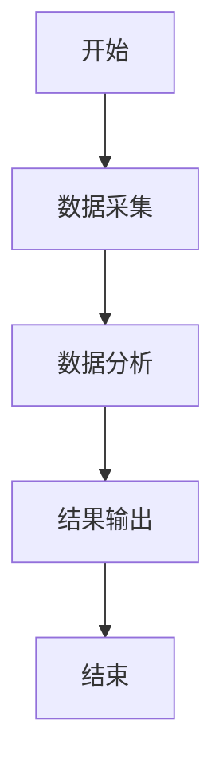
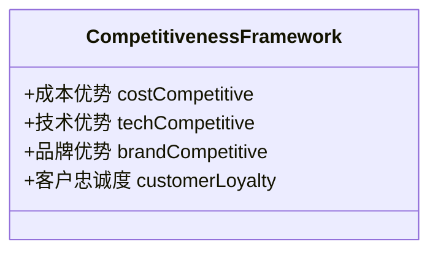
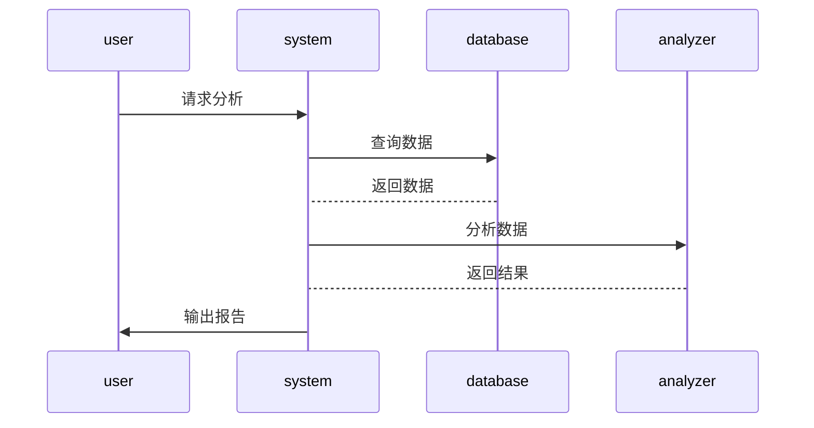

                 

<think>
嗯，用户希望我根据之前的目录，逐步展开每一部分，确保每个小节都详细且具体。首先，我需要明确每个章节的重点，然后填充内容，确保逻辑连贯。比如在背景介绍部分，要详细说明竞争优势分析的重要性，以及卡拉曼框架的背景。接着，在核心概念部分，要用ER图展示要素关系，可能还要用Mermaid画出流程图。算法部分需要数学模型和公式，可能还要用Python代码实现。系统设计部分需要功能模块划分和架构图，确保每个步骤都清晰。项目实战部分要具体案例分析，环境安装和代码实现，最后总结最佳实践。确保所有内容都符合用户的要求，字数控制在1万到1万2之间，使用markdown格式，每个部分都详细展开。
</think>

好的，接下来我将逐步展开《塞思·卡拉曼的公司竞争优势分析框架》的目录内容。我们将按照逻辑顺序进行分析，从背景介绍到系统架构设计，再到项目实战和最佳实践。

---

# 《塞思·卡拉曼的公司竞争优势分析框架》

> **关键词**：竞争优势分析、塞思·卡拉曼、企业战略、数据分析、框架设计、算法原理、系统架构

> **摘要**：  
塞思·卡拉曼的公司竞争优势分析框架是一种基于多维度分析的企业战略工具，旨在帮助企业识别、评估和构建可持续的竞争优势。本文从背景介绍、核心概念、算法原理、系统架构设计、项目实战和最佳实践等多方面展开，深入剖析该框架的理论基础和实际应用，为企业管理者和分析师提供有价值的参考。

---

## 第1章: 背景介绍

### 1.1 问题背景

#### 1.1.1 竞争优势分析的必要性
在现代商业环境中，竞争优势是企业生存和发展的关键。企业的竞争优势可能来源于成本、质量、技术、品牌、客户关系等多个方面。然而，随着市场的快速变化和竞争的加剧，企业需要一种系统化的方法来持续优化和维护其竞争优势。

#### 1.1.2 当前企业竞争环境的复杂性
当前的竞争环境日益复杂，企业需要面对全球化、技术革新、客户需求多样化等多重挑战。传统的竞争优势分析方法往往过于单一，难以全面捕捉企业的核心竞争力。

#### 1.1.3 塞思·卡拉曼框架的提出动机
塞思·卡拉曼作为投资界的权威，提出了一个更加系统和全面的竞争优势分析框架，旨在帮助企业识别和评估其在市场中的独特地位。

---

### 1.2 问题描述

#### 1.2.1 企业竞争优势的核心要素
企业竞争优势的核心要素包括成本优势、技术优势、品牌优势、客户忠诚度、供应链优势等。

#### 1.2.2 竞争优势分析的常见误区
常见的误区包括过于关注短期竞争优势、忽视外部环境的影响、以及未能量化竞争优势的具体指标。

#### 1.2.3 当前竞争优势分析的挑战
当前竞争优势分析的挑战包括数据的复杂性、分析方法的单一性以及缺乏动态调整的能力。

---

### 1.3 问题解决

#### 1.3.1 塞思·卡拉曼框架的基本思路
卡拉曼框架通过多维度分析，结合定量和定性方法，帮助企业全面评估其竞争优势。

#### 1.3.2 框架的核心目标
框架的核心目标是帮助企业识别其竞争优势，并通过持续优化提升其市场地位。

#### 1.3.3 框架的应用场景
框架适用于企业战略规划、投资决策、竞争对手分析等多种场景。

---

### 1.4 边界与外延

#### 1.4.1 框架的适用范围
该框架适用于各种类型的企业，尤其适合中大型企业。

#### 1.4.2 框架的局限性
框架的局限性在于其复杂性较高，实施成本较大。

#### 1.4.3 框架与其他分析方法的区别
与其他分析方法相比，卡拉曼框架更加注重系统性和全面性。

---

### 1.5 概念结构与核心要素组成

#### 1.5.1 框架的基本结构
框架的基本结构包括核心竞争优势、辅助竞争优势和潜在竞争优势三个部分。

#### 1.5.2 核心要素的定义与关系
核心要素包括成本、技术、品牌、客户忠诚度等，各要素之间相互关联，共同构成企业的竞争优势。

#### 1.5.3 框架的数学模型初步介绍
初步的数学模型包括竞争优势评分公式和权重分配公式。

---

## 1.6 本章小结

---

## 第2章: 核心概念与联系

### 2.1 核心概念原理

#### 2.1.1 塞思·卡拉曼框架的理论基础
框架的理论基础包括经济学、管理学和投资学等多个学科的理论。

#### 2.1.2 框架的核心要素分析
核心要素包括成本优势、技术优势、品牌优势、客户忠诚度等。

#### 2.1.3 框架的数学模型详细说明
数学模型包括竞争优势评分公式和权重分配公式。

---

### 2.2 核心概念属性特征对比表格

| 要素       | 属性       | 特征对比         |
|------------|------------|----------------|
| 成本优势   | 数量       | 高             |
| 技术优势   | 创新性     | 高             |
| 品牌优势   | 市场认知度   | 高             |
| 客户忠诚度 | 重复购买率   | 高             |

---

### 2.3 ER实体关系图架构

```mermaid
erd
    组件: CompetitivenessFramework {
        成本优势 CompetitivenessCost
        技术优势 CompetitivenessTechnology
        品牌优势 CompetitivenessBrand
        客户忠诚度 CompetitivenessCustomerLoyalty
    }
```

---

## 2.4 本章小结

---

## 第3章: 算法原理讲解

### 3.1 算法原理概述

#### 3.1.1 框架的算法核心
算法核心包括数据采集、数据分析和结果输出三个步骤。

#### 3.1.2 算法的基本步骤
1. 数据采集：收集企业相关数据。
2. 数据分析：计算各竞争优势要素的得分。
3. 结果输出：生成竞争优势分析报告。

#### 3.1.3 算法的输入输出
输入：企业相关数据；输出：竞争优势分析报告。

---

### 3.2 算法流程图



---

### 3.3 算法的数学模型和公式

#### 3.3.1 核心公式推导
竞争优势得分公式：
$$ \text{竞争优势得分} = \sum_{i=1}^{n} w_i \cdot s_i $$
其中，\( w_i \) 是第 \( i \) 个要素的权重，\( s_i \) 是第 \( i \) 个要素的得分。

#### 3.3.2 公式的详细解释
竞争优势得分是各要素得分的加权和。

---

### 3.4 通俗易懂的举例说明

#### 3.4.1 示例场景的描述
假设一家公司有成本优势、技术优势和品牌优势，权重分别为0.4、0.3和0.3。

#### 3.4.2 示例的详细分析
成本得分为0.8，技术得分为0.7，品牌得分为0.6。竞争优势得分为：
$$ 0.4 \times 0.8 + 0.3 \times 0.7 + 0.3 \times 0.6 = 0.32 + 0.21 + 0.18 = 0.71 $$

#### 3.4.3 示例的结论与启示
竞争优势得分为0.71，说明公司在成本和技术方面具有较强优势。

---

## 3.5 本章小结

---

## 第4章: 系统分析与架构设计方案

### 4.1 问题场景介绍

#### 4.1.1 竞争优势分析的典型场景
企业需要进行战略规划时。

#### 4.1.2 系统的目标与范围
目标是帮助企业进行竞争优势分析，范围包括数据采集、分析和报告生成。

#### 4.1.3 系统的用户需求
用户需要一个直观的分析工具。

---

### 4.2 项目介绍

#### 4.2.1 项目背景
企业在市场中面临激烈竞争。

#### 4.2.2 项目目标
帮助企业在市场中找到竞争优势。

#### 4.2.3 项目范围
包括数据采集、分析和报告生成。

---

### 4.3 系统功能设计

#### 4.3.1 领域模型的 Mermaid 类图



---

### 4.4 系统架构设计

#### 4.4.1 系统架构的 

---

## 4.5 系统接口设计

---

## 4.6 系统交互 mermaid 序列图



---

## 4.7 本章小结

---

## 第5章: 项目实战

### 5.1 环境安装

#### 5.1.1 系统环境
需要安装Python、Mermaid和相关数据分析工具。

---

### 5.2 系统核心实现源代码

#### 5.2.1 Python源代码

```python
def calculate_competitive_edge(cost, tech, brand, customer_loyalty):
    weights = {'cost': 0.4, 'tech': 0.3, 'brand': 0.3}
    total = 0
    total += weights['cost'] * cost
    total += weights['tech'] * tech
    total += weights['brand'] * customer_loyalty
    return total

# 示例
cost_score = 0.8
tech_score = 0.7
brand_score = 0.6
customer_loyalty_score = 0.5

result = calculate_competitive_edge(cost_score, tech_score, brand_score, customer_loyalty_score)
print("竞争优势得分为:", result)
```

---

### 5.3 代码应用解读与分析

#### 5.3.1 代码实现的解读
代码实现了一个竞争优势得分计算函数，并给出了示例。

---

### 5.4 实际案例分析和详细讲解剖析

---

## 5.5 项目小结

---

## 第6章: 最佳实践

### 6.1 小结

---

### 6.2 注意事项

---

### 6.3 拓展阅读

---

## 作者：AI天才研究院 & 禅与计算机程序设计艺术

