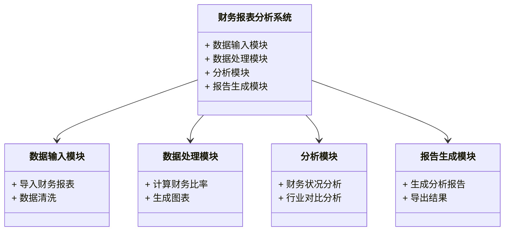
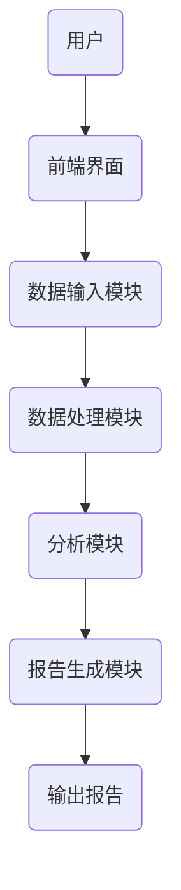
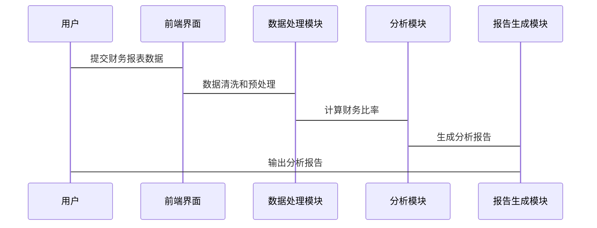

                 


# 塞思·卡拉曼的公司财务报表深度解析

## 关键词
- 公司财务报表
- 财务分析
- 财务指标
- 数据分析
- 财务建模
- 财务管理系统

## 摘要
本文深度解析塞思·卡拉曼的公司财务报表分析方法，从基础概念到高级算法，结合实际案例，全面讲解财务报表的分析技巧和应用。通过系统化的分析框架，帮助读者掌握财务报表的核心要素、分析方法和实际应用。

## 第一部分: 财务报表的基础知识

### 第1章: 财务报表的基本概念

#### 1.1 财务报表的定义与作用
- **财务报表的定义**：财务报表是企业记录和展示其财务状况、经营成果和现金流量的正式文件。
- **财务报表的作用**：帮助企业管理者、投资者、债权人等利益相关者评估企业的财务健康状况、经营效率和未来前景。
- **财务报表的目标**：提供透明的财务信息，支持决策和评估。

#### 1.2 财务报表的主要类型
- **资产负债表**：展示企业在某一特定日期的资产、负债和所有者权益的状况。
  - 资产：企业拥有的资源，如现金、存货、应收账款等。
  - 负债：企业欠款，如应付账款、长期借款等。
  - 所有者权益：企业资产减去负债后的剩余部分，包括股本、资本公积等。
- **利润表**：展示企业在一定会计期间内的收入、费用和利润。
  - 收入：企业在销售商品或服务中获得的总收入。
  - 费用：企业为获取收入而产生的各种支出，如销售费用、管理费用等。
  - 利润：收入减去费用后的净收益，包括净利润、息税前利润（EBIT）等。
- **现金流量表**：展示企业在一定会计期间内的现金流入和流出情况。
  - 经营活动现金流：与企业日常经营相关的现金流入和流出。
  - 投资活动现金流：与企业投资活动相关的现金流入和流出。
  - 筹资活动现金流：与企业筹资活动相关的现金流入和流出。
- **所有者权益变动表**：展示企业在一定会计期间内所有者权益的变动情况，包括股本增减、利润分配等。

#### 1.3 财务报表分析的重要性
- **企业内部管理的需求**：通过财务报表分析，企业可以评估自身的财务状况、经营效率和盈利能力，为内部决策提供数据支持。
- **企业外部利益相关者的关注**：投资者通过分析财务报表评估企业的投资价值，债权人通过分析财务报表评估企业的偿债能力。
- **行业趋势与竞争分析**：通过对比同行业公司的财务数据，企业可以了解自身在行业中的位置，发现竞争优势和劣势。

### 1.4 财务报表分析的基本方法
- **基本的财务比率分析**：
  - 流动比率：衡量企业短期偿债能力，计算公式为流动资产除以流动负债。
  - 速动比率：进一步衡量企业短期偿债能力，计算公式为（流动资产 - 存货）除以流动负债。
  - 资产负债率：衡量企业负债在资产中的比例，计算公式为总负债除以总资产。
  - 净资产收益率（ROE）：衡量企业股东投资的回报率，计算公式为净利润除以平均净资产。
  - 毛利率：衡量企业销售产品的盈利能力，计算公式为（销售收入 - 销售成本）除以销售收入。
- **财务报表分析的步骤**：
  - 数据收集与整理：收集企业的财务报表数据，确保数据的准确性和完整性。
  - 数据分析与计算：计算各种财务比率和指标，识别关键数据点。
  - 结果解读与应用：根据分析结果，评估企业的财务状况，提出改进建议。
- **财务报表分析的工具与技巧**：
  - 财务分析软件的使用：如Excel、QuickBooks、SAP等工具，可以帮助用户进行数据整理和分析。
  - 数据可视化：通过图表和图形展示财务数据，帮助更好地理解和分析。
  - 行业基准分析：将企业的财务数据与行业平均水平进行对比，识别差异和趋势。

## 第二部分: 财务报表的核心概念与联系

### 第2章: 财务报表的核心概念与联系

#### 2.1 财务报表的核心概念
- **流动资产**：可以在一年内转换为现金的资产，包括现金、应收账款、存货等。
- **非流动资产**：不能在一年内转换为现金的资产，包括固定资产、无形资产等。
- **流动负债**：需要在一年内偿还的债务，包括应付账款、短期借款等。
- **非流动负债**：需要在一年以上偿还的债务，包括长期借款、应付债券等。
- **所有者权益**：企业资产减去负债后的剩余部分，包括股本、资本公积、盈余公积等。

#### 2.2 财务指标的属性特征对比
| 指标名称       | 属性                | 特征对比         |
|----------------|---------------------|------------------|
| 流动比率       | 短期偿债能力指标    | 值越高，短期偿债能力越强 |
| 速动比率       | 短期偿债能力指标    | 值越高，短期偿债能力越强，扣除存货影响 |
| 资产负债率     | 财务杠杆指标        | 值越高，财务杠杆越高，风险越大 |
| 净资产收益率（ROE） | 盈利能力指标        | 值越高，股东投资回报越高 |
| 毛利率         | 盈利能力指标        | 值越高，产品盈利能力越强 |

#### 2.3 财务报表的实体关系图

```mermaid
erDiagram
    actor 公司 {
        key 企业ID
        string 企业名称
        string 企业类型
    }
    actor 股东 {
        key 股东ID
        string 股东名称
        string 持股比例
    }
    actor 债权人 {
        key 债权人ID
        string 债权人名称
        string 债务金额
        string 债务期限
    }
    actor 管理层 {
        key 管理层ID
        string 管理层职位
        string 责任范围
    }
    company 与 shareholder 关系：股东拥有公司股份
    company 与 creditor 关系：公司欠债权人债务
    company 与 management 关系：管理层管理公司
    shareholder 与 management 关系：股东选举管理层
    creditor 与 management 关系：债权人要求偿还债务
```


## 第三部分: 财务报表分析的算法原理

### 第3章: 财务报表分析的算法原理

#### 3.1 财务分析算法概述
- **比率分析法**：通过计算各种财务比率，评估企业的财务状况。
- **趋势分析法**：分析财务数据的变化趋势，预测未来财务表现。
- **行业比较法**：将企业的财务数据与行业平均水平进行对比，识别差异。

#### 3.2 比率分析法的实现
```mermaid
graph TD
    A[开始] -> B[收集财务数据]
    B -> C[计算财务比率]
    C -> D[分析比率结果]
    D -> E[得出结论]
    E -> F[结束]
```
```python
# 比率分析法的Python实现

def calculate_ratios(financial_data):
    ratios = {}
    # 计算流动比率
    current_assets = financial_data['流动资产']
    current_liabilities = financial_data['流动负债']
    ratios['流动比率'] = current_assets / current_liabilities

    # 计算速动比率
    quick_assets = current_assets - financial_data['存货']
    ratios['速动比率'] = quick_assets / current_liabilities

    # 计算资产负债率
    total_assets = financial_data['流动资产'] + financial_data['非流动资产']
    total_liabilities = financial_data['流动负债'] + financial_data['非流动负债']
    ratios['资产负债率'] = total_liabilities / total_assets

    # 计算净资产收益率
    net_profit = financial_data['净利润']
    average_equity = (financial_data['期初所有者权益'] + financial_data['期末所有者权益']) / 2
    ratios['净资产收益率(ROE)'] = net_profit / average_equity

    # 计算毛利率
    operating_revenue = financial_data['营业收入']
    cost_of_goods_sold = financial_data['营业成本']
    ratios['毛利率'] = (operating_revenue - cost_of_goods_sold) / operating_revenue * 100

    return ratios

# 示例数据
financial_data = {
    '流动资产': 500000,
    '流动负债': 300000,
    '存货': 100000,
    '非流动资产': 200000,
    '非流动负债': 50000,
    '净利润': 80000,
    '期初所有者权益': 400000,
    '期末所有者权益': 500000,
    '营业收入': 1000000,
    '营业成本': 600000
}

# 计算比率
ratios = calculate_ratios(financial_data)
for ratio_name, ratio_value in ratios.items():
    print(f"{ratio_name}: {ratio_value:.2f}")
```

#### 3.3 数学模型与公式
- **流动比率（Current Ratio）**：
  $$ \text{流动比率} = \frac{\text{流动资产}}{\text{流动负债}} $$
- **速动比率（Quick Ratio）**：
  $$ \text{速动比率} = \frac{\text{流动资产} - \text{存货}}{\text{流动负债}} $$
- **资产负债率（Debt-to-Assets Ratio）**：
  $$ \text{资产负债率} = \frac{\text{总负债}}{\text{总资产}} $$
- **净资产收益率（Net Profit Margin）**：
  $$ \text{净资产收益率} = \frac{\text{净利润}}{\text{平均净资产}} $$
- **毛利率（Gross Profit Margin）**：
  $$ \text{毛利率} = \frac{\text{营业收入} - \text{营业成本}}{\text{营业收入}} \times 100\% $$

## 第四部分: 财务报表分析的系统设计

### 第4章: 系统分析与架构设计方案

#### 4.1 问题场景介绍
- **目标**：构建一个自动化、智能化的财务报表分析系统，帮助用户快速分析企业的财务状况。
- **用户需求**：企业财务人员、投资者需要快速获取财务报表分析结果，支持决策。

#### 4.2 系统功能设计


#### 4.3 系统架构设计


#### 4.4 系统接口设计
- **输入接口**：财务报表数据接口，支持CSV、Excel等格式。
- **输出接口**：分析报告输出接口，支持PDF、Word等格式。

#### 4.5 系统交互设计


## 第五部分: 项目实战

### 第5章: 项目实战

#### 5.1 环境安装
- **安装Python**：下载并安装Python，建议使用最新版本。
- **安装必要的库**：使用pip安装numpy、pandas、matplotlib、openpyxl等库。
  ```bash
  pip install numpy pandas matplotlib openpyxl
  ```

#### 5.2 系统核心实现源代码
```python
import pandas as pd
import matplotlib.pyplot as plt
from openpyxl import load_workbook

# 加载财务数据
def load_financial_data(file_path):
    # 加载Excel文件
    wb = load_workbook(file_path)
    ws = wb.active
    data = []
    for row in ws.iter_rows(values_only=True):
        data.append(row)
    return data

# 数据清洗与预处理
def preprocess_data(data):
    df = pd.DataFrame(data)
    df = df.dropna()
    return df

# 计算财务比率
def calculate_ratios(df):
    ratios = {}
    # 计算流动比率
    current_assets = df['流动资产'].mean()
    current_liabilities = df['流动负债'].mean()
    ratios['流动比率'] = current_assets / current_liabilities

    # 计算速动比率
    quick_assets = current_assets - df['存货'].mean()
    ratios['速动比率'] = quick_assets / current_liabilities

    # 计算资产负债率
    total_assets = current_assets + df['非流动资产'].mean()
    total_liabilities = current_liabilities + df['非流动负债'].mean()
    ratios['资产负债率'] = total_liabilities / total_assets

    # 计算净资产收益率
    net_profit = df['净利润'].mean()
    average_equity = (df['期初所有者权益'].mean() + df['期末所有者权益'].mean()) / 2
    ratios['净资产收益率'] = net_profit / average_equity

    # 计算毛利率
    operating_revenue = df['营业收入'].mean()
    cost_of_goods_sold = df['营业成本'].mean()
    ratios['毛利率'] = (operating_revenue - cost_of_goods_sold) / operating_revenue * 100

    return ratios

# 生成可视化图表
def generate_visualizations(ratios):
    plt.figure(figsize=(10, 6))
    plt.bar(ratios.keys(), ratios.values())
    plt.title('财务比率分析')
    plt.xlabel('指标')
    plt.ylabel('比率值')
    plt.show()

# 主程序
def main():
    file_path = 'financial_data.xlsx'
    data = load_financial_data(file_path)
    df = preprocess_data(data)
    ratios = calculate_ratios(df)
    generate_visualizations(ratios)

if __name__ == "__main__":
    main()
```

#### 5.3 案例分析与详细解读
- **案例选择**：以一家制造企业为例，分析其财务报表。
- **数据输入**：加载企业的财务数据，包括资产负债表和利润表。
- **数据清洗**：处理缺失值和异常值，确保数据准确性。
- **计算比率**：计算流动比率、速动比率、资产负债率、净资产收益率和毛利率。
- **结果解读**：根据计算结果，评估企业的财务状况，识别潜在问题和机会。

## 第六部分: 最佳实践

### 第6章: 最佳实践

#### 6.1 小结
- 财务报表分析是评估企业财务状况的重要工具，掌握基本概念和分析方法是基础。
- 通过算法和系统设计，可以提高分析效率和准确性。
- 实际案例分析帮助巩固理论知识，提升实战能力。

#### 6.2 注意事项
- 数据的准确性和完整性是分析的基础，确保数据无误。
- 分析结果需结合行业背景和企业实际情况，避免片面结论。
- 定期更新分析模型，适应市场变化和企业战略调整。

#### 6.3 拓展阅读
- 《财务报表分析与应用》：深入讲解财务报表分析的理论与实践。
- 《数据分析实战》：提供丰富的数据分析案例和方法。
- 《企业财务管理系统设计》：探讨企业财务管理系统的构建与优化。

## 结语
通过本文的详细解析，读者可以全面掌握塞思·卡拉曼的公司财务报表分析方法，从基础概念到高级算法，结合实际案例，提升财务分析能力。希望本文能为读者在财务分析领域提供有价值的指导和参考。

## 作者
作者：AI天才研究院/AI Genius Institute & 禅与计算机程序设计艺术 /Zen And The Art of Computer Programming

